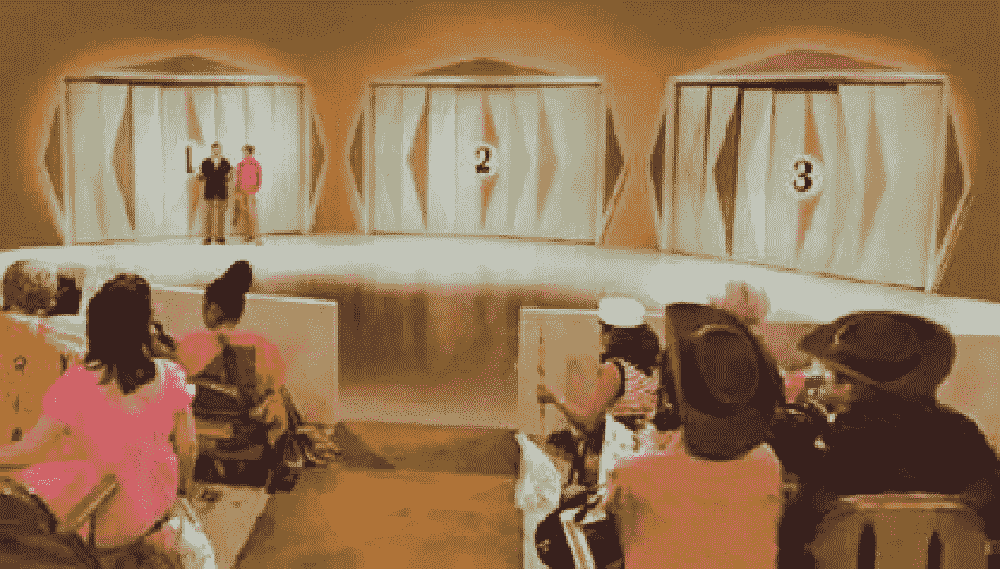

# 让我们做个交易

> 原文：<https://towardsdatascience.com/lets-make-a-deal-7eff0f5a7ef8?source=collection_archive---------19----------------------->

## 解决蒙蒂霍尔问题的三种方法


你的心脏跳得很厉害。你既兴奋又紧张，不知道接下来会发生什么。你以前从未上过电视，但你很了解这项运动。由老谋深算、魅力非凡的蒙蒂·霍尔领衔的《让我们做笔交易》是目前最受欢迎的电视节目之一。自 1965 年以来，你一直是一名普通观众，无数次看到蒙蒂与参赛者进行交易。有一次，你看到一个女人用 50 美元换取一个装有 1000 美元的信封。还有一次，你看到一个人拒绝了 800 美元，而是保留了一个盒子，结果发现里面只有纸巾！现在轮到你了。

蒙蒂·霍尔转向你。很快，就像广播员的剧本一样，“在这三个标有 1、2 和 3 的门后面，有一辆新的克尔维特；另外两个藏着不值钱的山羊。没错，绝对不值钱的山羊。现在那里，你会有哪扇门？”

你听到一个无声的“咩咩”声，但你不确定它来自哪里。

“我要 1 号门，”你自信地说。



“绝佳的选择！如你所见，3 号门后面是一只毫无价值的山羊。”3 号门打开了，一只黑白斑点的公山羊出现了。它几乎是可爱的，尽管它实际上一文不值。在你的城市公寓里养一只山羊的想法很滑稽，而且你也不知道如何卖掉一只山羊。

蒙蒂继续说道，“1 号门是你的最终选择吗？你可以转到 2 号门，但不能回头。我不希望在这里做出错误的决定。”

你考虑一下情况。你最初的选择有⅓概率是正确的，但是你被授予了新的信息，3 号门现在退出了。汽车一定在 1 号门或 2 号门后面，但是是哪一个呢？你考虑如果你从 1 号门换到 2 号门，却发现汽车一直在 1 号门后面，你会感到多么沮丧。也许坚持最初的选择是最好的…或者是吗？

# 蒙蒂·霍尔问题

蒙蒂霍尔问题是一个经典的脑筋急转弯，测试一个人用条件概率进行推理的能力。另外，问题的前提增加了一个心理边缘；许多人选择留在原来的车门，只是为了避免从汽车切换的失望。在这篇文章中，我将演示 3 种方法来确定最佳策略，留下或转换。

## 频率主义方法

相对来说，多次模拟 Monty Hall 游戏并记录游戏的胜败次数是比较容易的。从统计学的角度来说，我们可以将游戏中的每一次尝试视为伯努利试验(具有二元结果的随机实验)，成功概率为 P。根据大数定律，如果实验次数 N 非常大，则预期胜率为 100 * P%。通过记录停留和转换策略的许多试验的结果，可以使用 z 检验来确定胜率是否存在统计上的显著差异。

下面的 python 代码定义了一个模拟游戏的函数`monty_hall`。关键字参数`switch`控制是采用停留还是切换策略。此外，设置关键字参数`verbose = True`允许一个人以互动的方式玩游戏，并当场选择是留下还是转换。

```
import numpy as npdef monty_hall(chosen_door, switch = False, verbose = False): '''
    Parameters
    ----------
    chosen_door : Initial choice of door, must be either 1, 2, or 3.
    switch : False --> stay strategy
             True --> switch strategy.
    verbose: False --> no input required
             True --> player is asked if they'd like to switch
                      doors. overrides switch input.

    Returns
    ------
    1 : if the game is won
    0 : if the game is lost
    '''

    # Correct indexing for chosen door
    chosen_door += -1 

    # Randomly initialize array to represent the 3 doors
    # Array contains two 0s for goats and a single 1 for the car

    doors = [0, 0, 0]
    doors[np.random.randint(0,3)] = 1

    # Reveal a door concealing a Goat

    revealed_door = np.random.choice([i for i, x in enumerate(doors) if x == 0 and i != chosen_door])
    switch_door = list({0, 1, 2} - {chosen_door, revealed_door})[0]

    # If verbose == True ask the player if they'd like to switch.

    input_string = f"You've chosen door {chosen_door + 1}, an excellent choice! As you can see behind door {revealed_door + 1} is a worthless goat. Is door {chosen_door + 1} your final choice? You may switch to door {switch_door + 1} but there's no going back. Enter y if you'd like to switch."

    if verbose == True:
        choice = input(input_string)
        if choice == 'y':
            switch == True
        else:
            switch == False

    # Return the result of the game

    if switch == False:
        result = doors[chosen_door]
    else:
        result = doors[switch_door]

    if verbose == True:
        if result == 0:
            print("How unfortunate, you've chosen a worthless goat!")
        if result == 1:
            print("Congratulations, you've just won a new Corvette!")

    return result
```

让我们用这个函数对停留和转换策略进行 100，000 次游戏。结果将保存在停留和切换列表中，并将打印每个策略的胜率。

```
i = 0
stay = []
switch = []while i < 100000:
    stay.append(monty_hall(np.random.randint(1, 4)))
    switch.append(monty_hall(np.random.randint(1, 4), switch = True))
    i += 1

print(f"Stay win rate: {round(100 * np.sum(stay) / 100000, 1)}%")
print(f"Switch win rate: {round(100 * np.sum(switch) / 100000, 1)}%")
```

> 入住率:33.3%
> 
> 切换成功率:66.6%

显然，这两种策略之间有很大的区别。尽管在这里并不真的需要统计检验来检测差异，但我们还是要对数据进行双尾 z 检验。

```
from statsmodels.stats.weightstats import ztesttest_statistic, p_value = ztest(stay, switch)
print(f"Test Statistic: {round(test_statistic, 1)}")
print(f"P-Value: {round(p_value, 5)}")
```

> 测试统计:-157.5
> 
> p 值:0.0

z-test 返回的测试统计值为-157.5，p 值为 0(实际上是一个无穷小的数字，我们的计算机已将其四舍五入为 0)。因此，可以完全肯定地拒绝零假设，即逗留和转换策略的成功率是相同的。事实证明，转换显然是更好的策略！

但是为什么切换要好得多呢？为了更好地理解，让我们从贝叶斯的角度来看这个问题。

## 贝叶斯方法

与频率统计相比，贝叶斯统计为因果关系提供了另一种视角。频率主义统计学试图回答这个问题，“给定我的假设，我的数据有多大的可能性？”另一方面，贝叶斯统计试图回答这个问题，“给定我的数据，我的假设有多大的可能性？”这种差异是微妙而强大的。


Thomas Bayes, English minister, philosopher, and statistician known for deriving the rule that bears his name. However, the modern version used today was derived by the French mathematician Pierre-Simon Laplace.

贝叶斯统计的基石是贝叶斯规则，这是一个简单的恒等式，告知如何在给定新数据的情况下正确更新对假设的信念。

P(H|D) = P(D|H)*P(H) / P(D)

H =假设，D =新观察到的数据

P(H|D)是给定新的观察数据时我们假设的概率。P(D|H)是假设假设是正确的，观察到数据的概率。P(H)是我们在观察新数据之前对假设正确的概率的评估，也称为“贝叶斯先验”。P(D)是在任何情况下观察到数据的概率，无论假设是否成立。

对于 Monty Hall 问题，有两种可能的假设:H1)汽车在最初选择的门后面，以及 H2)汽车不在最初选择的门后面，并且切换将导致获胜。现在让我们考虑一下 H1，看看如何用贝耶法则来确定这个假设的概率。

首先，考虑假设 P(H1)的先验概率。请记住，最初的选择是从三个选项中做出的，这三个选项都同样可能是正确的。P(H1)，做出最初正确选择的概率，简单来说就是 1/3。

接下来，考虑观察到新数据的概率，假设 H1 是正确的。如果汽车实际上在最初选择的门后面，那么山羊出现在其他门的概率是 1/2，因为蒙蒂会在他的两个选项中随机选择。H1 = 1/2。


Billy goat. Isn’t he cute?

最后，考虑在任何情况下观察到新数据的概率。因为可能只有两个互斥的假设，P(D)可以用下面的等式来确定，P(D) = P(D|H1)P(H1) + P(D|H2)P(H2)。我们已经知道 P(D|H1) = 1/2，P(H1) = 1/3。P(H2) = 2/3，是最初做出错误选择的概率。最后，P(D|H2) = 1/2，因为如果我们的第一扇门隐藏了一只山羊，剩下的两扇门都有相等的概率隐藏第二只山羊。总而言之，P(D) = 1/2 * 1/3 + 1/2 * 2/3 = 1/2。

我们总共有:P(H1) = 1/3，P(H2) = 2/3，P(H1)= 1/2，P(H2)= 1/2，P(D) = 1/2

现在可以将这些值插入到贝叶斯规则中，以确定汽车在我们最初选择的门后面的概率。

P(H1 | D)= P(D | H1)* P(H1)/P(D)=(1/2 * 1/3)/(1/2)= 1/3

看来新的信息并没有增加最初选择正确的可能性！

当我们这样做的时候，让我们也使用贝叶斯法则来确定 H2 的概率，即汽车不在我们最初选择的后面，以及转换将导致胜利。

P(H2 | D)= P(D | H2)* P(H2)/P(D)=(1/2 * 2/3)/(1/2)= 2/3


That billy goat sure is cute, but most people would rather have this awesome 70s Corvette.

我们现在使用贝叶斯推理来证实我们的频率主义者实验的结果。此外，为 H1 和 H2 确定的贝叶斯概率与观察到的胜率完全一致！到目前为止，为什么换工作比呆在公司好得多已经变得越来越清楚了，但是让我们以最后一种方式来看待这个问题，以便真正理解这一点。

## 博弈论方法

蒙蒂霍尔问题当然是欺骗性的，但它并不特别复杂。通过思考所有可能的结果，人们可以很快得出结论:转换是最优策略。

考虑转换策略会赢或输的情况。当初始门隐藏汽车时，切换将会失败。当初始门隐藏一只山羊时，蒙蒂将被迫露出第二只山羊，剩下的门将隐藏汽车，切换将总是获胜。由于最初的选择将仅在 3 场游戏中的 1 场游戏中隐藏汽车，所以转换策略将在 3 场游戏中输掉大约 1 场，并赢得另外 2 场。相反，留下来只会赢得最初选择恰好正确的三分之一的比赛。

蒙蒂拍摄一个不耐烦的样子，“现在任何一天伙计。我开始觉得我应该把那辆新的克尔维特给山羊！”

“咩咩”黑白相间的公山羊似乎同意蒙蒂的观点。

"我最后问一次，你愿意换到 2 号门吗？"

在突然的顿悟中，你想起了你读过的一篇关于这个主题的文章。虽然你不能确定，但你明白你的选择的可能性。抵制住坚持己见的诱惑，接受自己造成的不幸可能带来的尴尬，你平静地宣布“我要换到 2 号门。”

为了更深入地探究天魔堂问题，它的历史、心理学和许多变化，请查看杰森·罗森豪斯的《天魔堂问题[*。*](https://www.amazon.com/Monty-Hall-Problem-Remarkable-Contentious/dp/0195367898)