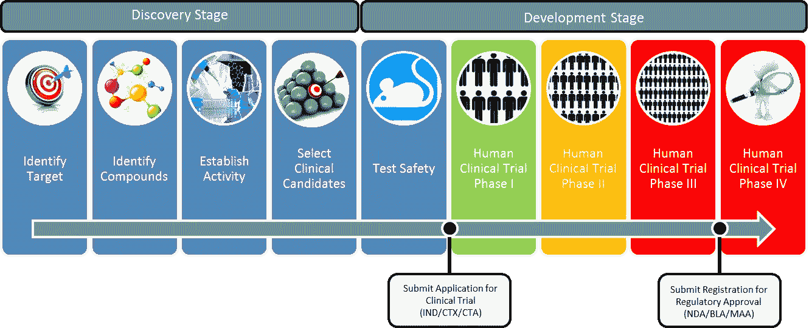
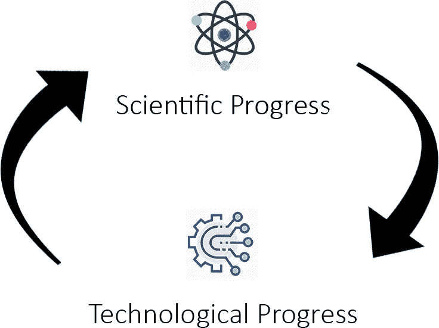
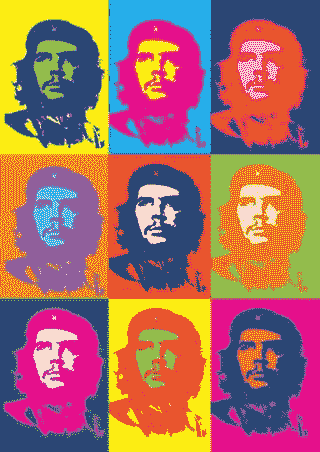
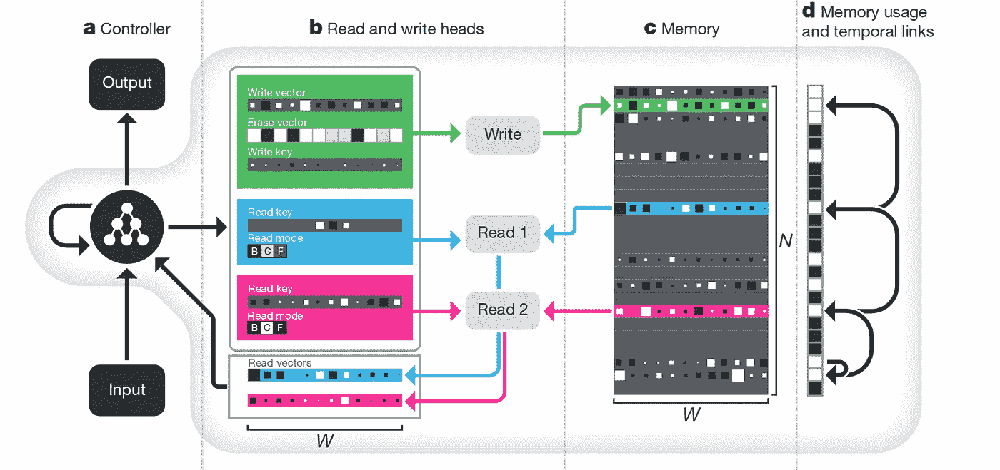

# 我们用机器学习做一些分子吧！⚛️

> 原文：<https://towardsdatascience.com/lets-make-some-molecules-with-machine-learning-%EF%B8%8F-429b8838e3ef?source=collection_archive---------10----------------------->

## 米（meter 的缩写））医学和材料科学

***一个新分子到达大众市场平均需要 10 年。***

【1912 年 4 月， ***RMS 泰坦尼克号*** 在它的处女航中与大西洋上的一座冰山相撞，淹没了 1500 条生命，创造了历史。几十年后，沉船被发现，仍然充满了 20 世纪的历史。在打捞泰坦尼克号几个月后， ***挑战者号航天飞机*** 将在全国数百万人热切的目光注视下发射。发射 73 秒后，航天飞机在半空中爆炸。

Historically relevant material failures

这两起灾难的根本问题不在于人为错误和设计。**问题出在素材上。**泰坦尼克号船体的失败程度不亚于挑战者号的右火箭助推器。我们记得这些悲剧事件，不是因为它们发生了，而是因为它们本来是可以避免的。泰坦尼克号和挑战者号建造时已知的更好的材料。但是仅仅知道存在更好的材料是不够的；它们必须是可用的和适用的。

问题是，一个分子从了解到应用需要大量的时间。今天，平均时间是 10 年。

According to Scientifist, the average time for a drug to complete this process is **12 years and 1.5B dollars** (courtesy of Scientifist)

10 年足够花费数万亿美元，5 亿人死亡，数百万小时浪费在解决问题上,如果我们有合适的材料或药物，这些问题本来可以不那么严重。

这并不新鲜。从历史上看，科学进步是缓慢的。几个世纪以来，由石头制成的工具一直是标准的，定期开处方的药物治疗通常弊大于利。直到人类重视科学的进步，我们才开始创造更好的技术，从而开始了正反馈循环:

有一段时间，这种反馈循环导致了稳定的线性增长。但是随着我们对科学掌握的增长，我们的技术也在进步。随着人工智能等技术的出现，这种增长必然会呈指数级加速。

人工智能给了研究人员更多对分子空间的控制，从而在科学领域掀起了波澜。

在我的上一篇文章中， [***A.I 增强了分子发现和优化***](https://medium.com/p/9434f3f8a593/edit) ，用 A.I 在高水平上讨论了当前加速科学的方法。在这里，我将介绍我最近的一个项目，该项目遵循当前在科学领域的 ML 应用研究中使用的最常见的工作流/管道。

# 项目小说

这个项目的目标是用递归神经网络产生新的分子。这些分子可能没有用，甚至可能无效，但想法是训练模型**学习微笑串**中的模式，使得输出**类似于**有效分子。SMILES 是一个分子的字符串表示，基于给定分子的结构和组件。例如，环丙沙星看起来有点像这样:

**Colors** correspond to the **character** (Courtesy of Wikipedia)

神经网络的选择取决于我们要输入的数据类型。在这种情况下，我们将向它提供微笑字符串作为数据，因此递归神经网络(RNN)最适合这项工作。习惯于用相对更高效和有效的方式来增强 RNN 的内部结构；LSTM 牢房。我们将使用由 LSTMs 组成的几个层，在超过 200，000 个微笑字符串的数据集上进行训练。

## 步骤 1 —映射:

与大多数语言处理 rnn 一样，第一步是创建字符到整数的映射**(允许神经网络处理数据)，反之亦然(将结果翻译回字符)。**

最简单的方法是创建一组独特的字符，并枚举每一项。在像英语这样的自然语言中，有 26 个字母(是大写字母的两倍)，以及大量的语法符号和语法字符。在微笑字符串中，有两种类型的字符:

1.  特殊字符:“/”、“(”、“”、“=”等。
2.  元素符号:“C”、“O”、“Si”、“Co”等。

这个独特字符的列表被列举并方便地放入字典中。

值得注意的是**字典不认为由两个字符组成的元素符号是一个元素。**例如，硅元素符号的“S”和“I”算作两个独立的字符。这意味着**模型必须了解“Si”和“S”之间的区别，这两者是完全不同的元素。将这两个字符的符号硬编码到字典中是完全可能的，但只是为了好玩，我将它们分开，以观察模型的表现如何。**

## 第 2 步—数据预处理:

一旦有了惟一的字符映射，就可以着手**将 SMILES 字符串数据集中的每个字符转换成整数。简单调用我们在第一步中构建的字典就可以了。**

同时，您可以通过简单地将每个整数除以数据集中唯一字符的总数来规范化所有的整数。最后，**将得到的整合和标准化数据集**重新整形为适合神经网络模型的格式。

## **步骤 3 —模型架构**

使用 Keras，构建模型非常简单。

Play around with the numbers! Try more layers, more neurons, more dropout, whatever you fancy!

我们的模型有多层，每一层都有数量递减的神经元；你可以随意摆弄这些数字。这是一个很大的概括，但经验法则是，神经网络中的层和神经元越多，计算量越大，但其性能也越好。

## 步骤 4—检查点:

我们都经历过。你已经在你一直在写的文章或报告上取得了很大进展，但突然你的电脑出了故障——你所有的工作都消失在深渊中。顺便提一下，训练神经网络也有同样的问题。谢天谢地，有一个解决方案。

还记得在新的马里奥游戏中，一旦你过了一半，游戏会保存你的进度吗？

For nostalgia, and to emphasize how important it is to **SAVE!!!** (courtesy of TrustedReviews)

检查点是 Keras 库中的一个内置功能，它允许我们**将我们的训练进度(模型在任何给定时期的权重)保存在一个文件中，然后可以将其传输到另一个设备或保存起来供以后使用。**检查点可能是最不受欢迎的，也是最有用的机器学习技术之一。

Don’t forget to call the callbacks parameter when fitting your model!

检查点对于将训练从预测、分类或生成步骤中分离出来特别有用。在将节省下来的重量加载到 CPU 上之前，通过在 GPU 或云服务上进行训练，你可以减少完成一个项目所需的时间。因此，检查点对于迁移学习或者简单地暂停和恢复训练是有用的。它们还可以用于对每个改进时期的模型输出进行采样，为网络模型增加一点透明度。

## 第 5 步—培训:

我使用分类交叉熵作为带有`Adam`优化器的损失函数(混合了`RMS-prop`和`ADAgrad`以及内置动量)。为了利用尽可能多的数据集，该模型有 19 个 512 批次大小的时期可供学习。一般来说，更多的历元与更小的批量配对允许网络更好地从数据中学习，但代价是更长的训练时间。

## 第 6 步—生成:

发电相对简单。首先，我们导入从训练中保存的检查点(这样我们就不必在每次想要生成新分子时重新训练模型)。下一步是从数据集中随机选择一个 SMILES 字符串作为参考，最后生成指定数量的字符。

The exact code is used for generating any kind of text - only in this case, the text is a molecule.

根据数据集大小的选择、学习率和其他可以对模型进行的自定义调整，结果会有所不同，但理想情况下，您应该得到类似于有效分子的输出。如果你插入一个精确度较低的检查点文件，你实际上可以**看到神经网络是如何学习并随着时间变得更好的。**通常，它以一系列只有一次的字符开始:

**cccccccccccccccccccccccccccccccccccccccccccccccccccccccccccccc**

但是随着时间的推移，包含交替字符会变得更好

**C1 C1 C1 C1 C1 C1 C1 C1 C1 C1 C1 C1 C1 C1 C1 C1 C1 C1 C1 C1 C1 C1 C1 C1 C1 C1 C1 C1 C1 C1 C1 C1 C1 C1 C1 C1 C1 C1**

最终，随着它学习子结构，输出将更加多样化

**C1 C1 C1 C1 C1 C1 C1((((((((((/////////ccccccchchchchchchchchc)))))))))**

目标是尽可能接近

**O1C = C[C @ H]([C @ H]1 O2)C3 C2 cc(OC)C4 c3oc(= O)C5 = C4 CCC(= O)5**

尽可能。

# 可能的改进

这个项目可以用两种不同的方式来增强，一些以数据为中心，另一些以模型本身的架构为中心。

## 数据集

20 万个分子的数据集虽然令人印象深刻，但如果再大一些也不会有什么坏处。除了在互联网上搜寻更多的微笑字符串，一个可能实现的技术是**数据扩充。**

**Data augmentation** as explained using **Andy Warhol paintings**

数据增强实际上类似于安迪·沃霍尔的画；取一张图片，稍加修改，然后添加到数据集。从本质上说，这是数据扩充，尽管过于简单。对微笑字符串也可以这样做；**获取字符串，找到它的排列，并将其添加到您的数据集中。**

在这种情况下，项目的目标是生成尽可能接近有效的分子，而不是具有特定或期望属性的分子。这消除了偏向一种特定类型分子的结果的风险，因此增加我们现有的 200k 分子数据集是安全的。我们可以**通过枚举超出其规范形式的微笑字符串来扩充数据，**这基本上意味着以另一种方式编写相同的微笑字符串，所有这些字符串最终都表示相同的分子。这给了模型更多的字符串来学习，因为每个分子都有许多不同的微笑字符串，其数量随着分子大小和复杂性的增加而增加。

## 建筑

在这个项目中，LSTM 被用作各层的主节点。然而，还有许多其他强有力的选择。**神经图灵机(NTM)** 和它的兄弟**例如，可微分神经计算机(DNCs)** 都是由谷歌的研究人员创造的最先进的架构。两种架构都很强大。NTMs 和 DNCs 令人印象深刻，因为它们有一个外部组件，可以比 LSTMs 更好地“记住”事情。这个外部组件充当一种**存储体。**

The DNC architecture (courtesy of The Nature magazine)

你可以在这些博客文章(NTMs， [DNCs](/rps-intro-to-differentiable-neural-computers-e6640b5aa73a) )和关于它们的研究论文(NTMs，DNCs)中读到关于它的所有内容，或者在我的文章中获得关于 RNN 建筑家族所有成员的高层次概述。本质上，这两个强大的替代方案都有内置**注意力机制**的记忆库，这允许它们**选择性地记忆数据的部分**(在这种情况下是文本，但也可以是图像)，这被认为是非常重要的。这在生成具有所需特性的分子方面可能非常有用，因为一些特性如毒性是由分子内的亚结构决定的，当翻译成微笑时，它是该串的特定部分。

还有其他因素需要考虑，比如其他可能的数据集和格式的丰富性。不同类型的分子表示代替微笑，例如 SMARTS)和架构改进(例如对抗性训练或强化学习的使用)。这两种改进已经有了一些值得注意的实现。

# 专用工具

有一些非常棒的工具可以用于大规模和高质量的制作，但是没有多少人知道。计算材料科学、生物学、化学和物理学项目将使用如下软件包:

*   Matminer —一个用于材料科学数据挖掘的`Python`库
*   **Magpie** —基于`Java`的材料性能预测 ML 库
*   PyMKS——一个专门研究结构-属性关系的`Python`图书馆
*   deep chem(—`Python`一个让科学领域的 ML 民主化的图书馆
*   **Openbabel** —一个用于生物和化学信息学的`Python`和`C++`库

这些专门的包与 Python 的内置和扩展库一致，这意味着它们可以与 numpy、scipy、matplotlib 等一起使用。对于项目。未来的工作将探索这些工具包能做什么！

# 下一步是什么+关键要点

Project Novel 是用基本的 M.L 工具和固体数据集生成分子的最基本方法的一个例子。大多数研究将结合其他架构的方面，如对抗训练，或强化学习，以**提高生成分子的有效性，或使模型结果偏向具有所需属性的分子。**

即使在最好的情况下，LSTMs 对生成的文本样本的说服力也是有限的。原因在于微笑字符串本身，这是**不是计算表示分子的最佳方式。**在不久的将来，可能会有更好的框架专门用于化学信息学和相关科学领域。然而，目前标准仍然停留在递归神经网络和分子串表示的动态组合上。

在我的下一篇文章中，我们将深入探究科学和人工智能的交汇点在哪里，以及随着人工智能加速科学的发展，会发生什么变化。

## 关键要点

*   材料和药物的失败是研发速度缓慢的结果
*   缓慢的研发速度可以通过像 M.L 这样的指数技术得到改善
*   人工智能应用于科学最流行的方式是使用循环神经网络和分子串表示法
*   递归神经网络和分子串表示法**不是将 M.L .应用于科学的最佳方式**
*   人工智能和科学的交叉仅仅触及了表面；项目仍处于初级阶段，有很多东西值得期待！

# ***需要看更多这样的内容吗？***

*跟我上*[***LinkedIn***](http://www.linkedin.com/in/flawnson)***，*** [***脸书***](https://www.facebook.com/flawnson) ***，***[***insta gram***](https://www.instagram.com/flaws.non/?hl=en)*，当然还有* [***中***](https://medium.com/@flawnsontong1)

**我所有的内容都在* [***我的网站***](http://www.flawnson.com) *我所有的项目都在*[***GitHub***](https://github.com/flawnson)*

**我总是希望结识新朋友、合作或学习新东西，所以请随时联系*[***flawnsontong1@gmail.com***](http://mail.google.com)*

> *向上和向前，永远和唯一🚀*

**

*📝稍后在[杂志](https://usejournal.com/?utm_source=medium.com&utm_medium=noteworthy_blog&utm_campaign=guest_post_read_later_text)上阅读这个故事。*

*🗞每周日早上醒来，你的收件箱里会有本周最值得关注的科技故事、观点和新闻:[获取值得关注的时事通讯>](https://usejournal.com/newsletter/?utm_source=medium.com&utm_medium=noteworthy_blog&utm_campaign=guest_post_text)*