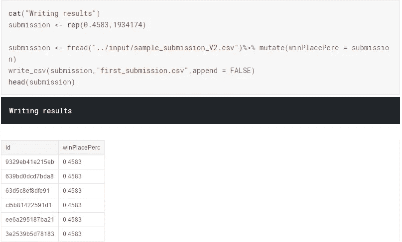
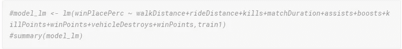

# 让我们开始吧——PUBG 一步一步教程

> 原文：<https://towardsdatascience.com/lets-play-a-pubg-step-by-step-tutorial-1c0b38b322e8?source=collection_archive---------16----------------------->

大家好！这款笔记本是专门为想要进入 **Kaggle 竞赛**领域但不知道如何开始旅程的初学者准备的。

> *最有效的方法，就是去做！*

嗯，我相信这个。对于初学者来说，这是一个很好的平台，可以让他们在正在进行的比赛中动手。我鼓励你们所有人在这个 **PUBG** 比赛中尝试并获得乐趣。

Photo by [Kony Xyzx](https://unsplash.com/@konyxyzx?utm_source=medium&utm_medium=referral) on [Unsplash](https://unsplash.com?utm_source=medium&utm_medium=referral)

从 Kaggle 页面

> player unknown ' s BattleGrounds(PUBG)*广受欢迎。销量超过 5000 万份，是有史以来第五大畅销游戏，每月有数百万活跃玩家。*
> 
> *你得到了大量匿名的 PUBG 比赛统计数据，格式化后每行包含一名球员的赛后统计数据。数据来自各种类型的比赛:单人赛、双人赛、团队赛和定制赛；不能保证每场比赛有 100 名玩家，也不能保证每组最多 4 名玩家。*
> 
> *你必须创建一个模型，根据玩家的最终统计数据预测他们的最终排名，范围从 1(第一名)到 0(最后一名)。*

基本上，我们被要求在不玩游戏的情况下预测每个玩家的最终位置。多酷啊！这就像一个成功的公式，

> 哦，你有这么多大头照，你会进入前 5 名的。

太神奇了，不是吗？

在这个游戏中，有 n 个不同的人用不同的策略玩，知道什么能帮助你赢得游戏会很有趣。

和大多数 Kaggle 比赛一样，你会得到两个数据集:

*   一个**训练集**，包含一组球员的结果(或目标变量)以及其他参数的集合，如他们的 groupId、matchId、助攻等。这是您必须在其上训练预测模型的数据集。
*   一个**测试集**，你必须根据为两个数据集提供的其他玩家属性来预测现在未知的目标变量。

为了让事情运转起来，我们将从简单的方法开始，这些方法在逻辑上对所有人来说都是合理的。在我们前进的道路上逐渐转向**深度学习**方法。是的，你没听错。深度学习在 r .让我们不要忘乎所以。

让我们首先从加载这些库开始。

读取训练和测试文件

数据一瞥

只是我，还是你们也注意到了测试文件中有一个**列不匹配**(有一列丢失了)？
**winPlacePerc** 列是我们在测试中要预测的。如果在测试文件中有，这就不是一个挑战了，对吗？

让我们更深入地研究我们的目标变量。

好吧，这样更容易理解。0.4583 是训练集中的中值。这当然意味着大多数玩家都在完成游戏的区间**(努力)**的中间。你准备好做你的第一个预测了吗？既然大多数玩家都完成了中等级别的训练，也许假设测试组中的每个人都完成了是一个好的开始？一点玩快速脏，并发送一个预测。

> *您可能已经注意到，我们在目标值中有一个空值。除此之外，它是一个超级干净的数据集。(警告:这不是真实情况)。所以我们用 0 来估算。*

现在在机器学习中，主要有两类变量。

1.  **分类变量**，其值是有限的，通常基于特定的有限组。例如，分类变量可以是国家、年份、性别、职业。
2.  **然而，连续变量**可以取任何值，从整数到小数。例如，我们可以得到收益，股票价格。

机器学习算法不支持字符。所以我们要把它们转换成因子(分类)。

我们的第一次预测出了什么问题？让我们分析一下。

我们看到了中间值(或最常出现的值)并将其应用于预测文件，希望其他所有玩家都在 **try hards** 类别中。我们是多么自信啊，啊！

# 欢迎来到超适合

*   一个好的机器学习模型的目标是从训练数据很好地推广到来自问题域的任何数据。这使我们能够根据模型从未见过的数据对未来做出预测。
*   **过拟合**指对训练数据建模过好的模型。
*   **过度拟合**发生在模型学习训练数据中的细节和噪声，以至于对模型在新数据上的性能产生负面影响的时候。这意味着训练数据中的噪声或随机波动被模型拾取并学习为概念。问题是这些概念不适用于新数据，并对模型的概括能力产生负面影响。

在我们的例子中，通过查看中间值，我们认为它将适用于测试数据中的所有其他值。这是数据的过度拟合。

# 如何解决过度拟合？

*   一个**验证数据集**仅仅是你的训练数据的一个子集，你把它从你的机器学习算法中保留下来，直到你的项目结束。在训练数据集上选择并调整了机器学习算法后，您可以在验证数据集上评估学习到的模型，以最终客观地了解模型在未知数据上的表现。

# EDA 和特征工程

嗯，理论上讲**步行距离**应该是获胜的关键因素。由于跑步速度几乎是静止的，你对此无能为力。*所以，如果你必须处于领先的位置，你就必须继续前进。*步行距离与获胜几率成正比。

提升也应该是一个重要因素。如果你想多活些时间，很有可能你使用了一次或多次强化。

我们还看到了表示游戏模式(如小队、双人和单人模式)的预期分组数。小于 10 的值可能需要进一步调查，因为这些很可能是自定义游戏或断开错误。

# 相互关系

让我们看看变量之间的相关性。这可能会给我们一个良好的开端，以防从长远来看所有的变量都被认真考虑。

**正相关**——步行距离、武器获得、提升

**负相关** —必杀之地

**杀戮地点** —在比赛中杀死的敌方玩家数量排名。等级越低，赢得比赛的机会就越大。

# 1.NumGroups —我们在比赛中拥有数据的组的数量。

有趣的是，当 numGroups 为 1 时，只有**的值为 0。让我们记住这一点，并在测试数据中进行更改。(一些后期处理)。**

# 2.步行距离——步行的总距离，以米为单位。

似乎数据有很多离群值，这使得(或骗子)在训练数据。时速超过 20 公里是不切实际的。我们会认为这是一个欺骗代码，并继续前进。

# 3 —杀死

在这里，我为那些拥有超过 40 次杀戮的 id 创建了一个标志

# 4.头像率

***爆头杀*** 可能有很多可以告诉你一个玩家有多好。我已经创建了一个变量 *headshot_rate* 来理解头部枪击致死率与总致死率的关系。

这里，我们创建了 **test1** 作为验证集，以便在**真实测试**数据集上进行测试之前进行进一步测试。

# 僵尸

# 问题陈述

主要有两种类型的机器学习问题

*   **分类** —输出变量采用类别标签。
*   **回归** —输出变量取连续值

这里，由于目标变量(winPlacePerc)是一个连续变量，该问题属于**回归**问题。

**线性回归**是回归的首选方法。

**线性回归**用于根据一个或多个输入预测变量 x 来预测结果变量 Y 的值。目的是在预测变量和响应变量之间建立线性关系(数学公式),这样，当只有预测变量(Xs)值已知时，我们可以使用该公式来估计响应变量 Y 的值。使用我们的 PUBG 数据，假设我们希望对资产、kills 和 winPlacePerc 之间的线性关系进行建模。

Y = β1 + β2X + ϵ

其中，β1 是截距，β2 是斜率。统称为回归系数。ϵ是误差项，y 的部分回归模型无法解释。

# 是线性的！

*   在后台，代表“线性模型”的 lm 通过最小化最小二乘准则产生最佳拟合线性关系。
*   对于我们模型的初始评估，我们可以使用 summary。这为我们提供了关于我们的模型的大量信息，我们将逐一介绍。

# 斯捷潘克

在**逐步回归**中，选择程序由统计包自动执行。变量选择的标准包括调整的 R-square、Akaike 信息标准(AIC)、贝叶斯信息标准(BIC)、Mallows 的 Cp、PRESS 或错误发现率(1，2)。逐步选择的主要方法是向前选择、向后淘汰和两者的结合

# 平均绝对误差

**平均绝对误差(MAE)** 是另一个用于回归模型的损失函数。MAE 是我们的目标变量和预测变量之间的绝对差值的总和。因此，它测量的是一组预测中误差的平均大小，而不考虑它们的方向。(如果我们也考虑方向，这将被称为平均偏差误差(MBE)，它是残差/误差的总和)。

# H2O——图书馆

**H2O** 是一个开源、内存、分布式、快速、可扩展的机器学习和预测分析平台，允许您在大数据上构建机器学习模型，并在企业环境中轻松实现这些模型。

此外，它还使用内存压缩来处理大型数据集，即使是小型集群也是如此。它还包括实现并行分布式网络培训规定。

# 深度学习

希望你们学到了一些东西。建设性的反馈总是受欢迎的。

这里有完整的代码:[https://github.com/Arjundasmarath/PUBG](https://github.com/Arjundasmarath/PUBG)

跟着我上**kaggle**:[https://www.kaggle.com/arjundas](https://www.kaggle.com/arjundas)