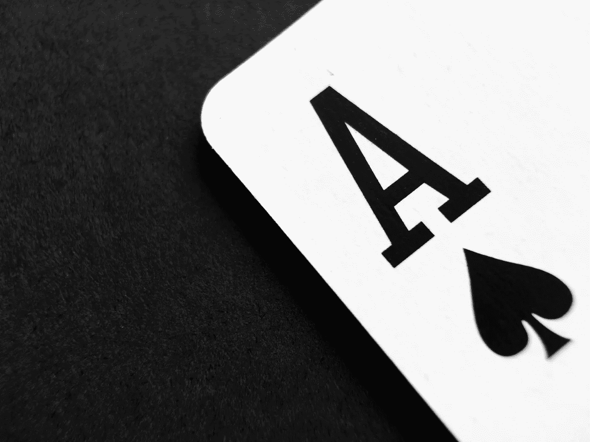
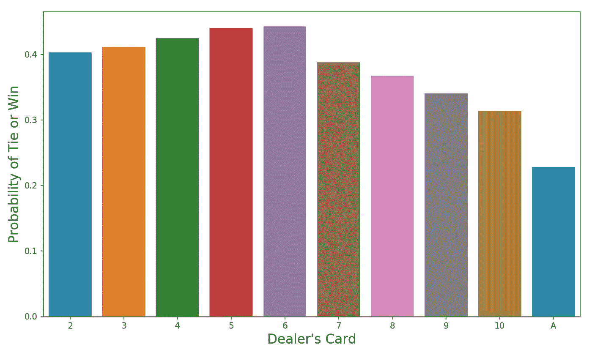
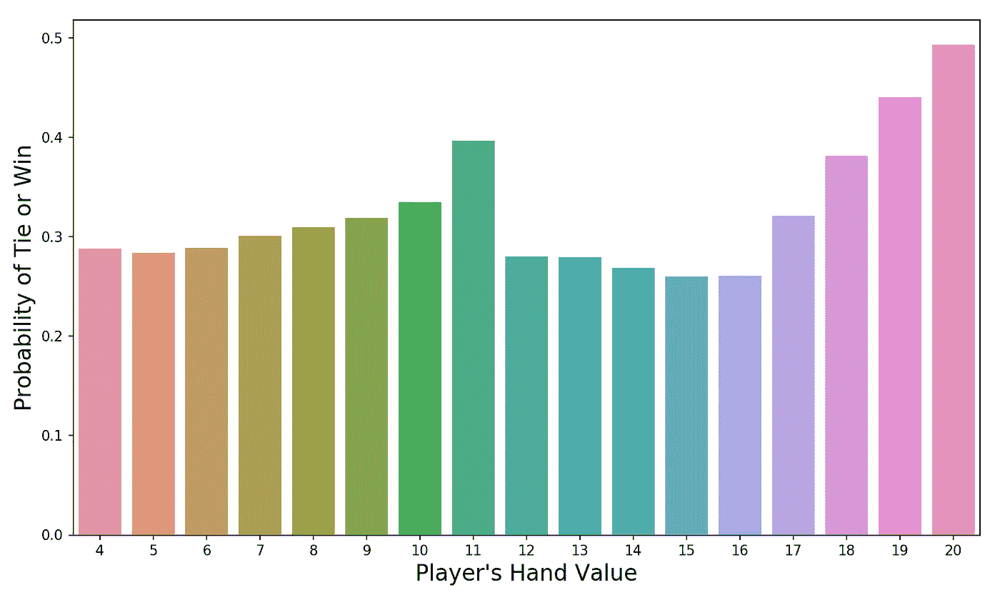
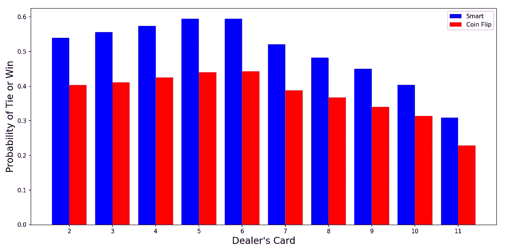
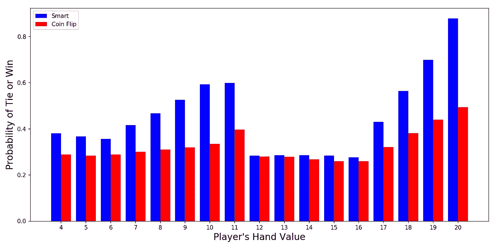

# 让我们玩 21 点(用 Python)

> 原文：<https://towardsdatascience.com/lets-play-blackjack-with-python-913ec66c732f?source=collection_archive---------2----------------------->



## 我们用 Python 实现了一个 21 点模拟器，以便更好地理解去拉斯维加斯的风险

这篇文章绝不是试图推广 21 点或赌博行为。任何时候你在赌场赌博，赔率都对你不利——随着时间的推移，你会输钱。不要拿你输不起的东西去冒险！

***更正:*** *我意识到(感谢@DonBeham 的友好提示)在某些情况下，我的 total_up 函数错误地处理了多个 ace。我已经在我的 GitHub* *上更新了下面的代码和* [*。我道歉！*](https://github.com/yiuhyuk/blackjack)

我最近没有为博客写任何代码，所以我想写一篇与编程相关的文章。概率和统计的经典应用之一是对机会游戏(赌博)的研究。碰运气的游戏(纸牌游戏、骰子游戏等。)是统计学家的最爱，因为它们既展示了随机性，也展示了某种必然性:

*   **随机**在那场你不知道会有什么结果的游戏中。
*   而**必然**在于你知道大量游戏的平均结果会是什么。

今天，我们将通过用 Python 编写一个 21 点模拟器来研究 21 点，模拟一系列游戏，然后研究我们的玩家做得如何。我将假定您对 21 点游戏有一些基本的了解，但这里有一个关于该游戏玩法的快速复习:

1.  玩家下注。
2.  玩家发 2 张牌。
3.  庄家得到 2 张牌，第二张牌对玩家是隐藏的。
4.  游戏的目标是获得比庄家更高的总点数(但不超过 21，**任何超过 21 的点数都是自动损失，称为破产** ) —如果你以这种方式击败庄家，你将从赌场赢得你所赌的钱(如果庄家破产，你也将获胜)。ace 可以值 1 或 11；其他每张牌的面值都相同(正面牌的面值为 10)。
5.  由一张 a 和一张脸牌组成的最初 2 手牌被称为 21 点，是最好的一手牌。
6.  在第一轮发牌后，每个玩家都可以选择打(收到更多的牌)或留(没有更多的牌)。如果击中导致玩家失败(总数超过 21)，那么他或她的赌注就输了。
7.  在所有玩家都完成击球/停留后，庄家翻开他隐藏的牌。如果庄家的总数少于 17，那么他或她需要击中(收到一张新卡)。这个过程一直重复，直到庄家的手牌总数达到 17 或更多，或者破产(超过 21)。
8.  庄家玩完之后，就决定了最后的结果——如果庄家破产，那么任何没有先破产的玩家就赢了他或她的赌注。如果庄家没有破产，那么庄家的总数将与每个玩家的总数进行比较。任何玩家的总点数大于庄家的，他或她就赢了钱(按下注的金额)。任何玩家的总点数少于庄家的，他或她就输钱。在平局的情况下不兑换货币。

如果你想了解更多关于 21 点规则的内容，请访问这个网站。开始编码的时间到了！

# 编写我们的模拟器

[你可以在我的 GitHub 上找到完整的代码。](https://github.com/yiuhyuk/blackjack)

使用面向对象编程可能是个好主意。但是在这一点上，我还不习惯用那种方式写代码。我可能会在将来的某个时候修改我的代码，使之面向对象；但这是另一天的项目。

首先，让我们把输入语句放在一边:

```
import numpy as np
import pandas as pd
import random
import matplotlib.pyplot as plt
import seaborn as sns
```

现在让我们创建几个函数来帮助我们。首先，我们需要一个函数来创建一副新的纸牌供我们玩。 *make_decks* 函数就是这么做的——它为每种牌类型添加四张牌(ace、2、3、4 等等)。)到列表 *new_deck* ，洗牌 *new_deck* ，并返回新创建的列表(deck)供我们玩。还要注意，我们可以通过 *num_decks* 来指定我们希望该函数创建多少副牌。

```
# Make a deck
def make_decks(num_decks, card_types):
    new_deck = []
    for i in range(num_decks):
        for j in range(4):
            new_deck.extend(card_types)
    random.shuffle(new_deck)
    return new_deck
```

我们还需要一个函数，可以增加我们手中的卡的价值。它比简单的求和稍微复杂一些，因为 ace 可以值 1 或 11，这取决于哪一个对持有者最有利。因此，我们的函数首先计算手中每张非 a 牌的值(我用数字 10 表示所有的正面牌，因为它们在 21 点中的功能都是相同的)。然后它会计算 ace 的数量。最后，它决定了每张 a 值多少钱，这取决于你其余牌的价值。

**修正:**在我之前版本的代码下面，有一个错误。为了解决这个问题，我添加了助手函数 **ace_values** ，它将您手中的 ace 数作为整数输入，并输出您的 ace 值的唯一值列表。计算给定数量的 ace 的排列(和它们的和)比我想象的要多，我需要写下面两个助手函数来完成它(更多细节，请参考我在下面代码块中的注释):

```
# This function lists out all permutations of ace values in the
# array sum_array.
# For example, if you have 2 aces, there are 4 permutations:
#     [[1,1], [1,11], [11,1], [11,11]]
# These permutations lead to 3 unique sums: [2, 12, 22]
# Of these 3, only 2 are <=21 so they are returned: [2, 12]
def get_ace_values(temp_list):
    sum_array = np.zeros((2**len(temp_list), len(temp_list)))
    # This loop gets the permutations
    for i in range(len(temp_list)):
        n = len(temp_list) - i
        half_len = int(2**n * 0.5)
        for rep in range(int(sum_array.shape[0]/half_len/2)):
            sum_array[rep*2**n : rep*2**n+half_len, i]=1
            sum_array[rep*2**n+half_len : rep*2**n+half_len*2, i]=11
    # Only return values that are valid (<=21)
    return list(set([int(s) for s in np.sum(sum_array, axis=1)\
                     if s<=21]))# Convert num_aces, an int to a list of lists
# For example if num_aces=2, the output should be [[1,11],[1,11]]
# I require this format for the get_ace_values function
def ace_values(num_aces):
    temp_list = []
    for i in range(num_aces):
        temp_list.append([1,11])
    return get_ace_values(temp_list)
```

以上两个函数现在可以由函数 **total_up** 使用，该函数像我上面提到的那样，计算我们手中牌的价值(包括正确处理任何 a):

```
# Total up value of hand
def total_up(hand):
    aces = 0
    total = 0

    for card in hand:
        if card != 'A':
            total += card
        else:
            aces += 1

    # Call function ace_values to produce list of possible values
    # for aces in hand
    ace_value_list = ace_values(aces)
    final_totals = [i+total for i in ace_value_list if i+total<=21]

    if final_totals == []:
        return min(ace_value_list) + total
    else:
        return max(final_totals)
```

既然我们的助手函数已经完成了，让我们进入主循环。首先，我定义了我的关键变量:

*   **牌堆**是我们将模拟的牌堆数量(其中每个牌堆可以是一副或多副)。
*   **玩家**是每个模拟游戏的玩家数量。
*   **num_decks** 是每叠牌中的牌数。
*   **card_types** 是所有 13 种卡类型的列表。

```
stacks = 50000
players = 1
num_decks = 1card_types = ['A',2,3,4,5,6,7,8,9,10,10,10,10]
```

现在开始我们模拟器的主循环。有两个:

1.  一个 **for 循环**，遍历我们想要模拟的 50，000 叠牌。
2.  一个 **while 循环**，对于每叠牌，玩 21 点，直到该叠牌中有 20 张或更少的牌。此时，它移动到下一个堆栈。

numpy 数组， *curr_player_results，*是一个重要的变量，其中存储了每个玩家的游戏结果——1 表示赢，0 表示平，1 表示输。这个数组中的每个元素对应于 21 点桌上的一个玩家。

在 while 循环中，我们给每个玩家发一张牌，然后给庄家发一张牌(Python 注释说“先发一张牌”)，然后我们再发一次，这样每个人都有 2 张牌。为了发牌，我利用了输入为 0 的 pop 函数——它返回列表的第一个元素，同时将它从列表中删除(非常适合从一堆牌中发牌)。当庄家牌堆中剩余的牌数下降到 20 张或更少时，新的牌堆用于替换旧的牌堆(移动到 for 循环的下一次迭代)。

```
for stack in range(stacks):
    blackjack = set(['A',10])
    dealer_cards = make_decks(num_decks, card_types)
    while len(dealer_cards) > 20:

        curr_player_results = np.zeros((1,players))

        dealer_hand = []
        player_hands = [[] for player in range(players)] # Deal FIRST card
        for player, hand in enumerate(player_hands):
            player_hands[player].append(dealer_cards.pop(0))
        dealer_hand.append(dealer_cards.pop(0))
        # Deal SECOND card
        for player, hand in enumerate(player_hands):
            player_hands[player].append(dealer_cards.pop(0))
        dealer_hand.append(dealer_cards.pop(0))
```

接下来，庄家检查他或她是否有 21 点(a 和 10)。请注意，在前面的代码块中，我将 21 点定义为包含 a 和 10 的集合。

如果庄家有 21 点，那么玩家就输了(并在 *curr_player_results* 中得到-1)，除非他们也有 21 点(在这种情况下是平局)。

```
 # Dealer checks for 21
        if set(dealer_hand) == blackjack:
            for player in range(players):
                if set(player_hands[player]) != blackjack:
                    curr_player_results[0,player] = -1
                else:
                    curr_player_results[0,player] = 0
```

如果庄家没有 21 点，游戏继续。玩家自己做 21 点检查——如果他们有，他们就赢(在一些赌场，21 点支付 1.5 比 1，换句话说，如果你的赌注是 100 美元，那么你就赢 150 美元)。我通过将数组 *curr_player_results* 中对应于该玩家的元素设置为 1 来记录一次胜利。

对于没有 21 点的玩家，他们现在可以选择击球、停留等。对于这个模拟，我的目标是捕捉所有类型的玩家决策——聪明的、幸运的和愚蠢的。所以我基于抛硬币来为玩家做决定(如果 random.random()产生的值高于玩家命中的 0.5，否则玩家留下)。

通过抛硬币来决定可能听起来很傻，但通过使击中/停留决定与游戏中实际发生的事情无关，我们可以观察所有类型的情况，并最终生成丰富的数据集进行分析。

在这个例子中，我并不试图找出最佳策略。相反，我想使用这个模拟器来生成训练数据，用这些数据我最终可以训练一个[神经网络](/understanding-neural-networks-19020b758230)来最佳地玩 21 点(在未来的帖子中)。

*对于 Python 来说，\字符表示行继续符，可以用来格式化超长的代码行，以获得更好的可读性——在下面的代码块中，你会看到我使用它。*

```
 else:
            for player in range(players):
                # Players check for 21
                if set(player_hands[player]) == blackjack:
                    curr_player_results[0,player] = 1
                else:
                    # Hit randomly, check for busts
                    while (random.random() >= 0.5) and \
                    (total_up(player_hands[player]) <= 11):
                        player_hands[player].append]
                        (dealer_cards.pop(0))
                        if total_up(player_hands[player]) > 21:
                            curr_player_results[0,player] = -1
                            break
```

在我们循环的最后一段(快到了！)，轮到庄家了。庄家必须打到他或她破产，或者有一手至少等于 17 的牌。因此，while 循环向庄家发牌，直到达到 17，然后我们检查我们的庄家是否破产。如果庄家破产，那么每个还没有输(通过破产)的玩家都会赢，我们会在 *curr_player_results* 中为他们记录 1。

```
 # Dealer hits based on the rules
        while total_up(dealer_hand) < 17:
            dealer_hand.append(dealer_cards.pop(0))
        # Compare dealer hand to players hand 
        # but first check if dealer busted
        if total_up(dealer_hand) > 21:
            for player in range(players):
                if curr_player_results[0,player] != -1:
                    curr_player_results[0,player] = 1
```

如果庄家没有破产，那么每个玩家都将自己的手牌与庄家的手牌进行比较，较高的手牌获胜。

```
 else:
            for player in range(players):
                if total_up(player_hands[player]) > \
                total_up(dealer_hand):
                    if total_up(player_hands[player]) <= 21:
                        curr_player_results[0,player] = 1
                elif total_up(player_hands[player]) == \
                total_up(dealer_hand):
                    curr_player_results[0,player] = 0
                else:
                    curr_player_results[0,player] = -1
```

最后，在每场 21 点游戏结束时，我们将游戏结果以及我们关心的其他变量添加到列表中，我们将使用这些列表来跟踪我们的整体模拟结果:

```
 # Track features
        dealer_card_feature.append(dealer_hand[0])
        player_card_feature.append(player_hands)
        player_results.append(list(curr_player_results[0]))
```

# 模拟结果

很好，我们现在可以检查一些结果了。我运行了 50，000 副牌的模拟器。由于使用了这么多副牌，最终出现了:

*   **玩了**312，459 二十一点**游戏。**
*   **玩家在游戏的**199403**(当时的 **64%** )输了**。
*   **玩家在游戏 **99，324** (当时 **32%** )中赢得**。
*   **玩家在游戏的**13732**(时间的 **4%** )中与**打成平手。

我们可以看看赢/平概率(不把钱输给赌场的概率)是如何由于关键的可观察因素而变化的。例如，下面是所有可能的庄家牌的赢/平概率(回想一下，玩家在决定怎么做时只能看到其中一张庄家的牌):



Probability of Win or Tie vs. Dealer’s Shown Card

从 2 到 6，赢/平的概率增加。但是在 6 之后，这种可能性急剧下降。那很有趣。让我们思考一下为什么会出现这种情况:

*   如果庄家亮出一张低牌，那么在其他条件相同的情况下，他的总牌价更低，这对玩家来说更容易被击败。这部分解释了为什么从 2 到 6 的概率平均高于从 7 到 ace 的概率。
*   此外，记住庄家的规则——如果他的总数少于 17，他必须击中。如果他必须出手，他很有可能会破产。这解释了为什么概率从 2 增加到 6。这么想吧— **最常见的卡值是多少？它是 10，因为每副 52 张牌中有 16 张(4 张 10 张牌，j、q 和 k)。**因此，如果庄家显示的是 6，(假设我们没有算牌)，我们庄家最有可能的初步总数是 16。因为 16 小于 17，所以他必须击中。还有很多牌可能会让他破产——任何值 6 或以上的牌。同样的逻辑也适用于庄家出 5 的情况，只是少了一张会让他破产的牌(现在必须是 7 或更多)。
*   现在让我们想一想，当庄家出 7 时会发生什么。在这种情况下，另一张隐藏的牌值 10。那么拥有 16 分或更少的玩家将会觉得必须去击球。如果他们不这样做，失败的概率是实质性的。但是如果他们真的击中了，那么他们很有可能会失败(由于所有的 10 分)。

> 简而言之，这就是赌场对 21 点玩家的优势——通过在玩家行动时隐藏庄家的一张牌(并迫使玩家在庄家之前行动)，赌场迫使 21 点玩家做最坏的打算，并让自己面临被捕的风险(这很重要)。

因此，如果你在赌场，你拿到的牌总数在 12 到 16 之间，祝你好运，因为你已经成为赌场的标志，现在你的胜算很大。让我们来看看玩家的初始手牌值(他或她的初始两张牌的值)如何影响他或她的赢/平概率:



Probability of Win or Tie vs. Player’s Hand Value (21 not shown because the probability is 100%)

**正如所料，初始玩家手牌值在 12 到 16 之间时，赢/平的概率最低。这些玩家经常被迫陷入“如果我打了我就破产，如果我留下我就输了”的双输局面。**这也解释了为什么初始玩家手牌值为 4 和 5 的概率次低。假设你有一张 5，那么你需要打(没有理由不打)——但是如果你真的打了，那么最有可能的结果是你的手牌总数现在是 15。现在，你已经陷入了和那些初始手牌总数在 12 到 16 之间的玩家一样的困境(如果你击中了，你的下一张牌可能会让你破产)。

# 我未来帖子的预览

现在我们已经探索了 21 点的风险，接下来是什么？在即将发布的帖子中，我将使用上面生成的训练数据来训练神经网络玩 21 点。这样我就可以检查机器选择什么作为最优策略。

但是今天，让我们看看是否可以用一个简单的启发式方法来提高我们的胜算。回忆两件事:

*   玩家面临的一个主要不利因素是他们被迫先行动(并面临在庄家之前被击败的风险)。因此，赌场的策略是迫使玩家在不确定的情况下行动，希望他们会一掷千金。
*   在我们的模拟器中，玩家根据掷硬币来选择击中或停留，而不考虑他或她的手牌的价值(除非他或她 21 岁)。所以即使他或她 20 岁，仍然有 50%的机会击中。

因此，让我们看看，我们是否可以仅仅通过选择在我们知道没有失败机会的情况下才出手来提高我们的胜算。因此，我们的新决策规则不是抛硬币，而是只有当我们的总牌价等于或小于 11 时才继续击球。

这不是我所知道的最优策略，但很简单。因为它阻止了我们的破产，我们有效地将破产的风险从我们自己转移到了庄家/赌场。

下图比较了我们的新“智能”策略(蓝色)和我们的原始策略(红色的抛硬币策略):



Smart vs. Coin Flip Probability of Win or Tie (bucketed by Dealer’s Card)

哇，永不冒险的简单决定增加了我们全面获胜的几率。而旧的趋势还在，无论庄家亮出什么牌，我们不亏损的概率都增加了。

让我们来看看，当我们按初始手牌值下注时，我们新策略的赢/平概率是怎样的:



Smart vs. Coin Flip Probability of Win or Tie (bucketed by Player’s Initial Hand Value)

看这个情节就更清楚是怎么回事了。除了 12 到 16 之外，我们提高了所有初始牌价的胜算。这些手牌值相对不受影响，因为通过选择留下(为了消除破产的风险)，我们使庄家更容易击败我们的手牌(因为庄家只有在手牌值达到 17 或更高时才能停止打击)。

但对于所有其他牌价，我们避免崩盘的策略似乎很有帮助。

我希望你喜欢阅读，并继续关注下一篇文章，我们将看到神经网络是否能够击败我们的天真策略。干杯并记住——**永远不要赌你输不起的东西！**

***我最近的一些帖子，希望你看看:***

[*你的公司真的是数据驱动的吗？*](/is-your-company-truly-data-driven-2cf5feaa3cfb)

[*数据科学家面临自动化的风险吗*](/is-the-data-science-profession-at-risk-of-automation-ae162b5f052f)

[*数据科学家挣多少钱？*](/how-much-do-data-scientists-make-cbd7ec2b458)

[*数据科学家赚多少钱第二部*](/how-much-do-data-scientists-make-part-2-cb959a0d05f)

[*软件工程师挣多少钱？*](/how-much-do-software-engineers-make-60565f50f579)

[*技能提升的更好方法*](/a-better-way-to-skill-up-b2e5ee87dd0a)