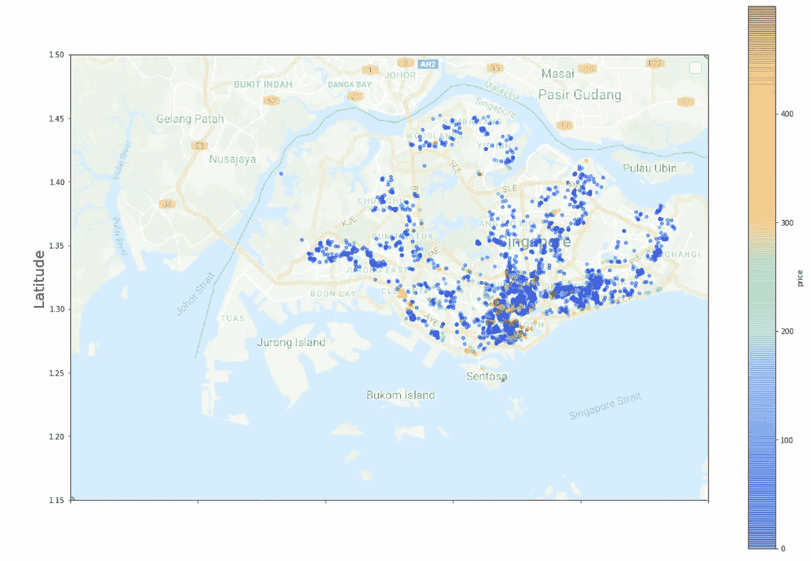
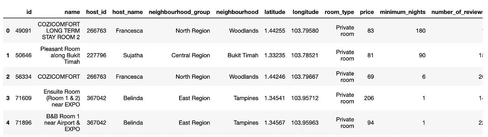
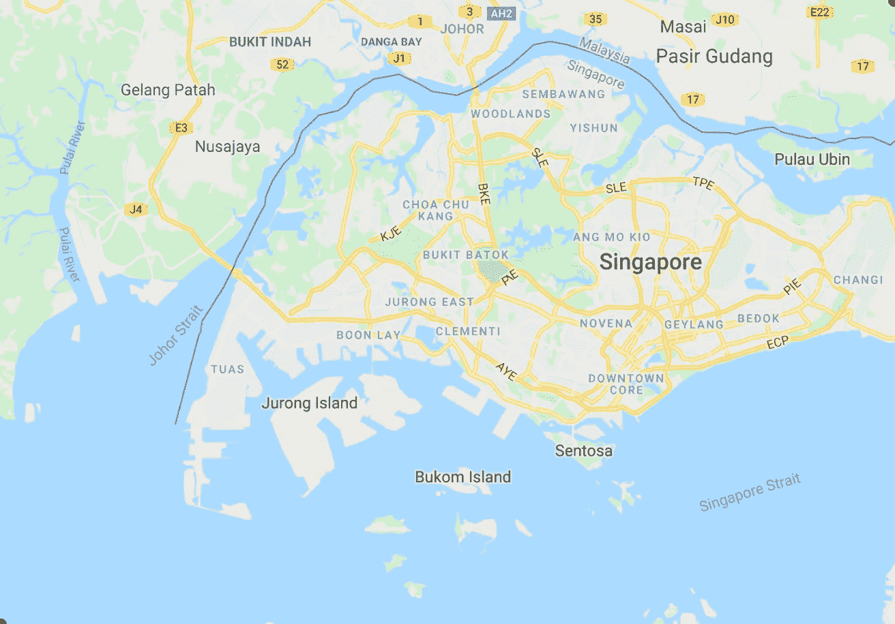

# 让我们在新加坡地图上标出 Airbnb 的位置和价格

> 原文：<https://towardsdatascience.com/lets-plot-airbnb-prices-on-a-map-of-singapore-ddbcae44fb69?source=collection_archive---------25----------------------->

## 使用 Matplotlib 以编程方式用 python 标注地图



在地图上绘制数据比你想象的要容易。

让我们通过在新加坡地图上绘制 Airbnb 房屋位置(用颜色和价格区分)来了解一下。为什么？嗯，我喜欢新加坡，但是我每次去都会花一大笔钱在航空旅馆上。

从 Kaggle 下载数据集，然后将其保存到与 jupyter 笔记本相同的目录中。你需要登录 Kaggle 来下载它。

数据集:[https://www.kaggle.com/jojoker/singapore-airbnb](https://www.kaggle.com/jojoker/singapore-airbnb)

该文件是一个 CSV，我们可以很容易地预览熊猫。

```
import pandas as pd# you may have named it something different
df = pd.read_csv('data-sg-listings.csv')# take a look
df.head()
```



现在，让我们放弃所有价格超过 500 英镑的房屋，因为离群值会打乱我们的颜色编码。

```
df = df[df['price'] < 500]
```

完美。

困难的部分来了。得到新加坡的地图图像，我们最终将在上面绘图。我是这么做的。

我去了 http://www.copypastemap.com 的，输入了将形成一个包围新加坡的边界框的角点的纬度和经度(1.15N，103.5E & 1.50N，104E)。然后我拍了一个截图，用相同的点来表示我的 x 轴和 y 轴的最小值/最大值。

但是省点麻烦，把我的截图截图在下面就行了。然后保存在同一个目录下。



唷。现在是简单的部分。在地图上标出我们的位置。又名。以地图图像为背景，在散点图上绘制我们的点。

```
import matplotlib.pyplot as plt# import our image 
singapore_img = mpimg.imread('singapore-map-3.png')# plot the data
ax = df.plot(
    kind="scatter", 
    x="longitude", 
    y="latitude", 
    figsize=(20,14),
    c="price", 
    cmap=plt.get_cmap("jet"),
    colorbar=True, 
    alpha=0.4,
)# use our map with it's bounding coordinates
plt.imshow(singapore_img, extent=[103.5,104,1.15, 1.50], alpha=0.5) # add axis labels
plt.ylabel("Latitude", fontsize=20)
plt.xlabel("Longitude", fontsize=20)# set the min/max axis values - these must be the same as above
plt.ylim(1.15, 1.50)
plt.xlim(103.5, 104)plt.legend(fontsize=20)
plt.show()
```

看看这个。


对我来说，最困难的实际上是获得一张包含我想要绘制的所有纬度/经度点的图像。多亏了 pandas 和 matplotlib，绘制这些点非常容易。