# 让我们在画面中弹出这些过滤器！

> 原文：<https://towardsdatascience.com/lets-pop-those-filters-in-tableau-86d1e27a9a37?source=collection_archive---------14----------------------->

## [加快数据可视化](https://towardsdatascience.com/tagged/datafiedviz)

## 它是数据化的！— Tableau 剧本

Photo by [Nicolas Picard](https://unsplash.com/@artnok?utm_source=unsplash&utm_medium=referral&utm_content=creditCopyText) on [Unsplash](https://unsplash.com/s/photos/up?utm_source=unsplash&utm_medium=referral&utm_content=creditCopyText)

现在，我们又回到了学习有趣的数据可视化概念的旅程中，使用 Tableau、dash-boarding 最佳实践和一些方便的提示/技巧。

在此记录中，我们将经历以下活动:

1.  **使用细节层次(LOD)表达式来识别是否已经选择了某些过滤器。**
2.  **使用计算字段隐藏/显示消息并突出显示哪些过滤器处于活动状态。**
3.  **使用 Tableau 中的浮动容器来隐藏过滤器，并使它们在满足某些要求时弹出。**

这些概念可以在您的 Tableau 旅程中的各种用例中使用。我将参考我创建并发布在我的 Tableau 公共配置文件中的示例仪表板，供您参考。

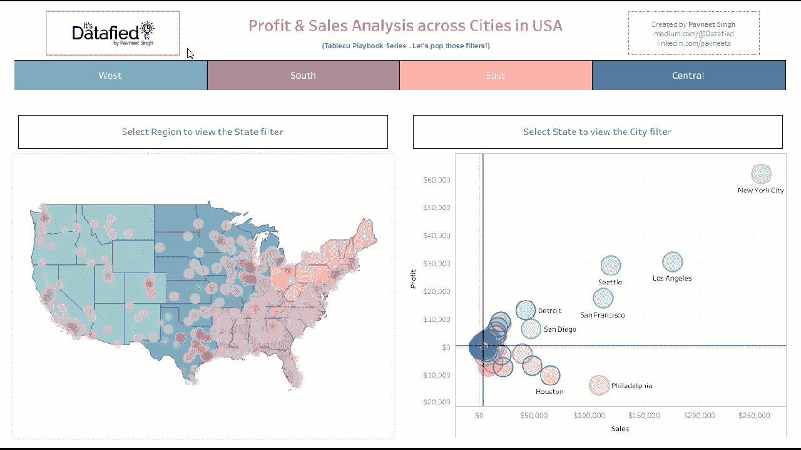

[**It’s Datafied! - Tableau Playbook**](https://public.tableau.com/profile/pavneet.singh#!/vizhome/ProfitSalesAnalysisacrossCitiesinUSA/ProfitSalesAnalysisDashboard)

*使用的数据集:样本超市*

让我们从如何使用细节层次(LOD)表达式来识别某些过滤器是否被选中开始。

# **步骤 1:使用 LOD 表达式检查是否选择了地区、州、城市进行过滤**

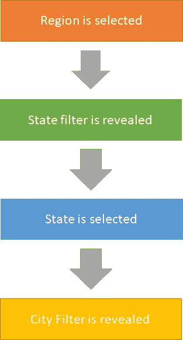

Hierarchical flow to be implemented

由于过滤器必须在我创建的参考仪表板中分层显示，让我们考虑我们必须检查的第一个条件，即是否选择了区域过滤器。将显示一条消息，要求首先选择区域，以便为状态应用过滤器。

一旦区域被选中，即弹出状态过滤器，状态过滤器将被显示。同样，当选择一个州时，会显示城市过滤器。

为了检查第一个条件是否选择了区域过滤器，我们将使用以下公式创建一个计算字段**“未选择区域”**。

**计算字段名称:“未选择 c#区域”**

*注意:如果您向自定义计算字段名称或 Tableau 中的参数名称添加类似 c#或 p#的前缀，以保持它们有组织并与您的其他维度/度量不同，这被认为是一个好的做法。*

**公式:**

> SUM([记录数])= SUM({ SUM([记录数])})

**公式分解:**

**SUM([记录数])** 表示当前视图中记录数的总和，即应用区域过滤器时，该计数会相应变化。

**SUM({ SUM([记录数])})** 代表固定 LOD，即它将计算数据集中的记录数，而不参考视图中的维度。这也被称为[表作用域 LOD](https://help.tableau.com/current/pro/desktop/en-us/calculations_calculatedfields_lod.htm#Table) 。由于 tableau 不能在同一个表达式中混合聚合函数和非聚合函数，我们必须将其与 SUM([记录数])进行比较，即当前视图中记录数的总和。

除非选择了区域筛选器，并且在当前视图中筛选了记录数，否则这种比较是正确的。

接下来，只有选择了州过滤器，才会显示城市过滤器。因此，为了检查这种情况，我们创建了以下计算字段:

**计算字段名称:“未选择 c#州”**

**公式:**

> SUM({固定[区域]:COUNTD([状态])})= COUNTD([状态])

**公式分解:**

> **SUM({固定[区域]:COUNTD([状态])})**
> 
> 在这里，我们对每个区域的不同状态进行计数，并使用固定的 LOD 对其进行汇总。因为不同的计数是跨每个区域计算的，所以它将不受除了区域之外的过滤器/维度的影响，因为它是固定的 LOD。
> 
> **COUNTD([State])** 表示当前视图中不同状态的计数，即一旦应用了区域/州过滤器，该计数会相应改变。

同样，我们也将为 City 创建一个计算字段。

**计算字段名称:“未选择 c#城市”**

**公式:**

> SUM({固定[州]:COUNTD([城市])})= COUNTD([城市])

# 步骤 2:使用计算字段根据适当的筛选器选择/取消选择来显示/隐藏消息

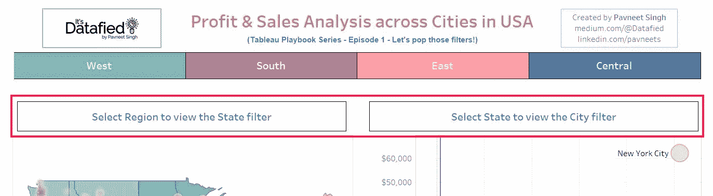

如您所见，我们有两个平铺窗口，上面显示一条消息，说明一旦选择了层次结构中较高的过滤器，就会显示相应的过滤器。让我们了解它们是如何工作的。

**计算字段名称:“c#区域未选择文本”**

**公式:**

> 如果[未选择区域],则“选择区域以查看状态过滤器”结束

**公式分解:**

> 如果没有选择区域，即如果我们在上述步骤中创建的'*区域未选择'* LOD 表达式为*真*，则显示消息。因为我们没有 else 条件，所以在这种情况下不会显示任何消息。
> 
> 以同样的方式，我们创建另一个计算字段，这一次是用于城市筛选器。

**计算字段名称:' c#状态未选择文本'**

**公式:**

> 如果[未选择州],则“选择州以查看城市过滤器”结束

# 步骤 3:创建工作表

所以现在我们到了第三步！太棒了。让我们继续前进，事情会越来越清楚。我们将使用在之前步骤中创建的字段，并创建 3 个工作表:

1.  隐藏状态过滤器！
2.  隐藏城市过滤器！
3.  过滤警报！

隐藏状态过滤器！

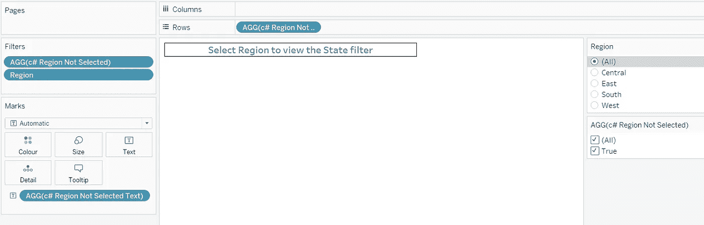

所以现在我们将计算字段 *'* ***c#区域未选择的文本*** *'* 添加到文本卡中，并进行适当的格式化。接下来，我们将 LOD 表达式'***c # Region Not Selected***'添加到 rows 工具架和 filters 工具架上。隐藏标题，如下所示:

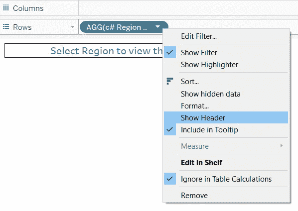

我还在工作表中添加了区域过滤器，向您展示它是如何工作的。

确保在从过滤器中选择一个区域后，勾选“***c # Region Not Selected***”的编辑过滤器选项中的 **True** 值，并取消勾选 **False** 选项。

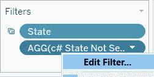

现在，如果我选择一个特定的区域，如下图所示:

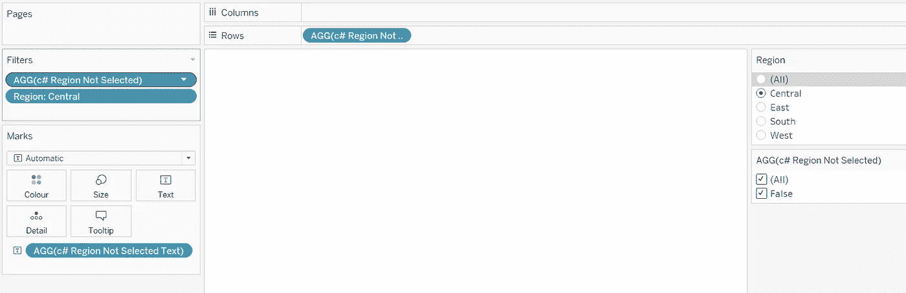

1.  我们视图中的记录数只针对中心区域进行了筛选，因此***([记录数])SUM({ SUM([记录数])})*** 因此我们的计算字段****‘c #区域未选择’****返回一个****False****值。**
2.  *这个**假**值使文本消失，因为在**‘c #区域未选择文本’**计算字段中不满足我们的条件。*
3.  *由于***‘c #区域未被选择’***被用于行货架，由于轴为**假**并被过滤，视觉的整个空间也被消除。这是重要的一步，你将在下一节中了解这一步有多重要。*

***隐藏那个城市滤镜！***

*同样的，你可以创建'*隐藏那个城市过滤器！*'工作表如下所示:*

*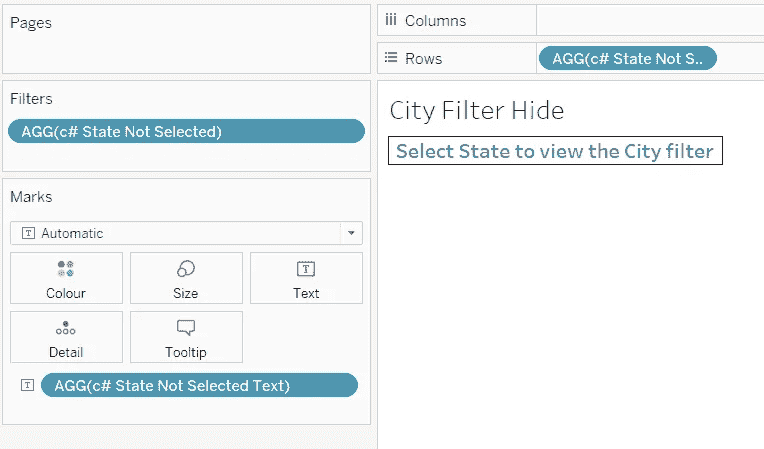*

***过滤预警！***

*我希望现在您已经非常清楚 LOD，因此我们将继续使用它们来创建一个计算字段，该字段将显示一个警报，提示控制面板上哪些筛选器当前处于活动状态！是啊，那真的很酷，对吧？*

***计算字段名称:“应用了 c#筛选器的警报”***

***公式:***

> *如果不是[未选择 c#地区]和[未选择 c#州]以及[未选择城市]*
> 
> *然后“使用中的过滤器:区域”*
> 
> *else if NOT[未选择 c#区域]和 NOT[未选择 c#州]和[未选择城市]*
> 
> *然后“使用中的过滤器:地区、州”*
> 
> *else if NOT[未选择 c#区域]和 NOT[未选择 c#州]和 NOT[未选择城市]*
> 
> *然后“正在使用的过滤器:地区、州、城市”*
> 
> *否则""*
> 
> *结束*

*创建一个新工作表，并将该字段添加到文本卡中。*

*该公式是不言自明的，我将把它留给您来试验，并理解在选择过滤器时计算字段如何返回 True /False。*

# *步骤 4:使用浮动容器在仪表板中添加元素，使过滤器弹出！*

*唷！做完那些计算和工作表！现在我们开始仪表板开发。*

*因为在这种方法中我们必须重叠容器，所以我们将使用浮动容器。让我们直接进入流程吧！*

*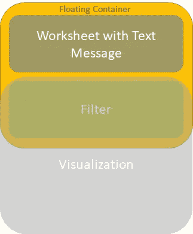*

*Layout for our dashboard*

*我们将把我们创建的带有文本消息的工作表放在浮动容器中该字段的实际过滤器之上。然后，过滤器将隐藏在另一个浮动可视化后面。*

*一旦选择了层次结构中较高的过滤器，文本消息就会消失，从而显示出在容器中弹出的过滤器！*

*在本次演示中，我将使用两个图表 *—* 堆叠图例过滤器、双轴密度标志图。*

**你可以在* [*我之前的博文*](/stacked-legend-filter-dual-axis-density-marks-map-dual-axis-scatter-plot-in-tableau-3d2e35f0f62b) *中了解到他们，链接也在本文末尾分享了。**

*我已经将本次演示所需的所有浮动元素添加到仪表板上:*

*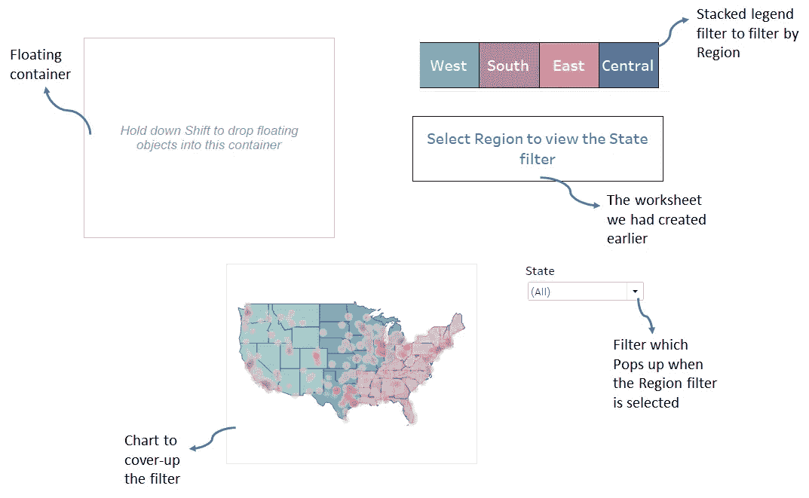*

*您可以通过对象部分将浮动垂直容器添加到空白仪表板:*

*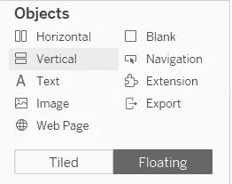*

*状态筛选器是使用应用它的 visual 添加的:*

*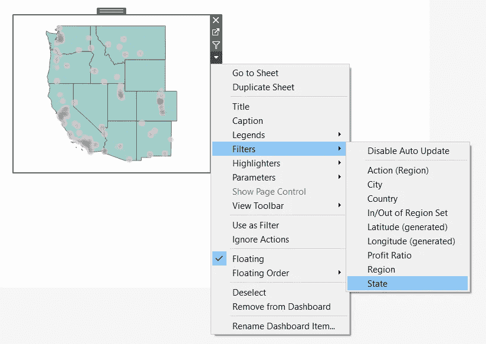*

*现在，我们将通过按住 shift 键将带有文本消息和状态过滤器的工作表添加到浮动容器中。*

*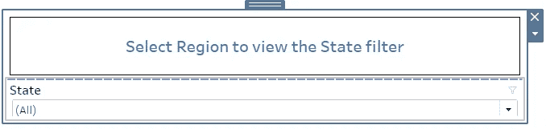*

*确保未选中容器的“平均分配内容”选项。*

*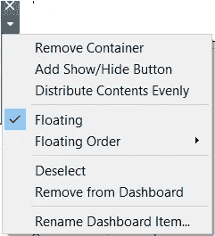*

> *提示:您可以通过双击宽灰色条来选择和移动容器，选择后该条显示在仪表板元素的顶部。*

*使用项目层次结构，我们可以将地图可视化拖动到项目层次结构的顶部，然后适当地放置它以隐藏它后面的状态过滤器:*

*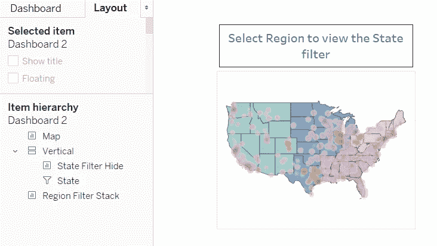*

*现在，当我们通过启用过滤器动作将过滤器栈用作过滤器时，*

*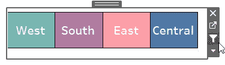*

*瞧啊。状态过滤器从地图后面弹出！*

*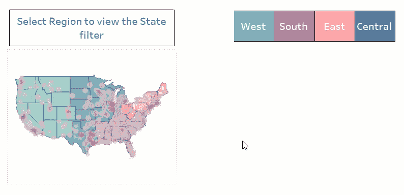*

*我们已经介绍了一些有趣的新概念，这些概念在您的# DataRockstar Tableau 之旅中可能会非常有用。太棒了，对吧？！*

> *注意:从我的 tableau 公共配置文件下载 Tableau 工作簿后，请务必检查*仪表板操作*，当取消选择该地区时，我使用了过滤器操作来重置州和城市过滤器，以避免任何歧义。那是让你作为一个活动进一步探索的！*

## ***总结***

1.  *开发的组件——识别使用 LOD 表达式和计算字段选择的过滤器，显示活动过滤器的文本消息，组合浮动容器中的元素。*
2.  *整合了最佳实践-遵循组织计算字段和参数的命名方案。*
3.  *分享的提示和技巧——如何使用浮动容器隐藏元素，并根据层次结构中的过滤器选择显示它们。*

*请随意从我的 Tableau 个人资料中下载工作簿，并试用它以获得更好的理解。敬请期待进一步的帖子和快乐的餐桌！*

 *[## Tableau 公共

### 随意分享和玩耍

public.tableau.com](https://public.tableau.com/profile/pavneet.singh#!/vizhome/ProfitSalesAnalysisacrossCitiesinUSA/ProfitSalesAnalysisDashboard)* * [## 堆叠图例过滤器、双轴密度标记图和双轴散点图

### 它是数据化的！— Tableau 剧本系列

towardsdatascience.com](/stacked-legend-filter-dual-axis-density-marks-map-dual-axis-scatter-plot-in-tableau-3d2e35f0f62b)*  *[## 概述:详细等级表达式-表格

### 本文解释了细节层次表达式是如何计算的，以及它们在 Tableau 中的作用。更多信息…

help.tableau.com](https://help.tableau.com/current/pro/desktop/en-us/calculations_calculatedfields_lod_overview.htm)* * [## 操作和仪表板

### 当源或目标是仪表板时，操作通常具有独特的行为。因为仪表板可以包含…

help.tableau.com](https://help.tableau.com/current/pro/desktop/en-us/actions_dashboards.htm)  [## 调整仪表板的大小和布局

### 创建仪表板后，您可能需要调整其大小并重新组织，以便更好地为用户服务。固定大小…

help.tableau.com](https://help.tableau.com/current/pro/desktop/en-us/dashboards_organize_floatingandtiled.htm)*