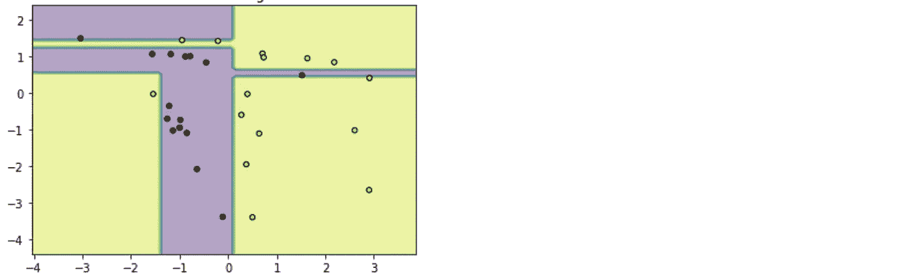
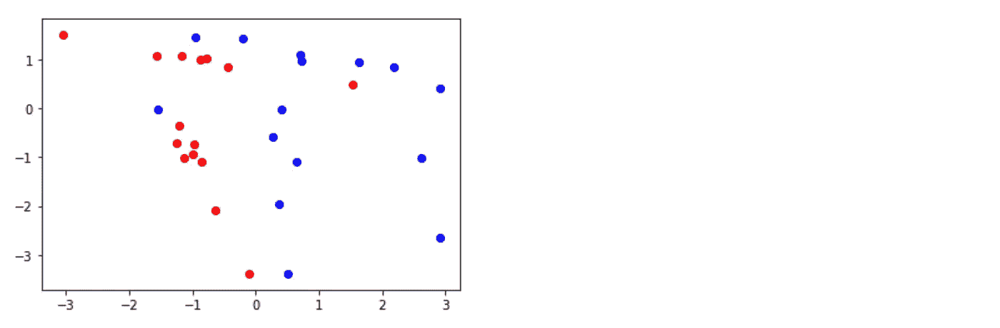
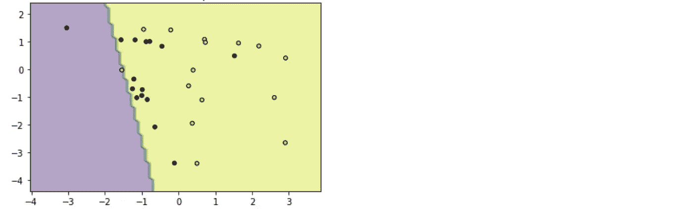
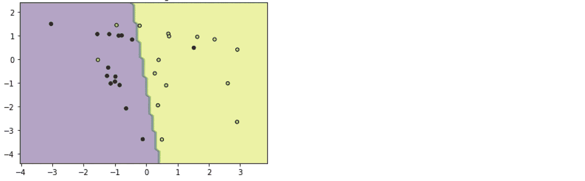

# 让我们对机器学习模型进行欠适应和过适应

> 原文：<https://towardsdatascience.com/lets-underfit-and-overfit-a-machine-learning-model-26e1aebca233?source=collection_archive---------23----------------------->

## 构建过度和不足的模型



一位同事最近开始使用术语“欠拟合”来指代命名实体识别(NER)模型，该模型遗漏了它应该标记的实体。

我必须澄清事实。这实际上并不是不合身，但我可以理解有人会有这种印象。

那么什么是适配不足，或者适配过度呢？

让我们训练一些低估和高估数据的模型！

我们先用 sklearn 的“make_classification”函数生成一个数据集。每个数据点将有 2 个特征(所以很容易绘制)和一个标签。

```
from sklearn.datasets import make_classification# We didn't need to display all params but I like to see defaults
# I've edited some of these
X,y = make_classification(
    n_samples=30, 
    n_features=2, 
    n_informative=2,
    n_redundant=0,
    n_repeated=0, 
    n_classes=2, 
    n_clusters_per_class=2, 
    weights=None, 
    flip_y=0.01, 
    class_sep=1.0, 
    hypercube=True, 
    shift=0.0, 
    scale=1.0, 
    shuffle=True, 
    random_state=None
)# Split examples by class (positive/negative) to give diff colors
pos_feat0 = []
pos_feat1 = []
neg_feat0 = []
neg_feat1 = []for idx,klass in enumerate(y):
    if klass == 1:
        pos_feat0.append(X[idx][0])
        pos_feat1.append(X[idx][1])
    else:
        neg_feat0.append(X[idx][0])
        neg_feat1.append(X[idx][1])# And plot them
import matplotlib.pyplot as plt
plt.scatter(pos_feat0,pos_feat1, c='blue')
plt.scatter(neg_feat0,neg_feat1, c='red')
```



嘣。我们有数据。

现在，我们将浏览欠拟合和过拟合的定义，然后有意识地选择将欠拟合和过拟合数据的算法。

# 欠拟合

根据[维基百科](http://Underfitting occurs when a statistical model cannot adequately capture the underlying structure of the data.)。

> **当统计模型无法充分捕捉数据的底层结构时，就会出现**欠拟合。

**翻译:**模型在数据中找不到可靠的模式。这并不意味着没有模式。只是模特找不到。

```
from sklearn.linear_model import SGDClassifiermodel = SGDClassifier()
model.fit(X, y)# set min and max values for the x and y axes
x_min, x_max = X[:, 0].min() - 1, X[:, 0].max() + 1
y_min, y_max = X[:, 1].min() - 1, X[:, 1].max() + 1
a = np.arange(x_min, x_max, 0.1)
b = np.arange(y_min, y_max, 0.1)# build a grid of each unique combination of x and y
xx, yy = np.meshgrid(a, b)# make predictions for every combination of x and y on that grid
Z = model.predict(np.c_[xx.ravel(), yy.ravel()])
Z = Z.reshape(xx.shape)# draw the classification boundary
plt.contourf(xx, yy, Z, alpha=0.4)# adds the points from our training data
plt.scatter(X[:, 0], X[:, 1], c=y, s=20, edgecolor='k')plt.show()
```



完美。该模型在绘制决策边界方面做得很糟糕。它不能使用特征来确定一个例子的类别。吃不饱！

# 过度拟合

据[维基百科](https://en.wikipedia.org/wiki/Overfitting)。

> 产生的分析与一组特定的数据过于接近或精确，因此可能无法拟合额外的数据或可靠地预测未来的观察结果

翻译:模型学习输入的例子，但它不能推广到其他例子。

```
from sklearn.tree import DecisionTreeClassifier
model = DecisionTreeClassifier(max_depth=4)model.fit(X, y)# set min and max values for the x and y axes
x_min, x_max = X[:, 0].min() - 1, X[:, 0].max() + 1
y_min, y_max = X[:, 1].min() - 1, X[:, 1].max() + 1
a = np.arange(x_min, x_max, 0.1)
b = np.arange(y_min, y_max, 0.1)# build a grid of each unique combination of x and y
xx, yy = np.meshgrid(a, b)# make predictions for every combination of x and y on that grid
Z = model.predict(np.c_[xx.ravel(), yy.ravel()])
Z = Z.reshape(xx.shape)# draw the classification boundary
plt.contourf(xx, yy, Z, alpha=0.4)# adds the points in our training data
plt.scatter(X[:, 0], X[:, 1], c=y, s=20, edgecolor='k')plt.show()
```


太美了。又一个可怕的模型。它在应该出现的例子周围画出了界限，但是它发现的模式毫无意义，并且可能无法推断出新的例子。

# 让我们现在拟合数据，只是为了好玩

```
from sklearn.linear_model import LinearRegression,LogisticRegression
model = LogisticRegression()model.fit(X, y)# set min and max values for the x and y axes
x_min, x_max = X[:, 0].min() - 1, X[:, 0].max() + 1
y_min, y_max = X[:, 1].min() - 1, X[:, 1].max() + 1
a = np.arange(x_min, x_max, 0.1)
b = np.arange(y_min, y_max, 0.1)# build a grid of each unique combination of x and y
xx, yy = np.meshgrid(a, b)# make predictions for every combination of x and y on that grid
Z = model.predict(np.c_[xx.ravel(), yy.ravel()])
Z = Z.reshape(xx.shape)# draw the classification boundary
plt.contourf(xx, yy, Z, alpha=0.4)# adds the points in our training data
plt.scatter(X[:, 0], X[:, 1], c=y, s=20, edgecolor='k')plt.title('Underfitting')plt.show()
```



太好了。不完美。但是比之前的 2 好多了。

这就是了。欠拟合、过拟合和计划拟合。

我们有意选择了一个简单的 2 要素数据集，以便您可以在图表上看到决策边界。

具有数千个特征的真实例子需要一种更数值的方法来测量欠拟合和过拟合。但是我们会留到下一天。