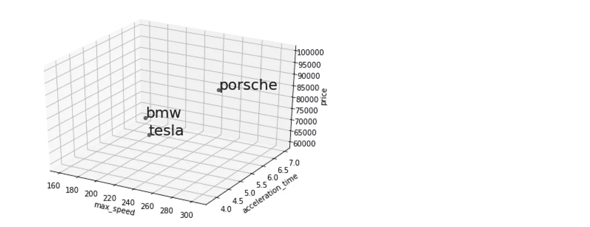
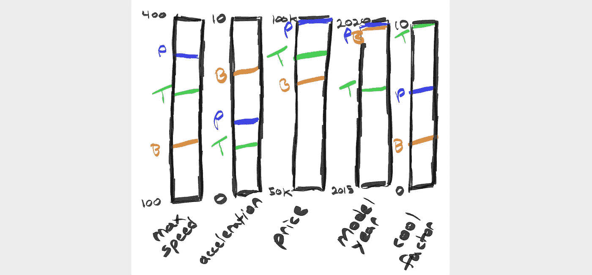
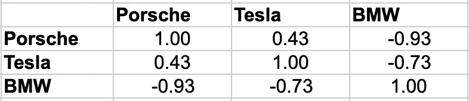

# 让我们通过建模汽车来理解机器学习中的向量空间模型

> 原文：<https://towardsdatascience.com/lets-understand-the-vector-space-model-in-machine-learning-by-modelling-cars-b60a8df6684f?source=collection_archive---------14----------------------->

## 带有代码示例



根据[维基百科](https://en.wikipedia.org/wiki/Vector_space_model)。

> **向量空间模型**或**术语向量模型**是一种代数模型，用于将文本文档(以及一般的任何对象)表示为标识符的[向量](https://en.wikipedia.org/wiki/Vector_space)，例如索引术语。

**Translation** :我们将数据集中的每个例子表示为一个特征列表。


[wikipedia](https://en.wikipedia.org/wiki/Vector_space_model): the document is a vector of features weights

该模型用于表示 n 维空间中的文档。但是“文档”可以指您试图建模的任何对象。

无论你是否明确理解这一点，你已经在你的机器学习项目中使用了它。

# **什么是维度？**

只是我们建模的对象的一个特征。比如说。

**房屋**可以有维度:房间数量、销售价格、建造日期、纬度和经度。

**人物**可以有维度:年龄、体重、身高、发色 _ 是蓝色、发色 _ 是其他。

**句子**对于每个可能的单词/单词可以有一个维度。

**汽车**可以有维度:最大速度、加速度、时间和价格。

最终，特性/尺寸是您在特性选择过程中决定的。

# 让我们在 n 维空间中建模汽车

**我们的维度将是:**
1。max_speed(最大速度单位为公里/小时)
2。加速 _ 时间(达到 100 公里/小时的秒数)
3。价格(美元)

我挑选了 3 辆车并收集了它们的信息(声明:我对车一无所知……)。

**2020 款保时捷卡宴**
max _ speed:304 kmph
acceleration _ time:4.4s
售价:9.92 万美元

**2018 款特斯拉 Model S**
max _ speed:250 kmph
acceleration _ time:3.8s
售价:79990 美元

**2020 款宝马 i3s**
max _ speed:160 kmph
acceleration _ time:7s
售价:6 万美元

那么向量看起来像什么呢？
T43【保时捷= (304，4.4，99200)
特斯拉= ( 250，3.8，79990 *)
宝马= (* 160，7，60000 *)*

让我们画出这些。

```
from matplotlib import pyplot
from mpl_toolkits.mplot3d import Axes3D
from numpy.random import rand
from pylab import figure# features
X = np.array([
    [304, 4.4, 99200],
    [250, 3.8, 79990],
    [160, 7, 60000]
])# labels
y = ['porsche', 'tesla', 'bmw']# setup our chart
fig = figure()
ax = Axes3D(fig)# iterate on the examples and plot them
for i in range(len(X)): 
    ax.scatter(
        X[i,0],
        X[i,1],
        X[i,2],
        color='b') 

    ax.text(
        X[i,0],
        X[i,1],
        X[i,2],
        '%s' % (str(y[i])), 
        size=20, 
        zorder=1,
        color='k')# label our chart
ax.set_xlabel('max_speed')
ax.set_ylabel('acceleration_time')
ax.set_zlabel('price')
pyplot.show()
```


酷毙了。

要看到汽车相互之间的方位有点困难，但是如果我们更有雄心的话，我们可以使用 matplotlib 的“动画”模块从不同的角度查看图表。

# 如果有 3 个以上的维度呢？

我选择了 3 个连续的特征，因为它很容易绘制。在现实中，我们可能有成千上万的功能，在我工作的 NLP 中，这是典型的情况。

但是有一些心理技巧可以用来想象 3 个以上的特征。就像想象每个人都有自己的酒吧秤。因此，如果我们有 5 个功能，而不是 3 个…



I like Tesla’s :)

# 为什么使用向量空间模型？

它使得计算两个对象之间的相似性或者搜索查询和一个对象之间的相关性变得容易。

从上面看，我们的汽车有多相似？

这种相似性计算将忽略一些关键因素(即每个特征的重要性)。

首先我们将缩放我们的数据，然后计算余弦相似度，这是最流行的相似度算法之一。

```
from sklearn.metrics.pairwise import cosine_similarity
from sklearn.preprocessing import StandardScaler# scale unit variance
scaler = StandardScaler()
scaler.fit(X)
X_scaled = scaler.transform(X)
X_scaled# calculate cosine_similarity
similarities = cosine_similarity(X_scaled,X_scaled)
print(similarities)#=>
[[ 1\.          0.42538808 -0.9284599 ]
 [ 0.42538808  1\.         -0.73110643]
 [-0.9284599  -0.73110643  1\.        ]]
```



好吧！我们可以看到保时捷和特斯拉比宝马更相似。

就这样了，伙计们。

这是对向量空间模型及其用途的快速介绍。虽然你几乎会在任何机器学习项目中接触到这一点，但这不是你需要有意识地思考的事情。如果没有别的，这是一个观察世界的有趣的心智模式。