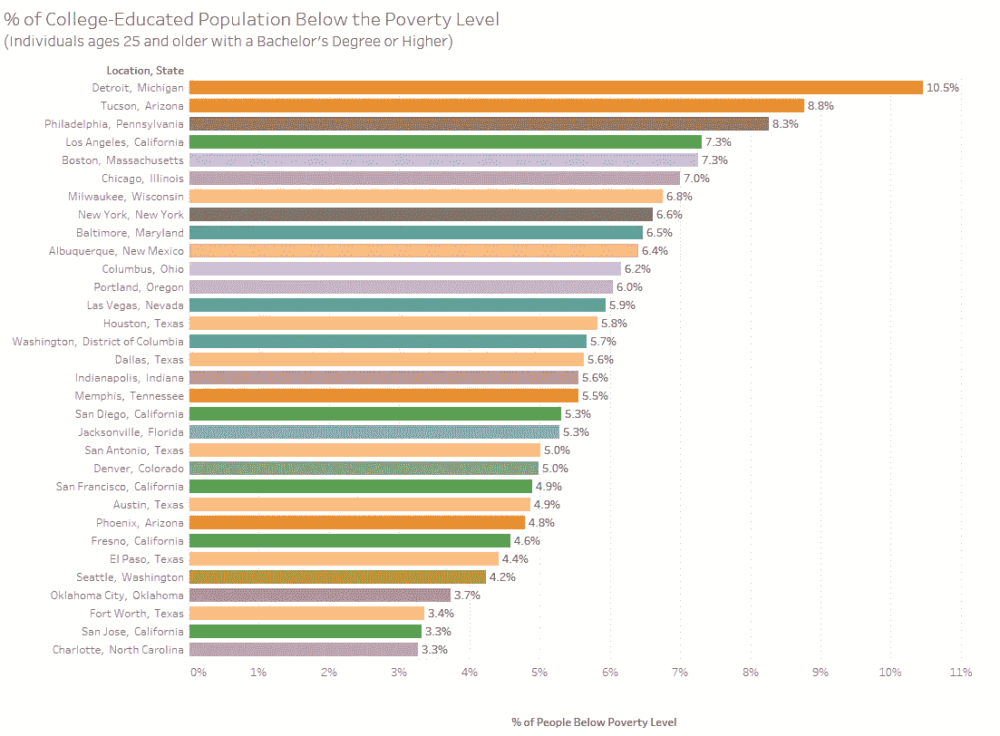
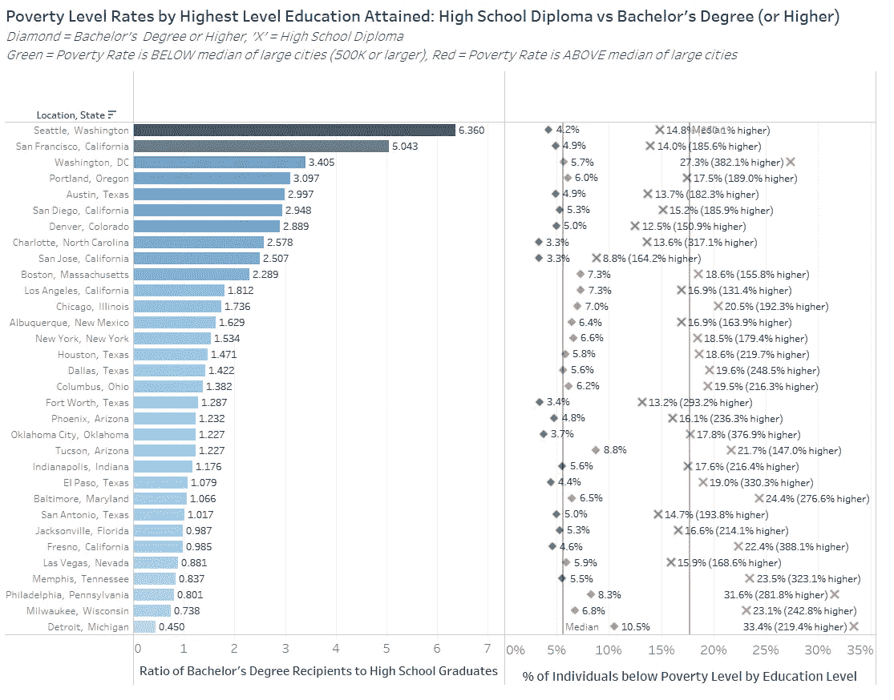
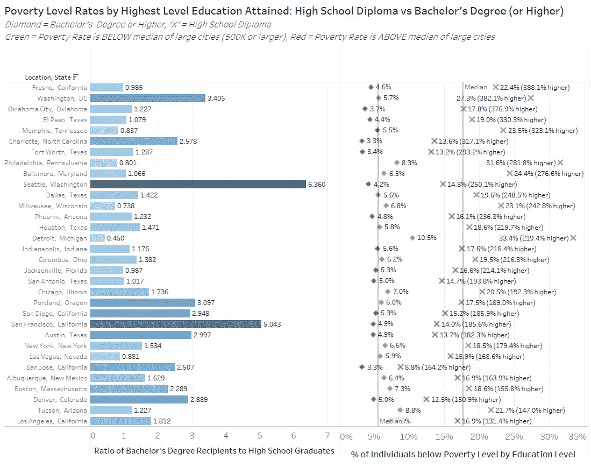
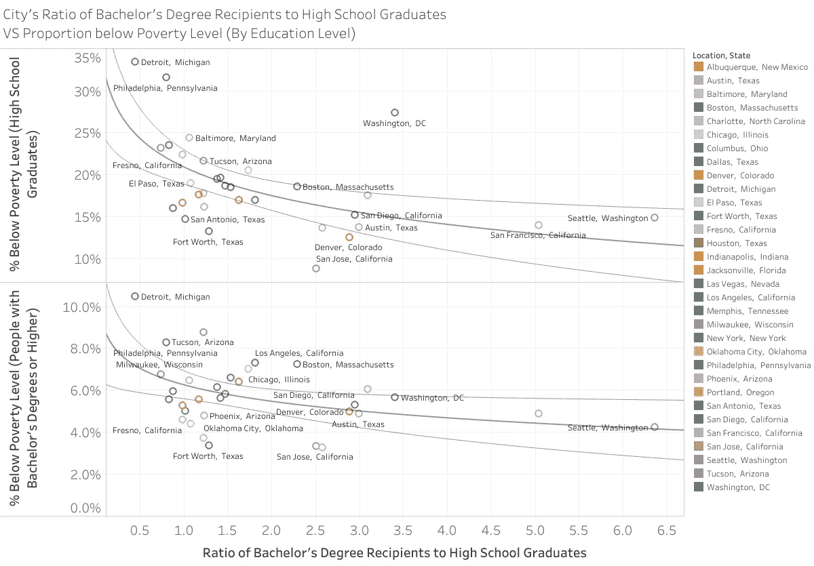
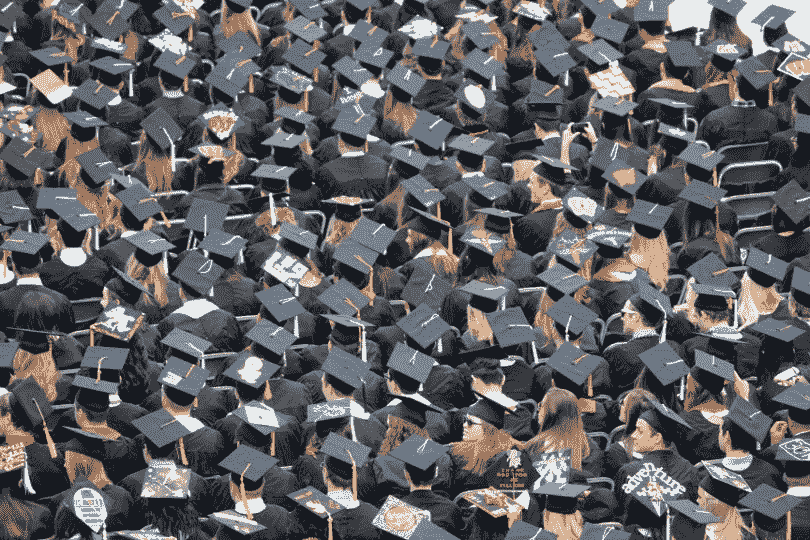

# 教育水平和贫困线:对美国最大城市的分析(包括交互式仪表盘)

> 原文：<https://towardsdatascience.com/level-of-education-and-the-poverty-line-an-analysis-of-the-largest-us-cities-interactive-309e6c3e9f46?source=collection_archive---------15----------------------->

正如劳工统计局([【BLS】](https://www.bls.gov/opub/ted/2017/high-school-graduates-who-work-full-time-had-median-weekly-earnings-of-718-in-second-quarter.htm))所概述的，获得高中文凭[的人比继续接受高等教育的人挣得少](https://www.bls.gov/opub/ted/2017/high-school-graduates-who-work-full-time-had-median-weekly-earnings-of-718-in-second-quarter.htm)(获得学士学位的人多 66%，如果是硕士或以上学位，则多 102%)，因此，受教育程度越高的人生活在贫困线以下的可能性就越小。虽然这一趋势已经确立了一段时间，但不同城市之间的教育水平差异很大。

在这项研究中，我使用了来自 [2017 年美国社区调查](https://factfinder.census.gov/faces/tableservices/jsf/pages/productview.xhtml?src=bkmk)的数据，查看了至少有 50 万居民的城市，以研究各城市的教育水平和贫困之间的关系。

为了更深入地挖掘和查看更多的可视化效果，[转到这里使用我为今天的报告](https://public.tableau.com/profile/david.peterson#!/vizhome/CityPovertyRatesbyLevelofEducation/ofCollege-EducatedPopulationBelowthePovertyLevelBachelorsDegreeorHigherandatleast25YearsOld)创建的仪表板。

**%受过大学教育的人口生活在贫困线以下**

密歇根州的底特律在美国大城市中位居前列，成为拥有大学学历的人群中贫困率最高的城市(10.5%)。紧随底特律之后的是亚利桑那州的图森(8.8%)和宾夕法尼亚州的费城(8.3%)。在光谱的另一端是北卡罗来纳州的夏洛特，那里只有 3.3%受过大学教育的人生活在贫困线以下。紧随其后的是加利福尼亚州的圣何塞和得克萨斯州的沃思堡，这两个城市的失业率与夏洛特相差不到 0 . 1%。

**学士学位获得者与高中毕业生的比例**

*接下来，我们将看看受过大学教育(学士学位或更高)的人与高中文凭是他们接受的最高教育形式的人的比例。*

*图表图例:如何阅读以下报告的右侧*

*   *颜色*
*   o *红色——高于大城市的平均贫困水平(针对相应的教育水平)。*

o *绿色——城市的教育贫困率低于中等贫困水平。*

- *形状*

o*‘X’—表示该市高中毕业生的贫困率。*

o *钻石——城市大学毕业生贫困率(学士学位&以上)。*

西雅图以 6.4 的比率领先，这意味着每 1 个拥有高中文凭的人，就有 6.4 个获得学士学位或更高学位的人。紧随西雅图之后的是旧金山(5.0 的比率)和华盛顿特区(3.4)。

在这份报告考虑的 32 个大城市中，只有 7 个城市拥有高中文凭的人比拥有学士学位或更高学位的人多。在底特律，每一个拥有高中文凭的人，只有 0.45 个学士学位获得者。底特律的这一比率远远领先于密尔沃基(0.74)和费城(0.8)，这两个城市分别位居第二和第三。

**生活在贫困线以下的高中毕业生与大学毕业生贫困率之间的差距**

弗雷斯诺高中毕业生的贫困率领先所有主要城市(22.4%，以上；比大城市高中毕业生的贫困率中位数高出 27%)，比受过大学教育的贫困率高出 388%(4.6%；比大城市大学毕业生贫困率中位数低 24%)。与其他四个加州城市不同，弗雷斯诺的高中毕业生和大学毕业生的比例接近 1:1。DC 华盛顿州以 382%的差距紧随其后，大学教育贫困率(5.7%)和高中教育贫困率(27.3%)之间的差距。排在第五位的是俄克拉荷马州的俄克拉荷马城；得克萨斯州埃尔帕索；和田纳西州的孟菲斯；这些城市的大学教育贫困率都比一般大城市高，但高中教育贫困率更低。

洛杉矶的教育水平差异最小，高中毕业生的贫困率仅比受过大学教育的贫困率高 131%。亚利桑那州图森(147%)；科罗拉多州丹佛市(151%)位居第二和第三。

**受过大学教育的人口比例高的城市对贫困水平的影响**

在最后一张图片中，我比较了学士学位获得者与高中毕业生的比例(在之前的图片中使用),并将其与各自教育水平的贫困率进行了比较。获得学士学位者的比例越高，生活在贫困线以下的人口比例就越低(包括高中毕业生和大学毕业生)。

这是我今年计划写的关于贫困、收入不平等、住房和中产阶级化的一系列相关文章的第一篇。为了更深入地挖掘并查看更多的可视化效果， [*转到这里使用我为今天的报告*](https://public.tableau.com/profile/david.peterson#!/vizhome/CityPovertyRatesbyLevelofEducation/ofCollege-EducatedPopulationBelowthePovertyLevelBachelorsDegreeorHigherandatleast25YearsOld) *创建的仪表板。*

