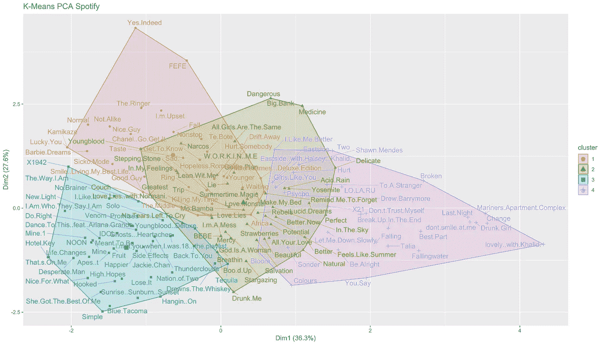
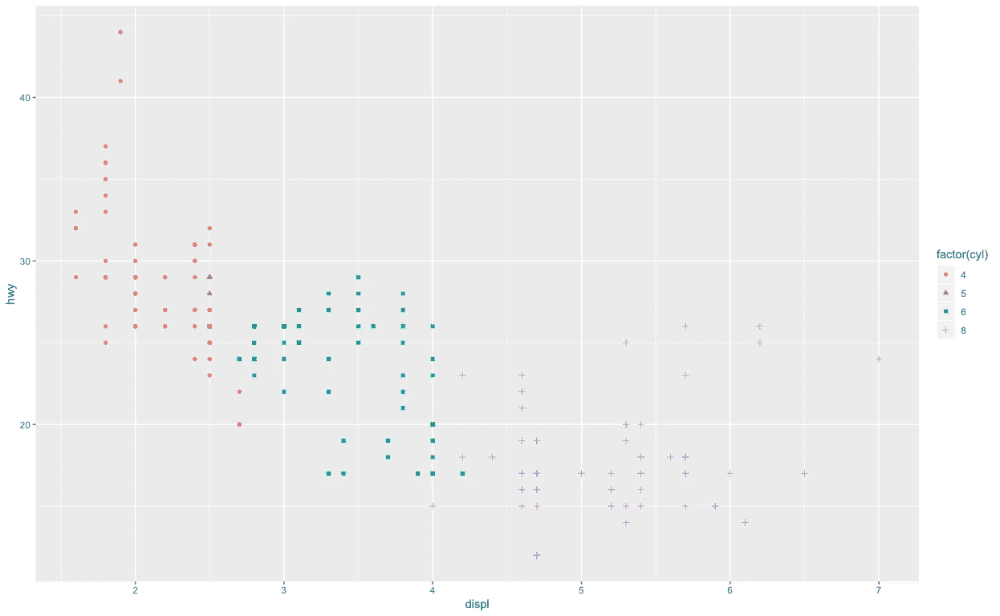
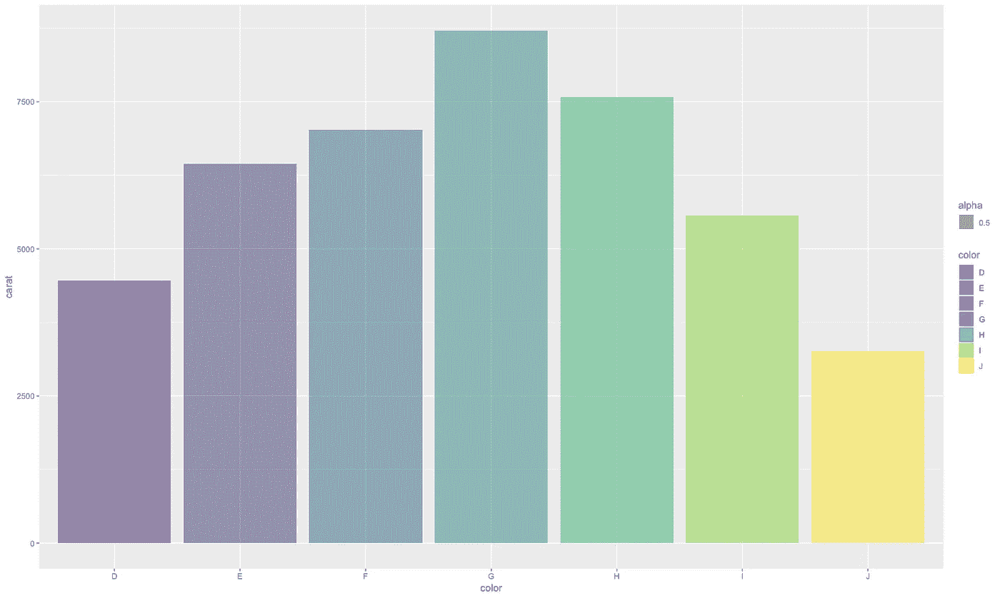
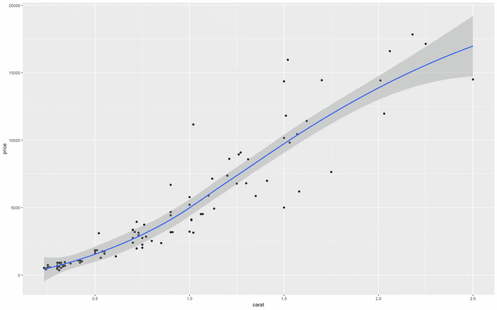
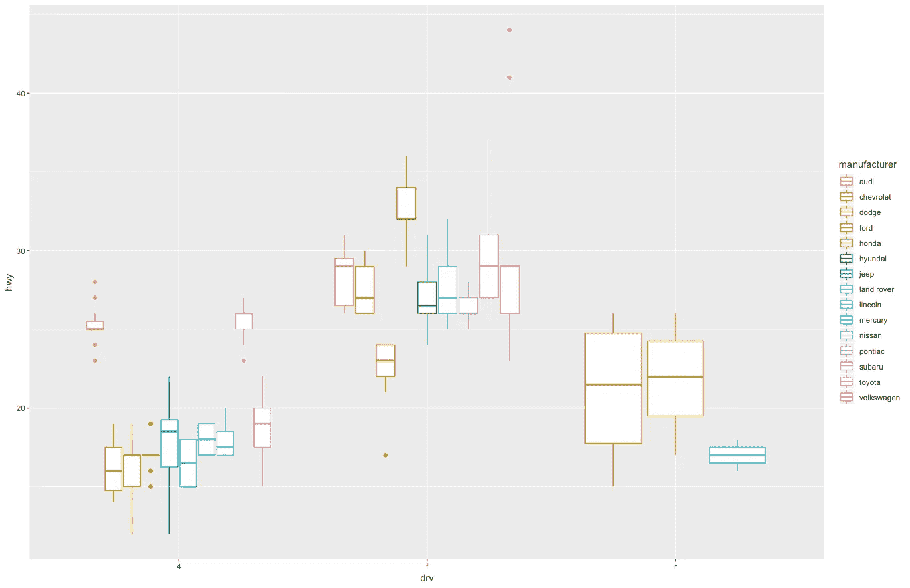

# 使用快速绘图提升数据可视化水平

> 原文：<https://towardsdatascience.com/level-up-your-data-visualizations-with-quick-plot-f18eddb82468?source=collection_archive---------11----------------------->



K-Means plot for Spotify

数据可视化是数据科学家工作流程的重要组成部分。它允许我们直观地理解我们的问题，分析我们的模型，并允许我们为社区提供深刻的有意义的理解。

作为数据科学家，我们总是寻找新的方法来改进我们的数据科学工作流程。

> *我为什么要在 ggplot 上使用这个？他们有什么不同吗？有什么好处？*

Qplot 允许更清晰、更简短和更简洁的语法来声明 ggplot 可视化。这是一把伟大的瑞士军刀，用于绘制快速简单的可视化图形，对于那些以前没有使用过 ggplot 或 R 的人来说，它非常容易阅读。

qplot 是`quick plot`的简写，是为 ggplot2 设计的一个快捷方式。

> 让我们看看它是如何工作的！

下面我将展示两种绘制相同可视化的方法。首先使用 ggplot2，然后使用 qplot。



Scatterplot

## ggplot2

```
ggplot(mpg) + 
  geom_point(aes(displ, hwy, color = factor(cyl), shape = factor(cyl)))
```

## qplot

```
qplot(displ, hwy, data = mpg, colour = factor(cyl), shape = factor(cyl))
```

通过使用 quick plot，我们可以缩短语法，使其更加清晰简洁。如果您以前用 python 编程过，语法变得非常类似于`seaborn`库。

让我们再看几个例子！

# 条形图



Bar Chart using ggplot

## ggplot2

```
ggplot(data = diamonds) + 
geom_bar(aes(color, weight = carat, fill = color, alpha = 0.5)) + scale_y_continuous("carat")
```

## qplot

```
qplot(color, data = diamonds, geom = "bar", weight = carat, fill = color, alpha = 0.5) + scale_y_continuous("carat")
```

# 散点图和折线图



Scatter plot & line chart

首先，我们将从钻石数据集中抽取一个小样本。

```
dsmall <- diamonds[sample(nrow(diamonds), 100),]
```

## ggplot

```
ggplot(dsmall, aes(carat, price)) + geom_point() + geom_smooth()
```

## qplot

```
qplot(carat, price, data = dsmall, geom = c("point", "smooth"))
```

# 箱线图



Boxplot

## ggplot

```
ggplot(data = mpg) + 
  geom_boxplot(mapping = aes(x = drv, y = hwy, color = manufacturer))
```

## qplot

```
qplot(drv, hwy, data = mpg, color = manufacturer, geom = 'boxplot' )
```

# 鳍状物

我希望这个故事教会你一些新的东西！ggplot 和 qplot 都可以用来达到同样的效果。但是，如果你曾经想决定是独立的，有一个快速，肮脏和简单的数据可视化探索性数据分析的 qplot 的尝试！

一如既往，我欢迎反馈和建设性的批评。你可以在推特[@ chip asaur](https://twitter.com/Chippasaur)上找到我。