# 利用人工智能治愈癌症

> 原文：<https://towardsdatascience.com/leveraging-ai-to-cure-cancer-c56189a9dbba?source=collection_archive---------7----------------------->

癌症是全球死亡的主要原因之一。这并不意外。

预计每两个加拿大人中就有一个会患上癌症，这是一个惊人的数字**预计会有 1850 万人被诊断患有这种致命的疾病。更不用说四分之一的 T4 人预计会死于癌症，也就是 925 万人。**

最近，人工智能等技术的许多进步正在帮助研究人员彻底改变医疗保健的未来，从识别医学图像中的模式到预测药物的新目标蛋白质！这项技术正显示出改变全世界数百万人生活的巨大能力。

我利用了人工智能的技术，并深入研究了称为生成模型的子部分。在生成模型中，我特别关注**变型自动编码器**，因为它能够:

a)学习数据的有意义的底层表示

b)从不同类别的数据中理清变异的来源

由于这些因素，我能够构建一个变分自动编码器来识别和提取一个包含 5000 个不同表达基因的数据集内的已知和未知生物信号。

数据集来源于**癌症基因组图谱**，该图谱描绘了超过 **10，000 种肿瘤**超过 **33** 种不同的癌症类型，揭示了不同的基因组特征，例如众多基因的表达水平。

基因表达水平是对样本中所有**活性**和**非活性**基因的测量。如果基因是活跃的，这意味着它的过程，用它的信息(转录)编码 **RNA** ，并从编码**蛋白质**(翻译)的 RNA，被执行。基因表达水平捕获了关于肿瘤状态的大量信息。显然，不是所有的基因都一直表达，所以表达的基因有助于研究人员在治疗特定疾病时识别哪些特定的基因通路。基因表达的过程极其重要，因为基因表达的产物，一种蛋白质，决定了细胞的功能。识别在不同肿瘤中高度表达的基因，并识别其基因表达在患者中的生物影响，对于设计有助于治愈癌症等疾病的特定治疗方法来说极其重要。

我构建的变分自动编码器能够成功地压缩输入数据，并重新生成 5000 个基因及其表达水平的类似数据。它还能够理清数据中生物变异的来源，以及识别导致不同生物模式的特定基因的贡献，这可能导致肿瘤的癌变状态。

这篇文章将由两部分组成。

**第 1 部分)部件——在 VAE 的引擎盖下**

**第 2 部分)解释——提取/识别数据中有意义的生物信号**

# 第一部分

## 这是什么？

变分自动编码器是一个生成模型。这意味着它可以学习输入数据的底层分布，并基于它的学习生成数据的副本。

注意单词**编码器**是“可变自动编码器”的一部分这是因为 VAE 的一个功能是将输入数据(5000 个基因)压缩到一个低维(隐藏)空间，称为 ***潜在空间。*** 潜在空间中的数据是输入数据的分布，然后由解码器网络对其进行采样，以生成输入数据的类似版本。

VAE 由一个**编码器**、**解码器**、**和一个损失函数组成。**

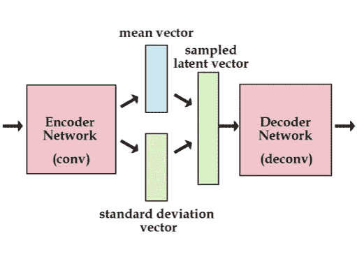

Structure of a VAE

**编码器**是一个神经网络，它获取 **5000 个基因**的输入数据，并将其编码成仅仅一个 **100 个特征**。

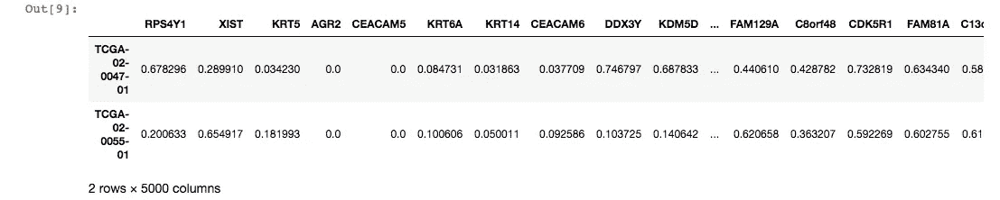

Snip-it of input data consisting of 5000 genes and their gene expression levels (this table goes on for a long time)

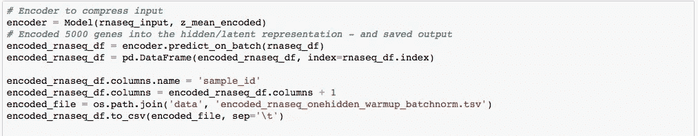

Compressing the input data

编码特征是仅代表输入数据的相关特征的概率分布。由于 VAE 是一个生成模型，它的目标是生成与输入数据相似的变量。为了使编码器压缩并以概率术语表示数据，以适合最小化的空间，编码器输出压缩的数据作为两个向量:**平均向量**和**标准偏差向量****。**

**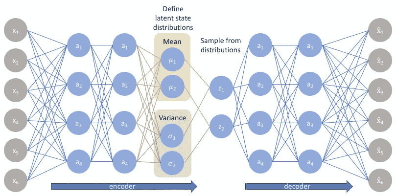**

**直观地说，均值向量控制范围，即输入数据的编码应该围绕什么进行，而标准差控制“区域”，即编码可以偏离均值多少。**

**现在**解码器网络**从平均值和标准变化向量中采样，以获得向量格式的输入，并馈入解码器网络。采样的矢量称为隐藏层。解码器现在能够重建原始输入。**

**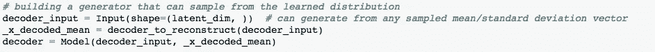**

**但是，我们如何确保解码器网络的输出与输入编码器网络的原始输入数据相匹配呢？**

**这就是**损失函数**发挥作用的地方！损失函数由两部分组成，一个**生成损失**和一个**潜在损失**。生成损失帮助解码器生成类似于输入的数据，这有助于它的准确性。它通过获取解码器的数据输出和编码器网络的输入之间的误差差来实现这一点。然后，误差通过两个网络反向传播，更新其权重和参数，以提高解码器网络的精度。潜在损失表明均值和标准差向量中的编码特征与原始输入数据的匹配程度。这在 VAE 中是一个非常重要的功能，因为最终编码的特征是解码器正在采样的，以从中学习并生成与输入类似的数据。**

**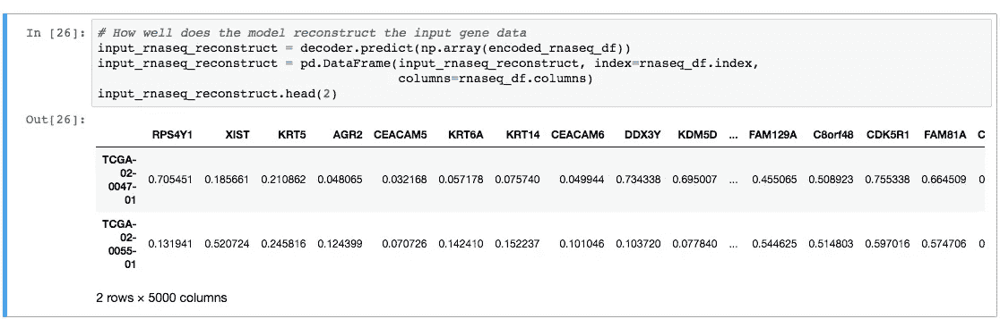**

**Output generated data from decoder network**

# **第二部分**

## ****识别生物信号****

**我想看看 VAE 中的编码特征是否能够概括和保留基因数据中存在的生物差异，例如患者的性别。**

**为此，我提取了解码器网络第一层中的权重。解码器网络第一层中的权重对隐藏层进行解码，隐藏层由来自压缩输入数据的采样信息组成。**

**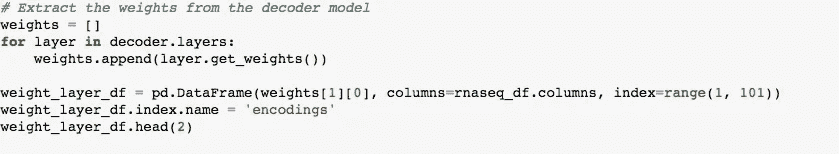**

**用于解码隐藏层中特征的权重实际上能够捕捉基因表达数据中重要且一致的**生物模式**。通过从解码器网络中提取权重，我能够识别出**特征 82** 主要由与患者性别相关的基因组成。这意味着编码器网络能够输出 5000 个基因的压缩，这学习了数据集中的模式。**

**通过从解码器提取权重，我们现在能够查看哪些基因**对编码器网络创建的**特定特征编码**有贡献。你可以注意到特征 82 中的所有基因都位于性染色体上。****

****

**genes in feature 82**

**我们可以通过观察**阳性高权重基因**来预测患者的性别，这些基因包括 x 失活基因，如 XIST 和 TSIX。**

**VAE 还能够构建两个特征，分别由**原发性**和**转移性** **皮肤黑色素瘤(SKCM)肿瘤组成。****

**对于这两个特征中的基因，我们提取了权重较大的基因，来专门识别这些基因所执行的 **GO** (基因本体) **terms** 。我们提取高权重基因，因为这些基因被认为是表达最多的基因，这意味着它们对肿瘤的状态有更大的影响，因为它们的表达决定了细胞的功能。**

**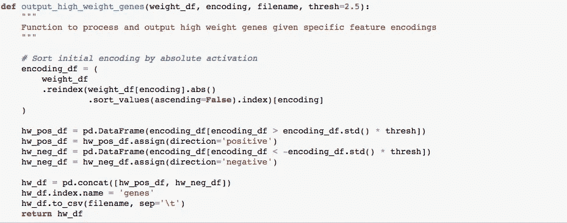**

**Code to extract high weight genes from SKCM features**

**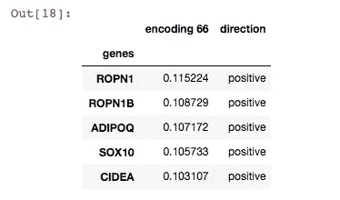**

**Output of high weight genes from metastatic tumour**

**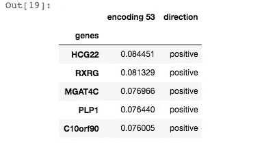**

**Output of high weight genes for primary tumour**

**现在可以对来自**特征 66** 和**特征 53** 的高权重基因实施过度表达途径分析，以识别每个特征中的 GO 术语。**

**过度表达途径分析是一种用于解释特征中基因列表(也称为基因集)的 GO 术语/功能过程的技术。GO 术语分为 **3 类** : **分子功能**(描述基因的分子活性)**生物过程**(描述基因执行的更大的细胞作用，与其他基因协调)和**细胞成分**(描述基因产物(即蛋白质)在细胞中执行其功能的位置)。**

**每个基因都可以用多个术语来描述(注释)。**过度表现途径分析**与随机比较，识别集合中过度表现的 GO 术语(因此得名)。**

**被过度表示的项被输出为 P 值。P 值越接近零，特征(基因集合)中表示的 GO 项不是随机的并且具有生物学相关性的区别就越大。**

**根据对特征 66 中的高基因权重的分析，GO 术语在该基因集中过度出现，暗示了与胆固醇、乙醇和脂质代谢相关的功能。**

**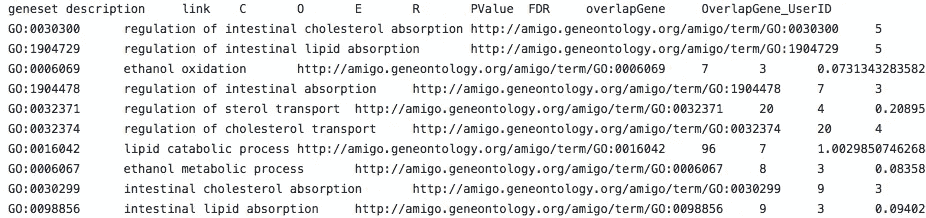**

**GO terms**

**识别在特征的最高基因权重中过度表现的 GO 术语，可以指示由一组表达的基因执行的重要过程。**

**如果从癌性肿瘤中取样一组特定的基因，鉴定哪些基因具有最高的权重(最活跃)并鉴定它们的 GO 术语可以发出潜在的基因表达途径异常的信号，这有助于癌性肿瘤的起因。**

**例如，如果特征 66(转移性 SKCM 肿瘤)中的高权重基因暗示了与胆固醇相关的 GO 项的强相关性，这可能意味着由决定胆固醇水平变化的基因表达产生了特定的途径/过程功能障碍。这些变化将成为细胞功能中的一个巨大因素，而细胞功能可能导致癌症肿瘤的产生。**

**使用这种技术，研究人员可以识别特定导致癌性肿瘤产生的表达基因(蛋白质)的靶途径和产物。VAE 能够分离和构建 5000 个基因数据的编码特征，这些特征捕获了数据集中的模式，如患者性别和 SKCM 肿瘤。我们能够通过提取解码器网络中的权重来发现这一点，因为通过训练 VAE 模型，解码器权重学习数据内的模式。**

> ****关键要点****

**1.诸如变分自动编码器之类的生成模型能够在低维空间中有效地压缩数据，同时仍然保持帮助解码器网络重构输入数据的相关特征。**

**2.解码器网络中的权重能够捕获可以提取的数据中的重要生物模式。**

**3.使用过度表达分析来识别高基因权重中的 GO 项可以指示生物过程中的功能障碍。**