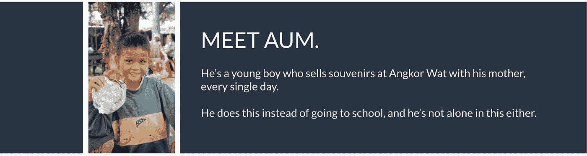

# 利用区块链激励教育

> 原文：<https://towardsdatascience.com/leveraging-blockchain-to-incentivize-education-5553e705324c?source=collection_archive---------15----------------------->

## 教育简介:赚钱的教育

Angkor Wat, Siem Reap, Cambodia

这里有一个小小的警钟:**你做错了旅游**。不相信我？我可以证明。

如果你是一个旅行者，你会知道在旅游景点的郊区看到小孩子卖纪念品是很常见的事情。有时小贩的孩子会变得好斗，即使他们不会说你的语言。它们都很可爱，以至于你很想让步买些东西……但你没有——可能是因为你并不真正需要那些纪念品，也可能是因为你的导游告诉你不要买。

很多人对此感到内疚。我承认我也是。回到 12 月，我去了趟柬埔寨，在那里我们参观了很多很多寺庙，看到很多可爱的小孩在卖小饰品，大部分是在吴哥窟。我不知道你怎么想，但是当我忽视他们的时候，我总是感觉很糟糕，但是那是我们的向导告诉我们要做的。于是我们这样做了，但我一点也不满意(今年的轻描淡写)，因为我意识到我处于特权地位，却完全没有做任何事情来解决弥合机会不平等的问题，这真的很难。

当我真正开始思考到底发生了什么时，我意识到:**柬埔寨的孩子们在卖纪念品，而不是去上学**。比起孩子的长期教育，他们的家庭更看重短期的金钱激励。

贫困的循环就这样开始了，而没有人对此做任何事情。孩子们和父母在赚钱养家，游客可以买纪念品，所以很多人并不认为这是个问题。但事实是，他们无法摆脱贫困，因为他们的日常“工作”是街头小贩。

作为游客，我们会不假思索地走过，但实际上这个世界的运作方式有一个根本性的缺陷。

> 暹粒旅游业的大规模增长间接导致了入学率的下降，因为向游客销售比上学有更多的短期金钱收益。

我们如何打破这种循环？答案是教育。你可以看到，随着教育水平的提高，受教育率呈指数下降。对于小学来说，这是相当高的，因为他们没有语言/人际技能，一旦他们成熟和发展，他们就会辍学。

Facts and figures on Siem Reap’s school attendance.

# 区块链技术:你需要知道的

如果你不知道的话，区块链是一个**去中心化的点对点网络**，在这里数字信息(包括令牌)可以被分发和存储。它可以被认为是一个巨大的数据库，每个人都可以看到所有的活动，没有人可以控制其他人。可能最重要的方面是，他们在系统中没有中央权威，所以*不可能有任何腐败，并且所有日志都是完全透明的，将被永久保存。*

The face of every person who discovers a thing called ‘blockchain’

## 揭开系统的神秘面纱:区块和链条

等等…这是怎么回事？让我们打开这个。

这个系统实际上是如何工作的，谁参与，他们如何参与？

基本上，有 3 个主要参与者:**挖掘者、节点和用户**——没有他们，系统将无法工作。

当用户发送事务时，挖掘者会访问它们。矿工们竞相解决复杂的数学问题(解码哈希函数)，以创造一个区块。这些散列函数需要很长时间才能解码，所以矿工们最终只能猜测和检查。**这些块包含一系列事务，这些事务由挖掘器放在一起作为对解码散列的奖励**。

Credits: CBInsights

为什么矿工们想把所有的时间都花在解码哈希函数上？实际上，这是有动机的——除了用户支付的交易费之外，矿工还会因为创建区块而获得以太坊(ETH)的奖励(目前，以太坊大约为 2 ETH，约合 300 美元)。他们也可以创建空的区块，这样他们就可以得到第二个区块，但是拥有一个满的区块更经济。

当事务被添加到块中时，块被添加到链中，因此称为“块链”。节点接收一系列交易，并且更新数字分类帐的状态。瞧！

## 区块链的优势(或劣势……)

*   **去中心化:**正如我们之前所说，这意味着没有系统故障的中心点。网络存在于每一个参与者的电脑上，不能由一个人或一个组织来控制。
*   **不变性:**防止对任何帐户进行未经授权和未经授权的更改。你不能编辑过去的交易，或改变事件，所以所有的信息都是可信的，100%真实的。
*   **一致:**由于需要所有节点之间的一致同意，防止可能的损坏。您可以随时查看分类帐的状态。
*   透明性:这是一件既有利又有弊的事情。网络上的每个人都可以访问存储在区块链上的所有交易、记录和任何信息。不一定是侵犯隐私，看你怎么看待。

# 符合学生需求的系统

> 在我们的网站上了解更多关于我们项目的信息，链接[这里](https://njeans1.wixsite.com/educents)。

区块链和柬埔寨儿童缺乏教育有什么关系？

**TL；大卫:我们用加密货币来标记柬埔寨的教育系统，以激励教育。**

# 我们的(加密)货币

## 柬埔寨:CCO

他们得到的东西(以 CamboCoin (CCO)代币的形式)的价值比他们作为商贩赚的钱更高。这种虚拟货币可以用来购买额外的营养，医疗保健福利和财政援助，以换取合作组织。学生上学越多，授予学生的 CCO 就越多。当交换时，它们就从流通中消失了。

他们获得上学代币，我们还自动化了一个系统来跟踪和记录学生在学校的参与情况——他们的出勤情况通过生物识别进行记录，在特定时间打卡上下班，但确保他们在申请奖励前停留最短时间。

## 知识硬币:KNO

CCO 是授予出勤学生的，而 KNC 是一种证书，为经济困难的青年提供了更多的机会来接受突破障碍的教育。

教育有两个主要目标:

1.  **让孩子上学**:激励措施肯定会鼓励更高的入学率，尤其是当家庭需要非政府组织提供的奖励时。这一制度还能防止政府内部的腐败。
2.  **确保孩子们留在学校**:由于小学的入学率为 90%，我们用乘数来激励教育(也就是说，小学生的收获不如中学生多，中学生的收获不如高中生多)

从每天最少 CCOs 到最多:

小学→中学→高中/中学

# 智能合同的作用

区块链最大的优势之一是它的权力下放。智能合同利用这种技术来有效地促进、验证和执行双方达成的协议。我们的系统由两个智能合约组成，每个智能合约对应一个令牌。

我们的第一份合同是管理 CamboCoin。这些代币是铸造的，分发给上学的学生。当这些代币被家庭认领时，它们会被从我们的总供给中烧掉，以调节它们的流通。

以下是 CCO 智能合约代码的摘录:

Minting various coin values according to the level of education.

另一个重要的方面是处理实际的事务。这需要交易费，以 ETH 支付。你也可以向账户捐款。用户可以申领他们的代币金额作为奖励。

> 完整的代码可以在这里找到[。](https://github.com/mthaw/blg-education/tree/version-2/src)

这里有一个界面的预览，以及如何从他们的帐户中查看不变的信息。已有数据不可编辑，没有动作的反向功能。

*注意:为了预览，这是一个简化的界面，而不是实际看起来的样子！但它的目的只是让人们了解除了网站之外我们还在做什么。

# 重新想象未来

我整合和技术固然重要，但是**如果你没有目标**也没关系。基本上，**你要知道你为什么**。为创新而创新——她是谁？

个人经历和我的旅行明确地塑造了我的“为什么”。但更重要的是，我想在世界上做好事。做到这一点的最佳方式是通过联合国的可持续发展目标来构建整个理念。因此，我们专注于高质量的教育、经济增长、消除贫困和减少不平等。

显然不止于此。可扩展性是我们项目的一个重要组成部分，我们想评估如何将它扩展到柬埔寨更多的农村地区，甚至更远的地方。

我们项目的最终目标是教育——区块链恰好是促进这一进程的途径。作为一名学生，创造平等的机会对我来说非常重要，对我们团队的其他成员也是如此。教育有能力戏剧性地改变一个孩子的人生轨迹:从街头小贩变成导游。我们的一大重点是通过这个项目打破贫困循环，这个项目有可能影响数百万人的生活。

Siem Reap, Cambodia

这个项目是由马丁·索、威利斯·郭、玛希塔·拉希德、陈可辛和合作完成的。

> 非常感谢 Blockscale Solutions、Blockchain Learning Group、Adam、Erik、Zagabe 先生、Tarle 先生和 Mur 在整个过程中对我们的指导。

让我知道你的想法！

*关注我关于* [*领英*](https://www.linkedin.com/in/nathalie-jeans-1316b2172/)T22[中](https://medium.com/@nathaliejeans7) *了解更多。*