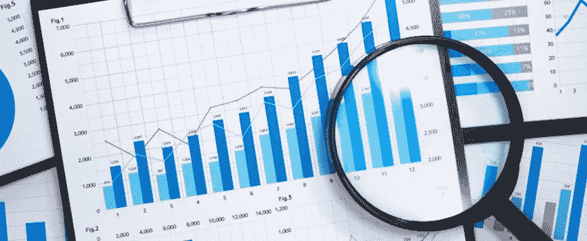
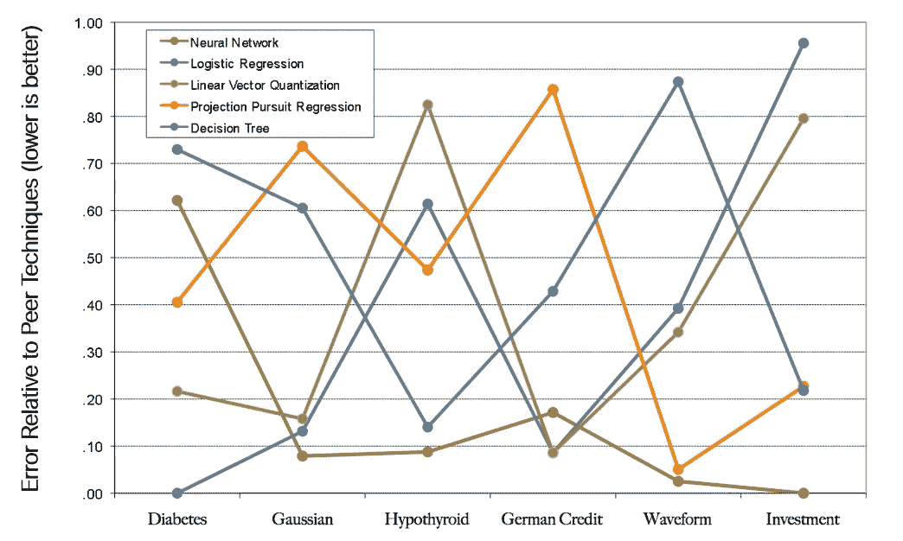
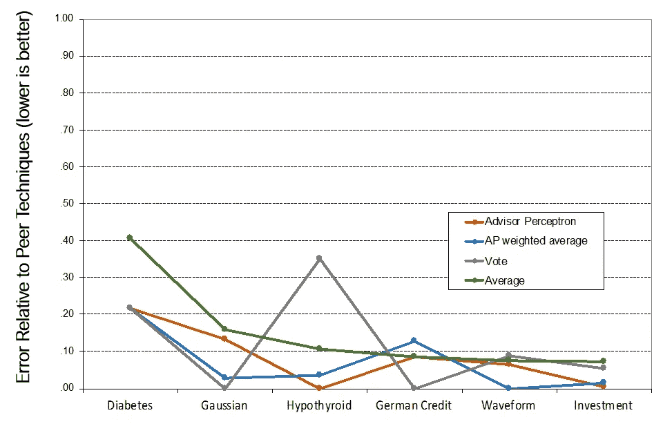
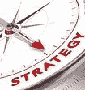

# 利用数据分析提高投资回报率

> 原文：<https://towardsdatascience.com/leveraging-data-analytics-to-increase-roi-5df9250b26e7?source=collection_archive---------39----------------------->

普遍存在不愿意信任和依赖基于机器的决策。这是可以理解的；如何确保自动化决策系统考虑了所有应该考虑的因素？员工首先努力学习新技术，然后在取得巨大进步并生产出有前景的模型后，决策者仍然极不愿意冒险采用新方法，不管测试如何揭示其有效性。尽管如此，在当今竞争激烈的工作环境中，与机器保持积极的关系对于增加利润和提高投资回报率(ROI)至关重要。

# 建立基线

衡量投资回报率包括检查增加的收益与成本相比如何。为了增加 ROI，您需要建立一个基线来比较进展和一个良好的度量(价值标准。)还有，令人震惊的是，你现在的表现可能并不是你想象的那样。清楚地了解你的基线和度量，告诉你你在哪里；结合业务理解，你就知道自己要去哪里了。之后，你们可以就如何到达那里进行头脑风暴。

 [## DDI 编辑推荐:5 本让你从新手变成专家的机器学习书籍|数据驱动…

### 机器学习行业的蓬勃发展重新引起了人们对人工智能的兴趣

www.datadriveninvestor.com](https://www.datadriveninvestor.com/2019/03/03/editors-pick-5-machine-learning-books/) 

数据分析通过多种方式提高性能，其中主要有:

*   提高利润、效率、准确性和满意度
*   减少成本和延迟
*   寻找新的更好的机会
*   消除不合标准的做法

机器学习和数据科学可以帮助企业实现他们的目标——但只有在实际实施的情况下。为了提高数据科学的投资回报率，你必须掌握两种截然不同的技能:技术，以及说服他人信任和使用它的能力。

# 成为技术专家

学习数据科学方法的用途和优缺点对许多企业领导者来说是一个挑战。经验丰富的数据科学顾问可以帮助那些希望应用数据科学和机器学习最新发展的人确定好的项目及其所需的组件。在 Elder Research [，我们是许多大公司](https://www.elderresearch.com/company/clients-partners)值得信赖的顾问，我们可以执行[准备情况评估](https://www.elderresearch.com/consulting-services/analytics-strategy-and-assessment)的第一步。Jeff Deal 和 Gerhard Pilcher 还写了一本书， [*挖掘你自己的业务*](https://www.elderresearch.com/company/resource-center/books/mining-your-own-business) ，以指导数据挖掘(数据科学)项目的经理。此外，Elder Research 还提供复杂的[分析培训](https://www.elderresearch.com/consulting-services/analytics-training)(短期和长期)和指导，以便客户的员工能够提高数据科学技能，并最终独立完成所有任务。

## 无人驾驶汽车的例子

目前，许多炒作都围绕着人工智能(AI)以及最近的突破——在驾驶汽车、玩围棋和扑克、写文章等方面。—令人印象深刻。但很少有人知道，最大的人工智能进步取决于数据科学。AI 通常使用自上而下的基于演绎逻辑的方法，而数据科学是归纳的；它自下而上地想出新的理论(逻辑和方程)；也就是说，来自个别标记病例的例子。事实证明，数据科学是近来“人工智能”成就的原因。单独使用人工智能，你通常可以遵循逻辑，但使用数据科学，你可能无法准确地解释模型是如何工作的。在某种程度上，你必须对过程有信心，承认当严格的统计测试显示出样本外数据的良好准确性时，机器知道它在做什么。

自动驾驶汽车的能力正在稳步提高。2018 年 3 月，一则广泛报道的行人死亡事件让自动驾驶汽车的粉丝们暂停了脚步，但这项技术预防的事故很可能会远远超过曾经广泛使用的实际撞车事故。

到目前为止，成功的关键是“深度学习”，这是一种多层神经网络，可以创建令人费解的方程。例如，如果一辆自动驾驶汽车向左转，这是因为一个方程表明，在看到大量由实际驾驶和专家决策组成的训练数据后，这是最佳行动。成千上万个例子训练出来的方程，代替了，或者补充了，或者证实了，AI 的逻辑规则。

深度学习不同于经典的 AI。融合在一起，来自数据科学世界的归纳建模方法和来自人工智能世界的基于逻辑的方法变得非常强大。

# 方法的合并

在数据科学中，有许多不同的数据建模技术或方法来“连接”数据的点以形成答案。最受欢迎的是:

*   回归
*   决策树
*   神经网络
*   最近的邻居
*   朴素贝叶斯

…但是有几十种有趣的[算法](https://www.elderresearch.com/company/resource-center/books/handbook-of-statistical-analysis-and-data-mining-applications)。那么，哪个最好呢？在我和爱达荷大学的斯蒂芬·李一起做的一个实验中，我们发现在一个包含六个流行挑战问题的测试集上，我们发现神经网络赢得了比赛，但是所有五个被测试的算法在至少两个问题上获得了第一或第二名。因此，每种算法都是有用的，并且可能是最佳的，这取决于您试图解决的业务问题，神经网络值得一试。

但是我们也尝试了使用四种不同的[集合技术](https://www.elderresearch.com/company/resource-center/books/ensemble-methods-in-data-mining)的挑战，比如平均和投票。这是您使用所有竞争模型得出一致估计的地方。这四种综合方法甚至打败了最好的个人方法！因此，即使你在一种技术上取得了成功，你也应该尝试多种技术来提高性能。

*图一。相对性能示例:6 个数据集上的 5 个算法(与爱达荷州斯蒂芬·李，1997；* [*来源)*](https://www.elderresearch.com/company/resource-center/books/ensemble-methods-in-data-mining)

*图二。所有集成方法提高性能(* [*来源*](https://www.elderresearch.com/company/resource-center/books/ensemble-methods-in-data-mining) *)*

此外，如果你比较标准偏差，或原始技术的传播，与任何集合技术，你会看到模型集合更可靠，更少的变化。

# 说服人们部署数据科学模型

长者研究已经进入第 25 个年头，所以我们有很多经验，在过去几十年里也学到了一些东西。在我们的第一个十年，我们有 90%的项目技术成功率，然而只有 65%的模型被实际使用！我们对此并不满意——尽管研究显示只有 33%的数据科学或机器学习项目在全国范围内实施。我们发现临界点是“碳基生命形式”；也就是人类。经理们将无法真正使用他们委托的努力工作，即使它满足了他们的所有要求。发生了什么事？

我们知道这是变化的问题。这项技术通常会导致人们行为方式的重大改变。在压力下，由于害怕鹤立鸡群，许多人回到了旧的做事方式，而不是信任这种模式。我们对此进行了研究，发现了许多改善信任环境的方法——包括技术和人际信任。它得到了回报；在我们的第二个十年，我们的技术成功率上升到 98%，我们的采用成功率飙升到 92%。

## 首都一中举例

在 90 年代末，当 Capital One 只有 100 名拥有硕士和博士学位的员工分析信用评分时(几年前我最后一次看到他们超过 300 人)，他们雇佣了 Elder Research 来看看新的数据挖掘技术是否能增加什么。他们怀疑一个小的多面手公司能为他们的核心专业领域做出什么贡献。我注意到了预期的差异，并打了个赌:如果我们不能改进他们的模型，我们只会收取他们一半的费用——但如果我们做得更好，我们会收取双倍的费用。他们愉快地同意打赌。

使用专家建模和我们并不秘密的集成武器，我们能够提高性能。信用评分的杠杆作用——或利润的增加——如此之高，以至于 [Capital One 的投资回报率飙升](https://www.elderresearch.com/improving-credit-risk-scoring),他们很乐意支付我们两倍的价格。

这种情况我已经见过很多次了，直到今天，我喜欢给客户提供这样的交易，他们可以选择不预先支付任何费用，而只在交易实施后支付额外利润的一部分。我对技术和我们的专业知识充满信心。(如果您对此感兴趣，请告诉我们！)

# 说服的艺术

数据科学是一种理性的决策方法，但人类往往比我们愿意承认的更不理性。在他的《思考 [*、快与慢*](https://www.amazon.com/Thinking-Fast-Slow-Daniel-Kahneman/dp/0374533555/ref=as_li_tl?ie=UTF8&tag=eldresinc-20&camp=1789&creative=9325&linkCode=as2&creativeASIN=0996712100&linkId=2d151daa2e22fef7bccbeef0c583b162) *、*一书中，丹尼尔·卡内曼描述了几个令人不安的例子，说明我们的判断是如何频繁地受到任意事物的影响，如饥饿、最近的积极事件或不合理的联想。我们认为，如果客户难以接受我们的结果，这是不合理的，但我们知道这是正常的，这种挑战值得尊重和关注。

稍后我将更多地谈论“软”问题，但我想简要地指出我开发的一个强大的技术工具，它可以揭示结果有多可靠:“[目标改组](https://www.elderresearch.com/company/target-shuffling)”。目标洗牌量化了你的结果偶然发生的可能性。它解释了“巨大的搜索效应”,在这一效应中，数百万(比如说)可供选择的假设得到了检验；也被称为“黑客入侵”。通过目标洗牌，你可以从数据中提取真正的意义，而不会被巧合所迷惑。

## 石油和天然气勘探示例

我们已经在许多现实世界的挑战中使用了目标洗牌。一个令人难忘的例子向一家国际石油和天然气生产公司展示了它如何每年节省数百万美元。我们建立了预测分析模型，以确定某个地区的哪些气井面临停产风险(例如，由于地上管线冻结或地下管线堵塞)。他们希望提前 4-6 个月了解这一点，以便他们能够优先考虑预防性维护，并最好地利用他们宝贵的员工和维护资源。通过大量的辛勤工作和专业知识，我的同事们成功地预测了维护需求，比他们的基线方法好了 3 倍。因此，在不增加员工或机器支出的情况下，他们只需根据我们的模型安排员工路线，就可以回收数千万美元的天然气。目标洗牌显示这个结果是如此的可靠和重要，以至于只有 1/2500 的几率是由于运气。此外，如果他们能够将决策窗口缩短一两个月，由于准确性的提高，节省的成本将会大幅上升。

现实是，许多行业的公司可以通过从数据中提取有用的信息来获得巨大的收益。这需要信任和一些耐心，但老年人研究可以提供证明的结果，通常只需几个月。我们确定基线和业务指标，收集数据并将其转化为有价值的信息，以帮助您做出更好的决策，从而带来令人难以置信的投资回报并转变您的业务。

**需要帮助开始分析吗？Elder Research 的现场半天分析高管战略会议提供了使用分析来改进组织决策的策略，以及如何提高您的分析能力的建议。** [**了解更多。**](https://www.elderresearch.com/analytics-executive-strategy-consulting)

# 有关系的

[数据分析真的能带来 1300%的投资回报率吗？](https://www.elderresearch.com/blog/can-analytics-deliver-high-roi) [为什么高管层的数据素养很重要](https://www.elderresearch.com/blog/data-literacy-in-c-suite-matters) [炒作还是现实:机器学习的投资回报率](https://www.elderresearch.com/blog/roi-of-machine-learning)

*原载于*[*https://www.elderresearch.com*](https://www.elderresearch.com/blog/leveraging-data-analytics-to-increase-roi)*。*