# 利用数据造福社会——一个实例

> 原文：<https://towardsdatascience.com/leveraging-data-for-social-good-a-practical-example-adac053bdeaa?source=collection_archive---------25----------------------->

## 一个五人小组如何利用经验数据为隐藏在印度北部农村角落的一个村庄做好事的故事

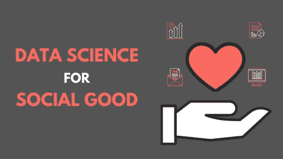

Using Data Science to make common lives better

***注:*** *我们团队研究这个项目的支柱的所有术语和理论都归功于印度 Amrita Vishwa Vidyapeetham**的* [*Live in Labs 团队举办的预备研讨会。*](https://www.amrita.edu/international/live-in-labs)

2018 年夏天，我有机会成为一个团队的一员，该团队访问了印度北部一个高度落后的村庄。这次参观是我们学院课程的一部分— **实验室生活项目** ( [点击此处了解更多信息](https://www.amrita.edu/international/live-in-labs))我们在该项目中的任务如下:

> **确定村庄中需要立即关注的关键指标，验证我们的发现，并提出有助于改善其状况的解决方案。**


Fig 1\. Key Indicators of a village

通过这篇博文，我将提供我们在该村工作的要点，并阐明我是如何运用我对数据科学的热爱来做好社会公益的。

我为这个项目写的所有代码都可以在 https://github.com/ry05/Live-in-Labs-Analysis 找到。

# 村庄-基本信息

关于我们参观的村庄的一些初步信息如下:

*   村庄的正式名称:新塔里亚尔
*   地点:印度旁遮普省北部
*   村里的房屋数量:58
*   **村里人数:** 300+居住者
*   **人民的主要职业:**非熟练工和季节工

## 资源地图

资源地图是村庄地理景观的草图，有两个主要目标:

*   提供一份**概述，介绍该村庄为实现自身可持续性而拥有的最重要的资源**(例如:木柴)
*   **标出村内的主要地标**和位置(例如:一所学校)

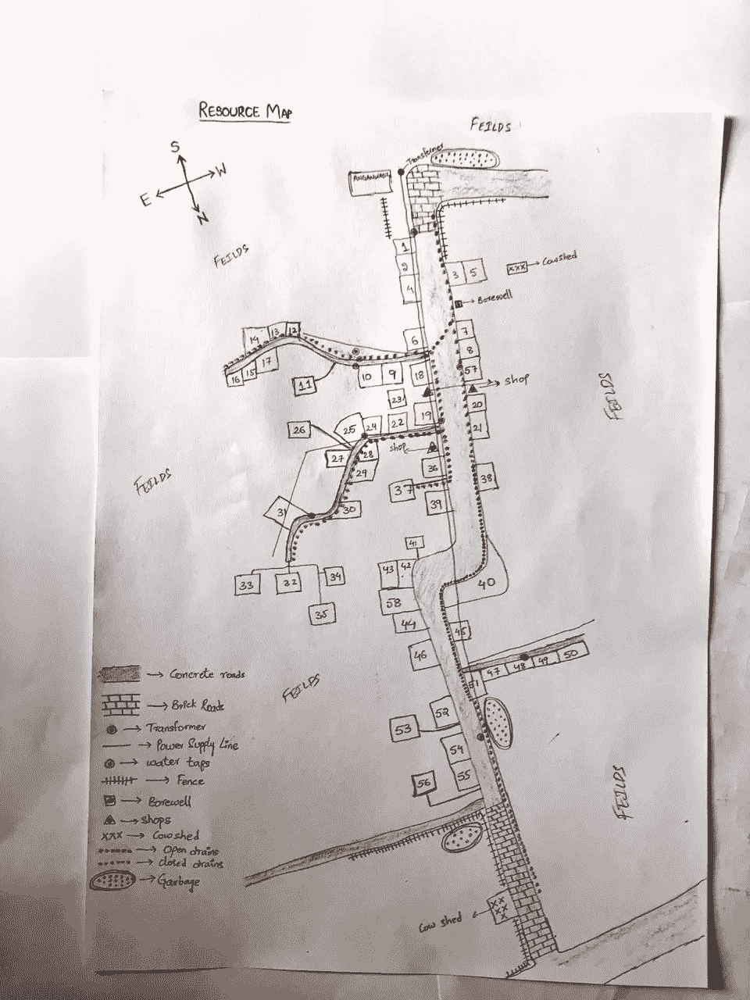

Fig 2\. Resource Map of Dodeneer (CREDITS : Venkata Ramana)

# 最初的挑战

我们的主要目标是帮助村民解决他们面临的问题，但我们也意识到，这个问题的确定不会一蹴而就。这主要是由于以下两个原因:

1.  **不可否认的差距**
    乡村和城市的生活方式有着巨大的差异。有不同的行话，不同的行为，不同的观点和更多的领域，城市和乡村的想法不能产生相同的频率。作为一个团队，我们需要尊重和理解这一点，如果我们要从人们身上提取任何实质性的东西来帮助他们的话。
2.  **对问题的接待**
    如果一群大学生和一位导师来到我家，问我一些我不太好回答的问题，我不用花太多时间就能把他们引向门口。这同样适用于一个村庄。因此，我们必须格外小心，确保我们在村里的学习不会扰乱他们的日常生活，或者我们的问题不会让他们处于紧张的状态。

# 确定直接关注的领域

为了全面了解这个村庄，我们使用了一套特定的工具和技术。我将在下面对此做一个简短的介绍。

## 参与者观察法(POM)

顾名思义，该工具用于观察我们的参与者(即村民)并推断村庄的场景，而无需与村民就村庄中的问题进行直接对话。使用 POM 有几个优点:

*   我们开始**与考虑中的参与者建立关系**
*   我们成为了我们试图评估的社区的积极成员
*   我们对**主要痛点**有了一个基本的概念，而无需过多干预参与者的日常生活

POM 可以通过使用 *Senses 框架*或 *AEIOU 框架*来执行。

1.  **感官框架**
    利用视觉、听觉、嗅觉、触觉、味觉和直觉来感知环境(即我们这里的村庄)
2.  **AEIOU 框架**
    活动:目标导向的参与者采取的一组行动
    环境:活动发生的区域
    交互:可以是人-人或人-对象
    对象:用户使用的工具
    用户:被观察的人(参与者)

如果你想更多地了解 AEIOU 框架，下面的链接是一个很好的阅读材料。

[](https://help.ethnohub.com/guide/aeiou-framework) [## AEIOU 框架

### AEIOU 是一个启发，有助于解释观察收集的人种学实践在工业。它的两个主要…

help.ethnohub.com](https://help.ethnohub.com/guide/aeiou-framework) 

该团队通过实地观察(在实地日志中记录的笔记)以及与村民、人物角色和场景的一对一随意交谈，收集了 POM 所需的数据和信息。

## 人物角色和场景

人物角色是基于所进行的研究而创建的虚构人物，以代表将从研究成果中受益的不同类型的用户。使用角色的一些优点是:

*   帮助获得对最终用户体验的**可靠、精确和相对的理解**
*   帮助**对**几种类型的用户进行分类
*   帮助洞察特定用户类型的**关键特征**，例如 a)他们的激励目标，b)他们的任务，c)他们的痛点

人物角色有助于确定研究关注的“谁”，而场景有助于确定人物角色作为一系列事件“如何”工作。

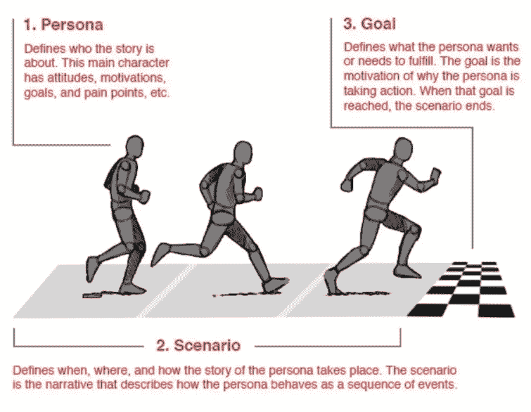

Fig 3\. Persona vs Scenario ([Image Source](https://www.interaction-design.org/literature/article/personas-why-and-how-you-should-use-them))

如图 3 所示。人物角色、场景和特定于用户的目标是三个主要组成部分，有助于确定特定个人的目标。一旦我们发现了一个人的目的，我们就能确定他对我们原型的期望。这正是[人性化设计](https://medium.com/dc-design/what-is-human-centered-design-6711c09e2779)的基础。

## 参与式农村评估

PRA 的使用帮助我们深入了解了该村庄以及普遍存在的几个挑战。把 PRA 想象成这个框架，它执行的任务是**将我们从村庄收集的原始数据**组织成**特定的 PRA 工具**。**每个 PRA 工具**执行其**自己的特定任务**并且**揭示村庄的唯一维度**。

我们投入使用的 PRA 工具有:

*   **资源地图:**该村主要资源和地标的基本地图
*   **横断面图:**根据资源图和 AEIOU 框架将村庄划分为多个部分的地图
*   **季节/活动:**帮助了解村庄的季节性活动和季节变化
*   **流入/流出:**进村和出村的货物
*   **收入/支出矩阵:**量化村庄的总体财务状况
*   **头脑风暴:**与村里最有影响力的领导开会，听取他们的意见
*   **维恩图:**用于描绘机构、自助组织、团体和个人对村庄的影响和相互依存关系
*   **问题树:**描述村里几个问题的前因后果

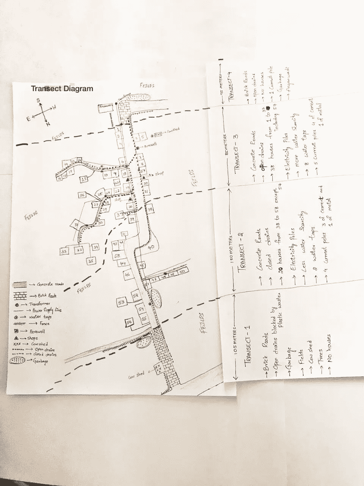

Fig 4\. The Transect Map

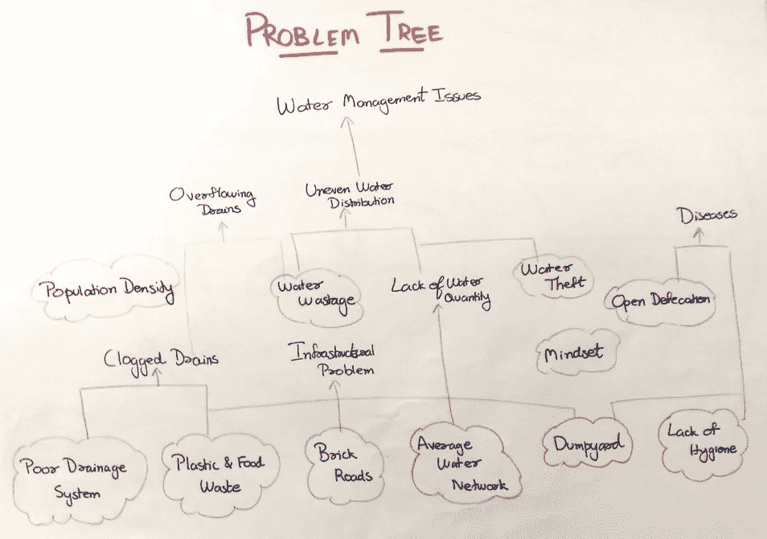

Fig 5\. The Problem Tree

# 《概览》的必要性

在我们的观察方法和 PRA 的帮助下，我们能够确定该村的关键问题与水管理和分配有关(参见图 5。).但是，我们仍然心存疑虑，希望在把它带回家交给 LiLA 团队之前，能真正确定我们的发现。

就在那时，我们决定终于到了在村子里进行官方调查的时候了。我们可以使用这样收集的数据来检查 PRA 的结果是否与村庄的真实情况相符。

**注意:我们为什么不首先进行调查呢？如果我们无论如何都要在最后进行调查，为什么我们必须使用所有的 PRA 和相关的方法？** 这是一个非常相关的问题，我相信你现在一定会想到这个问题。我分几点来回答一下:

*   调查是收集数据的好方法，但不是最人性化的方法
*   与村民建立联系至关重要，粗略的调查无助于实现这一目标
*   此外，我们的调查只集中在一个主要的重要研究问题上，**“来自 Dodeneer 的人们正遭受严重的水资源短缺吗？”**。如果我们没有进行 PRA 和观察性分析，我们永远也不能集中在这个主要问题上。
*   因此，PRA 和其他框架有助于清楚地了解村庄，并帮助我们集中精力解决需要解决的主要问题。这项调查有助于证实我们的发现是否确实是居民想要的。

# 唤醒我心中的数据科学家！

现在，我们有两个主要的目的需要处理

*   查一下村里的水分配不均是不是真的
*   找出缺水的原因

我们有疑问，我们需要答案。那时，我就该戴上“数据科学的帽子”，从我们如何利用数据来帮助我们实现目标的角度来思考问题了。在这种情况下，我们如何利用数据做好社会公益？

我们肯定要进行调查，但是**我们定义调查质量的方式将非常重要**。我们都知道数据科学没有神奇的能力来读取我们的思想并给我们带来结果。因此，我们需要提供正确的数据来获得正确的结果。

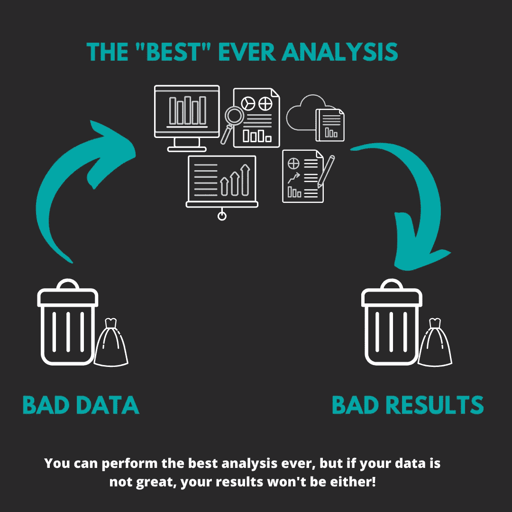

Fig 6\. Garbage In, Garbage Out

因此，为了确保我们将通过调查进行正确的数据收集，我们首先确定了我们将遵循的调查方法。我们花了几个小时思考理想的方法，最终集中在一个将帮助我们实现目标。

## 该调查

我们为我们的调查创造了自己的方法，构建了调查问卷，用当地语言将它们准备成对话，在纸上记下他们的回答，然后将数据数字化。

**主要研究问题** 多迪尼尔的人民是否正遭受严重的水资源短缺？

**调查是如何进行的？** 进行了如下调查:

*   该调查以面对面访谈的方式进行，并使用预先准备好的问卷作为参考
*   该小组首先在纸上收集数据，然后将其输入电子表格

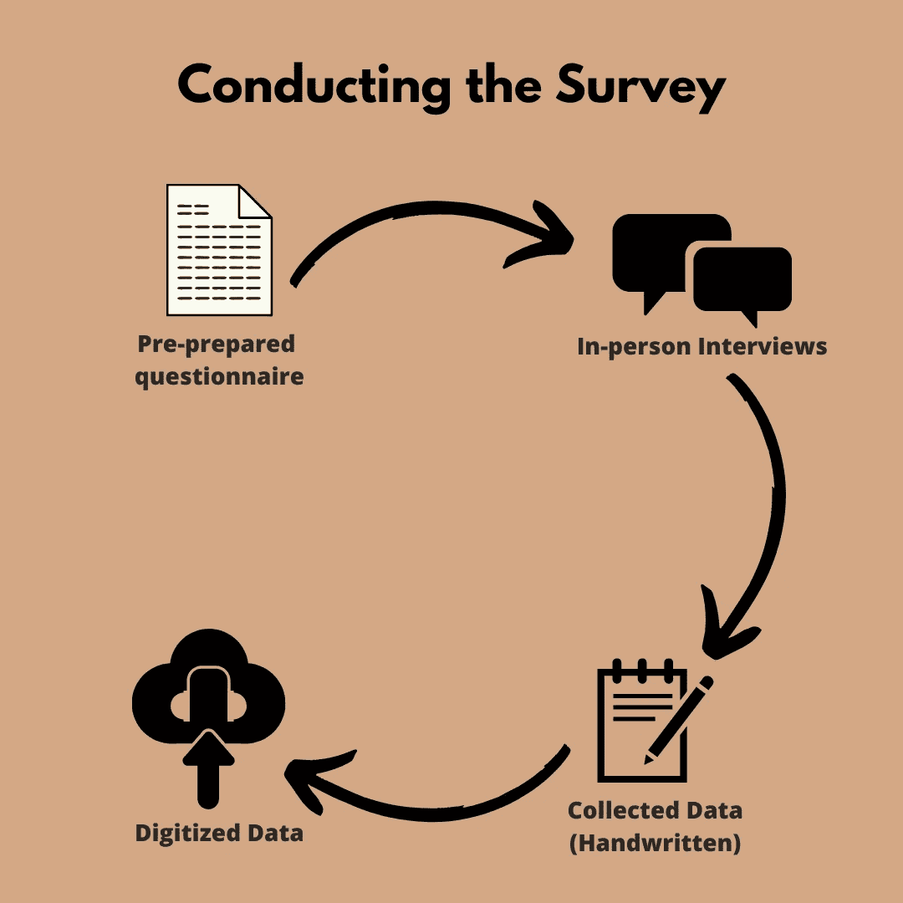

Fig 7\. Collecting Data through the Survey

问卷调查作为我们调查的一部分，我们向每个家庭询问了以下问题:

*   房子储水的介质是什么？(水箱或污水坑或桶或罐)
*   房子每天用水量的粗略估计是多少？
*   这房子有地下马达(抽水)吗？
*   家庭用水是来自 Thariyal 供水系统，还是村内的井眼水源，还是两者都有？
*   如果一个家庭从两个来源获得水，哪一个来源提供的水量更大？
*   房子里住了多少人？

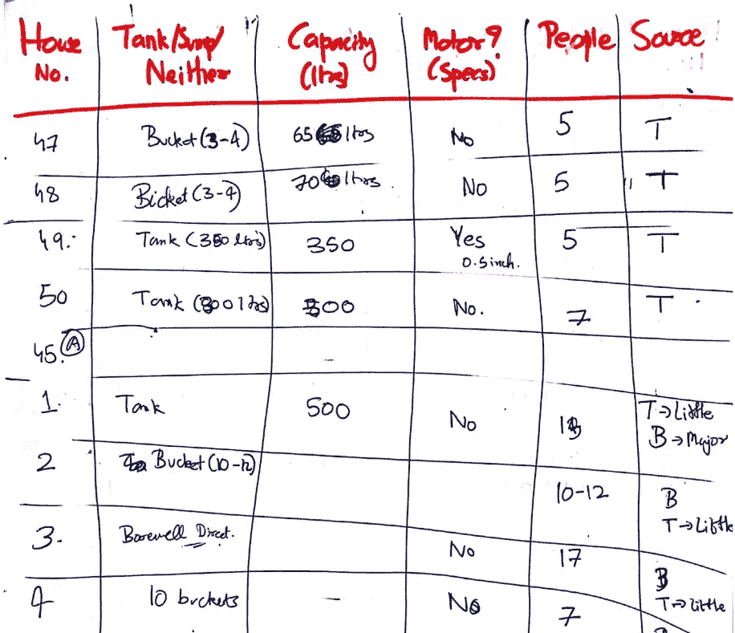

Fig 8\. A portion of the original survey response sheet

**采访语言:**这些问题是用当地语言(旁遮普语和印地语)问的。
**额外帮助:**团队还得到一名当地导游的帮助，帮助我们与村民互动

## 创建调查问卷时需要考虑的主要因素

*   **相关性** —这些问题与我们开展调查的目标相关吗？
*   **结构** —这些问题的结构是否可以被伪装成自然对话？考虑到这一点非常重要，因为正常的对话会比一系列明确的问题更能让人们开诚布公。
*   长度——我们避免做一份冗长的问卷，这样我们就不会占用一个人太多的时间。
*   安慰——在一个落后的印度村庄，并不是每个问题都会被以正确的态度对待。因此，我们决定避免询问诸如家庭收入等问题，因为不是每个家庭都愿意给出准确的答案。

最后，在进行调查后，我们获得了数据，并将其存储到 excel 表中，以便我们可以使用它来量化该村的水资源情况。

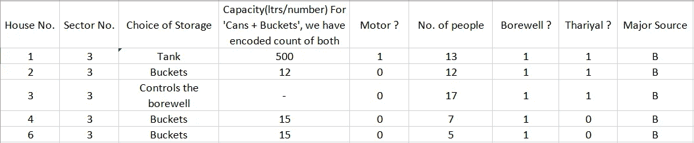

Fig 9\. First 5 rows of our “Water Consumption in Dodeneer” data

# 执行数据分析

我们有数据。现在，是时候分析它了，看看我们是否能找到我们正在寻找的答案。如上所述，通过我们的分析，我们有两个主要目的要实现——

*   查一下村里的水分配不均是不是真的
*   找出缺水的原因

我使用 Python 作为数据分析语言，你可以在这里找到相关的 Jupyter 笔记本。

下面的工作流程图提供了分析我们的数据所涉及的步骤的高级描述。

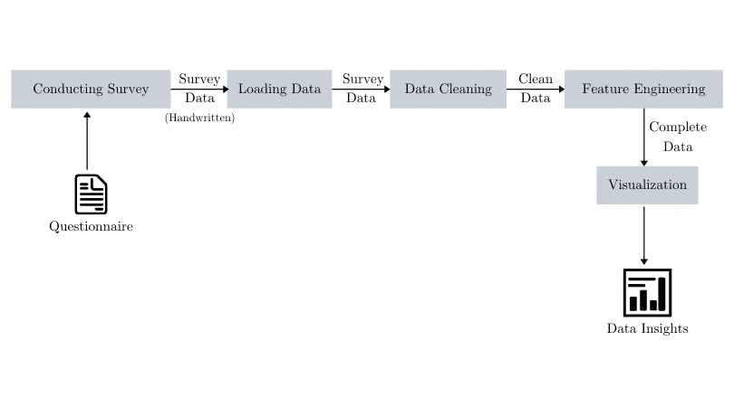

Fig 10\. The LiLA Survey Analysis Workflow

## 加载数据

我们的 excel 表中的数据被转换为。csv 格式(逗号分隔值)并作为[熊猫数据帧](/pandas-dataframe-a-lightweight-intro-680e3a212b96)加载。

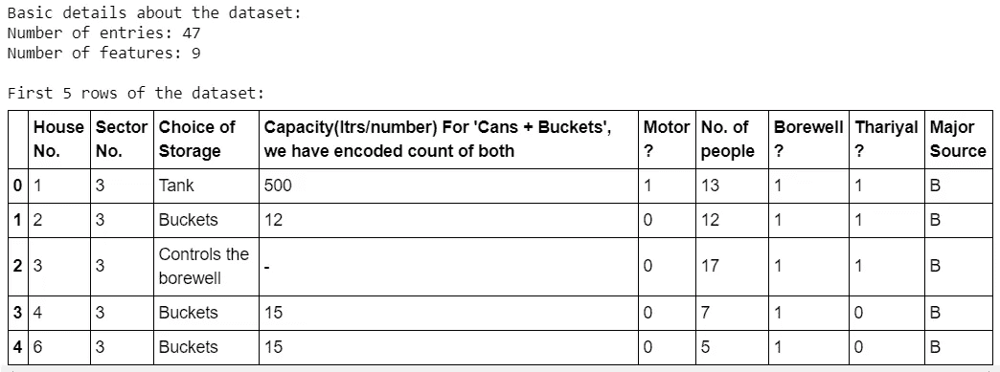

Fig 11\. Dataset loaded as a Dataframe

我们有 47 行数据，其中每一行对应于来自给定房屋的响应(该房屋使用房屋号特征来识别)。如图 11 所示，有 9 列(或特征)。

然而，我注意到数据中有两个主要问题—

*   **“存储选择”**中的某些值已被输入为“罐+桶”。这个值表示*给定的房子使用罐子和桶来存放物品*。但是，那个加号是令人讨厌的！
*   **“容量…”**特性的值不在同一范围内！当桶或罐是存储媒介时，单元具有桶或罐的计数。但是，当储存容器是一个水箱或一个污水坑时，它们的容积是 100 升.另外，在容量的第三行有一个奇怪的“-”值。

## 数据清理

为了使我们的数据比原始形式更适合我们的分析，我们执行数据清理。OMAR El gabry[的这篇文章为数据清理提供了最好的深入解释。绝对值得一读(还有书签)！](https://medium.com/u/372363c767a9?source=post_page-----adac053bdeaa--------------------------------)

[](/the-ultimate-guide-to-data-cleaning-3969843991d4) [## 数据清理的终极指南

### 当数据是垃圾的时候

towardsdatascience.com](/the-ultimate-guide-to-data-cleaning-3969843991d4) 

那么，我是如何清理我的数据的呢？

1.  “-”的异常值位于一个单元格中，该单元格指定了一所房屋的存储容量，该房屋对该村庄的水井的使用拥有第一手控制权。而且，如果我们说**这所房子比村里的任何一户人家都能获得更多的水，这并不是一个太大胆的猜测。
    所以，我们给这个单元格一个 **10000** 的值。**
2.  **“容量…”**功能的测量值范围不一致。(两个**升**以及**实体计数**)。为了解决这个问题，我创建了一个名为**“Amount”**的新特性，它描述了一栋房子每天获得的总水量。贴完这个，我去掉了**“容量……”**功能。为了创建**“金额”**，我使用了调查中记录的以下几点。

*   当存储=“罐”或“控制井”时，**数量=容量**
*   当存储=“可以”时，**金额=容量×50**
*   当存储=“桶”时，**数量=容量 x 20**
*   当 Storage = "Cans + Buckets "时，容量以元组的形式输入(num_of_cans，num _ of _ buckets)。这里，**数量=(罐数 x 50) +(桶数 x 20)**

**假设:**村里使用的易拉罐统一容量为 50 升，而水桶可以装大约 20 升水。大多数村民谈论的是“满满的”桶或罐，因此我们假设所有的存储媒介都装满了它们各自的容量。

## 特征工程

警惕！特征工程是一个非常重要的主题，是机器学习算法工作的先决条件。我只对这个问题进行了基本的特征工程，因为我真的不需要做太多来回答我的数据问题。*毕竟，为什么要拿起斧子去杀一只蚊子呢？*

Emre ren beroglu 的这篇文章提供了一个真正技术性的、简单的对特征工程的理解，对深入细节非常有帮助。

[](/feature-engineering-for-machine-learning-3a5e293a5114) [## 面向机器学习的特征工程基本技术

### 用熊猫例子进行综合数据预处理所需的所有方法。

towardsdatascience.com](/feature-engineering-for-machine-learning-3a5e293a5114) 

**同样，在这个数据集中，我沿着特征工程的路线做了什么？**

还记得我是如何计算**“数量”**特性来消除**“容量……”**特性中的不一致吗？这种转换有一个潜在的缺陷。它是不完整的。因为，每栋房子里的人数是可变的。因此，每个家庭每天收到的水量远远不是一个好的衡量标准。如果我们要有效地量化村子里的水资源压力，我们真的需要了解村子里的每个人得到了多少水。

因此，我创建了一个新的功能，**“每人每天的用水量”**，制作如下:

```
dataset["Water_per_person_day"] <- dataset["Amount"] / dataset["No.    of people"]# dataset corresponds to exactly what you think it is
```

**假设:**为简单起见，我们假设给定家庭中的每个人每天获得的水量完全相同。这也适用于儿童。

现在，我的数据看起来更接近于帮助我识别多迪尼尔的水压力。

## 形象化

终于，我们到了！讨论数据如何帮助我们满足我们的目的的部分—

*   查一下村里的水分配不均是不是真的
*   找出缺水的原因

**A)村里常见的储水介质有哪些？**

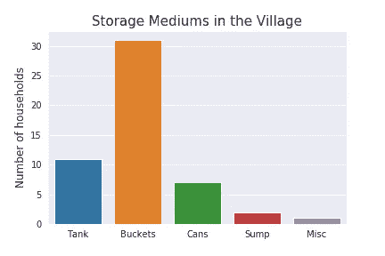

Fig 12\. Cans are the most common medium of storage

注: Misc 是控制钻井操作的一家公司

生活在多代尼尔的人们是如何分配水资源的？

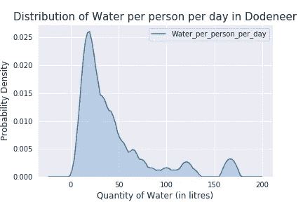

Fig 13\. A case of the haves and the have-nots

这是一个密度图([威尔·科尔森](https://medium.com/u/e2f299e30cb9?source=post_page-----adac053bdeaa--------------------------------)的这篇文章)描述了村子里每个人每天获得的水量分布。这证明了非常重要的一点，*“虽然有许多家庭每人每天获得的水不到 50 升，但也有一些家庭每人每天获得的水超过 150 升！”*。这在最纯粹的意义上是不平衡。

但是，跳到这种视觉化似乎是不对的。所以，我又提出了两个问题来帮助澄清这种不平衡—

*   这种不平衡的**严重性**是什么？
*   人们有足够的水用于日常活动和家务吗？

有多少房子符合联合国的用水要求？

根据联合国的数据，每人每天的最低需水量为 50-100 升，以确保基本需求得到满足，并且很少出现健康问题。我将阈值设定为 50 升(取最小值)，并绘制了一个条形图，以查看 Dodeneer 有多少房子符合这一要求。

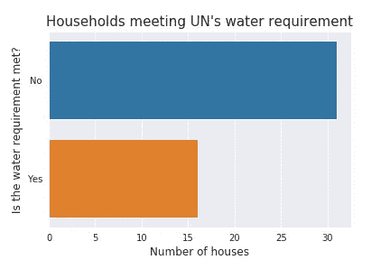

Fig 14\. Almost 2/3 of the people in the village do not have their basic water requirements met

没有满足每人基本用水需求的家庭数量几乎是满足这些需求的家庭数量的两倍。

**的确，水分失衡在十二尼尔非常普遍和严重！**

**D)使用地下马达会影响水的可用性吗？**

在我们最初的观察中，我们发现 2 区(比 3 区离村口更近)有相当多的房子使用地下马达抽水。第 3 区的人还告诉我们，第 2 区的房屋使用马达是他们得不到水的主要原因。我们注意到了这一点。但是，最令人吃惊的发现是当我们拜访最近的城镇的市政办公室时。官员们通知说，“在那个地区(多迪尼尔和它的邻居)使用地下马达是非法的，会被罚款的！”。

所以，我也试着看看马达对接收的水有没有影响。我用了一个**箱线图**(关于它的更多信息可以从[这篇文章](/understanding-boxplots-5e2df7bcbd51)由 [Michael Galarnyk](https://medium.com/u/c07aac64b6e1?source=post_page-----adac053bdeaa--------------------------------) 撰写)来探究这个问题。

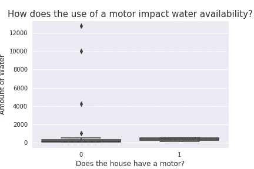

Fig 15\. Outliers causing issues in viewing the graph

哎呀！进展不太顺利。上图看起来如此“无意义”的原因是因为那些额外的、单独的点。这些点不属于数据集中大多数其他点的一般行为。用数据术语来说，我们称这些为离群值。离群值有时会令人非常头疼，因为它们在大多数时候并不代表真实值。试图将它们包含在数据分析中可能会扭曲我们的发现或扭曲我们的图表(如图 15。).

塞尔吉奥·桑托约的这篇文章可能会帮助你了解离群值的本质细节。

[](/a-brief-overview-of-outlier-detection-techniques-1e0b2c19e561) [## 离群点检测技术概述

### 什么是离群值，如何处理？

towardsdatascience.com](/a-brief-overview-of-outlier-detection-techniques-1e0b2c19e561) 

那么，在这种情况下，那些异常值是什么呢？

*   位于 12000 升和 4000 升附近的值是那些具有地下水池作为其存储介质的房屋的存储量。
*   值 10000 升是我们自己放入数据中的。还记得那栋通向水井的房子吗？

因此，这 3 个值与其他 44 户相距甚远，因此最好将其排除，以获得更真实的结果。所以，我把它们过滤掉，只取水量为 4000 升的那些值。

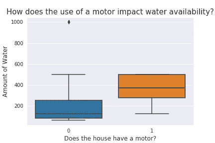

Fig 16\. After removing outliers, the graph makes more sense

如果看起来有点太混乱，让我来揭穿这个方框图。有马达的房子比没有马达的房子获得的水量多得多；这可以通过比较两个框来查看。橙色框(使用电机)的高度明显高于蓝色框(未使用电机)。**这可以解释为“使用电机的房屋通常比不使用电机的房屋用水量更大”。**

## 结论

从上面的可视化和分析中，对团队来说显而易见的是，我们对 Dodeneer 的水问题的最初理解是正确的，并且我们能够证实我们的 PRA 的发现。此外，在这个过程中，我们还发现了一些额外的见解！

# 最终注释

这篇博文试图展示数据科学在促进社会公益和传播农村发展方面的一些非常重要的信息方面的应用。我真的要感谢 Paulina Zheng 这篇精彩的文章，她非常清楚地强调了利用我们的能力对社会产生积极影响的必要性。事实上，这篇文章是我最初写这篇文章的原因。

[](/using-data-science-for-social-good-c654a6580484) [## 利用数据科学造福社会

### 在混乱的代码和无情的技术浪潮中，人们很容易忽略更大的目标…

towardsdatascience.com](/using-data-science-for-social-good-c654a6580484) 

我希望我能够清楚地阐明我的目的，如果有任何疑问，你可以随时在[推特上联系我。](https://twitter.com/thedatacrack)

> 互联网上有大量的文章将数据带入人们的头脑和口袋。太好了，这很重要。但是，如果我们能试着把数据带进人们的心里呢？
> 
> 绝对值得一想！！！

感谢您的阅读😃😃