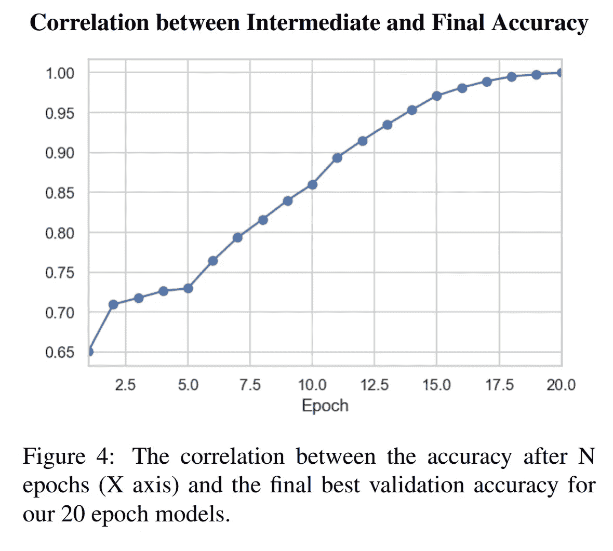

# 利用代理数据集和快速失效技术优化卷积神经网络开发

> 原文：<https://towardsdatascience.com/leveraging-proxy-datasets-and-fail-fast-techniques-to-optimize-convolutional-neural-network-6b67607738d8?source=collection_archive---------22----------------------->

当开发新的 CNN(卷积神经网络)时，为给定任务确定最佳超参数和架构的一个大的瓶颈就是花费在训练每个个体变量上的时间，以便为该任务确定最佳超参数和架构设置。

虽然理想的过程是运行每一个变化，直到完全收敛(即过拟合即将发生)并比较最终结果，但是计算时间和成本以及人力时间和成本排除了这种可能性。

因此，人们一直在努力寻找测试速度更快且结果与实际或完整数据集的结果关联更好的方法。这篇文章总结了 FastAI 和斯坦福大学的 Schliefer 和 Prokop 最近的论文-“使用小型代理数据集加速超参数搜索”中这些努力的最新结果。

在最近的 FastAI 高级开发课程中，杰瑞米·霍华德创建了两个代理数据集(ImageNette 和 ImageWoof ),其想法是使用这两个较小的数据集，以比在整个 ImageNet 数据集上测试更快的方式测试 CNN 变体。

Howard 的结果表明，与标准流程相比，这种代理流程能够实现更快的迭代和开发，代理的结果可以很好地映射到完整的 ImageNet 结果。从那时起，许多 FastAI 从业者开始利用它作为测试新架构的概念证明(例如，Google efficient net vs FastAI xres net)。值得注意的是，Howard 还警告说，使用 CIFAR 等数据集及其 32x32 图像，通常不会很好地映射到更自然的图像大小。

在最近的一篇论文中，(【https://arxiv.org/abs/1906.04887v1】)Schliefer 和 Prokop 通过测试产生代理数据集的最佳方式进一步发展了这一概念，并得出了一些有趣而有用的发现。他们测试了关于如何生成代理数据集的多种策略——随机采样 10%的完整数据集、10%最难的图像和 10%最容易的图像(通过默认设置运行的损失函数测量简单和困难),以及仅在完整数据集上运行 1 个历元。

具体来说，他们发现:

> 1 — **从 10%最简单的例子中构建和使用代理数据集是最有启发性的，并且为完整数据集的最终测试提供了最高的相关性！** (r2 = .81%)。

具有讽刺意味的是，对 10%最难的例子进行测试，这些例子直观上可能被认为更好，但相关性却低得多(只有 0.36%)。

随机抽样(随机抽取 10%的数据集)和仅 1 个时期的整个数据集测试也表现不佳，仅 1 个时期显示仅 0.20%的相关性。

因此，信息是明确的——使用“简单”的例子建立一个“玩具”或代理数据集是加速你的 CNN 开发过程的最佳策略！

From the paper — a breakdown of proxy correlation results. The winner (easiest 10%) highlighted in purple.

本文还简要探讨了第二种策略，即在全数据集上运行时取消表现不佳的变化，以加快优化搜索。

当然，棘手的方面是收集了多少信息，相对于每种变化运行多远，以确定何时减少损失并投资于更好的设置或架构？

这张图表展示了他们的发现，并提供了一些有用的见解:

From the linked paper — after 2 epochs, 72% correlation!

他们的结果如上所示，并建议对转移评估资源的各种截止点进行一些考虑:

1-2 个时期后，与最终结果的相关性为 72%。

2 —从 5 到 15，相关性稳步增加。在 8 个时期之后，实现了大约 82%的相关性。

3-在 15 个时期，或完整运行的 75%，96%的相关性。

因此，根据您在测试方面所处的阶段，您可以考虑一个我称之为“快速失败”评估的策略，使用:

a-2 个时期(预期时期的 10%)作为广泛传播评估的快速过滤器(72%相关过滤器)，然后移至

b —阶段 A 中胜出候选人的 8 个时期(或最终预期时期的 35%)。因此，这是一个 80/20 规则截止值，因为 82%的相关性显示为 8 个时期，最后

c-使用 15 个历元(或相当于 75%的历元)完成，提供 96%的相关滤波器，同时减少 25%的训练时间。

人们可能会采用上面的百分比(即 2 个时期=估计的最终运行长度的 10%，等等)来将其扩展到更大的预期时期。

上面当然有许多警告，因为最终结果是基于 20 个时期的，并且这些结果不一定适用于所有类型的 CNN 任务。然而，这种“快速失败”的策略应该是一个比随机起点更好的方法，当你工作在产生最佳 CNN 架构时，如何更好地明智地使用计算资源。

无论如何，这里的执行摘要非常清楚——该论文的结果有力地表明，使用基于 10%最简单示例的代理数据集是加速您开发最佳 CNN 的最佳策略！

论文链接:【https://arxiv.org/abs/1906.04887v1 