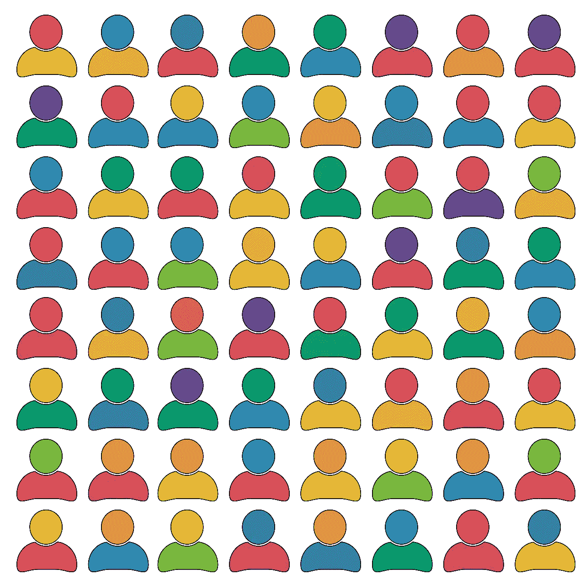
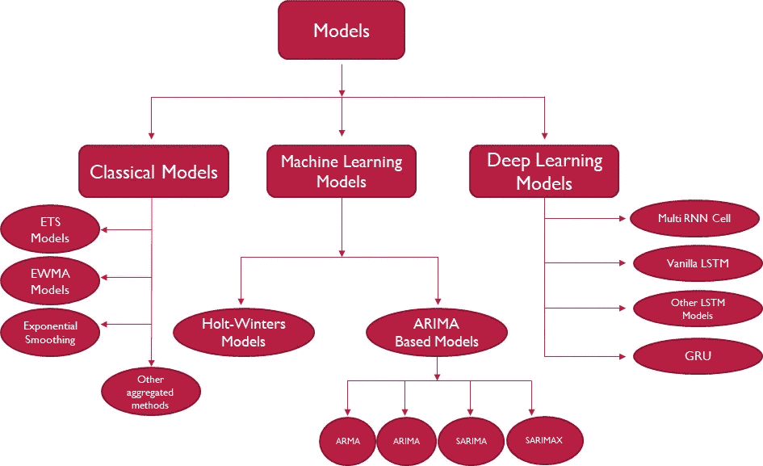
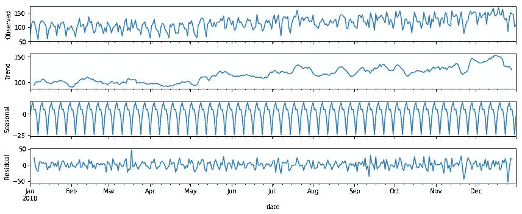
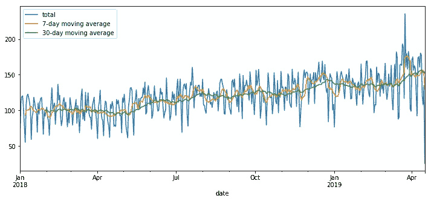
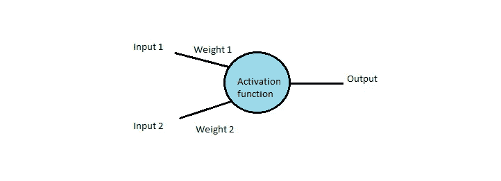
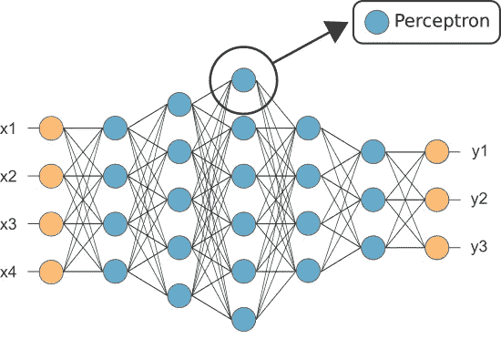
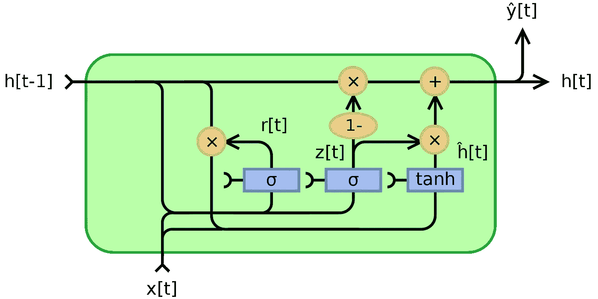

# 使用深度学习利用劳动力分析

> 原文：<https://towardsdatascience.com/leveraging-workforce-analytics-using-deep-learning-b13427f674bf?source=collection_archive---------27----------------------->

如今，几乎每个基于服务的企业都需要劳动力分析。它还被称为劳动力管理、人员分析和其他各种术语，但所有这些用例的最终工作和预期结果都是相同的，即预测日常管理业务所需的劳动力。劳动力分析的主要目标是在不影响工作质量的情况下削减劳动力成本。对每日劳动力需求的预测是基于组织中的几个内部和外部因素，如假期安排、病假和休假、天气条件以及所有其他直接或间接对业务产生影响的因素。我们主要关注基于我们已获得的历史数据的劳动力分析的*预测方面*,而不涉及预算、个人绩效分析、生产力检查等其他方面。

很简单，我们想知道每天需要多少劳动力才能无障碍地开展日常业务。由于我们正在处理每日数据，我们将考虑每日趋势，也就是说，业务可能在周末达到高峰，而在周中、周二和周三达到低谷。在更高的层面上，趋势也可以在每周数据中看到，劳动力需求可能在假期周飙升，在淡季周下降。月度趋势在这类数据中很少看到，即使看到也可以忽略，除非我们有一个庞大的历史数据库。

# **时间序列建模**

这种数据是基于时间的——我们在数据中看到一些重要的趋势和模式，都与时间有关。数据具有时间依赖性；这意味着未来数据点的出现与过去数据点的出现相关。这种类型的数据不能用常规的机器学习模型来建模，而是需要一组专门的模型来处理这方面的数据。

这篇文章介绍了我在分析中应用的所有预测时间序列模型，以预测劳动力需求。本文不是关于我们可以对劳动力相关数据执行的各种不同的分析任务。仅仅是关于机器学习和深度学习模型，*我已经应用*来预测一段时间内的单变量数据，特别是针对我的用例和问题。市场上可能有更多的模型可以更好地处理不同类型的时间序列问题。这些是对我来说效果最好的几个。

目标:预测每天完成一项任务所需的工作小时数。(根据所需的总小时数，管理层计划完成任务所需的劳动力。)

数据:每日时间序列数据。感兴趣的变量是“每天工作的总小时数”。在我们的分析中，额外的变量被用作支持变量。

下面是我对这些数据运行的机器学习/深度学习模型的分类。

Predictive models used

使用的模型类别:

*   经典方法
*   机器学习模型
*   深度学习模型
*   集合模型

# **数据探索**

就像任何其他数据一样，在我们应用任何方法进行预测之前，也需要很好地理解时间序列数据。我们需要进行一些数据探索，以确定潜在的趋势。

我使用带有 python 实现的 statsmodels 库来执行 EDA。Statsmodels 是一个为以下各项提供类和函数的模块:

*   不同统计模型的估计
*   进行统计测试
*   进行统计数据探索

使用 statsmodels，我们可以识别数据中的季节性和周期性趋势。使用 Hodrick-Prescott 滤波器，我们可以分离趋势和周期分量。该滤波器使二次损失函数最小化，以确定各个分量。它使用一个平滑参数(λ)，我们可以根据手头的数据进行调整。

将这些组件分别可视化，以检查它们在数据中的分布，并敏锐地观察它们所在的范围。与季节性和趋势成分相比，噪声应该可以忽略不计。

在上面的图表中，我们可以看到有一个略微上升的趋势，并且一定程度上存在季节性。整个数据集中存在噪声(残差)。

有关用于执行 EDA 的方法的详细信息，请参考我在时间序列建模中的描述性统计的文章:[ [链接](/descriptive-statistics-in-time-series-modelling-db6ec569c0b8)

# **经典款**

1.  **ETS 模型(误差-趋势-季节性)**

statsmodels 库中提供误差-趋势-季节性(ETS)模型。这些模型将采用这些项(误差、趋势、季节性)中的每一项进行平滑，即，将它们相加、相乘或省略其中一些。基于这些关键因素，我们可以创建一个最适合我们数据的模型。

*ETS 分解*是 ETS 模型的一个具体用例。statsmodels 的季节性分解()用于其实现。

在我们决定使用哪种 ETS 模型之前，需要检查数据的趋势成分。

*   线性与指数
*   向上与向下

还要检查数据中孤立的季节性成分和残差成分，看数据集结尾的噪声是否比开头的少。但是，主要看趋势组件应该有助于您做出选择模型的决定。

根据上面提到的单个组件，我们决定是选择加法模型还是乘法模型。

*加性 ETS 模型*:当趋势更加线性，季节性和剩余成分随着时间的推移更加稳定时，我们应用此模型。

*乘法 ETS 模型:当趋势为指数时(趋势以非线性速率增加或减少)*

在应用 ETS 分解之前，确保有效地处理缺失值，要么估算它们，要么从数据集中删除它们，因为 ETS 分解在它们存在时不起作用。

**2。EWMA 模型(指数加权移动平均线)**

上图显示了窗口大小为 7 天和 30 天(1 周，1 个月)的简单移动平均线。7 天平均线显示了一个详细的趋势，而 30 天平均线显示了一个更一般的趋势。你为你的窗口选择的时间框架给了你相应的趋势。

我们可以使用 SMA(简单移动平均线)来检查数据的总体趋势。在我们的分析中，它可以作为一个通用模型。但是，我们需要更复杂的模型来理解时间序列趋势。为此，我们可以使用 EWMA 模型。

EWMA 是 SMA 模型的扩展概念。SMA 的问题在于，它被限制为在整个数据中使用相同的窗口大小。另一方面，EWMA 允许我们使用不同大小的时间窗口，也就是说，更新的数据可以比旧的数据更重要。考虑到最近的数据在预测未来数据的建模中的重要性，给予其更多的权重。

EWMA 修复了 SMA 的其他问题，比如它减少了 SMA 的滞后效应，因为它将更多的权重放在了最近发生的值上。分配给这些值的权重取决于给定模型的实际参数和给定窗口大小的周期数。“衰减项”用于当我们从较新的值到较旧的值时，指数地减少分配给数据值的权重。

**3。霍尔特-温特斯法**

我们之前讨论过 EWMA，它是一种简单的指数平滑方法。我们应用了一个单一的平滑因子“阿尔法”。这没有考虑到趋势和季节性等因素。

霍尔特温特斯是一种双指数平滑方法。它包括一个预测方程和三个平滑方程。这里的三个平滑参数分别针对水平、趋势和季节性。(分别为α、β和γ)

同样，霍尔特温特斯模型可以用作加法和乘法模型。当季节变化在整个系列中保持不变时，使用加法模型。然而，当季节变化与系列水平成比例变化时，使用乘法霍尔特温特斯模型。

双指数平滑处理数据中的趋势部分，三指数平滑处理数据中的季节性部分。

**4。ARIMA(自回归综合移动平均线)模型**

基于 ARIMA 的模型通常是时间序列建模中最受欢迎的模型。这是一个非常广泛的主题，我已经写了一篇关于它的实现的单独文章— [ [Link](/implementing-time-series-arima-38fd77fc1d79)

# **深度学习模型**

深度神经网络具有比传统机器学习模型先进得多的能力。它们具有强大的功能，为时间序列预测问题提供了很多希望，特别是在具有多步预测、多值输入和复杂非线性
依赖的问题上。它们还提供自动特性选择和对序列数据(如时间序列数据)的本地支持。

对具有时间相关性的数据建模，比如我们的时间序列数据，在拟合和评估模型时需要专门的处理。数据中的这种时间结构需要专门的模型来识别趋势和季节性模式。我们早先已经应用了像 ARIMA 这样的机器学习线性模型，因为它们对许多问题非常有效，并且很好理解。但是像这样的线性方法受到一些限制，例如:

-通常不支持缺失数据。
-线性方法假设数据中存在线性关系，但不包括更复杂的联合分布。
-大多数线性模型关注单变量数据。(除了少数情况)而大多数现实世界的问题都有多个输入/变量。
-我们需要更先进的模型，能够在很长的时间范围内预测结果。

但是神经网络通常是“黑箱”——很难超出它们的性能指标来解释它们。出于这个原因，每当你遇到与时间序列相关的问题时，首先尝试使用 ARIMA 模型，如果它们没有给你好的结果，那么就把神经网络作为最后的手段。接下来是我在深度学习中使用的所有模型的简要说明。同样，深度学习是一个庞大的主题，我在这篇文章中的尝试仅限于展示模型的基本效用，而不是详细解释这个概念。

**5。多层感知器模型(MLP)**

多层感知器模型是深度学习中最简单的前馈神经网络模型之一。在我们进入复杂的神经网络之前，让我们先了解一下简单的人工神经元是怎么回事。MLP 采用一组先前时间步长的观测值(滞后观测值)来预测一个或多个未来时间步长。

感知器或人工神经元:人工神经网络与我们身体中的生物神经元有很强的相似性。就像生物神经元如何从身体的各个部分接收输入信号并发出输出信号一样，人工神经网络也有类似的神经元概念，它接收各种输入，这些输入在通过激活函数之前进行加权，从而决定神经元的输出。

感知器将权重和偏差添加到输入中，激活函数决定是否激活该神经元。(要不要发射)常用的激活函数有 sigmoid 函数、双曲正切函数、校正线性单位(ReLu)。

> z = wx + b

数学上，感知器可以用上面的等式表示，其中“w”是用偏差“b”加到“x”输入上的权重。

Simplest representation of an artificial neuron

正如你在下面看到的，上面的感知器(或神经元)是多层感知器网络中的单个 most 单元。黄色图层表示输入图层，红色图层表示输出图层，中间的所有蓝色图层表示网络中的隐藏图层。随着层越来越多，抽象层次也越来越高。并且，如果隐藏层是 3 层或更多，那么这样的网络被称为“深度网络”。

Example of a Multilayer Perceptron model [2]

**6。递归神经网络**

这类神经网络专门设计用于处理像我们的时间序列数据这样的序列数据。它们由循环神经元组成，与正常神经元略有不同。

递归神经元不同于普通神经元，它接收来自前一时间步和当前时间步的输入。下图显示了随时间滚动的递归神经网络。

Un-rolling the recurrent neuron over time [1]

例如，在第三时间步的循环神经元将是在 t，t-1，t-2 的输入的函数。这些神经元是来自先前时间步骤的输入的函数，因此被称为“记忆细胞”。通过这种方式，一个循环神经元在任何给定的时间步形成某种记忆状态，所有的历史数据都提供给它。

谈到输入和输出的格式，rnn 在这方面非常灵活。序列到序列、序列到向量、向量到序列是应用中广泛使用的几种格式。

在实现 RNNs 时，请确保缩放您的数据，因为神经元可能会对最小值和最大值之间存在巨大差异的数据表现不同。此外，将数据分批输入到模型中，因为小批量可以更好地训练。

并且 rnn 可能要求输入数据是某种格式。如果我们要向模型提供一个数据序列，请确保包含带有相应标签的序列，例如，[1，2，3，4]-->[5]。第 5 个时间步长的数据值成为前 4 个时间步长的标签。我们根据数据中的季节性来选择这个特性集。如果是年度季节性，那么输入序列(特征集)将包含 12 个输入(对于月度数据)。

您可以根据需要向网络添加图层。在添加这些层时，必须注意的超参数是:每层中的神经元数量、激活函数、输入形状。这些值中的每一个都可以首先通过反复试验来确定。如果模型不是最优的，那么可以使用网格搜索进行改进。在这方面花费大量的时间，因为确定适当的超参数值对模型性能起着至关重要的作用。

此外，定义损失函数及其优化器。还应该初始化对数据运行模型的时期数。

在所有这些实现之后，在测试/验证数据上测试它，一旦获得最佳性能，就预测数据的未来。

7 .**。LSTM(长短期记忆单位)**

rnn 会在一段时间后丢失信息，从最初的几个时间步骤开始。赋予相对较新的时间步长的权重会覆盖它们。我们的网络需要一种“长期记忆”。LSTMs 解决了这个问题。它解决了消失梯度的问题，并致力于跟踪序列数据中的长期依赖性。LSTM 是 RNN 的一种。

Un-rolling of an LSTM cell over time [3]

LSTM 的一个单位包含 4 个主要层:

第 1 层- *遗忘门层*:由我们将要遗忘或从细胞状态中丢弃的信息组成。在使用特定权重和偏差项执行一些线性变换后，我们将 ht-1 和 Xt 作为输入传递给 sigmoid 函数。

第 2 层-第 1 部分: *Sigmoid 层或输入门层:*我们再次将两个输入 ht-1 和 Xt 传递到 Sigmoid 函数中，在这两个输入用权重和偏置项进行线性变换之后。这创建了新候选值的向量。

*第 2 部分:双曲正切层:在这一层中，相同的输入经历线性变换，但是我们现在不是将它们传递到 sigmoid 函数中，而是将它们传递到双曲正切函数中。它们还创建了新候选值的向量。*

第 3 层——在下一层，我们将从两层添加新的候选值，并将它们更新为单元格状态。注意，该单元状态总是具有当前单元状态值 Ct-1。

第 4 层-输出 ht 基于单元状态，但也是单元状态的过滤版本。同样在该层中，两个输入 ht-1 和 Xt 经历线性变换，并被传递到 sigmoid 函数。这又乘以 Ct 的双曲正切，得到输出 ht。

**8。门控循环单元(GRU)**

这是 LSTM 细胞的一个微小变化。

Structure of a Gated Recurrent Unit

与 LSTM 不同，GRU 使用复位门和更新门。重置门位于前一激活和下一候选激活之间以忘记前一状态，并且更新门决定在更新单元状态时使用多少候选激活。

就将小区状态暴露给网络中的其他单元而言，LSTMs 在一定程度上控制这种暴露，而 gru 将整个小区状态暴露给网络中的其他单元。LSTM 单元具有独立的输入和遗忘门，而 GRU 通过其复位门同时执行这两种操作。

**参考文献**

[1][3]https://colah.github.io/posts/2015-08-Understanding-LSTMs/

[2][https://www . neural designer . com/blog/perceptron-the-main-component-of-neural-networks](https://www.neuraldesigner.com/blog/perceptron-the-main-component-of-neural-networks)