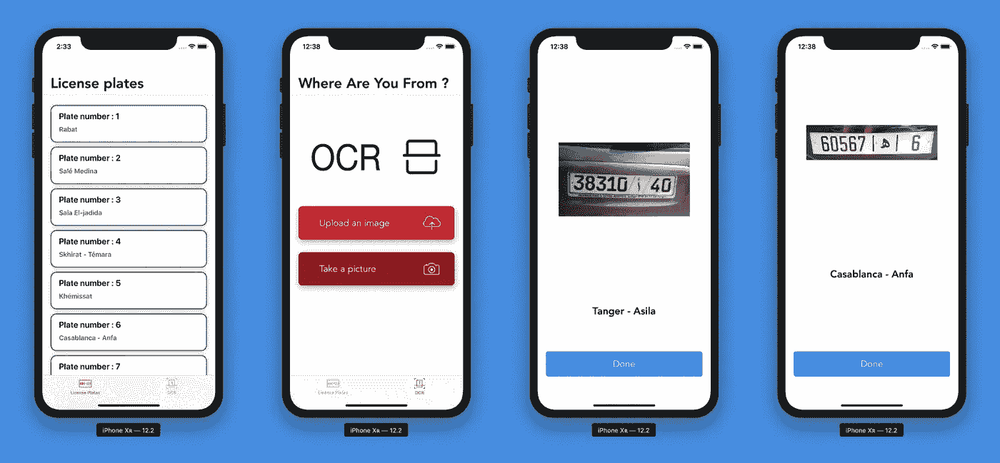
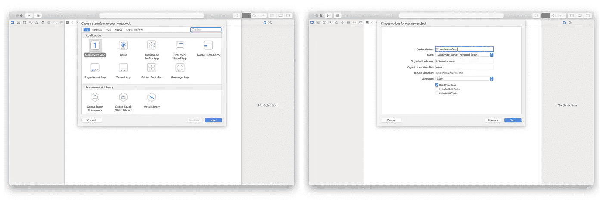
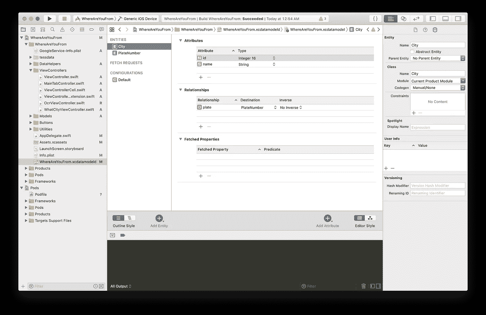
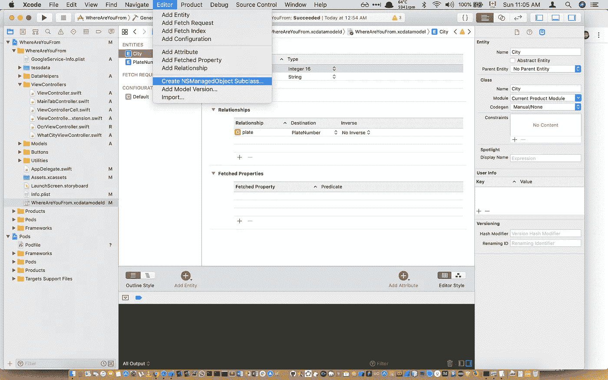
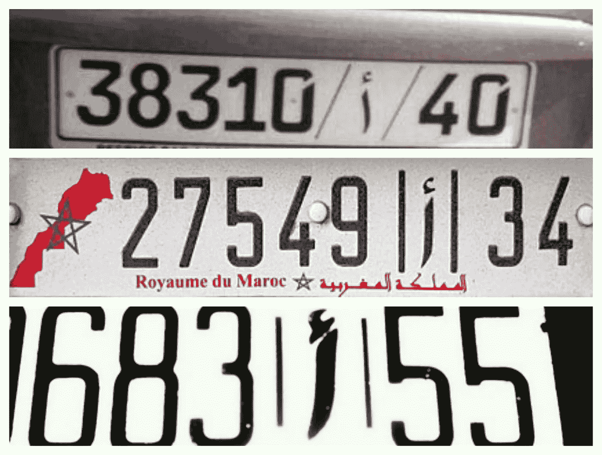
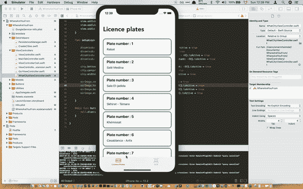

# 使用 OCR 技术和 CoreData 创建车牌读取 iOS 应用程序

> 原文：<https://towardsdatascience.com/licence-plate-reader-ios-application-using-ocr-technologies-and-coredata-3cdee933c38b?source=collection_archive---------14----------------------->

## 使用不同库的完整教程—tesseracrios、SwiftOCR 和 Google MLVision |我们能打败 Google 吗？

Photo by [Oleg Ivanov](https://unsplash.com/@olegixanovpht?utm_source=medium&utm_medium=referral) on [Unsplash](https://unsplash.com?utm_source=medium&utm_medium=referral)

当谈到字符识别技术时，看看我们已经走了多远是很有趣的。阅读和识别脚本文件的清晰图像中的文本变得很容易，但在现实生活中，如果光线不好，图像扭曲，该怎么办呢？

嗯，阅读和识别字符仍然令人惊讶地困难，这是因为视觉，一般来说，在计算方面是复杂和昂贵的。在试图从给定的图像中获取任何有用的信息之前，还有许多参数进入图像的预处理。

当你试图处理来自手机的图像时，由于你无法利用任何 GPU 加速来加速处理过程，这变得更加困难。

让我们深入 iOS 设备的视觉世界，在本教程中，我们将阅读车牌并识别其注册的城市。我们的应用程序将被称为 ***“你从哪里来？”***

Final Result, [Github](https://github.com/omarmhaimdat/WhereAreYouFrom)

# 创建应用程序框架

## 基本设置

让我们首先创建一个带有单视图应用程序的 iOS 项目，确保选中*使用核心数据*:**

****

**Create a new project with core data**

## **创建视图控制器**

**我们需要四个视图控制器:**

*   ****视图控制器:****

**在这里，我们将设置带有所有牌照(在本例中是摩洛哥牌照)和相应城市的 CollectionView。**

*   ****OcrViewController:****

**在这个控制器中，我们将添加两个按钮:一个用于访问照片库，另一个用于访问相机。**

*   ****WhatCityViewController:****

**这里我们将显示对应城市的实际图像。**

*   ****MainTabViewController:****

**这是我们的主导航，我们将在这里为我们的应用程序创建完整的导航。**

## **创建导航**

**iOS 中的导航非常简单，也很容易实现，我已经改变了一些东西，比如导航条的字体等等。所以看起来确实不错。这里是导航的完整源代码，你仍然可以在 [Github 资源库](https://github.com/omarmhaimdat/WhereAreYouFrom)中找到所有这些资料:**

**MainTabViewController.swift**

**确保相应地更改`AppDelegate.swift`,我们将此控制器用作我们的应用入口点:**

**AppDelegate.swift**

# **设置 CoreData**

**如果您在创建项目时选择了“使用核心数据”，Xcode 会添加一个`.xcdatamodeld`文件，我们将使用它来创建我们的模型。**

****

**.xcdatamodeld file**

**您可以创建自己的模型，在这里我选择了一个非常简单的结构，因为我的`objectif`只是为了获取数据并更专注于 OCR，但您肯定可以根据您所在国家的车牌结构进行更改。**

**在这里，我将只使用`City`类作为存储我的车牌数据的主类，`id`代表后缀数字，`name`代表城市名。**

## **添加模型**

**Core Date 将使用与类相关联的 CRUD 方法生成模型。你只需要创建一个`NSManagedObject`子类并按照步骤操作。这非常简单明了:**

****

**Create NSManagedObject Subclass**

## **用数据助手填充模型**

**我用我的`ViewController`类的扩展创建了一个文件，这样我就可以用所有的车牌填充`Database`(如果你是摩洛哥人，你可以使用我创建的那个，否则创建一个并用必要的信息填充它)。**

**Example of how I instantiated my City class, I did this for 87 cities in the CreateCities.swift file**

**你只需要运行这个函数一次，否则，你会得到很多重复的结果。**

## **设置上下文**

**我从 Xcode 最初放置它的`AppDelegate.swift`中移除了上下文，所以我创建了一个名为`PersistenceManager`的类。*这是我的`PersistenceManager`类:***

**Persistence Manager Class**

# **设置 UICollectionView—view controller . swift**

## **创建和设置收藏的布局**

**首先，实例化一个`UICollectionView`对象和`cellId`对象:**

**Our Collection View**

**然后设置布局并添加代理:**

**我们还需要一个`CollectionViewCell` ***，*** 我已经创建了一个自定义的，你可以在 Github 库中找到。**

## **填充集合视图**

**我更喜欢在这里使用扩展名，所以我创建了一个单独的文件:**

# **设置 UIImagePickerView—ocrviewcontroller . swift**

## **从图像库中获取图像**

**我们需要一个按钮和一些逻辑来触发它:**

## **启动摄像机**

**我们现在需要设定一些逻辑。更改`Info.plist`文件并添加一个向用户解释为什么我们需要访问摄像机和库的属性是非常重要的，添加一些文本到`Privacy — Camera Usage Description`:**

## **设置代理人**

**现在我们可以从`ImagePickerController`访问图像:**

**Image Picker Delegate**

# **测试三个 OCR 库**

**现在让我们进入有趣的部分，OCR！**

**说到图像处理，重要的是要找到一个易于处理的图像，更重要的是，要聚焦在主体上。让我们假设图像质量很好，并且已经裁剪到我们感兴趣的区域。**

**由于我们正在制作一个 iOS 应用程序，使用我的老朋友`OpenCV` 是没有意义的，因为它并不意味着要在 ARM 架构中使用，也不会被优化来处理复杂的卷积和转换系列(我确信，如果我们能够利用 OpenCV，结果会好得多)。**

**以下是我用来比较这三个库的图片:**

****

**Three images of Moroccan License Plates. **Disclaimer**: I found these images on google image engine and only used for testing purposes, I don’t know if they are real or not.**

## **特瑟莱克里奥斯**

**这个库很有趣，因为它使用了遗留库 Tesseract，这是用 C++编写的，并包装成在 Swift 中工作。我相信这会给我一个不错的结果，但是我错了！**

**让我们开始吧，首先你需要设置你的`pod`文件，让你的工作空间启动并运行，我假设你知道如何使用 pods(YouTube 上有很多教程可以帮助你学习`cocoapods`)。**

**如果你想看的话，有一个 GitHub 库:[tesseracrios](https://github.com/gali8/Tesseract-OCR-iOS)**

**我创建了一个带有完成块的函数，它返回一个字符串:**

**Tesseract OCR for iOS**

**让我说清楚，这是三个中最差一个。我尝试了几乎所有的方法，甚至拍摄图像并在我的电脑上执行一些卷积来改善图像，但什么都没有！就是不好。**

**这个库只有在图片是纯黑色文本，字体非常简单，背景为白色的情况下才会运行良好。我还想指出的是，众所周知，Tesseract 不适合包含大量文本的图像。**

## **SwiftOCR**

> **SwiftOCR 是一个用 Swift 编写的快速简单的 OCR 库。它使用神经网络进行图像识别。截至目前，SwiftOCR 已针对识别短的一行长度的字母数字代码(例如 DI4C9CM)进行了优化。 ***来源****:*[*Github*](https://github.com/garnele007/SwiftOCR)**

**这很有趣，因为这是一种不同于 Tesseract 的方法，在 tessera CT 中，你基本上利用分类和训练过的数据来进行识别。**

**SwiftOCR 使用神经网络，所以它应该更好，让我们试试吧！**

**因此，我创建了一个带有完成块的函数，它返回一个字符串:**

**没有比这更简单的了，只有四行代码。**

**我可以 100%确定它比宇宙魔方好得多，尤其是在一小块文本上。我会说它给了我 20%的字符，但并不一致，每次迭代之间有一个巨大的梯度。我不确定是我做错了还是只是不稳定。**

**因此，总结来说，对于这个用例，SwiftOCR 比 Tesseract 更好，但是它离预期的结果还差得很远。至此，我彻底郁闷了(开玩笑)。结果与我处理它并与我的数据库进行比较所需要的相差甚远。**

**SwiftOCR 更好，但仍然不够好！**

## **Google MLVision — Firebase ML 套件**

**当你去谷歌，这意味着你已经达到了你的极限。**

**视觉很难，我在图像处理方面的一点点经验教会了我这一点。你需要大量的资源和非常专业的工艺来完成一些像样的东西。**

**您需要下载设备上的文本识别。显然，它没有基于云的强大，但我可以告诉你，它粉碎了其他库(就像真的粉碎了)。**

**因此，我创建了一个带有完成块的函数，它返回一个字符串:**

**我会非常直截了当地说，谷歌是伟大的时期:**

> **95%的全文，98%的准确率。**

# **决赛成绩**

## **谷歌总是赢**

**你不能生其他图书馆的气，因为他们不可能做到谷歌能做到的。他们已经在游戏中呆了很长时间，并为此投入了大量的资金和资源。**

**每个人都知道视觉是人工智能最具挑战性的领域，谷歌正在尽自己的一份力量。**

**要是像脸书、微软和亚马逊这样的公司能够通过开源他们的一些工具来分享一小部分知识就好了。**

**无论如何，这是最后的结果:**

****

**Final result**

**如果你喜欢这个教程，请鼓掌并分享给你的朋友。如果你有任何问题，不要犹豫给我发电子邮件到 omarmhaimdat@gmail.com。**

**这个项目可以从我的 Github 帐户下载**

**[**下载项目**](https://github.com/omarmhaimdat/WhereAreYouFrom)**