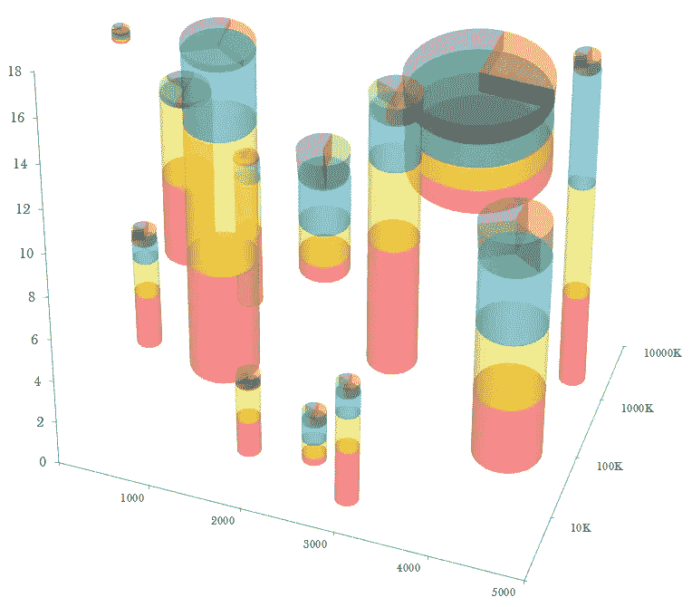

# 谎言，该死的谎言，和数据可视化

> 原文：<https://towardsdatascience.com/lies-damn-lies-and-data-visualisation-39e20991e7da?source=collection_archive---------33----------------------->

## 或者，算术的意想不到的优点

The 3D stacked pie chart shows 8 statistics simultaneously, and none of them effectively

作为一名分析师或数据科学家，可能会觉得从百万行数据帧中创造洞察力是这个过程中最难的部分。

你花费数小时来清除空值、转换数据、测试假设、记录 R 值和仔细检查 p 值。在某些时候，你会得出一个结论。你坐下来，自鸣得意，因为你发现了一些真正突破性的见解。

现在你需要告诉全世界这一切。

如果数学、数据科学和统计学是同一种外语的方言，那么数据可视化可以被认为是一块罗塞塔石碑，允许数字分析者向某种人传达洞察力，这种人可能相当合理地认为“y-hat”是一个关于头饰的问题。

思考如何展示洞察力本身就是一门艺术。如果一个人不能恰当地可视化数据，那么，坦率地说，它将不会被理解。无论见解与谁分享，都是如此。在我之前的管理顾问生涯中，我看到过客户——甚至是首席执行官——拒绝完全合理的、基于证据的建议，因为这些证据的表述不恰当。人们很难指责首席执行官缺乏计算能力，或者普遍忽视合理的建议。

我还从痛苦的个人经历中了解到，一个令人困惑的格式图表甚至会让一位同事感到困惑，他曾在同一数据集上工作，而正是这种洞察力来自于该数据集。因此，每当我在这个问题上培训新员工时，我都会鼓励他们遵循一个简单的数据可视化规则的简短列表:

*   保持简单。始终假设条形图就可以了，只有在洞察的本质真正需要时才偏离(例如，显示时间序列的折线图，或显示相关性的散点图)。
*   图表应该是完全可以理解的，不需要附带文字。
*   每个图表只显示一个洞察。
*   使用 3D 图表显示任何数据，我将把它作为结束你职业生涯的个人目标。

实现上述目标的关键是有效利用**前注意属性**——任何图形的基本视觉属性。

How much longer did it take you to spot the odd one out in ‘Curvature’, compared to ‘Position’? How much longer would it take you if the dots were 3-dimensional?

前注意加工，即提取“明显的”视觉信息的行为，如上述例子所示，发生在感觉记忆中。它不需要观众有意识的努力，并且只需要不到 500 毫秒就可以完成。那么，有效的数据可视化不仅仅是让观众读出轴外的数字，而是要吸引他们的潜意识。

> "总有一天，统计思维将像读写能力一样，成为高效公民的必要条件." **—赫伯特·乔治·威尔斯**

22 < 0, 34 < 14, and 2+2 = 5

当然，一个著名的数据科学家应该尽力确保可视化不会歪曲数据。他们还应该以一种读者能够从中获得明确、准确信息的方式展示他们的发现。

然而，如果数字不支持你所希望的那种信息，那么数据*仍然可以以讲述理想故事的方式呈现。甚至在世界呈现出最近的后真理倾向之前，统计数据及其可视化就经常带着这种不可告人的动机被使用。*

达雷尔·赫夫的畅销书《T2》、《T3》、《如何用统计数据撒谎》、《T4》、《T5》、《T6》、《T7》，并不是为了回应肖恩·斯派塞的另类事实《T9》或《T10》在 2016 年竞选巴士上的不实言论而写的。事实上，它出版于 1954 年，尽管其中的许多主题对现代读者来说是熟悉的(章节标题包括“具有内在偏差的样本”、“精心选择的平均值”和“Gee-Wizz 图”)。

He who controls the media, controls the y-axis

一些数据可视化的现代例子，如此明显是为了欺骗观众而设计的，即使放在最粗略的审查下，看起来也几乎是滑稽可笑的。但是，即使这些数字真的写在图表上，第一视觉印象(通常是残缺的 y 轴)也很重要。图表的前注意属性闪闪发光，要求观众的注意力。一个人的潜意识，经过一百万年的进化，是很难反驳的。