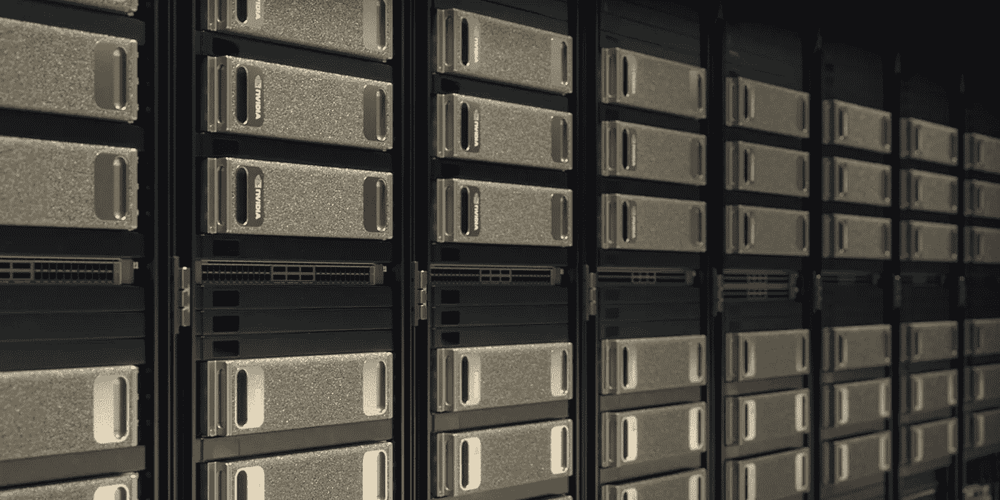

# Hadoop 后的生活:让数据科学为您的企业服务

> 原文：<https://towardsdatascience.com/life-after-hadoop-getting-data-science-to-work-for-your-business-c9ab6605733f?source=collection_archive---------16----------------------->

## 扩展数据科学的五个基本要素

由[乔希·帕特森](https://medium.com/@patterson.joshua)和[吉姆·斯科特](https://medium.com/@kingmesal)

数据科学可以对企业产生变革性的影响。但如果需要几个星期才能有结果，就不会了。

将数据科学付诸实践可以简化为三个步骤。首先，从业务流程中捕获数据。第二，将这些大数据与海量处理结合起来，创建机器学习模型。第三，验证模型的准确性并部署它们。

这听起来似乎很容易，但是到目前为止，却一点也不容易。像 [Apache Hadoop](https://hadoop.apache.org/) 和基于 CPU 的基础设施这样的传统方法无法胜任这项任务——它们造成了太多的瓶颈，而且速度太慢。

NVIDIA 及其合作伙伴正在开发基于 GPU 的工具，让企业利用人工智能释放数据科学。以下是构建人工智能优化数据中心的五个关键要素，但首先让我们看看数据科学正处于哪个十字路口。

# 大数据的麻烦在于

实现机器学习的数据科学家需要三样东西:算法、大量数据和大量计算能力。它们需要万亿字节的数据、千万亿次的计算和数百次迭代学习循环来创建机器学习数据管道。

大数据最初构建于 Hadoop 之上，因为它易于扩展。这允许存储大量的数据。为了处理这些数据，在大型集群中 Hadoop 使用了 MapReduce 等软件框架。

然而，与机器学习相关的常见数据处理任务有许多步骤(数据管道)，Hadoop 无法有效处理。 [Apache Spark](https://spark.apache.org/) 通过将所有数据保存在系统内存中解决了这个问题，这允许更灵活和复杂的数据管道，但引入了新的瓶颈。

这些管道的许多步骤包括收集、清理、标准化和丰富数据。但是只使用 CPU 来处理这些复杂的工作流非常慢。

在具有数百个 CPU 节点的 Spark 集群上，即使分析几百千兆字节的数据也需要几个小时甚至几天。现在考虑处理以大数据著称的万亿字节数据，数据科学家认为该过程已经停止是情有可原的。

这甚至没有涉及到数据科学家想要完成的实际工作。虽然工作流的单次运行需要几个小时才能完成，但数据科学家同时希望修改变量、模型和模型参数，以选择最佳组合并重复他们的想法。

Workflows have many iterations of transforming Raw Data into Training Data, which gets fed into many algorithms combinations, which undergo [hyperparameter](https://en.wikipedia.org/wiki/Hyperparameter_optimization) tuning to find the right combinations of models, model parameters, and data features for optimal accuracy and performance.

# 数据科学的新时代

为了快速迭代，数据科学家需要更强的计算能力。事实上，他们需要的是超级计算能力，但要以企业可以轻松集成到现有基础设施中的方式。旧式数据中心无法完成这项工作。

GPU 可以加速其数据管道的许多步骤。虽然为数据中心添加 GPU 有好处，但这还不够。

为了挖掘数据科学的潜力，GPU 必须成为数据中心设计的核心。一般来说，GPU 上的数据科学工作流的端到端速度大约是 CPU 上的 10 倍。

我们一直在与合作伙伴合作，为数据科学创建解决数据中心瓶颈的基本构件。优化的人工智能数据中心有五个要素:

# 计算节点

凭借其巨大的计算性能，采用 NVIDIA GPUs 的系统是人工智能数据中心的核心计算构建模块。从英伟达 T4 到 V100，英伟达企业级 GPU 为众多应用的服务器提供超级性能。

我们已经看到，通过为每个节点添加一个 T4，流分析应用程序的性能提高了 10 倍以上。在其他地方，我们已经看到，在 DGX 系统中，V100 GPUs 与 NVSwitch 连接后，图形分析性能提高了 1000 倍。

NVIDIA DGX 系统提供了突破性的人工智能性能，并在 GPU 密度方面领先，在单个节点中拥有 8 个和 16 个 GPU。一台 DGX-1 平均可以取代 50 台双插槽 CPU 服务器。这是为数据科学家提供业内最强大的数据探索工具的第一步。

# 建立工作关系网

故事不止于从 CPU 扩展到 T4 和 DGX 系统。对于企业通常收集的海量数据，数据科学家也必须向外扩展。今天，大多数数据中心使用 10 或 25 GbE 网络，因为使用更快的网络几乎没有任何好处。在传统系统中，GPU 通过标准网络进行通信。一旦数据必须跨越节点，瓶颈就是 CPU 和网络。

远程直接内存访问(RDMA)解决了这一瓶颈，为深度学习和机器学习提供了顶级性能。在 [Mellanox](http://www.mellanox.com/) NICs、 [NCCL2](https://developer.nvidia.com/nccl) (英伟达集体通信库)和 [OpenUCX](http://www.openucx.org/) (一个开源的点对点通信框架)中，训练速度有了巨大的提升。由于 RDMA 允许 GPU 以高达 100Gb/s 的速度跨节点直接相互通信，它们可以跨越多个节点，就像在一台大型服务器上一样运行。

RDMA 的好处不仅限于训练。对于大型复杂的 ETL 工作负载来说，这也是至关重要的。在没有 RDMA 的系统上，与 PCIe GPU 相比，改进网络可为分布式连接提供高达 20 倍的优势。此外，以前仅限于 GPU 到 GPU 的通信，RDMA 通过 GPUDirect 存储在摄取静态数据方面提供了额外的 2 倍速度提升。

# 储存；储备

加速存储对企业来说并不是一个新概念，它只是没有为基于 Hadoop 构建的传统大数据集群提供显著的成本改善。考虑到 CPU 的性能，答案是使用较慢的磁盘并多次复制数据以提高局部性。

但是随着工作负载变得越来越复杂，复制将会增加。或者，CPU 将花费 70%的时间在 Spark 集群的数百个节点之间来回发送数据。虽然单个 GPU 最多有 48GB 的内存，但最终需要从存储中转移数据，传统存储成为最后的瓶颈。

[GPUDirect 存储](https://news.developer.nvidia.com/GPUDirect-storage-moving-data-pipeline-into-the-fast-lane/)允许 NVMe 和 NVMe 通过光纤(NVMe-oF)直接向 GPU 读写数据，绕过 CPU 和系统内存。传统架构在存储和 GPU 计算之间的 CPU 系统内存中放置了一个“缓冲区”，其中的数据副本将用于保持 GPU 上的应用程序运行。

借助 GPUDirect 存储，一旦所有计算都在 GPU 上进行，GPU 不仅成为速度最快的计算元素，而且成为 I/O 带宽最高的元素。这释放了 CPU 和系统内存用于其他任务，同时让每个 GPU 以高达 50%的带宽访问更多数量级的数据。

NVSwitch 用一个系统统一了 GPU，RDMA 跨节点统一了 GPU，现在 [GPUDirect Storage 统一了 GPU 和 NVMe](https://devblogs.nvidia.com/gpudirect-storage/) 将其容量提升到 Pb 级。

Unifying GPUs intra-node with NVLink and NVSwitch, internode with RDMA networks, and with NVMe over Fabric Storage with GPUDirect Storage provides the highest throughput for GPU processing and training.

# Kubernetes 和容器

部署软件是扩展数据科学的最后一个关键。企业通常依靠一些虚拟化或编排层来部署软件。在数据科学领域，Yarn 一直占据着至高无上的地位。它是 Hadoop、Spark 和其他传统大数据生态系统的支柱，允许企业在工作流中的库之间切换。

几乎所有的 Yarn 部署都是在 GPU 支持之前的版本上。这使得 Yarn 环境中的数据科学家很难将 GPU 机器作为工作负载的目标。这也是企业转向 Kubernetes 和 Docker 容器的原因之一。

通过容器打包和部署应用程序对于获得灵活性至关重要。将容器化的应用程序与 Kubernetes 相结合，使企业能够立即改变最重要任务的优先级，并为人工智能数据中心增加弹性、可靠性和可扩展性。Kubernetes 和集装箱在部署时间上也比传统包装和纱线更快。虽然在 Yarn 上构建一个数据科学集群可能需要几十分钟，但使用 Kubernetes 可以在几秒钟内完成。

能够快速改变任务减少了空闲周期，从而提高了集群的吞吐量和生产率。随着计算资源变得更加强大和密集，这对于最大化数据中心的价值至关重要。

英伟达意识到了 Docker 和 Kubernetes 的重要性，很早就投资了这个社区。这项投资使得 NVIDIA GPUs 成为 Kubernetes 的一流资源。软件可以访问数据中心的所有功能和硬件加速，从而最大限度地提高企业在数据科学方面的投资。

# 加速软件

[RAPIDS](https://rapids.ai/) 是一套完全在 GPU 上执行数据科学管道的开源软件库和 API，可以将培训时间从几天减少到几分钟。RAPIDS 基于 NVIDIA CUDA-X AI 构建，凝聚了图形、机器学习、深度学习、HPC 等领域多年的开发成果。

通过隐藏数据中心架构中使用 GPU 甚至幕后通信协议的复杂性，RAPIDS 创建了一种简单的方法来完成数据科学。随着越来越多的数据科学家使用 Python 和其他高级语言，在不改变代码的情况下提供加速对于快速缩短开发时间至关重要。

另一种加速开发的方式是集成到领先的数据科学框架，如 Apache Spark、 [Dask](https://dask.org/) 和 [Numba](https://numba.pydata.org/) ，以及众多深度学习框架，如 [PyTorch](https://pytorch.org/) 、 [Chainer](https://chainer.org/) 和 [Apache MxNet](https://mxnet.apache.org/) 。通过这样做，RAPIDS 为新的加速数据科学生态系统奠定了基础。

作为 Apache 2.0 开源软件，RAPIDS 不仅在 GPU 上整合了这个生态系统，还降低了新库的准入门槛。越来越多的产品建立在 RAPIDS 之上——例如， [BlazingSQL](https://blazingsql.com/) ，一个 SQL 引擎(最近[完全开源了](https://blog.blazingdb.com/blazingsql-is-now-open-source-b859d342ec20))——为用户增加了更多加速功能。

RAPIDS 允许新一波应用程序具有本机集成、Kubernetes 支持、RDMA 功能和跨无数数据格式的 GPUDirect 存储，而无需投资多年的开发。更多的软件让数据科学家更容易做他们想做的事情:用数据解决具有挑战性的问题。将这些优势与人工智能数据中心的其他方面结合起来，可以让您不受性能限制地处理数据科学。

# 英伟达 GPU 在行动

无论行业或用例如何，当将机器学习付诸行动时，许多数据科学问题都可以分解为类似的步骤:迭代地预处理数据以构建特征，用不同的参数训练模型，并评估模型以确保性能转化为有价值的结果。

RAPIDS 有助于加速所有这些步骤，同时最大限度地提高用户的硬件投资。早期客户采用了需要几天甚至几周才能完成的完整数据管道，并在几分钟内完成。他们同时降低了成本并提高了模型的准确性，因为更多的迭代允许数据科学家探索更多的模型和参数组合，以及在更大的数据集上进行训练。

零售商正在改善他们的预测。金融公司能够更好地评估信用风险。广告技术公司正在提高预测点击率的能力。数据科学家通常能实现 1-2%的改进。这可能看起来微不足道，但它可以转化为数千万或数亿美元的收入和利润。

# 帮助塑造未来

NVIDIA 致力于简化、统一和加速数据科学社区。通过优化从硬件到软件的整个堆栈，以及消除瓶颈，NVIDIA 正在帮助各地的数据科学家以更少的资源做更多的事情。这转化为企业最宝贵资源的更多价值:他们的数据和数据科学家。

但是，我们并不是孤军奋战。搭建跨越数据科学社区的桥梁，加速每个人的发展。成为社区的一部分。开始使用加速库，让我们知道接下来会有什么特性，并且[申请加入我们的顾问联盟](https://info.nvidia.com/data-science-advisory-consortium-early-access.html)。

NVIDIA 正在构建未来的数据科学平台，我们希望您成为其中的一员。