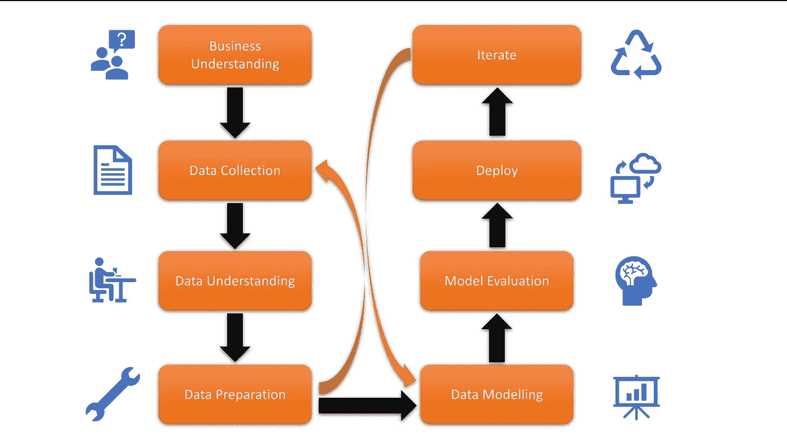
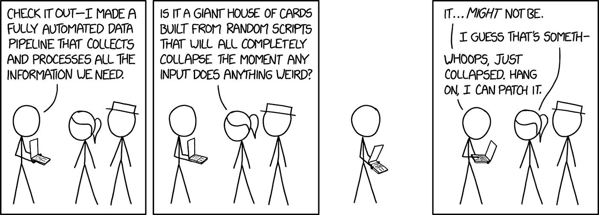
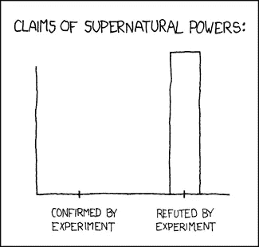
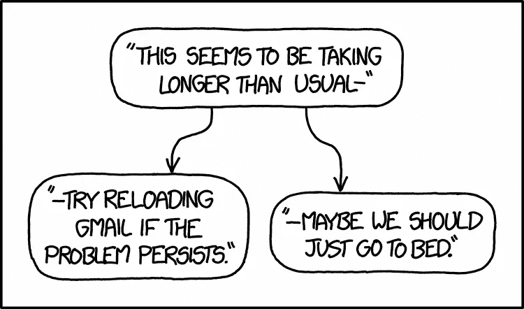

# 数据科学项目的生命周期

> 原文：<https://towardsdatascience.com/life-cycle-of-a-data-science-project-3962b9670e5b?source=collection_archive---------12----------------------->

## 解决现实世界数据科学问题的主要步骤

Photo by [Estée Janssens](https://unsplash.com/@esteejanssens?utm_source=medium&utm_medium=referral) on [Unsplash](https://unsplash.com?utm_source=medium&utm_medium=referral)

自数据科学这个术语在 90 年代被创造出来以来，它已经成熟了很多。该领域的专家在解决数据科学问题时遵循一种固定的结构。现在开展数据科学项目几乎就是一个算法。

太多时候都有一种绕过方法论直接解决问题的诱惑。然而，这样做，由于没有为整个努力打下坚实的基础，阻碍了我们最好的意图。然而，遵循这些步骤往往会让我们更接近我们试图解决的问题。

The Flow of a Data Science Project

## 1)问正确的问题，即业务理解

尽管在过去十年中，数据访问和计算能力都有了巨大的增长，但一个组织的成功在很大程度上仍然取决于他们对数据集提出的问题的质量。收集的数据量和分配的计算能力并不是一个区分因素。

IBM 数据科学家 John B. Rollins 将这一步称为**业务理解**。例如，谷歌在开始时会问“**什么构成相关搜索结果**”。随着谷歌作为搜索引擎业务的发展，它开始展示广告。那么正确的问题应该是“**哪些广告与用户相关**”。一些其他成功企业过去曾问过其数据科学团队的正确问题

*   亚马逊—在不景气时期，他们可以出租多少计算(EC2)和存储(S3)空间？
*   优步——司机实际开车的时间占多大比例？他们的收入有多稳定？
*   Oyo 酒店——普通酒店的平均入住率是多少？
*   阿里巴巴——我们仓库的每平方英尺利润是多少？

在我们开始数据科学之旅之前，所有这些问题都是必要的第一步。问完正确的问题后，我们继续收集数据

## 2)数据收集

如果问正确的问题是**的秘诀，**那么数据就是你的要素。一旦你对**业务有了清晰的理解，数据收集**就变成了将问题分解成更小的部分。

数据科学家需要知道需要哪些成分，如何获取和收集这些成分，以及如何准备数据以达到预期的结果。

例如，对于亚马逊，所需的**数据类型**将是

*   精简期间空闲的计算服务器数量
*   在不景气时期闲置的存储服务器数量
*   维护这些机器所花的钱
*   鉴于上述数据，亚马逊可以很容易地理解他们可以利用多少。事实上，当亚马逊回答这些问题时，贝佐斯很高兴地知道这是一个非常迫切的需求。这导致了 AWS 的出现。

**如何寻找和收集** 亚马逊的工程师们负责维护服务器运行的日志。进行了市场调查，以了解有多少人将从按使用付费服务器中受益，只有这样他们才继续前进。

[xkcd](https://xkcd.com/2054/)

## 3)数据准备

现在我们已经收集了一些数据。在这一步中，我们**了解**更多关于数据的信息，并且**为**进一步分析做准备。数据科学方法论的数据理解部分回答了这个问题:您收集的数据是否代表了要解决的问题？

比方说，优步想了解人们是否会选择为他们开车。为此，比方说，他们收集了以下数据

1.  他们目前的收入
2.  出租车公司对他们收费的百分比降低了
3.  他们乘坐的次数
4.  他们闲置的时间
5.  燃料成本

虽然 1-4 有助于他们更多地了解司机，但第 5 条并没有真正解释司机的任何事情。燃料成本确实影响了优步的整体模式，但并没有真正帮助他们回答他们最初的问题。

为了理解数据，很多人看数据统计，如平均值、中位数等。人们还绘制数据，并通过直方图、频谱分析、人口分布等图来查看其分布。

一旦我们对数据有了更好的理解，我们就为进一步的分析做准备。准备工作通常包括以下步骤。

1.  ***处理缺失数据***
2.  ***修正无效值***
3.  ***删除重复***
4.  ***将数据结构化后送入算法***
5.  [***特征工程***](https://en.wikipedia.org/wiki/Feature_engineering)

数据准备类似于清洗蔬菜以去除表面化学物质。数据收集、数据理解和数据准备 [***占整个项目时间的 70%-90%***](https://courses.cognitiveclass.ai/courses/course-v1:CognitiveClass+DS0103EN+v3/courseware/bd64ccdf56ad4ea1afe870e26d583038/d0cea537238c47a0ac4835e1463a3c7d/)*。*

> *这也是如果你觉得数据不合适或不足以让你继续，你回到数据收集步骤。*

*一旦准备好并清理了数据，我们就进入任何数据科学项目的核心——建模*

## *4)数据建模*

> *建模是数据科学方法中的一个阶段，在这个阶段，数据科学家有机会品尝调味汁，并确定它是否正点或需要更多调料*

*建模用于发现数据中的模式或行为。这些模式或者以两种方式帮助我们——1)**描述性建模**例如[推荐系统](https://medium.com/x8-the-ai-community/recommendation-system-db51c868f13d)也就是说，如果一个人喜欢电影《黑客帝国》,他们也会喜欢电影《盗梦空间》;或者 2) **预测性建模**,它涉及到对未来趋势的预测，例如[线性回归](/laymans-introduction-to-linear-regression-8b334a3dab09),我们可能想要预测股票交易值*

**

*[xkcd](https://xkcd.com/373/)*

*在机器学习世界中，建模分为 3 个不同的阶段——训练、[验证](https://medium.com/x8-the-ai-community/use-of-cross-validation-in-machine-learning-f3b80ad813e6)和测试。如果学习模式是无人监督的，这些阶段就会改变。*

*无论如何，一旦我们建立了数据模型，我们就可以从中获得洞见。这是我们最终可以开始评估我们完整的数据科学系统的阶段。*

*建模的结束是由模型评估来表征的*

1.  *准确性—模型的表现如何，即它是否准确地描述了数据。*
2.  *相关性——它是否回答了你想要回答的原始问题*

## *5)部署和迭代*

*最后，所有数据科学项目都必须部署在现实世界中。部署可以通过 Android 或 iOS 应用程序，就像 **cred** 一样，也可以通过 web 应用程序，比如**moneycontrol.com**或者作为企业软件，比如 **IBM Watson***

*无论您的数据模型以何种形式部署，它都必须向现实世界公开。一旦真正的人类使用它，你一定会得到反馈。对任何项目来说，获取这些反馈都直接关系到生死。您获得的反馈越准确，您对模型所做的更改就越有效，您的最终结果也就越准确。在这一点上，典型的组织记录这个流程，并雇佣工程师来不断迭代整个流程。*

**

*[Real World Deployment](https://xkcd.com/1631/)*

*数据科学项目是一个迭代过程。您不断重复不同的步骤，直到您能够根据您的具体情况对方法进行微调。因此，您将同时进行上述大部分步骤。 **Python** 和 **R** 是数据科学使用最多的语言。数据科学是一个兔子洞。祝你玩得开心！*