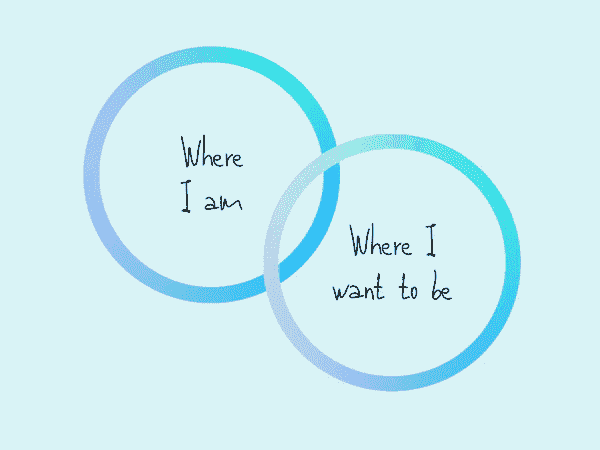

# 来自数据科学的生活经验

> 原文：<https://towardsdatascience.com/life-lessons-from-data-science-a59119e130d6?source=collection_archive---------20----------------------->

过去的几个月对我来说是当头一棒。在搬到柏林之前，我已经想好了一切。我把这个学期的计划细化到每天几点起床，去哪所舞蹈学校，读什么书。(是的，其中涉及到一个 Excel 电子表格。)每件事都有预算和时间段；一切都说得通了。直到它没有。

入住两个月后，我发现自己迷失了方向，对日常生活完全不满意。夹在统计课、没完没了的作业和每天寻找意义和动力的努力之间，内心似乎打开了一个洞，提醒我，我以为我知道的“过最好的生活”的一切都不起作用。

然后，就像你注意时经常发生的那样，洞察力开始从似乎在折磨我的源头出现。当我在计算科学课程中导航时——最后一刻改变专业，这被证明不是一个玩笑——我突然意识到数据科学的原则对我们的日常生活是多么适用。我发现统计数据和个人成长都有三点是正确的:

1.  你是你最丰富的数据集。
2.  说到底，是系统的问题，不是细节的问题。
3.  个人成长，就像数据科学一样，最好由好奇心驱动。

# 你是你最丰富的数据集。理解它并从中学习。

现实世界是一个巨大的反馈机制。最有才华的创新者和博学的未来学家是那些看到整体并理解人类历史的人，这是巧合吗？“了解你自己”是良好的数据科学和真正的个人成长的核心。我们过去的经历、情感模式、欲望和厌恶是一个不断被挖掘和更新的巨大数据仓库。随着我们的成长，我们开发了一个复杂的模型，将这些数据作为输入，并将信念、叙述和期望作为输出。但这种模式可能会崩溃，而且经常如此。预测与观察不符，所以我们对这个世界有一种挫败感。我们发现自己陷入了困境，因为我们的模型缺乏从自身错误中学习的能力。我们不断输入相同的数据，期待新的结果。不是有人说精神错乱的定义就是一遍又一遍的做着同样的事情，期待着不一样的结果吗？

在数据科学中，你知道你预测未来的能力取决于你对过去的解释。一个好的模型总是以敏锐的精确度整合历史数据。问题是并非所有的数据都是相关的。有点像这几天看新闻；知道发生了什么很重要，但十有八九，“发生”的是一种嘈杂的干扰，与真实的事态没有多大关系。

这个原则可能很难接受。人们可能会在生活中伤害自己，因为他们强化了很久以前建立在一些负面经验基础上的叙事。过度使用一个模型会产生一个强化的反馈循环，使得随着时间的推移更难改变。我从小就被告知(含蓄地)聪明的人获得科学学位，其他的都是肤浅的和浪费时间的。我花了一年时间学习痛苦的物理课程，只是为了取悦我内心的那个声音，那个声音说如果我不这样做，我就会是一个失败者。这种心态继续以微妙的方式限制着我，我知道我还有很多事情要做。

如果你的生活是一个统计模型，它会是什么样子？哪些变量比其他变量更重要，为什么？面对新信息时，模型表现如何？如果它不再为你服务，它还能适应吗？

# **归根结底，这是关于系统，而不是细节。**

有一种东西叫做过度合身。过于完美地提炼每一课，同等关注地审视每一次经历，你的模型很快就会崩溃。我们不仅仅是我们各部分的总和，过度分析一个人自身存在的每一个方面——正如柏拉图所说，“在关节处雕刻自然”——并不会让我们更好地生活，并真正地*享受那种存在。一个优秀的数据科学家知道，最好的模型总是为随机性、偶然性和同步性留有余地。在生活中，我们称之为神秘、美丽、奇迹。*

前几天，一个朋友透露他的生活准则是“不要设定目标”。创建系统。”我们中的许多人从小就被教导要追求远大的目标，用一生去追逐里程碑，证明自己的价值，核对清单上的项目。这种努力的回报是认可、名誉和成功。但是，如果没有一种甜蜜、宁静的满足感，目标又是什么呢？这就是自我提升模式失去效力的地方，也是我朋友的方法如此吸引人的地方。

如果我们少关注细节，多关注大局会怎么样？如果我们的日常活动不是基于需要做什么，而是基于我们想要如何生活会怎样？任务将变得不那么受时间和成就的限制，而更倾向于它们给我们和他人带来的感受；他们挑战我们的部分和他们允许我们活出的价值。例如，我的朋友辞去了他朝九晚五的工作，以便有更多的时间陪伴他的儿子。他是一名自由职业的法律顾问，按照社会标准，他现在一天中的大部分时间都毫无建树。当其他人在写电子邮件和签署协议时，他可能正在擦拭刚刚滑下儿子脸颊的大块食物。当他工作时，他创造性地、精力充沛地工作，边喝咖啡边头脑风暴，举办法律研讨会，帮助企业家驾驭错综复杂的业务。他的套路很灵活。他是一个善于思考和与人交往的人，他已经找到了将自己的职业生活融入一个更大体系的方法，这个体系构成了他真正想要的生活。不是每天都是完美的。有时最后期限无法满足。但是每天，他都在调整系统，让他做他最擅长的事情，并变得更好。在他的模型中，做一个创新的法律顾问和做一个父亲一样重要。

数据科学和生活本质上都是经验性的，我们无法通过完善代码行或分分秒秒地分配时间来掌握它们。我们通过观察、参与和学习来掌握它们，然后创建一个反映我们最重视的东西的系统。

# **个人成长，就像数据科学一样，最好由好奇心驱动。**

你可能听说过“p-hacking”这个术语。这是当研究人员有意或无意地操纵他们的方法来产生一个期望的 p 值时发生的事情——这个成败的统计数字告诉你在现实生活中获得与控制测试相同结果的概率。p 值显示了统计意义，这是数学家问“我应该多认真地对待这些结果？”

当数据科学家 p-hack 时，他们已经不再试图证明一个假设。相反，他们正在收集证据来支持他们已经相信或希望别人相信的东西。我们在自己的生活中一直是这种偏见的受害者*。当我们的模型崩溃时，我们继续期待从相同的输入中得到不同的结果，我们告诉自己没关系。我们会想办法从积极的角度看待证据。我们不是问题所在，其他人才是。我们观察到的任何差异都是微不足道的。我们通过“证明”相同的旧假设来愚弄自己，不断收集有利于我们当前思维模式的证据，并拒绝任何表明有改进空间的东西。*

这种想法很可怕，但如果对实验设计进行适当的调整，即使是最严谨的数据分析师也可以声称找到了不存在的模式，或者推翻了明显存在的模式。探索性数据分析的目标是发现和理解这些有趣的模式。但与 p-hacking 不同，它要求在数据发现过程中，我们不要在头脑中操纵我们看到的内容。方法纯粹是好奇。

我已经成为树立里程碑的牺牲品，这些里程碑不会挑战我的思维方式。追求个人成长和追求个人满足之间有很大的区别。我们不喜欢承认一个有时与另一个相矛盾。

# 那又怎么样呢？

数据科学教会了我少花时间制定计划，多花时间思考。系统的方法让我更容易更新我的信念，寻求和回应反馈，并确定我自己的模型中需要重新设计的部分。

我的结论是:没有“一刀切”。尝试完美之前先做实验。把自己当成一个优雅的统计模型，善于整合细微的反馈，消除噪音，适应复杂的环境。通过从你的错误中学习，并接受他人的意见，为你的基础建立弹性。把你的注意力从“什么时候？”以及“怎么做？”到“为什么？”，然后观察各个部分开始组合在一起。你的生活与其说是目标的线性结果，不如说是综合系统的一个突现属性。

作为一名数据科学家，最令人满意的事情之一是能够使用新开发的技能来揭示现实生活。我花了太长时间寻找“新的有趣的应用程序”，而最明显的一个却一直盯着我。