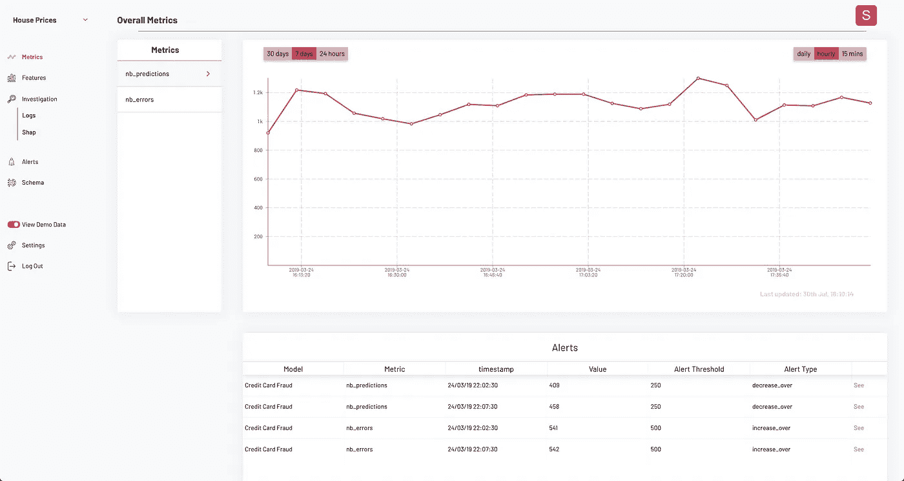
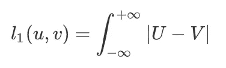
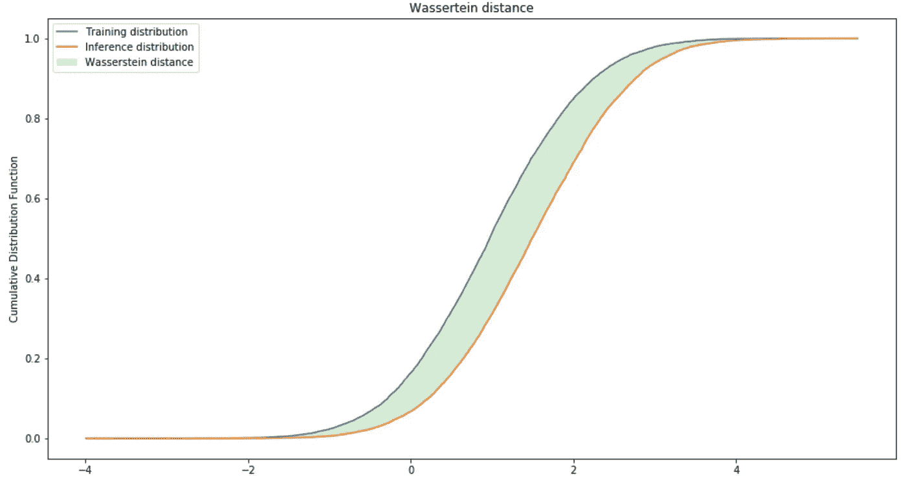
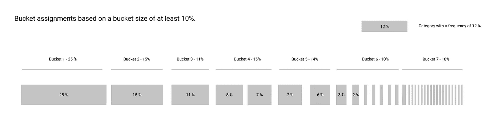

# 部署后模型的生命周期

> 原文：<https://towardsdatascience.com/life-of-a-model-after-deployment-bae52eb83b75?source=collection_archive---------24----------------------->

Example dashboard used to monitor models — [Stakion](https://stakion.io)

应用程序监控是在生产中运行软件的关键部分。没有它，找到问题的唯一方法是通过运气或者因为客户报告了它。至少可以说这两者都不太理想！

> 你不会在没有监控的情况下部署应用程序，那么为什么要为机器学习模型部署呢？

为了尽量保持帖子的可管理长度，我们将只关注几个关键主题:

*   监控所需的数据
*   要跟踪和提醒的关键指标
*   训练和推理分布之间的相似性度量

# 监控所需的数据

为了准确地监控机器学习模型，在进行预测时需要记录粒度数据。这些日志可用于调试为什么做出某个预测，一旦汇总，将使我们能够监控模型。

良好测井的关键部分:

*   **由调用 ML 模型的系统提供的每个请求的唯一 Id**。这个唯一标识符将与每个日志一起存储，并允许我们在 ML 模型之前、期间和之后跟踪预测的路径。
*   **在特征工程之前输入特征**
*   **输入特征工程后的特征**
*   **输出概率**
*   **预测值**

虽然这看起来像是大量的日志记录，但是如果没有它，我们将看不到模型是如何处理某些输入的。

# 要跟踪的关键指标

在最好的情况下，我们会近乎实时地将地面实况标签与我们的预测进行比较。不幸的是，这通常是不可能的，因为对于大多数应用程序来说，基本事实标签直到做出预测后很长时间才可用。例如，当试图预测下一年的收入或预测交易是否欺诈时，就是这种情况。

> 如果无法实时追踪模型的准确性，请改为追踪输入和输出要素的分布。

监视模型功能背后的假设是，当要求模型对不属于定型集的新数据进行预测时，模型的性能将会改变。

我们可以通过跟踪一些指标来很好地了解模型的健康状况:

*   预测次数
*   预测延迟—进行预测需要多长时间
*   输入和输出特征分布的变化

在特征级别，我们将想要跟踪在训练期间计算的分布(*训练分布*)和在推理期间计算的分布(*推理分布*)之间的相似性度量。

# 训练和推理分布之间的相似性度量

为了监控一个特性，我们需要计算一个度量来比较训练和推理分布。有许多不同的相似性分布可供选择，但很少能同时适用于分类变量和数值变量。

## 计算相似性度量

Wasserstein 距离[1]是一种相似性度量，可以针对数字和分类特征进行计算，其定义为:

Wasserstein distance with U as the training CDF and V the inference CDF

从图形上看，Wasserstein 距离是两个累积分布函数之间的面积。因此，如果训练和推理分布是相同的，那么它将是 0。当它们开始发散时，距离会增加，并且没有上限。

Graphical representation of the Wasserstein distance.

要计算分类变量的 Wasserstein 距离，您必须对每个类别的频率差异的绝对值求和。

## 存储分布

为了计算 Wasserstein 距离，我们需要存储连续分布和离散分布。

连续分布可以用 t-Digests 来表示[2]。不涉及细节，t-Digests 是一种新的数据结构，它存储 CDF 的稀疏版本，并具有许多属性(容易序列化、并行化等)。

离散分布更容易存储，我们只需要存储类别和它们各自的频率。如果类别总数很高，那么我们可以只存储前 1000 个。

可视化离散分布可能很棘手，我们可以做的一件事是将类别分组到桶中，每个桶至少包含 *x* %的数据(见下文)。鉴于这是在训练数据上完成的，我们预计每个桶的大小在推断过程中会略有波动。

Bucketing categories into buckets of frequency of 10%.

# 结论

通过一点规划，监控机器学习模型并不复杂。

监控模型归结为跟踪预测的数量以及训练和推理分布之间的相似性度量。如果你已经准备好了，你就可以高枕无忧了，如果出了问题，你会是第一个知道的人！

**参考文献:**

[1]瓦瑟斯坦米制，【https://en.wikipedia.org/wiki/Wasserstein_metric】T4

[2]使用 t-Digests 计算极其精确的分位数，[https://arxiv.org/abs/1902.04023](https://arxiv.org/abs/1902.04023)