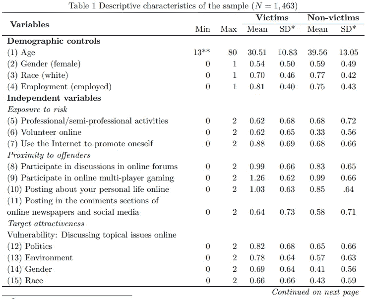
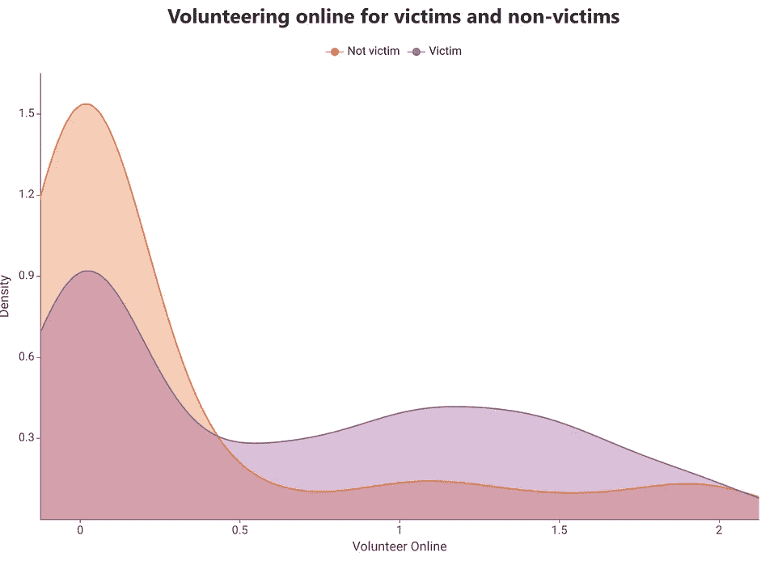
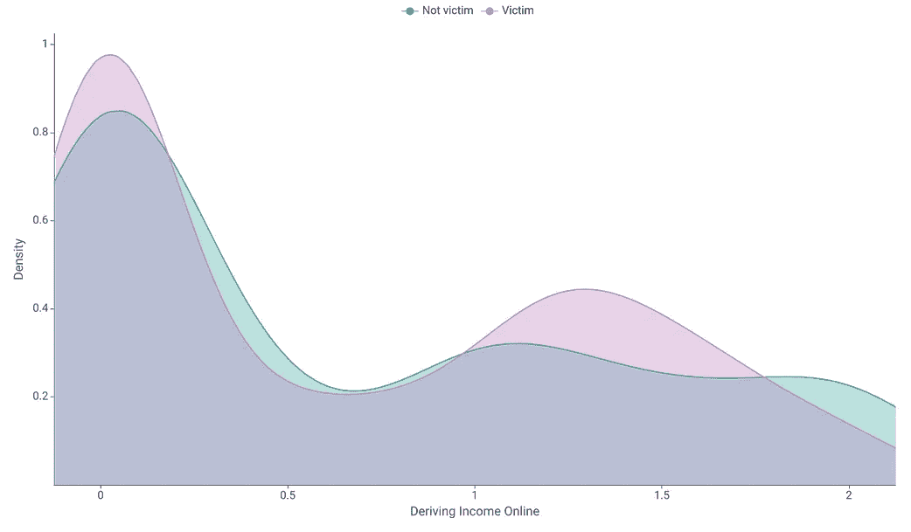
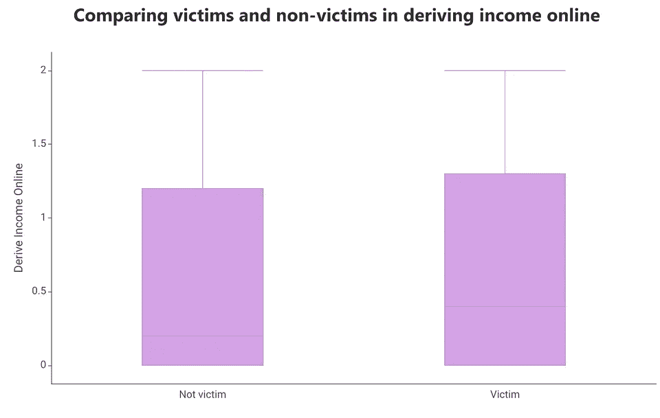
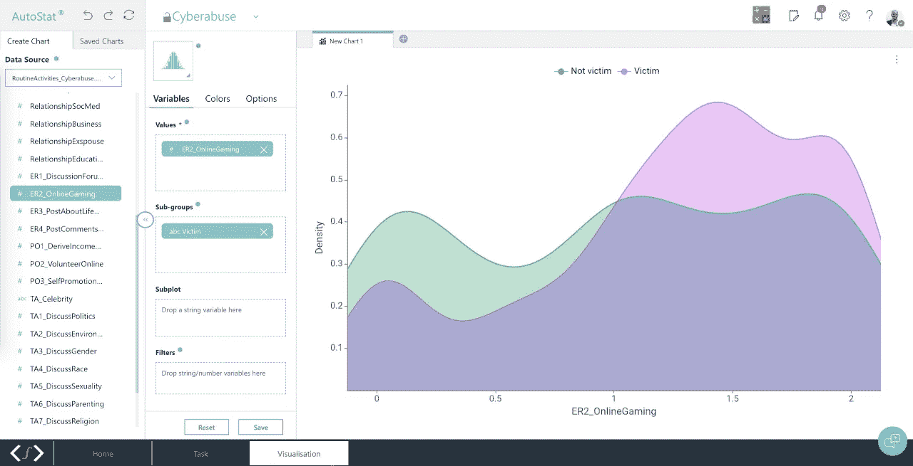
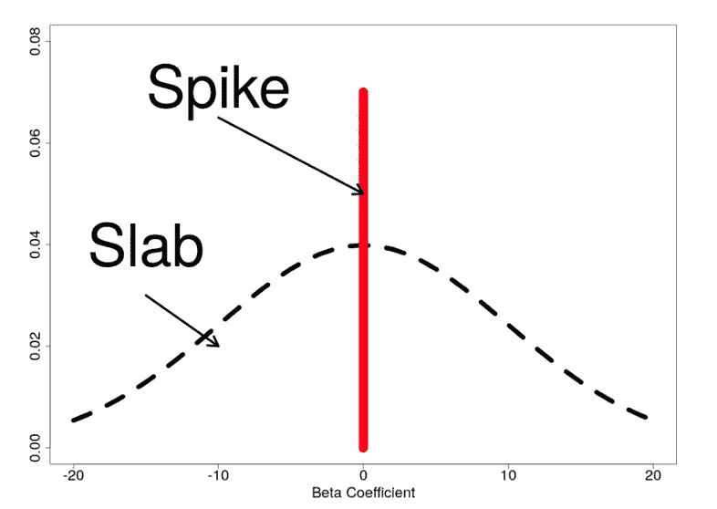
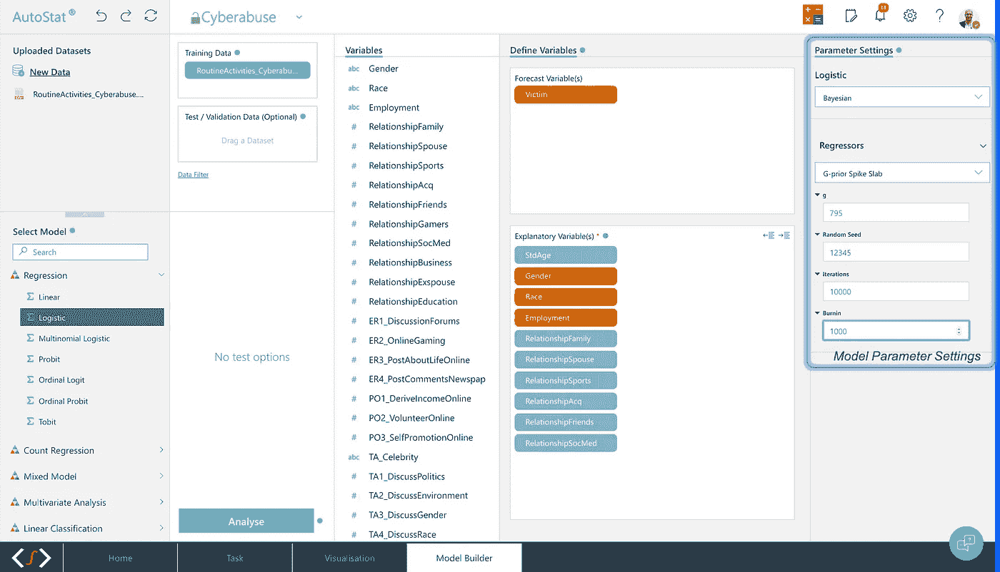
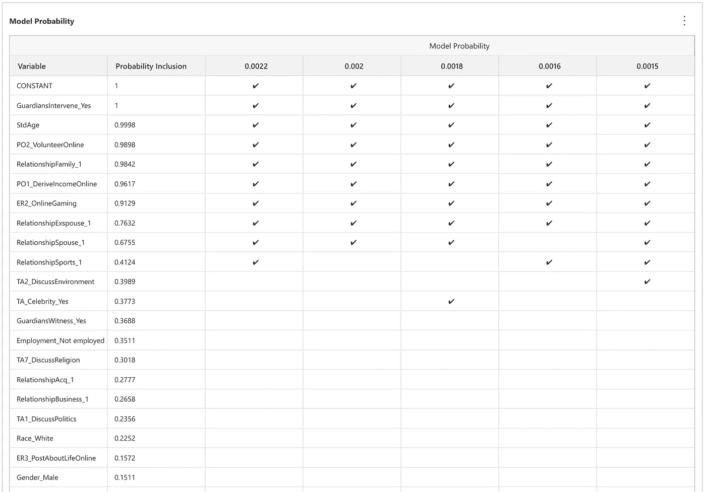
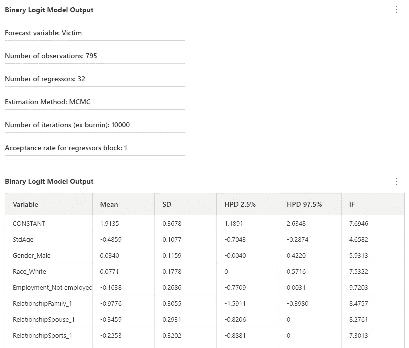

# 生活方式、日常活动和网络虐待:有联系吗？

> 原文：<https://towardsdatascience.com/lifestyles-activities-and-cyber-abuse-is-there-a-link-d757c835bb7a?source=collection_archive---------27----------------------->

## 使用 AutoStat 和贝叶斯变量选择对网络滥用的探索性分析。

Credit: Dragana Gordic / Freepik.com

# 介绍

互联网的出现带来了改进的通信、商业机会、科学和技术的进步。它也为犯罪创造了新的机会、新的犯罪方法和更多的潜在受害者。其中一种犯罪是网络虐待，这是一个总称，指的是利用技术进行的跟踪和骚扰。

虽然一些研究人员认为网络虐待只是旧的传统人际暴力形式(如跟踪和骚扰)的延伸，但很明显，技术影响着犯罪的实施、经历以及随后可以预防的方式。

对跟踪和骚扰机制的研究相当广泛，许多犯罪学理论被用来解释其原因。然而，新技术形式的滥用的因果机制尚未得到充分理解。同样不清楚的是，考虑到“地面”犯罪形式而发展起来的传统理论是否有助于解释这些新的犯罪形式。

在本文中，我们关注生活方式-日常活动理论，该理论解释了为什么一些人比其他人更容易经历犯罪(Cohen 等人，1981)。从这个角度来看，犯罪被视为在缺乏有能力的监护人的情况下，有动机的罪犯在时间和空间上与合适的目标汇合的产物(Cohen 和 Felson，1979 年)。

该理论认为，我们的生活方式和日常活动是犯罪受害风险的重要预测因素，因为它们决定了与罪犯接触的可能性。那些生活方式和日常活动更有可能导致与潜在罪犯接触的人更有可能成为受害者。

根据这一理论，犯罪受害的风险是概括的，可以通过衡量个人的以下方面来评估:a)风险暴露程度，b)与潜在罪犯的接近程度，c)目标吸引力(以经济或象征价值的形式，并被视为易受伤害)，以及最后，个人周围环境中是否存在潜在监护人(如被动旁观者或积极干预者)。

> 在本文中，我们的目的是检验危险的生活方式和日常活动与网络虐待受害之间的关系的本质。

# 数据和方法

为了提高我们对网络虐待受害机制的理解，我们使用在线调查(N = 1463)调查了[亚马逊的机械土耳其人](https://www.mturk.com/)的成年成员，然后使用在 [AutoStat](https://www.autostat.com.au) 中实现的随机搜索算法使用贝叶斯变量选择进行逻辑回归分析数据。

为了评估活动类型对成为网络虐待受害者的可能性的影响，我们测量了受访者参与潜在风险日常在线活动的程度，以及他们与各种社会联系人群体(如家人、朋友、在线游戏联系人等)的人际关系的*强度*。).在这里，我们测量了以前的研究中显示的影响一个人的风险暴露、与罪犯的接近程度、目标吸引力以及有能力的监护人的存在与否的活动，因此与个人受害风险的增加相关联 Vakhitova 等人(2019)。

*表 1 显示了我们在此分析的样本的汇总统计数据。*

# 将数据可视化

表 1 中的汇总统计数据似乎表明，我们关注的两个亚组(受害者和非受害者)在参与危险活动的程度上存在一些差异。为了帮助可视化这一趋势，我们使用箱线图和密度图比较了受害者和非受害者的在线生活方式和日常活动。图 1 展示了在线志愿服务(例如，作为在线论坛版主)和经历网络虐待受害者之间关系的密度和箱线图。这些数字表明，受害者(橙色分布)比非受害者(蓝色分布)更倾向于在线志愿服务。事实上，只有少数非受害者报告积极参与网上志愿服务。

**Figure 1:** Volunteering online and cyber abuse victimisation: Density plot on the left and boxplot on the right

然而，这种趋势并不一致，例如，对受害者和非受害者在线收入的比较表明，受害者和非受害者在线收入的可能性相似，这表明在线收入可能不是网络虐待受害的重要预测因素(见图 2)。

**Figure 2:** Earning income online and cyber abuse victimisation: density plot on the left and boxplot on the right.

要在 AutoStat 中生成分布图，选择选项卡**可视化**，选择您希望生成的图的类型，并将您希望绘制的变量移动到适当的框中(将您的分类变量移动到 ***子组*** 框中，将您的连续变量移动到 ***值*** 框中)(参见图 3)。

**Figure 3:** Generating density distribution plots in AutoStat®. Figure 6: Choice of plotting options in AutoStat®.

# 为什么在 AutoStat 中选择贝叶斯变量？

如前所述，双变量关系的汇总统计和可视化表明，受害者更有可能参与危险的在线活动，同时，不太可能与大多数人际关系积极交往(与前浪漫伙伴的关系和在线游戏连接除外)。

为了估计生活方式和日常活动相关变量以及社会人口统计控制的综合影响，我们现在将使用 AutoStat 中实施的贝叶斯变量选择逻辑回归对网络虐待受害进行建模。

在决定建模方法时，我们考虑了研究的探索性；在选择模型中包含的变量时，明显缺乏理论指导；以及先前研究中确定的社会科学研究背景下变量选择的统计方法的益处(Vakhitova 和 Alston-Knox，2018；Vakhitova 等人，2019 年)。在缺乏关于模型规范的明确理论指导的情况下，在建模过程时采用贝叶斯变量选择不仅允许考虑参数不确定性，还允许考虑模型不确定性，以及解决过拟合的问题。

我们使用 AutoStat 进行此分析，因为它提供了一个简单、用户友好的界面，以及一种进行类似分析的简单方法。在 R 编程环境中也有许多用于执行贝叶斯变量选择的统计包，例如，Raftery (1995)和 Raftery 等人(2016)或 Clyde 等人(2016)。虽然这些算法中的每一个都略有不同，但它们的意图是统一的，并且从模型中得出的推论也有类似的解释。

在这种分析中，随机搜索算法用于确定最可能的模型的解释能力。 [AutoStat](https://www.autostat.com.au) 允许使用多个不同的先验估计最可能的模型。在这项研究中，我们采用 G-先验尖峰厚片来实现变量选择。

如 G 先验尖峰厚片示意图所示，先验有两种状态(见图 4)。在系数被包括在模型中的 MCMC 迭代期间(如随机搜索算法所示)，在该后验样本抽取中使用的先验将是 G 先验，表示为“slab”。类似地，对于当随机搜索不包括系数时的迭代，在后验抽取中使用的先验是零(0)处的点质量，由“尖峰”指示，导致系数的后验抽取正好是零(0):

**Figure 4:** Spike-Slab Algorithm Schema

***我们的β参数的 g 先验(板坯)由:*** 给出

随着 g 的增加，先验变得更集中在零(0)附近，并在后验分布规范中扮演更活跃的角色。在本例中，我们将 g 设置为等于样本大小(AutoStat 中的默认值)。

*有关变量选择的随机搜索算法和 g-prior 规范的更多信息，请参见 Marin 和 Robert (2014)。*

## AutoStat 模型生成器:操作指南

> 以下是如何使用 AutoStat 的模型构建器功能，通过随机搜索算法执行贝叶斯变量选择分析的操作指南。

在 [AutoStat](https://www.autostat.com.au) 中使用贝叶斯变量选择进行逻辑回归，选择 **Model Builder** 选项卡。选择您正在分析的数据集，并将其移动到训练数据框。然后选择因变量并将其移动到预测变量框，然后移动预测解释变量框。请注意，如果您有任何缺失值，您可以选择从分析中删除它们。

下一步是在屏幕的参数设置部分指定您的建模参数。您可以指定先验 g(在我们的例子中，等于删除所有缺失数据后的样本大小)、随机种子、迭代次数和 burnin(参见图 5)。

**Figure 5:** AutoStat® Model Builder. Drag and drop datasets; select model framework; specify variable(s) of interest, and select model parameters before analysing.

指定参数后，点击分析按钮，随机搜索的神奇就在你眼前发生了(图 6)！

**Figure 6:** AutoStat® Model Builder running the logistic regression model. On the right-hand side, Bayesian variable selection was specified with a G-prior spike slab estimator, with 10,000 iterations.

作为贝叶斯变量选择分析的一部分，AutoStat 生成许多不同的输出，包括五个最佳解释模型的摘要以及所有感兴趣系数的包含概率(图 7)，所有感兴趣系数的均值、标准差和 HPD 区间的摘要(图 8)，详细的变量重要性图(图 9)和许多诊断图(例如，参见图 10 和 11)。

**Figure 7:** Top five best models explaining cyber abuse victimisation as a function of routine activities.

**Figure 8:** Means, standard deviations and HPD intervals for all coefficients included in explanatory models.

**Figure 9:** Relative Variable Importances

**Figure 10:** Posterior distribution for participating in online gaming as an explanation of cyber abuse victimisation.

**Figure 11:** The visualisation of the spike-slab algorithm for participating in online gaming as an explanation of cyber abuse victimisation.

## 结果

表 2 总结了我们的分析结果。它显示使用我们的数据的最佳模型(模型 1)具有 0.23%的后验概率，包括 10 个预测值。第二个最好的模型(模型 2)有 9 个预测值，后验概率为 0.21%。请注意，模型的后验概率并没有告诉我们模型的预测能力。相反，它给了我们一个相对于所有其他可能模型的数字。因此，在我们的特定示例研究中，拥有许多潜在回归变量意味着大量潜在解释模型，这反过来意味着模型的相对后验概率较小。

**Table 2:** Logistic regression with variable selection predicting the risk of cyber abuse victimisation. Checkmarks denote coefficients included in the model.

最佳模型(模型 1)中包含的大多数变量也包含在所有五个最佳模型中，包含概率超过 50%。两个例外是与前浪漫伴侣的社交，包括在五分之四的最佳模式中，以及与体育联系人的社交，包括在五分之三的最佳模式中，入选概率约为 40%。

表 2 表明，使用我们的数据并控制社会人口特征、生活方式和日常活动似乎是网络虐待受害者的有用预测指标，其中一些指标比其他指标更有用。最佳解释模型(模型 1)表明，造成网络虐待受害风险的最重要因素包括参与在线志愿服务和与前浪漫伴侣交往形式的风险因素，以及可能积极干预网络虐待事件的人在场/不在场形式的保护因素，在线赚取收入，以及与家人、配偶和体育/社会联系人交往。

使用表 2 中的信息，我们估计那些生活中有监护人干预的人只有 17%可能遭受侵害，而那些在其直接环境中没有监护人干预的人有 83%可能遭受侵害；与家人、配偶和体育/社会委员会联系人的社交似乎也与减少经历网络虐待的可能性有关(分别为 27%、41%和 44%)。

然而，参与在线游戏、在线志愿活动和与前恋人交往会增加网络虐待受害者的风险(分别为 61%、66%和 65%)。网上赚钱似乎可以保护个人免受网络虐待(经历网络虐待的概率只有 38%)的发现令人困惑。那些在网上赚取收入的人的行为方式似乎与那些将互联网用于娱乐和交流目的的人不同，这只是为了保护他们免受伤害。

值得注意的是，在社会人口特征中，只有年龄是受害的有用预测因素(年轻人更有可能经历受害)，而种族、就业和性别则不是。

# 讨论和结论

我们的发现表明，受害者的生活方式和日常活动可以为网络虐待受害机制提供有用的见解。话虽如此，一些生活方式和日常活动似乎比其他的影响更大。例如，我们发现，诸如在线志愿服务、在线收入、与前浪漫伴侣和体育/社交联系人进行社交等活动会增加网络虐待受害者的风险，而身边有人可以积极干预网络虐待事件，与家人和体育/社交联系人进行社交实际上会降低一个人成为网络虐待受害者的风险。

根据生活方式-日常活动理论，我们的最佳模型包括至少一个变量，该变量封装了来自所有四个风险方面的风险:暴露于风险、接近罪犯、目标吸引力和特别有能力的监护。

支持监护作为保护因素的证据特别有趣。我们的最佳模型包括四个衡量监护的变量——一个衡量在线监护(有人干预)，三个衡量线下监护(积极与家人、配偶和体育/社会委员会联系)。看来监护就像网络空间本身一样没有边界；它的影响从地球世界到网络空间，然后再回来。

似乎也有一个主要由主要联系人(如家庭、配偶等)组成的活跃的社会网络。可以作为防止犯罪受害的保护因素。需要进一步的研究来更好地理解这种保护机制。

这项研究的另一个有趣的发现是，有人可以在网络虐待事件中代表你积极干预是网络虐待受害者的最佳解释(纳入概率为 100%)，然而，有人目睹(被动)你被网络虐待并不是虐待的良好预测因素，纳入概率低于 40%。这一发现强调了监护在预防犯罪行动中的价值(Reynald，2010)。

## *传记*

***Zarina Vakhitova****博士是莫纳什大学(澳洲墨尔本)社会科学学院的讲师，专门研究犯罪学和刑事司法。她的研究兴趣集中在应用环境犯罪学原理来理解和控制发生在网络空间的犯罪。Zarina 在谷歌学术的出版物清单在这里。*

## 参考

克莱德，m .，利特曼，m .，王，q .，戈什，h. J .，，李，Y. (2016)。 [BAS:贝叶斯模型平均的贝叶斯自适应采样。r 包版本 1.4.2。从 ftp://cran.r-project.org/pub/R/web/packages/BAS/BAS.pdf 取回](https://cran.r-project.org/web/packages/BAS/)

科恩，L. E .，&费尔森，M. (1979)。[社会变化和犯罪率趋势:日常活动方法。《美国社会学评论》，第 44 期，588–608 页。](https://www.researchgate.net/publication/238322365_Social_Change_and_Crime_Rate_Trends_A_Routine_Activity_Approach)

科恩，l .，克卢格尔，j .，，兰德，K. (1981)。社会不平等和掠夺性受害:一个正式理论的阐述和检验。*《美国社会学评论》，46 期*，505–524 页。

Marin 和 c . p . Robert(2014 年)。[纽约 R . Bayesian essentials:Springer New York。](https://www.springer.com/gp/book/9781461486862)

拉夫特里(1995 年)。[社会研究中的贝叶斯模型选择。*社会学方法论，25* ，111–163。](https://www.jstor.org/stable/271063?seq=1)

a .拉夫特里，Hoeting，j .沃林斯基，c .画家 I .，& Yeung，K. Y. (2016)。 [BMA:贝叶斯模型平均。r 包版本 3.18.6。从 http://CRAN.R-project.org/package=BMA 取回](https://cran.r-project.org/web/packages/BMA/BMA.pdf)

雷诺医学博士(2010 年)。[监护人对监护:影响监护意愿、发现潜在犯罪者能力和干预意愿的因素。《犯罪和青少年犯罪研究杂志》，第 47 期，第 358-390 页。](https://journals.sagepub.com/doi/abs/10.1177/0022427810365904)

Vakhitova，Z. I .，& Alston-Knox，C. L. (2018)。[非显著 p 值？理解和更好地确定逻辑回归中效应和相互作用的重要性的策略。 *PLoS ONE，13* (11)。DOI:https://DOI . org/10.1371/journal . pone . 0205076](https://journals.plos.org/plosone/article?id=10.1371/journal.pone.0205076)

瓦希托娃、Z. I .、阿尔斯通-诺克斯、C. L .、韦伯斯特、J. L .、雷诺德、D. M .、&汤斯利、M. K. (2019)。生活方式和日常活动:它们会导致不同类型的网络虐待吗？人类行为中的计算机，101 ，225–237 页。DOI:https://DOI . org/10.1016/j . CHB . 2019.07 .