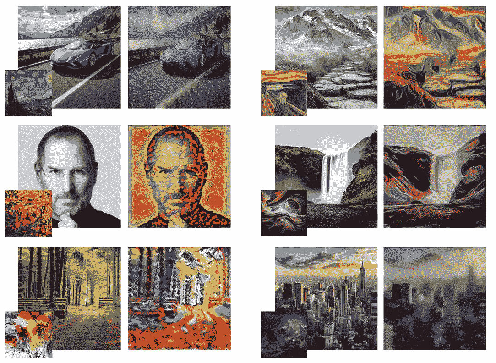
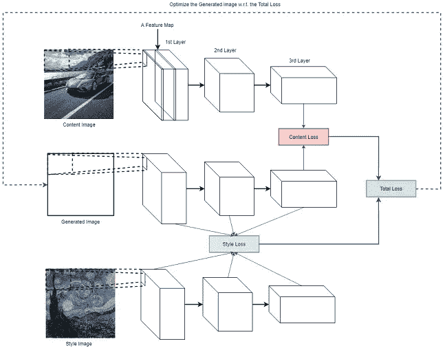
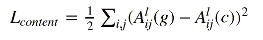
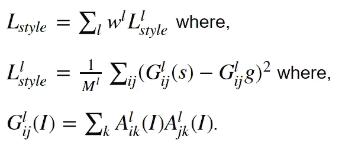
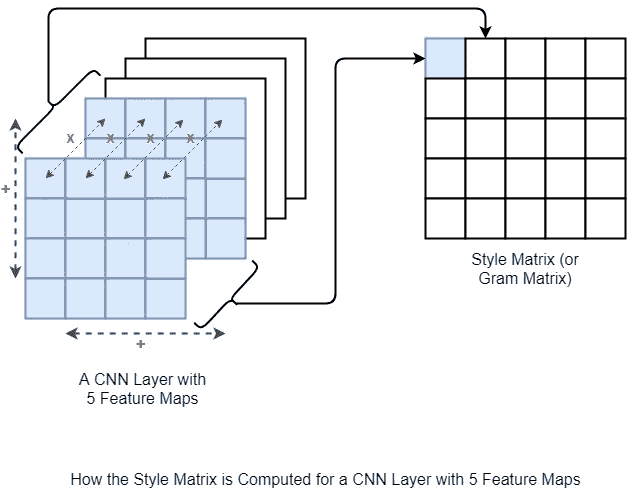
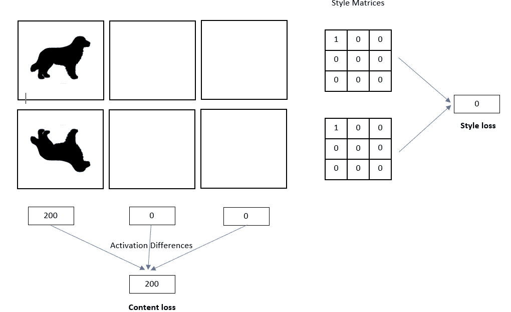
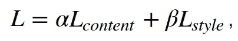

# 神经类型转移的直观指南

> 原文：<https://towardsdatascience.com/light-on-math-machine-learning-intuitive-guide-to-neural-style-transfer-ef88e46697ee?source=collection_archive---------5----------------------->

## [点亮数学机器学习](https://towardsdatascience.com/tagged/light-on-math)

## 探索神经类型转移网络的设计选择和技术的直观指南

Courtesy of Pixabay.com

# 介绍

神经类型转移(NST)是一个非常好的想法。NST 建立在一个关键的理念上，

> *在计算机视觉任务(例如图像识别任务)期间学习的 CNN 中，可以分离风格表征和内容表征。*

根据这一概念，NST 采用预训练的卷积神经网络(CNN)将风格从给定图像转移到另一个图像。这是通过定义试图最小化内容图像、风格图像和生成图像之间的差异的损失函数来实现的，这将在后面详细讨论。本教程结束时，你将能够创建非常酷的作品，如下所示。

本教程将在接下来的章节中介绍以下部分。

*   为什么神经类型转移和高层架构
*   加载 VGG 16 权重作为预训练的网络权重
*   定义神经型传递网络的输入、输出、损耗和优化器
*   定义将数据馈送到网络的输入管道
*   训练网络并保存结果
*   结论

本系列的其他文章可以在下面找到。

**A B**[**C**](http://www.thushv.com/computer_vision/light-on-math-machine-learning-intuitive-guide-to-convolution-neural-networks/)**[**D**](/light-on-math-machine-learning-intuitive-guide-to-understanding-decision-trees-adb2165ccab7)*** E F**[**G**](/light-on-math-ml-intuitive-guide-to-understanding-glove-embeddings-b13b4f19c010)*** H I J**[**K**](/light-on-math-machine-learning-intuitive-guide-to-understanding-kl-divergence-2b382ca2b2a8)**[**L***** M N O P Q R S T U V**](/light-on-math-machine-learning-intuitive-guide-to-latent-dirichlet-allocation-437c81220158)****

*****表示中等付费墙后面的文章****

# ****本文的目的****

****本文的目的是提供一个原则性的指南，而不是一个算法的预演，或者用一长串无聊的代码让读者窒息。特别是在这篇文章的结尾，我希望读者理解 NST 背后的概念，并知道为什么某些事情是这样的(例如损失函数)。作为一个额外的好处，读者可以浏览端到端的代码，并看到实际情况。****

# ****密码****

****请注意，我将只分享文章中最重要的代码片段。你可以在这里 获得 Jupyter 笔记本 [**的全部代码。该算法用 **TensorFlow** 实现。**](https://github.com/thushv89/exercises_thushv_dot_com/tree/master/neural_style_transfer_light_on_math_ml)****

# **为什么是 NST？**

**在物体识别和检测等任务中，深度神经网络已经超过了人类水平的性能。然而，直到最近，深度网络在产生具有高感知质量的艺术作品等任务上还远远落后。使用机器学习技术创造更高质量的艺术对于达到类似人类的能力是必不可少的，并开辟了一个新的可能性范围。随着计算机硬件的进步以及深度学习的普及，深度学习现在正被用于创作艺术。例如，一幅由人工智能生成的艺术作品不会在拍卖会上以高达 432，500 美元的价格出售。**

# **高层建筑**

**如前所述，神经类型转移使用预训练的卷积神经网络。然后，为了定义将两个图像无缝混合以创建视觉上吸引人的艺术的损失函数，NST 定义了以下输入:**

*   **内容图像( ***c*** ) —我们要将样式转移到的图像**
*   **样式图像( ***s*** ) —我们要从中转移样式的图像**
*   **输入(生成)图像( ***g*** ) —包含最终结果的图像(**唯一可训练变量**)**

**该模型的架构以及损耗的计算方法如下所示。您不需要深入理解下图中的内容，因为您将在接下来的几个部分中看到每个组件的细节。这样做的目的是对风格转换过程中的工作流程有一个高层次的理解。**

****

**High level architecture of NST model**

# **下载和加载预训练的 VGG-16**

**你将从这个网页中借用 VGG-16 的重量。您需要下载 [vgg16_weights.npz](https://www.cs.toronto.edu/~frossard/vgg16/vgg16_weights.npz) 文件，并**将其放在您的项目主目录**中一个名为 `**vgg**` **的文件夹中(对不起，我应该自动完成这个任务，但是我太懒了)。你将只需要卷积和池层。具体来说，您将加载第一个`7`卷积层，用作 NST 网络。你可以使用笔记本中的`load_weights(...)`功能来完成。****

****注**:欢迎你多尝试几层。但是要小心你的 CPU 和 GPU 的内存限制。**

# **定义函数以构建风格传递网络**

**在这里，您定义了几个函数，这些函数将有助于您稍后全面定义给定输入的 CNN 的计算图。**

## **创建张量流变量**

**在这里，您将加载的 numpy 数组加载到 TensorFlow 变量中。我们将创建以下变量:**

*   **内容图片(`tf.placeholder`)**
*   **风格形象(`tf.placeholder`)**
*   **生成的图像(`tf.Variable`和`trainable=True`)**
*   **预训练重量和偏差(`tf.Variable`和`trainable=False`)**

**确保生成的图像是可训练的，同时保持预训练的权重和偏差不变。下面我们展示两个函数来定义输入和神经网络权重。**

## **计算 VGG 净产出**

**在这里，你通过卷积和汇集运算来计算 VGG 净产出。请注意，您正在用`tf.nn.avg_pool`操作替换`tf.nn.max_pool`，因为`tf.nn.avg_pool`在风格转换过程中会产生更好的视觉效果[1]。通过改变以下功能中的操作，随意试验`tf.nn.max_pool`。**

# **损失函数**

**在本节中，我们定义两个损失函数； ***内容损失*** 功能和 ***风格损失*** 功能。内容损失函数确保更高层的激活在内容图像和生成的图像之间是相似的。风格损失函数确保在风格图像和生成的图像之间，所有层中激活的相关性是相似的。我们将在下面讨论细节。**

## **内容成本函数**

**内容成本函数确保内容图像中存在的内容在生成的图像中被捕获。已经发现，CNN 在较高的级别中捕获关于内容的信息，其中较低的级别更关注单个像素值[1]。因此，我们使用最顶层的 CNN 层来定义内容损失函数。**

**设***【a^l_{ij}(i】***为激活第 ***l*** 、第 ***i*** th 特征图和使用图像*获得的第 ***j*** th 位置。那么内容损失被定义为，***

******

***The content loss***

***基本上 ***L_{content}*** 捕获由生成的图像和内容图像产生的激活之间的均方根误差。但是为什么最小化更高层激活之间的差异确保了内容图像的内容被保留？***

## ***内容丢失背后的直觉***

***如果你想象一下神经网络所学到的东西，有[证据](https://arxiv.org/abs/1311.2901)表明，在不同物体的存在下，更高层的不同特征图被激活。因此，如果两幅图像具有相同的内容，它们在较高层中应该具有相似的激活。***

***我们可以将内容成本定义如下。***

## ***风格损失函数***

***定义风格损失函数需要更多的工作。为了从 VGG 网络中提取风格信息，我们使用了 CNN 的所有层。此外，风格信息被测量为*给定层中特征图*之间存在的相关量。接下来，损失被定义为由生成图像和风格图像计算的特征图之间存在的相关性的差异。数学上，风格损失定义为，***

******

****(在本教程中选择均匀)是在损失计算期间给予每一层的权重，*是取决于第 ***l*** 层的大小的超参数。如果您想查看确切的数值，请参考[本文](https://arxiv.org/abs/1508.06576)。然而，在此实施中，您没有使用 ***M^l*** ，因为在定义最终损耗时，它将被另一个参数吸收。*****

## ****风格丧失背后的直觉****

****虽然上面的方程式系统有点拗口，但这个想法相对简单。目标是为生成的图像和样式图像计算一个样式矩阵(如下图所示)。则风格损失被定义为两个风格矩阵之间的均方根差。****

****下面你可以看到一个如何计算样式矩阵的图解。样式矩阵本质上是 Gram 矩阵，其中样式矩阵的第 ***(i，j)*** 元素是通过计算第 ***i*** th 和第 ***j*** th 特征图的逐元素乘法并对宽度和高度求和来计算的。在该图中，红色叉号表示元素间的乘法，红色加号表示跨越特征图的两个宽度和高度的求和。****

********

****您可以按如下方式计算样式损失。****

## ****为什么在 Gram matrix 中可以捕捉到风格？****

****我们知道如何计算风格损失，这很好。但是您仍然没有看到“为什么使用 Gram 矩阵计算样式损失”。Gram 矩阵本质上捕捉了给定层中一组特征图的“特征分布”。通过尝试最小化两幅图像之间的风格损失，您实际上是在匹配两幅图像之间的特征分布[3，4]。****

******注**:个人认为上面的问题没有得到满意的回答。例如[4]解释了风格损失和[域适应](https://en.wikipedia.org/wiki/Domain_adaptation)之间的相似性。但是这个关系并没有回答上面的问题。****

****所以让我试着更直观地解释一下。假设您有以下特征地图。为了简单起见，我假设只有三个特征图，其中两个完全不活动。您有一个特征地图集，其中第一个特征地图看起来像一只狗，而在第二个特征地图集中，第一个特征地图看起来像一只颠倒的狗。然后，如果您尝试手动计算内容和样式损失，您将获得这些值。这意味着我们没有丢失两个特征地图集之间的样式信息。但是，内容却大相径庭。****

********

****Understanding style loss****

## ****最终损失****

****最终损失定义为:****

********

****其中 ***α*** 和 ***β*** 为用户自定义超参数。这里 ***β*** 吸收了前面定义的 ***M^l*** 归一化因子。通过控制 ***α*** 和 ***β*** 可以控制注入生成图像的内容和样式的数量。您还可以在[论文](https://arxiv.org/abs/1508.06576)中看到不同 ***α*** 和 ***β*** 值的不同效果的可视化效果。****

# ****定义优化器****

****接下来，您使用 Adam 优化器来优化网络损耗。****

# ****定义输入管道****

****在这里，您可以定义完整的输入管道。`[tf.data](https://www.tensorflow.org/guide/datasets)`提供了一个非常易于使用和直观的接口来实现输入管道。对于大多数图像操作任务，你可以使用`[tf.image](https://www.tensorflow.org/api_guides/python/image)` API，然而`tf.image`处理动态大小图像的能力非常有限。例如，如果您想要动态裁剪和调整图像大小，最好使用生成器的形式，如下所示。****

****您已经定义了两条输入管道；一个是内容，一个是风格。内容输入管道寻找以单词`content_`开头的`jpg`图像，而样式管道寻找以`style_`开头的图像。****

# ****定义计算图形****

****现在你准备好摇滚了！在本节中，您将定义完整的计算图。****

*   ****定义提供输入的迭代器****
*   ****定义输入和 CNN 变量****
*   ****定义内容、风格和总损失****
*   ****定义优化操作****

# ****跑步风格转移****

****是时候运行计算图并生成一些艺术作品了。生成的作品将被保存到`data/gen_0`、`data/gen_1`，...、`data/gen_5`等。文件夹。****

****当你运行上面的代码时，你应该得到一些整洁的图片保存到你的磁盘上，如下所示。****

********

# ****结论****

****在本教程中，您学习了神经类型转移。Neural style transfer 允许将两个图像(一个包含内容，一个包含样式)混合在一起，以创建新的艺术作品。您首先了解了为什么需要 neural style transfer，并概述了该方法的架构。然后，您用 TensorFlow 定义了神经类型传递网络的细节。具体来说，您定义了几个函数来定义变量/输入、计算 VGG 输出、计算损失和执行优化。接下来，你明白了让我们获得我们想要的东西的两个损失；详细讨论了内容损失和风格损失，并了解了它们是如何共同定义最终损失的。最后，您运行了模型并看到了模型生成的艺术品。****

****本教程的代码可在 [**这里**](https://github.com/thushv89/exercises_thushv_dot_com/tree/master/neural_style_transfer_light_on_math_ml) 获得。****

# ****想在深度网络和 TensorFlow 上做得更好？****

****检查我在这个课题上的工作。****

********

****[1] [(书)TensorFlow 2 在行动——曼宁](https://www.manning.com/books/tensorflow-in-action)****

****[2] [(视频教程)Python 中的机器翻译](https://www.datacamp.com/courses/machine-translation-in-python) — DataCamp****

****[3] [(书)TensorFlow 中的自然语言处理 1](https://www.amazon.com.au/Natural-Language-Processing-TensorFlow-Ganegedara/dp/1788478312/ref=sr_1_25?dchild=1&keywords=nlp+with+tensorflow&qid=1603009947&sr=8-25) — Packt****

# ****新的！加入我的新 YouTube 频道****

********

****如果你渴望看到我关于各种机器学习/深度学习主题的视频，请确保加入 [DeepLearningHero](https://www.youtube.com/channel/UC1HkxV8PtmWRyQ39MfzmtGA/) 。****

# ****进一步阅读****

****[【1】艺术风格的神经算法](https://arxiv.org/abs/1508.06576)****

****[【2】tensor flow 神经风格转移教程](https://medium.com/tensorflow/neural-style-transfer-creating-art-with-deep-learning-using-tf-keras-and-eager-execution-7d541ac31398)****

****[【3】Quora 关于神经风格转移的文章](https://www.quora.com/In-a-neural-style-transfer-why-does-using-Gram-matrices-keep-the-style)****

****[【4】揭秘神经风格转移](https://arxiv.org/pdf/1701.01036.pdf)****