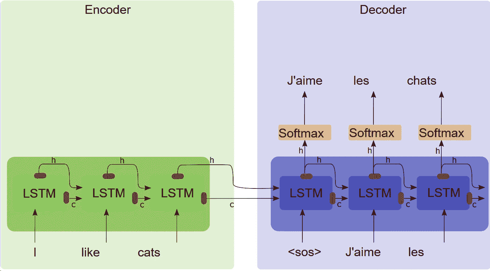
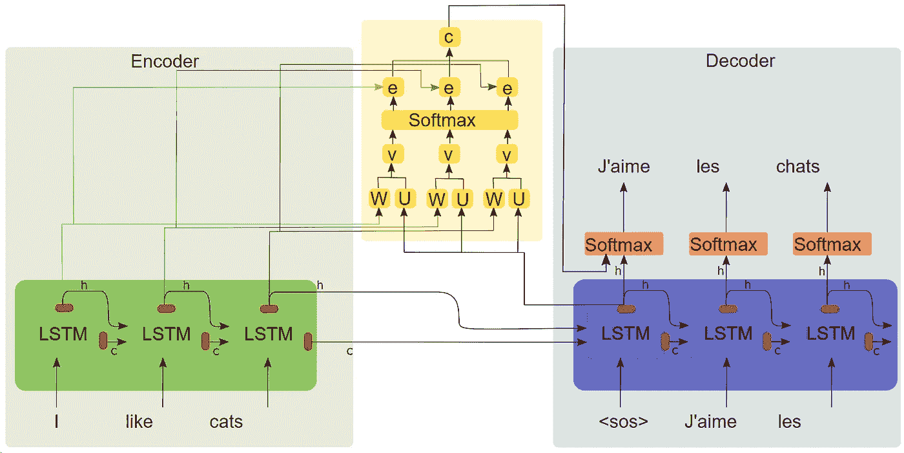
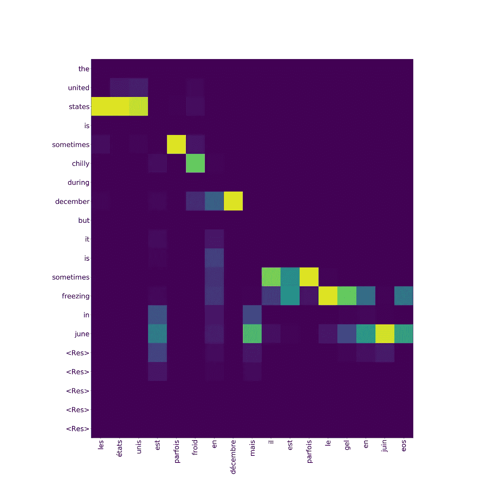
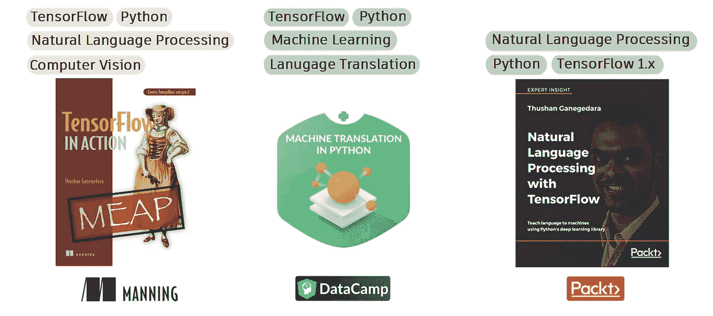

# Keras 深层网络中的注意力

> 原文：<https://towardsdatascience.com/light-on-math-ml-attention-with-keras-dc8dbc1fad39?source=collection_archive---------0----------------------->

## [点亮数学机器学习](https://towardsdatascience.com/tagged/light-on-math)

## 将所有错综复杂的注意力转移到喀拉斯的一条优雅的线上


Courtesy of Pixabay

这个故事向您介绍了一个 Github 存储库，其中包含一个使用 Keras 后端操作实现的原子最新关注层。可在 [**关注 _keras**](https://github.com/thushv89/attention_keras) **获得。**

要访问本系列中我以前的文章，请使用以下信件。

[**A**](/light-on-math-ml-attention-with-keras-dc8dbc1fad39)**B**[**C**](http://www.thushv.com/computer_vision/light-on-math-machine-learning-intuitive-guide-to-convolution-neural-networks/)**[**D**](/light-on-math-machine-learning-intuitive-guide-to-understanding-decision-trees-adb2165ccab7)*** E F G H I J**[**K**](http://www.thushv.com/machine-learning/light-on-math-machine-learning-intuitive-guide-to-understanding-kl-divergence/)**[**L*******](/light-on-math-machine-learning-intuitive-guide-to-latent-dirichlet-allocation-437c81220158)[**M**](https://medium.com/p/bee5af0c01aa)****

******[** 🔈🔥**最新文章**🔥🔈**:[M—矩阵分解](https://medium.com/p/bee5af0c01aa)******

# ******为什么是 Keras？******

******随着 TensorFlow 2.0 的推出，很难忽视引人注目的关注(没有双关语！)送给 Keras。有更多的重点是倡导 Keras 实施深度网络。TensorFlow 2.0 中的 Keras 将提供三个强大的 API 来实现深度网络。******

*   ******顺序 API——这是最简单的 API，首先调用`model = Sequential()`并不断添加层，例如`model.add(Dense(...))`。******
*   ******功能 API —高级 API，您可以在其中创建具有任意输入/输出的自定义模型。定义一个模型需要非常小心，因为在用户端有很多事情要做。可以使用`model = Model(inputs=[...], outputs=[...])`定义模型。******
*   ******子类化 API——另一个高级 API，可以将模型定义为 Python 类。在这里，您可以在类中定义模型的向前传递，Keras 会自动计算向后传递。那么这个模型可以像使用任何 Keras 模型一样正常使用。******

******更多信息，[从 TensorFlow 团队获得第一手信息](https://www.tensorflow.org/guide/keras)。然而，请记住，虽然选择高级 API 为实现复杂模型提供了更多的“回旋空间”，但它们也增加了出现错误和各种兔子洞的机会。******

# ******为什么发这个帖子？******

******最近，我正在为我正在做的一个项目寻找一个基于 Keras 的注意力层实现或库。我处理了几个已经引起关注的回复。然而，我的努力是徒劳的，试图让他们与以后的 TF 版本。由于几个原因:******

*   ******实现注意力的方式缺乏模块化(对整个解码器而不是解码器的各个展开步骤实现注意力******
*   ******使用早期 TF 版本中不推荐使用的函数******

******他们做出了巨大的努力，我尊重所有做出贡献的人。但是我想我会介入并实现一个 **AttentionLayer** ，它适用于更多的原子级别，并随着新的 TF 版本而更新。这个库在[这里](https://github.com/thushv89/attention_keras)可用。******

******注**:这是数学机器学习 A-Z 上 ***光系列的一篇文章。你可以在下面的信中找到以前的博客文章。*******

******A B**[**C**](http://www.thushv.com/computer_vision/light-on-math-machine-learning-intuitive-guide-to-convolution-neural-networks/)**[**D**](/light-on-math-machine-learning-intuitive-guide-to-understanding-decision-trees-adb2165ccab7)*** E F G H I J**[**K**](http://www.thushv.com/machine-learning/light-on-math-machine-learning-intuitive-guide-to-understanding-kl-divergence/)**[**L**](/light-on-math-machine-learning-intuitive-guide-to-latent-dirichlet-allocation-437c81220158)*** M**[**N**](/light-on-math-machine-learning-intuitive-guide-to-neural-style-transfer-ef88e46697ee)**O P Q R S T U V**********

# ****介绍****

****在这篇文章中，首先你会探究什么是序列对序列模型，然后是为什么注意力对序列模型很重要？接下来，你将学习注意力机制的本质。这篇博文将以解释如何使用注意力层来结束。****

# ****序列到序列模型****

****Sequence to sequence 是一个强大的深度学习模型家族，旨在解决 ML 领域中最疯狂的问题。举个例子，****

*   ****机器翻译****
*   ****聊天机器人****
*   ****文本摘要****

****有着非常独特和独特的挑战。比如机器翻译要处理不同的[语序拓扑](https://en.wikipedia.org/wiki/Word_order)(即主语-动词-宾语顺序)。因此它们是解决复杂 NLP 问题的必备武器。****

****让我们看看如何将序列对序列模型用于英法机器翻译任务。****

****序列对序列模型有两个组件，一个**编码器**和一个**解码器**。编码器将源句子编码成一个简洁的向量(称为**上下文向量**)，解码器将上下文向量作为输入，并使用编码的表示来计算翻译。****

********

****Sequence to sequence model****

# ****这种方法有问题吗？****

****这种方法有一个巨大的瓶颈。上下文向量负责将给定源句子中的所有信息编码成一个包含几百个元素的向量。现在给出一点背景，这个向量需要保持:****

*   ****关于主语、宾语和动词的信息****
*   ****这些实体之间的相互作用****

****这可能是相当令人生畏的，尤其是对于长句。因此，需要一种更好的解决方案来突破极限。****

# ****输入关注！****

****如果解码器能够访问编码器的所有过去状态，而不是仅仅依赖于上下文向量，会怎么样？这正是注意力在做的事情。在每个解码步骤中，解码器都会查看编码器的任何特定状态。这里我们将讨论 [Bahdanau 注意力](https://arxiv.org/pdf/1409.0473.pdf)。下图描绘了注意力的内部运作。****

********

****Sequence to sequence with attention****

****因此，如图所示，上下文向量已经成为所有过去编码器状态的**加权和。******

# ****介绍 attention_keras****

****由于我前面解释的原因，让一些注意力层在那里工作可能会很麻烦。****

# ****使用注意力层****

****您可以将它用作任何其他层。举个例子，****

```
**attn_layer = AttentionLayer(name='attention_layer')([encoder_out, decoder_out])**
```

****我还提供了一个玩具神经机器翻译器(NMT)的例子，展示了如何在 NMT ( [nmt/train.py](https://github.com/thushv89/attention_keras/blob/master/examples/nmt/train.py) )中使用注意力层。但是让我带你了解一些细节。****

# ****用心实施 NMT****

****在这里，我将简要介绍一下实现 NMT 的步骤。****

****首先定义编码器和解码器输入(源/目标字)。两者都是形状(batch_size，timesteps，vocabulary_size)。****

```
**encoder_inputs = Input(batch_shape=(batch_size, en_timesteps, en_vsize), name='encoder_inputs')
decoder_inputs = Input(batch_shape=(batch_size, fr_timesteps - 1, fr_vsize), name='decoder_inputs')**
```

****定义编码器(注意`return_sequences=True`)****

```
**encoder_gru = GRU(hidden_size, return_sequences=True, return_state=True, name='encoder_gru')
encoder_out, encoder_state = encoder_gru(encoder_inputs)**
```

****定义解码器(注意`return_sequences=True`****

```
**decoder_gru = GRU(hidden_size, return_sequences=True, return_state=True, name='decoder_gru')
decoder_out, decoder_state = decoder_gru(decoder_inputs, initial_state=encoder_state)**
```

****定义关注层。注意层的输入是`encoder_out`(编码器输出序列)和`decoder_out`(解码器输出序列)****

```
**attn_layer = AttentionLayer(name='attention_layer')
attn_out, attn_states = attn_layer([encoder_out, decoder_out])**
```

****连接`attn_out`和`decoder_out`作为 softmax 层的输入。****

```
**decoder_concat_input = Concatenate(axis=-1, name='concat_layer')([decoder_out, attn_out])**
```

****定义`TimeDistributed` Softmax 层并提供`decoder_concat_input`作为输入。****

```
**dense = Dense(fr_vsize, activation='softmax', name='softmax_layer')
dense_time = TimeDistributed(dense, name='time_distributed_layer')
decoder_pred = dense_time(decoder_concat_input)**
```

****定义完整模型。****

```
**full_model = Model(inputs=[encoder_inputs, decoder_inputs], outputs=decoder_pred)
full_model.compile(optimizer='adam', loss='categorical_crossentropy')**
```

****就是这样！****

# ****甚至支持注意力可视化…****

****这不仅实现了注意力，也给了你一个很容易窥视注意力机制的方法。这是可能的，因为这一层返回两者，****

*   ****注意上下文向量(用作解码器的 Softmax 层的额外输入)****
*   ****注意能量值(注意机制的 Softmax 输出)****

****对于每个解码步骤。因此，通过可视化注意力能量值，你可以完全了解注意力在训练/推理过程中在做什么。下面，我来说说这个过程的一些细节。****

# ****从 NMT 推断并获得关注权重****

****从 NMT 推断是繁琐的！因为你必须这么做，****

*   ****获取编码器输出****
*   ****定义一个执行解码器的单个步骤的解码器(因为我们需要提供该步骤的预测作为下一步的输入)****
*   ****使用编码器输出作为解码器的初始状态****
*   ****执行解码，直到我们得到一个无效字/ <eos>作为输出/或固定步数</eos>****

****我不打算讨论模型定义。详情请参考`examples/nmt/train.py`。让我们来看看如何利用这一点来获得关注权重。****

```
**for i in range(20):

    dec_out, attention, dec_state = decoder_model.predict([enc_outs, dec_state, test_fr_onehot_seq])
    dec_ind = np.argmax(dec_out, axis=-1)[0, 0]

    ...

    attention_weights.append((dec_ind, attention))** 
```

****如你所见，我们正在为每个解码步骤收集注意力权重。****

****然后，您只需将这个注意力权重列表传递给`plot_attention_weights` ( [nmt/train.py](https://github.com/thushv89/attention_keras/blob/master/examples/nmt/train.py) )，以便获得带有其他参数的注意力热图。绘图后的输出可能如下所示。****

********

# ****2022 年 6 月更新****

****最近有一个关于 AttentionLayer [在 TensorFlow 2.4+版本](https://github.com/thushv89/attention_keras/issues/59)上不工作的 bug 报告。这导致了如下的神秘错误，****

```
**TypeError: Exception encountered when calling layer "tf.keras.backend.rnn" (type TFOpLambda).

You are passing KerasTensor(type_spec=TensorSpec(shape=(None, 101), dtype=tf.float32, name=None), name='tf.compat.v1.nn.softmax_1/Softmax:0', description="created by layer 'tf.compat.v1.nn.softmax_1'"), an intermediate Keras symbolic input/output, to a TF API that does not allow registering custom dispatchers, such as `tf.cond`, `tf.function`, gradient tapes, or `tf.map_fn`. Keras Functional model construction only supports TF API calls that *do* support dispatching, such as `tf.math.add` or `tf.reshape`. Other APIs cannot be called directly on symbolic Kerasinputs/outputs. You can work around this limitation by putting the operation in a custom Keras layer `call` and calling that layer on this symbolic input/output.

Call arguments received:
  • step_function=<function AttentionLayer.call.<locals>.energy_step at 0x7f1d5ff279e0>
  • inputs=tf.Tensor(shape=(None, None, 256), dtype=float32)
  • initial_states=['tf.Tensor(shape=(None, 101), dtype=float32)']
  • go_backwards=False
  • mask=None
  • constants=None
  • unroll=False
  • input_length=None
  • time_major=False
  • zero_output_for_mask=False**
```

****该错误是由于基于图形的`KerasTensor`对象和渴望的`tf.Tensor`对象之间的混淆造成的。即将合并的 https://github.com/thushv89/attention_keras/tree/tf2-fix 分公司正在进行调整。****

# ****结论****

****在本文中，我向您介绍了 AttentionLayer 的一个实现。注意力对于序列模型甚至其他类型的模型都是非常重要的。然而，当前的实现要么不是最新的，要么不是非常模块化。所以我稍微挖了一下，用 Keras 后端操作实现了一个注意力层。所以我希望你能在这一层做得很好。如果您有任何问题/发现任何 bug，请随时在 Github 上提交问题。****

# ****欢迎贡献者****

****我将非常感谢有贡献者，修复任何错误/实施新的注意机制。所以欢迎投稿！****

****如果你喜欢我分享的关于数据科学和机器学习的故事，考虑成为会员吧！****

****[](https://thushv89.medium.com/membership) [## 通过我的推荐链接加入媒体

### 作为一个媒体会员，你的会员费的一部分会给你阅读的作家，你可以完全接触到每一个故事…

thushv89.medium.com](https://thushv89.medium.com/membership)**** 

# ****想在深度网络和 TensorFlow 上做得更好？****

****检查我在这个课题上的工作。****

********

****[1] [(书)TensorFlow 2 在行动——曼宁](https://www.manning.com/books/tensorflow-in-action)****

****[2] [(视频课程)Python 中的机器翻译](https://www.datacamp.com/courses/machine-translation-in-python) — DataCamp****

****[3] [(书)TensorFlow 中的自然语言处理 1](https://www.amazon.com.au/Natural-Language-Processing-TensorFlow-Ganegedara/dp/1788478312/ref=sr_1_25?dchild=1&keywords=nlp+with+tensorflow&qid=1603009947&sr=8-25) — Packt****

# ****新的！加入我的新 YouTube 频道****

****[](https://www.youtube.com/channel/UC1HkxV8PtmWRyQ39MfzmtGA/)****

****如果你渴望看到我关于各种机器学习/深度学习主题的视频，请确保加入 [DeepLearningHero](https://www.youtube.com/channel/UC1HkxV8PtmWRyQ39MfzmtGA/) 。****