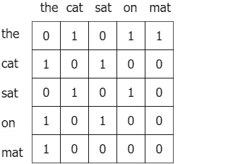
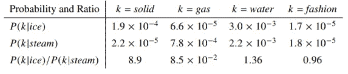
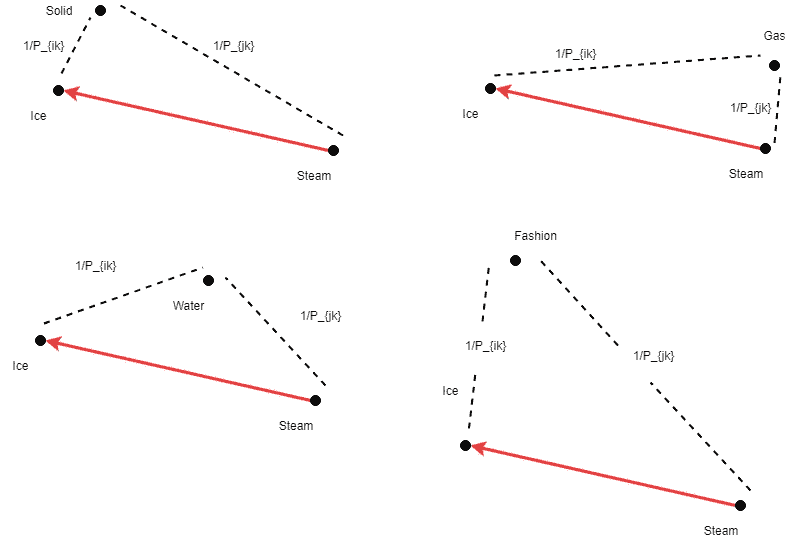

# 理解手套嵌入的直观指南

> 原文：<https://towardsdatascience.com/light-on-math-ml-intuitive-guide-to-understanding-glove-embeddings-b13b4f19c010?source=collection_archive---------1----------------------->

## [点亮数学机器学习](https://towardsdatascience.com/tagged/light-on-math)

## 理解 GloVe 和 Keras 实现背后的理论！

Photo by [Jelleke Vanooteghem](https://unsplash.com/photos/2OCh8tuNsBo?utm_source=unsplash&utm_medium=referral&utm_content=creditCopyText) on [Unsplash](https://unsplash.com/search/photos/words?utm_source=unsplash&utm_medium=referral&utm_content=creditCopyText)

## *；(太久没发工资了？不用担心，您仍然可以通过以下链接访问代码)*

*带 Keras 的手套实现:[【此处为](https://github.com/thushv89/exercises_thushv_dot_com/blob/master/glove_light_on_math_ml/glove_light_on_math_ml.ipynb)】*

*在本文中，您将了解 GloVe，这是一种非常强大的单词向量学习技术。本文将重点解释为什么 GloVe 更好，以及 GloVe 的成本函数背后的动机，这是算法中最关键的部分。。该代码将在后面的文章中详细讨论。*

*要访问本系列中我以前的文章，请使用以下信件。*

*[**A**](/light-on-math-ml-attention-with-keras-dc8dbc1fad39)**B**[**C**](http://www.thushv.com/computer_vision/light-on-math-machine-learning-intuitive-guide-to-convolution-neural-networks/)**[**D**](/light-on-math-machine-learning-intuitive-guide-to-understanding-decision-trees-adb2165ccab7)*** E F G H I J**[**K**](http://www.thushv.com/machine-learning/light-on-math-machine-learning-intuitive-guide-to-understanding-kl-divergence/)**[**L*******](/light-on-math-machine-learning-intuitive-guide-to-latent-dirichlet-allocation-437c81220158)[**M**](https://medium.com/p/bee5af0c01aa)*****

*******[** 🔈🔥**最新文章**🔥🔈**:[M—矩阵分解](https://medium.com/p/bee5af0c01aa)*******

*******GloVe 是一种词向量技术，它在短暂的沉寂之后驾驭了词向量的浪潮。只是为了刷新，单词向量将单词放入一个很好的向量空间，相似的单词聚集在一起，不同的单词相互排斥。GloVe 的优势在于，与 Word2vec 不同，GloVe 不仅仅依赖于局部统计(单词的局部上下文信息)，而是融入了全局统计(单词共现)来获取单词向量。但是请记住，手套和 Word2vec 之间有相当多的协同作用。*******

*******听到使用全局统计数据来推导单词之间的语义关系的想法可以追溯到很久以前，不要感到惊讶。第一回，[潜在语义分析](https://en.wikipedia.org/wiki/Latent_semantic_analysis) (LSA)。这只是一个有趣的事实。我们继续吧。*******

# *******Word2vec 复习*******

*******Word2vec 背后的根本思想是什么？*******

> *******从一个人交的朋友你就可以知道他说了什么——j·r·弗斯*******

*******单词向量就是建立在这个想法上的。基本上，你得到一个大型语料库，并制作一个元组数据集，其中每个元组包含(某个单词 x，x 的上下文中的一个单词)。然后你会使用你的老朋友，一个神经网络，学习预测 x 的上下文单词，给定单词 x。如果你想了解更多关于 Word2vec 的信息，请参考我的文章[这里](/light-on-math-machine-learning-intuitive-guide-to-understanding-word2vec-e0128a460f0f)。*******

# *******那么是什么在拉回呢？*******

*******鉴于 Word2vec 的显眼性能，为什么不坚持使用呢？原因不在于性能，而在于解决方案制定的根本。记住，Word2vec 只依赖于语言的 ***本地信息*** 。也就是说，对于一个给定的单词所学习的语义，只受周围单词的影响。*******

*****例如，以这个句子为例，*****

> *****那只猫坐在垫子上*****

*****如果你使用 Word2vec，它不会捕捉这样的信息，*****

> *****“the”是“cat”和“mat”这两个词的特殊语境吗？*****

*****或者*****

> *****“the”只是一个停用词吗？*****

*****这可能是次优的，尤其是在理论家的眼中。*****

# *******回车，手套**。*****

*****GloVe 代表“全局向量”。如前所述，GloVe 捕获语料库的全局统计数据和局部统计数据，以便得出单词向量。但是，我们需要全球和地方统计数据吗？*****

# *****两个比一个好吗？*****

*****事实证明，每种类型的统计都有自己的优势。例如，捕获局部统计数据的 Word2vec 在类比任务中表现非常好。然而，像 LSA 这样只使用全局统计的方法在类比任务中做得不好。然而，由于 Word2vec 方法由于仅使用局部统计而受到某些限制(如我们上面讨论的)。*****

# *****手套介绍*****

*****手套方法建立在一个重要的理念上，*****

> *****你可以从共现矩阵中推导出单词之间的语义关系。*****

*****给定一个含有 ***V*** 词语的语料库，共现矩阵 ***X*** 将是一个 ***V x V*** 矩阵，其中第*行和第 ***j*** 列为 ***X*** ， ***X_ij*** 一个示例共现矩阵可能如下所示。******

************

******The co-occurrence matrix for the sentence “the cat sat on the mat” with a window size of 1\. As you probably noticed it is a symmetric matrix.******

******我们如何从中获得一个度量词之间语义相似性的指标呢？为此，你需要一次说三个词。让我具体记下这句话。******

************

******The behavior of P_ik/P_jk for various words (Source [1])******

******考虑实体******

********P _ ik/P _ JK其中**P _ ik = X _ ik/X _ I**********

****这里的 ***P_ik*** 表示同时看到单词 ***i*** 和 ***k*** 的概率，通过除以同时出现 ***i*** 和***k***(***X _ ik***)的次数来计算****

****你可以看到，给出两个词，即*和*，如果第三个词*(也叫“探针词”)，*******

*   ******与冰很相似但与蒸汽无关(如***k***=固体) ***P_ik/P_jk*** 会很高(> 1)，******
*   *****与蒸汽很相似但与冰无关(如***k***=气体)***P _ ik/P _ JK***会很小(< 1)，*****
*   *****与任一单词相关或不相关，那么***P _ ik/P _ JK***将接近 1*****

*****因此，如果我们能够找到一种方法将***P _ ik/P _ JK***结合到计算单词向量中，我们将实现在学习单词向量时使用全局统计的目标。*****

# *****从度量到词向量*****

*****如果你喜欢到目前为止，系好安全带。就要变得粗暴了！我们如何能得到一个字向量算法并不是很明显，*****

*   *****我们没有方程，例如 ***F(i，j，k) = P_ik/P_jk*** ，只是一个表达式。*****
*   *****词向量是高维向量，然而 ***P_ik/P_jk*** 是标量。所以存在维度不匹配。*****
*   *****涉及三个实体( ***i，j*** ，和 ***k*** )。但是用三个元素计算损失函数可能会很麻烦，需要减少到两个。*****

*****回答这三个问题是 GloVe 的主要贡献。现在让我们一步一步地浏览 GloVe，看看回答这三个问题如何给我们一个词向量算法。*****

*****我使用下面的符号，由于在介质上渲染乳胶的困难，它与论文略有不同。*****

*   ********w*** ， ***u*** —两个独立的嵌入层*****
*   ********w ****—w 的转置*****
*   ********X*** —共生矩阵*****
*   ********bw*** 和 ***bu*** —分别为 w 和 u 的偏差*****

# *****让我们假设一个等式*****

*****回答第一个问题很容易。假设一下。假设有一个函数 F，它接受字向量 ***i*** ， ***j*** 和 ***k*** ，输出我们感兴趣的比率。*****

*******F(w _ I，w_j，u _ k)= P _ ik/P _ JK*******

*****现在你应该有点好奇了，因为我们看到两个嵌入层在播放( **w** 和**u**)。为什么是两个？该论文称，通常这两层的性能相当，只是随机初始化不同。然而，有两层有助于模型减少*过度拟合*。*****

*****现在回到函数。词向量是线性系统。例如，您可以在嵌入空间中执行算术运算，例如*****

********w _ {国王}—w _ {男性}+w _ {女性} = w _ {女王}********

*****因此，让我们将上面的等式改为下面的等式，*****

********F(w_i — w_j，u_k) = P_ik/P_jk********

*****为什么 ***w_i — w_j*** 适合这里？其实你可以在嵌入空间中推导出你观察到的关于 ***P_ik/P_jk*** 的美好性质。我来详细说明一下。*****

**********

*****Behaviour of vector distances to a probe word w.r.t. w_i — w_j*****

*****所以你可以看到当考虑不同的单词时，距离(虚线)是如何变化的。以及两个给定词 ***i*** 和 ***k*** 之间的距离，与 ***P_{ik}*** 的倒数相关。为什么会这样呢？因为我们总是计算距离 w.r.t 字向量 ***w_i — w_j*** (即红线)。所以从 ***w_i — w_j.*** 开始也未尝不可*****

# *****向量到标量…*****

*****一个问题解决了，我们继续下一个问题。我们如何使 LHS 成为标量？对此有一个非常直接的答案。也就是用下面的方法在两个实体之间引入一个转置和一个点积。*****

********F((w_i — w_j)*。u_k) = P_ik/P_jk*** 或者，*****

*****如果假设一个字向量为一个 ***Dx1*** 矩阵， ***(w_i — w_j)*** *将被 ***1xD*** 整形，从而在与 ***u_k*** 相乘时给出一个标量。*****

# *****F 能是什么？*****

*****接下来，如果我们假设 F 有某个性质(即 [*加法群和乘法群之间的同态*](https://en.wikipedia.org/wiki/Homomorphism) )给出*****

********F(w _ I * u _ k—w _ j * u _ k)= F(w _ I * u _ k)/F(w _ j * u _ k)= P _ ik/P _ JK********

*****换句话说，这种特殊的同态确保了减法***【A-B】***也可以表示为除法 ***F(A)/F(B)*** 并得到相同的结果。因此，*****

*******F(w _ I * u _ k)/F(w _ j * u _ k)= P _ ik/P _ JK*******

*****和*****

*******F(w _ I * u _ k)= P _ ik*******

# *****我对你耍了点小花招…*****

*****好吧，我是偷偷摸摸的。仅仅因为 F(A)/F(B) = G(A)/G(B)你不能说 F(A) = G(A)。因为 F(A)/F(B)=2F(A)/2F(B)，不代表 F(A)=2F(A)。从最初的论文来看，并不清楚(至少对我来说)为什么这样假设。但是让我给你一些直觉，为什么这是一个安全的假设。如果我们要正确定义上述关系，它应该是，*****

********F(w _ I * u _ k)= c P _ ik***对于某些常数 ***c********

*****但有了这个，你也得到了 ***F(w_j* u_k) = c P_jk*** 对于任意的 ***j*** 。所以如果 ***i*** 与 ***k*** 之间的相似度按 ***c*** 增长，那么 ***j*** 与 ***k*** (对于任意一个***j**c***之间的相似度也将按 ***增长。这意味着(在某种程度上)所有的单词向量将按系数 ***c*** 放大/缩小，这不会有任何损害，因为相对的拓扑被保留了。********

****继续，如果我们假设 ***F=exp，*** 满足上述同态性质。那么让我们开始吧，****

******Exp(w _ I * u _ k)= P _ ik = X _ ik/X _ I******

****和****

*******w _ I * u _ k = log(X _ ik)—log(X _ I)*******

****接下来， ***X_i*** 独立于 ***k*** ，我们把 ***log(X_i)*** 移到 LHS，****

*******w _ I * u _ k+log(X _ I)= log(X _ ik)*******

****注意，如果没有项 ***log(X_i)*** ，即 **i** 和 **k** 可以互换，则上述等式将具有对称性。我们可以添加一个 bias ***b_i*** 来吸收 ***log(X_i)*** 并添加另一个 ***b_k*** 来恢复对称性。所以，我们会有点创意，用神经网络的说法来表达 ***log(X_i)*** ，****

****w_i* u_k + b_i +b_k= log(X_ik)****

****或者，****

****w_i* u_k + b_i +b_k — log(X_ik) = 0****

****其中***b _ I******b _ k***是网络的偏差。****

# ****定义成本****

****在一个理想的设置中，你有完美的词向量，上面的表达式将是零。换句话说，这就是我们的目标。所以我们将把 LHS 表达式作为我们的成本函数。****

******J(w_i，w _ J)=(w _ I * u _ J+b _ I+b _ J—log(X _ ij))******

****注意，平方使其成为均方成本函数。对最初的发现没有损害。k 也被 j 代替了。****

# ****最终成本函数****

****但是你的工作并没有到此为止，你还需要解决一个重要的理论问题。思考一下如果 ***X_ik*** = 0 会发生什么。如果你对上面的成本函数做一个小实验，你会看到一个 ML 从业者最讨厌的 3 个字母，即***【NaN】***。因为 log(0)未定义。简单的解决方法是使用被称为拉普拉斯平滑的 ***log(1+X_ik)*** 。但是手套纸背后的杰出人物提出了一种更时髦的方法。即引入一个加权函数。****

******j = f(x_ij)(w_i^t u _ j+b _ I+b _ j—log(x _ ij))******

****其中***f(x _ ij)=(x/x_{max})^a***if***x<x _ { max }***else***0*******

# ****结论****

****一切都结束了。GloVe 是一种利用语料库的全局和局部统计的词向量技术，以便提出使用这两者的原则性损失函数。GloVe 通过解决三个重要问题来做到这一点。****

*   ****我们没有方程，例如 ***F(i，j，k) = P_ik/P_jk*** ，只是一个表达式(即 ***P_ik/P_jk*** )。****
*   ****单词向量是高维向量，然而 ***P_ik/P_jk*** 是标量。所以存在维度不匹配。****
*   ****涉及三个实体( ***i，j*** ，和 ***k*** )。但是用三个元素计算损失函数可能会很麻烦，需要减少到两个。****

****提供了用 Keras 实现手套的代码[【此处为](https://github.com/thushv89/exercises_thushv_dot_com/blob/master/glove_light_on_math_ml/glove_light_on_math_ml.ipynb)】****

****如果你喜欢我分享的关于数据科学和机器学习的故事，考虑成为会员吧！****

**** [## 通过我的推荐链接加入媒体

### 作为一个媒体会员，你的会员费的一部分会给你阅读的作家，你可以完全接触到每一个故事…

thushv89.medium.com](https://thushv89.medium.com/membership)**** 

# ****想在深度网络和 TensorFlow 上做得更好？****

****检查我在这个课题上的工作。****

********

****[1] [(书)TensorFlow 2 在行动——曼宁](https://www.manning.com/books/tensorflow-in-action)****

****[2] [(视频教程)Python 中的机器翻译](https://www.datacamp.com/courses/machine-translation-in-python) — DataCamp****

****[3] [(书)TensorFlow 中的自然语言处理 1](https://www.amazon.com.au/Natural-Language-Processing-TensorFlow-Ganegedara/dp/1788478312/ref=sr_1_25?dchild=1&keywords=nlp+with+tensorflow&qid=1603009947&sr=8-25) — Packt****

# ****新的！加入我的新 YouTube 频道****

********

****如果你渴望看到我关于各种机器学习/深度学习主题的视频，请确保加入 [DeepLearningHero](https://www.youtube.com/channel/UC1HkxV8PtmWRyQ39MfzmtGA/) 。****

# ****参考:****

****[1] GloVe:单词表示的全局向量([原文](https://nlp.stanford.edu/pubs/glove.pdf)****