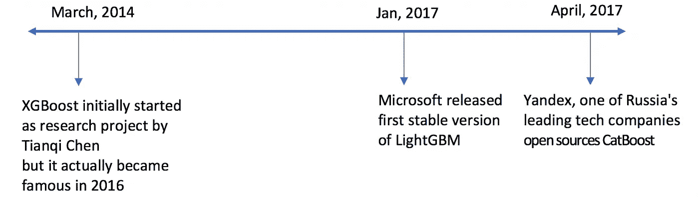
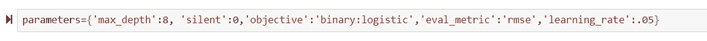
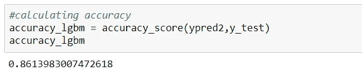

# XGBOOST vs LightGBM:哪种算法赢得了比赛！！！

> 原文：<https://towardsdatascience.com/lightgbm-vs-xgboost-which-algorithm-win-the-race-1ff7dd4917d?source=collection_archive---------3----------------------->

这篇文章是关于在人口普查收入数据集上对 LightGBM 和 XGBoost 进行基准测试。我注意到 XGBoost 的执行时间比 LightGBM 慢。下面我们来深挖更多细节，了解一下各种参数对比时哪个更胜一筹。

Photo by [Tim Gouw](https://unsplash.com/@punttim?utm_source=medium&utm_medium=referral) on [Unsplash](https://unsplash.com?utm_source=medium&utm_medium=referral)

增压机的发展从 AdaBoost 开始，到今天被大肆炒作的 XGBOOST。XGBOOST 已经成为在 Kaggle 赢得比赛的事实上的算法，仅仅是因为它非常强大。但是考虑到大量的数据，即使 XGBOOST 也需要很长时间来训练。

来了…轻 GBM 入图。

Timeline

你们中的许多人可能对灯光渐变很熟悉，但是读完这篇文章后你会有一个坚实的理解。你会想到的最自然的问题是——为什么是另一个助推机器算法？比 XGBOOST 快吗？

嗯，你猜对了！！！在本文中，我们将通过一个例子来比较 Light GBM 和 XGBoost 及其性能。

# 本故事中要讨论的副主题:

1.  什么是轻 GBM？
2.  轻型 GBM 的优势
3.  结构差异
4.  了解参数
5.  数据集上的实现
6.  每种算法的性能
7.  参数调整
8.  结束注释

# 什么是轻 GBM？

Light GBM 是一个基于决策树算法的快速、分布式、高性能梯度提升框架，用于排序、分类和许多其他机器学习任务。

由于它是基于决策树算法的，所以它以最佳拟合的方式分裂树的叶子，而其他 boosting 算法以深度或级别方式分裂树，而不是以叶子方式。因此，当在轻量级 GBM 中生长在同一片叶子上时，逐叶算法可以比逐级算法减少更多的损失，从而导致更好的准确性，这是任何现有的 boosting 算法都很少能达到的。

之前是轻型 GBM 制造商的示意图，以清楚地解释差异。

# 轻型 GBM 的优势

1.  **更快的训练速度和更高的效率** : Light GBM 使用基于直方图的算法，即将连续的特征值放入离散的箱中，加快了训练过程。
2.  **更低的内存使用率:**将连续值替换为离散值，从而降低内存使用率。
3.  **比任何其他 boosting 算法更高的准确性:**它通过遵循逐叶分裂方法而不是逐层方法来生成更复杂的树，逐层方法是实现更高准确性的主要因素。但是，有时会导致过度拟合，这可以通过设置 max_depth 参数来避免。
4.  **与大型数据集的兼容性:**与 XGBOOST 相比，它能够以显著减少的训练时间在大型数据集上表现得同样好。

# LightGBM 和 XGBoost 的结构差异

LightGBM 使用一种新颖的基于梯度的单侧采样(GOSS)技术来过滤数据实例，以找到拆分值，而 XGBoost 使用预先排序的算法&基于直方图的算法来计算最佳拆分。这里的实例是观察/样本。

简而言之，基于直方图的算法将一个特征的所有数据点分割成离散的仓，并使用这些仓来找到直方图的分割值。虽然它在训练速度上比列举预排序特征值上所有可能的分裂点的预排序算法更有效，但是在速度上它仍然落后于 GOSS。

那么是什么让这种高斯方法变得高效呢？
GOSS(Gradient Based One Side Sampling)是一种基于梯度对实例进行下采样的新型采样方法。正如我们所知，梯度小的实例训练良好(训练误差小)，梯度大的实例训练不足。一种简单的下采样方法是通过只关注具有大梯度的实例来丢弃具有小梯度的实例，但是这将改变数据分布。简而言之，GOSS 保留具有大梯度的实例，同时对具有小梯度的实例执行随机采样。

# 轻型 GBM 的重要参数:

> `*num_leaves*`:要使用的叶节点数。拥有大量的叶片会提高精度，但也会导致过度拟合。
> 
> `*min_child_samples*`:分组到一个叶中的样本(数据)的最小数量。该参数可以大大有助于过度拟合:每片叶子较大的样本大小将减少过度拟合(但可能导致欠拟合)。
> 
> `*max_depth*`:明确控制树的深度。较浅的树减少过度拟合。

## 不平衡数据的调优

说明不平衡或偏斜数据的最简单方法是增加正面类别示例的权重:

> `*scale_pos_weight*`:可以根据正反例的数量计算权重:`*sample_pos_weight = number of negative samples / number of positive samples*`。

## 过拟合调谐

除了上述参数之外，以下参数可用于控制过度拟合:

> `*max_bin*`:存放特征值的最大箱数。较小的`*max_bin*`减少了过度配合。
> 
> `*min_child_weight*`:一片叶子的最小和麻。结合`*min_child_samples,*`，较大的值可减少过度拟合。
> 
> `*bagging_fraction*`和`*bagging_freq*`:对训练数据进行打包(子采样)。这两个值都需要设置，以便装袋使用。频率控制使用(迭代)装袋的频率。较小的分数和频率减少了过度拟合。
> 
> `*feature_fraction*`:控制用于训练的特征的二次抽样(与装袋情况下对实际训练数据的二次抽样相反)。较小的分数减少了过度拟合。
> 
> `*lambda_l1*`和`*lambda_l2*`:控制 L1 和 L2 的正规化。

## 精确调谐

通过调整以下参数可以提高精度:

> `*max_bin*`:较大的`*max_bin*`增加精度。
> 
> `*learning_rate*`:使用较小的学习率，增加迭代次数，可能会提高精度。
> 
> `*num_leaves*`:增加叶片数可以提高精度，但过度拟合的风险很高。

# XGBoost 的重要参数:

XGBoost 作者将总体参数分为 3 类:

1.  **通用参数:**引导整体运行
2.  **助推器参数:**在每一步引导单个助推器(树/回归)
3.  **学习任务参数:**指导优化执行

## 一般参数

这些定义了 XGBoost 的整体功能。

> **1。booster [default=gbtree]**
> 
> 选择每次迭代运行的模型类型。它有两个选项:
> 
> gbtree:基于树的模型
> 
> gblinear:线性模型
> 
> **2。无声[默认值=0]:**
> 
> 静音模式激活设置为 1，即不打印任何运行消息。
> 
> 通常最好保持为 0，因为这些消息可能有助于理解模型。
> 
> **3。n thread[如果未设置，则默认为最大可用线程数]**
> 
> 这用于并行处理，应输入系统中的内核数量
> 
> 如果您希望在所有内核上运行，则不应输入值，算法将自动检测。

## 助推器参数

虽然有两种类型的助推器，我在这里只考虑**树助推器**，因为它总是优于线性助推器，因此后者很少使用。

> **1。eta[默认值=0.3]**
> 
> 类似于 GBM 中的学习率
> 
> 通过缩小每一步的权重，使模型更加健壮
> 
> 要使用的典型最终值:0.01–0.2
> 
> **2。最小 _ 子 _ 体重[默认值=1]**
> 
> 定义子代中所需的所有观察的最小权重和。
> 
> 这类似于 GBM 中的 **min_child_leaf** ，但不完全相同。这是指观察值的最小“权重和”，而 GBM 具有最小“观察值数”。
> 
> 用于控制过度拟合。较高的值会阻止模型学习可能高度特定于为树选择的特定样本的关系。
> 
> 过高的值会导致拟合不足，因此应该使用 CV 进行调整。
> 
> **3。max_depth [default=6]**
> 
> 树的最大深度，与 GBM 相同。
> 
> 用于控制过度拟合，因为较高的深度将允许模型学习特定样本的特定关系。
> 
> 应使用 CV 进行调整。
> 
> 典型值:3–10
> 
> **4。max_leaf_nodes**
> 
> 树中的最大终端节点或叶子数。
> 
> 可以代替 max_depth 进行定义。由于二叉树被创建，深度“n”将产生最大的 2^n 叶。
> 
> 如果这样定义，GBM 将忽略 max_depth。
> 
> **5。伽玛[默认值=0]**
> 
> 只有当产生的分裂给出损失函数的正减少时，节点才被分裂。Gamma 指定进行分割所需的最小损失减少量。
> 
> 使算法保守。这些值可能因损失函数而异，应该进行调整。
> 
> **6。max _ delta _ step[默认值=0]**
> 
> 在最大增量步骤中，我们允许每棵树的重量估计为。如果该值设置为 0，则表示没有约束。如果将其设置为正值，则有助于使更新步骤更加保守。
> 
> 通常，这个参数是不需要的，但是当类别极度不平衡时，它可能有助于逻辑回归。
> 
> 这通常不被使用，但是如果你愿意，你可以进一步探索。
> 
> **7。子样本[默认值=1]**
> 
> 同 GBM 子样本。表示每棵树随机抽样的观察分数。
> 
> 较低的值使算法更加保守，并防止过度拟合，但太小的值可能会导致拟合不足。
> 
> 典型值:0.5–1
> 
> **8。λ[默认值=1]**
> 
> 关于权重的 L2 正则化项(类似于岭回归)
> 
> 这用于处理 XGBoost 的正则化部分。虽然许多数据科学家不经常使用它，但应该探索它以减少过度拟合。
> 
> **9。alpha[默认值=0]**
> 
> 权重上的 L1 正则化项(类似于套索回归)
> 
> 可以在非常高的维数的情况下使用，使得算法在实现时运行得更快
> 
> **10。scale _ pos _ weight[default = 1]**
> 
> 在高等级不平衡的情况下，应该使用大于 0 的值，因为它有助于更快收敛

## 学习任务参数

这些参数用于定义每一步要计算的指标的优化目标。

1.  **目标[default=reg:linear]**

> 这定义了要最小化的损失函数。最常用的值有:
> 
> **二进制:逻辑回归**–二进制分类的逻辑回归，返回预测概率(非类别)
> 
> **multi:softmax**–使用 soft max 目标的多类分类，返回预测的类(不是概率)
> 
> **multi:soft prob**–与 softmax 相同，但返回属于每个类别的每个数据点的预测概率。

**2。eval_metric [根据目标的默认值]**

*   用于验证数据的指标。
*   对于回归，默认值为 rmse，对于分类，默认值为 error。
*   典型值包括:

> **rmse** —均方根误差
> 
> **mae** —平均绝对误差
> 
> **对数损失** —负对数可能性
> 
> **错误** —二值分类错误率(0.5 阈值)
> 
> **误差** —多类分类误差率
> 
> **mlogloss** —多类 logloss
> 
> **auc:** 曲线下面积。

# 数据集上的实现:

现在让我们比较 LightGBM 和 XGBoost，将这两种算法应用于人口普查收入数据集，然后比较它们的性能。

Dataset Information

Loading the data

Data Description

在上面的数据集上运行 Light GBM 和 XGboost 之后。结果是:

**Evaluation metrics:** Accuracy, auc_score & execution time (Model 1)

**Evaluation metrics:** Accuracy, rsme_score & execution time (Model 2)

与 LightGBM 相比，XGBoost 在准确性、AUC 评分和 rsme 评分方面仅略有增加，但在训练程序的执行时间方面存在显著差异。与 XGBOOST 相比，Light GBM 非常快，并且在处理大型数据集时是一种更好的方法。

当你在有限时间的比赛中处理大型数据集时，这是一个巨大的优势。

# 参数调整:

> **对于 XGBOOST**

这些是为模型 1 设置的参数:

Parameters for XGBoost — Model 1

## 模型 1 的精确度:

这些是模型 2 的参数:正在调整参数。

Parameters Tuning for XGBoost — Model 2

## 模型 2 的精确度:

正如我们可以看到的，随着参数的调整，我们的模型的准确性几乎没有增加。

> **对于 LightGBM:**

这些是为模型 1 设置的参数:

Parameters for LightGBM — Model 1

## 模型 1 的精确度:

这些是模型 2 的参数:正在调整参数。

Parameters for LightGBM — Model 2

## 模型 2 的精确度:

正如我们可以看到的，随着参数的调整，我们的模型的准确性几乎没有增加。

# 结束注释

在本文中，我试图比较 Light GBM 和 XGBoost 的性能。使用这种 LightGBM 的一个缺点是用户基础狭窄——但这种情况正在迅速改变。这种算法除了比 XGBOOST 更精确、更省时之外，由于可用的文档较少，它的使用受到了限制。然而，该算法已经显示出好得多的结果，并且已经胜过现有的提升算法。

您可以在我的 GitHub 资源库中找到完整的代码。

 [## nikhileshorg/light GBM-vs-XGBoost

### 在 GitHub 上创建一个帐户，为 Nikhileshorg/light GBM-vs-XGBoost 开发做出贡献。

github.com](https://github.com/Nikhileshorg/LightGBM-vs-XGBoost) 

关于 LightGBM，XGBoost 或者与本帖相关的有什么问题吗？留下评论，提出你的问题，我会尽力回答。

感谢阅读！❤