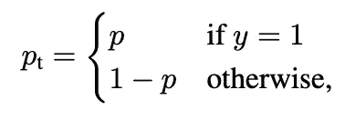
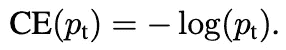
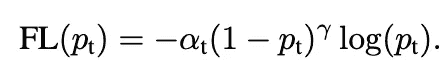
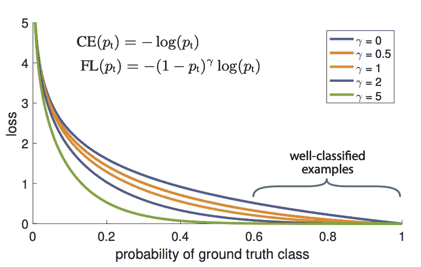
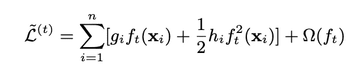

# 不平衡数据集中焦点损失的 LightGBM

> 原文：<https://towardsdatascience.com/lightgbm-with-the-focal-loss-for-imbalanced-datasets-9836a9ae00ca?source=collection_archive---------3----------------------->

[焦损失](https://arxiv.org/pdf/1708.02002.pdf)(以下简称 FL)是由宗-林逸等人在他们 2018 年的论文*“密集物体探测的焦损失”* [1]中引入的。它被设计成解决具有极端不平衡类别的情况，例如前景和背景类别之间的不平衡可以是例如 1:1000 的一阶段对象检测。

在这篇文章中，我将展示如何为[light GBM](https://papers.nips.cc/paper/6907-lightgbm-a-highly-efficient-gradient-boosting-decision-tree.pdf)【2】(以下简称 LGB)编写 FL，并演示如何使用它。配套的 github repo 可以在这里找到。不幸的是，我找不到公开的真正具有挑战性的不平衡数据集。python 中的[不平衡学习](https://imbalanced-learn.readthedocs.io/en/stable/) [3]包附带的数据集相对容易，LGB 不需要任何技术来处理不平衡数据集就能产生良好的结果。另一个选择是 Kaggle 的[信用卡欺诈检测数据集](https://www.kaggle.com/mlg-ulb/creditcardfraud)。然而，这也是一个非常容易的数据集，LGB 产生了非常好的结果“*开箱即用*”。

尽管如此，因为这篇文章的目标是展示 LGB 的 FL 代码以及如何使用它，所以我简单地挑选了两个众所周知的数据集，然后继续。这些是[成人普查](https://archive.ics.uci.edu/ml/datasets/adult)数据集和已经提到的信用卡欺诈检测数据集。

我们需要遵循这个代码中的代码的小数学是这个帖子可以写成如下。考虑二元分类问题，我们可以将 p_t 定义为:

Eq 1 (Eq 2 in Tsung-Yi Lin et al., 2018 paper)

其中，y ∈ { ∓ 1}指定地面实况类，p ∈ [0，1]是标注 y = 1 的类的模型估计概率。那么交叉熵可以写成:

Eq2\. Binary Cross Entropy

根据该公式，**焦点损失**定义为:

Eq3 (Eq 5 in their paper)

让我们看看它的行为，如图 1 所示。

Figure 1 (Figure 1 in their paper). The figure shows the Focal Loss plotted against pt. Note that for γ=0 the FL is equal to the CE. We can see that the factor (1 − pt) γo the standard cross entropy criterion. Setting γ > 0 reduces the relative loss for well-classified examples (pt > .5).

正如我们在图中看到的，设置γ > 0 减少了分类良好的例子的相对损失(pt > .5)，把更多的注意力放在困难的、错误分类的例子上。引用作者的话:*“当γ = 2 时，与 CE 相比，pt = 0.9 的示例的损耗低 100 倍，pt ≈ 0.968 的示例的损耗低 1000 倍”。*

这就是我们现在需要的所有数学知识。

# 光焦度损失

使用 LGB 时，为了编写您自己的损失函数，您需要损失数学表达式及其梯度和 hessian(即一阶和二阶导数)。**光 GBM** 的**焦损**可以简单编码为:

**Focal Loss implementation to be used with LightGBM**

如果只有一段代码可以从这篇文章中“拯救”出来，那就是上面的代码片段。

如果你要将 FL 和 LGB 一起使用，你可能需要编写相应的评估函数。在这种情况下，该函数需要返回名称、目标函数的值以及一个布尔值，该值指示值越高越好:

Evaluation Focal Loss function to be used with LightGBM

例如，如果不使用 F1 作为目标函数，您更喜欢 F1 分数这样的指标，您可以使用以下代码:

f1 score with custom loss (Focal Loss in this case)

注意第 2 行中的 *sigmoid* 函数。这是因为当使用您自己的损失函数时，直接来自算法的原始预测不会通过 sigmoid 来表示概率。

要将 FL 与 LGB 一起用于训练，只需:

How to use the Focal Loss for training with LightGBM

或者通过 F1 分数和交叉验证:

How to use the Focal Loss for LightGBM with cv and F1 as the evaluation metric

# 结果

如前所述，我使用了两个数据集，人口普查数据集和信用卡欺诈检测数据集。对于每个数据集，我运行两个实验:1)使用设置为`True`的`is_unbalance`参数(如果少数类是正类，这相当于使用`scale_pos_weight`)和 2)使用 FL。我使用 [Hyperopt](https://github.com/hyperopt/hyperopt) 进行超参数优化，针对 F1 分数进行优化，每个实验运行 100 次迭代，每次迭代都进行交叉验证(3 次，即每个实验 300 次拟合)。我根本没有使用过/欠采样。本文引用的所有代码都可以在[这里](https://github.com/jrzaurin/LightGBM-with-Focal-Loss)找到。

Table 1\. Performance metrics for the experiments run in this post with and without Focal Loss

结果如表 1 所示。需要强调的是，正如本文前面提到的， ***这两个数据集都不适合这里的*** 练习。事实上，成人人口普查数据甚至没有不平衡。因此，先验地，人们不会期望在有和没有 FL 的情况下获得的度量之间有大的变化。然而，表中的结果说明了 FL 的潜力。例如，两个数据集的 F1 分数都增加了 2%。此外，在信用卡欺诈检测数据集的情况下，所有的 *F1、精度*和*召回*提高了 2%或更多。

对此，我可以补充一点，我已经在几个真实数据集和相关的改进中使用了 FL，在不平衡率为 2:100 的数据集上，所有性能指标都一致提高了约 5%。我的一些同事告诉我，他们看到了更大的改善。

为了结束这一部分，让我们来看看聚焦损耗中的α和γ参数:

Table 2\. Focal loss α and γ parameters

较高的γ值将较大地减少分类良好的样本的相对损失，将更多的注意力放在难以分类的样本上。因此，这些结果可以解释如下。成人数据集虽然不是不平衡的，但对于算法来说，它比信用卡欺诈数据集*【更具挑战性】*。为了获得最好的 F1 分数，我们需要较大的γ值，将大量的“*焦点*放在硬的、错误分类的样本上。

**`**is_unbalance**`**参数****

**到目前为止，当使用 FL 时，我已经将`is_unbalance` 参数设置为`False.` ，注意也可以同时使用 FL 和`is_unbalance=True`。为了理解使用两者的含义，让我们首先假设树集成方法的目标函数的一般形式:**

****

**Eq 4\. This is actually Eq 3 in Tianqi Chen & Carlos Guestrin 2016 XGBoost paper [4].**

**其中 *f* _t 是树在第 *t* 次迭代时的函数， *g* 和 *h* 分别是梯度和 Hessian。**

**如果我们看一下 c++代码的这里的[，我们可以看到设置`is_unbalance = True`仅仅意味着，当计算损失时，少数类的标签权重将是两个类之间的比率(*count _ majority/count _ minority*)。如果我们再看这里的](https://github.com/microsoft/LightGBM/blob/a3a353d6832b3653f222886f912293998ff8ae69/src/objective/binary_objective.hpp#L95)，在 sklearns API 中，我们看到在计算目标函数时，这些权重直接乘以梯度和 Hessian。**

**现在假设我们有一个不平衡比率为 1:9 的数据集，我们取两个样本，一个正(少数)样本和一个负(多数)样本，预测概率 p=0.9。现在假设α和γ分别为 1.0 和 2.0。如前所述，在这种情况下，FL 中的因子α(1-p)^γ会将这两个样本的相应损耗值减少 100 倍。换句话说，FL 试图把重点放在更难的、错误分类的样本上。**

**假设，为了计算目标，LGB 使用类似于等式 3 的表达式，并且我们设置`is_unbalanced=True,` 相应的梯度和焦点损失的 Hessian 将仅对于正(少数)样本乘以因子 9。换句话说，设置`is_unbalanced=True`将增加少数类样本对目标的贡献，而不管它们是否被很好地分类。**

**因此，在我看来，焦点损失和`is_unbalance=True`对于分类良好且属于少数类的样本是竞争效应。尽管如此，我已经使用 FL 和设置`is_unbalance=True`对 2 个数据集进行了实验，结果与表 1 中的几乎相同。**

# **替代方法**

**在这篇文章中，我只是想展示如何为 LGB 编写 FL 并演示如何使用它。然而，让我简单地提一下我在这里没有探讨的一些替代技术。**

**使用 LGB 时，您可以直接传递与每个观察相关的权重。这也是一个值得你公司探索的好方法。也许你有一些启发，或使用一些无监督的技术，导致你的结论是，一些样本比其他的更重要。在这种情况下，您可以考虑为每个观察传递一个权重来反映这一先验知识。这可以通过简单地使用`lightgbm.Dataset`类中的参数`weight` 来实现。使用 FL 或使用`weight`参数都被称为成本敏感学习技术。**

**另一种技术是重新采样。正如我提到的，我没有使用任何欠采样/过采样。如果你想探索重采样技术，你可以在著名的 python 包 unbalanced-learn 中找到相当全面的资料。另一种我觉得特别有趣的更近期、更有前途的欠采样技术在 Ehsan Montahaei 等人 2018[5]中讨论过，如果你想更深入地了解重采样技术的话。**

**仅此而已。有什么想法，在这里评论或者发邮件给我:jrzaurin@gmail.com**

# **参考资料:**

**[1]宗-林逸，普里亚·戈亚尔，罗斯·吉斯克等人，2018: *密集物体探测的焦损失*。[**arXiv:1708.02002 v2**](https://arxiv.org/abs/1708.02002v2)**

**[2]郭林·柯，，托马斯·芬利等，2017: LightGBM: *一种高效的梯度推进决策树*。**

**[3]纪尧姆·勒迈特，费尔南多·诺盖拉，克里斯特斯·k·阿里达斯 2017:不平衡学习:一个 Python 工具箱，解决机器学习中不平衡数据集的诅咒。**

**[4]陈天琦，Carlos Guestrin 2016: XGBoost:一个可扩展的树提升系统。[**arXiv:1603.02754 v3**](https://arxiv.org/abs/1603.02754v3)**

**[5] Ehsan Montahaei，Mahsa Ghorbani，Mahdieh Soleymani Baghshah，Hamid R. Rabiee 2018:不平衡问题的对抗性分类器。[arXiv:1811.08812 v1](https://arxiv.org/abs/1811.08812v1)**