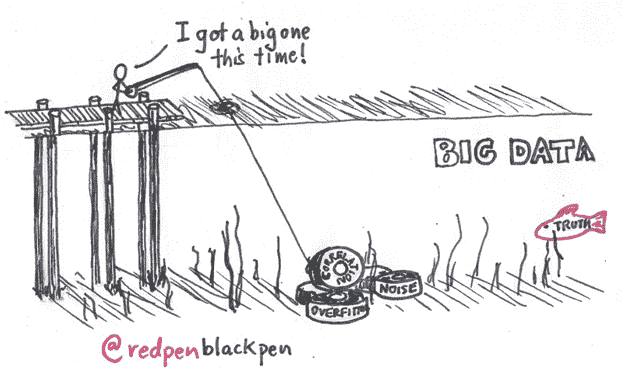
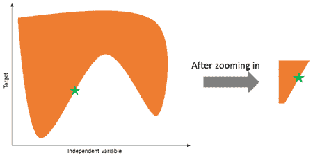
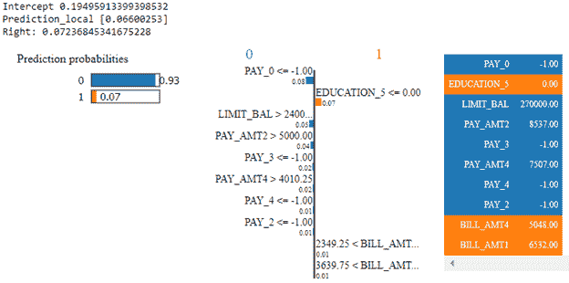
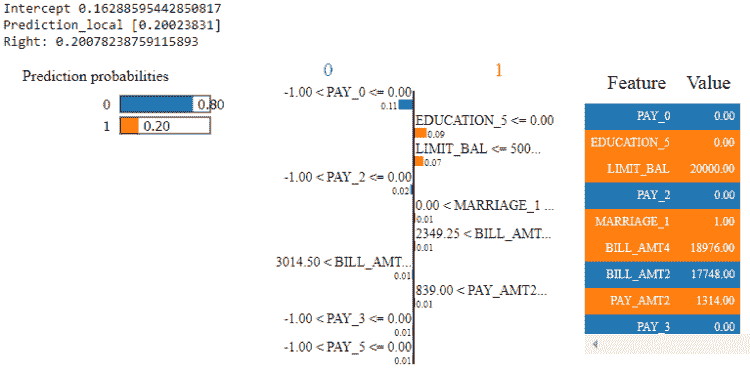

# 莱姆:解释机器学习模型的预测(1/2)

> 原文：<https://towardsdatascience.com/lime-explaining-predictions-of-machine-learning-models-1-2-1802d56addf9?source=collection_archive---------17----------------------->

## 在我之前的[博客](http://datascienceninja.com/2019/07/10/how-to-interpret-machine-learning-models/)中，我提到了以下理解模型预测的基本技术。


Photo by [Alex Bertha](https://unsplash.com/@alexbertha?utm_source=unsplash&utm_medium=referral&utm_content=creditCopyText) on [Unsplash](https://unsplash.com/search/photos/ariel-view?utm_source=unsplash&utm_medium=referral&utm_content=creditCopyText)

1.  使用基尼指数的特征重要性
2.  使用排列重要性的特征重要性
3.  部分相关图

首先，我想问一个问题:*“我们可以仅仅因为模型在测试数据上的表现令人信服地高，就相信模型的预测吗？”*许多人可能会回答这个问题为*【是的】*。但这并不总是正确的。高模型性能不应被视为信任模型预测的指标，因为模型拾取的信号可能是随机的，可能没有商业意义。



在这篇博客中，我将谈论 LIME，一种在实例层面上帮助理解预测背后的原因的方法。这是一种与模型无关的技术，也就是说，你可以将它用于任何模型，无论是神经网络、基于树的模型、支持向量机等等。

LIME 代表***L***ocal***I***n interpretable***M***odel-Agnostic***E***解释。对许多人来说，本地这个词似乎是最令人困惑的。所以我先来解释一下为什么*这个词本地*。

目标和自变量之间的关系在全局水平上可能变得非常复杂，例如参考下图。查看这个全局视图并不能提供太多关于独立特征和目标之间关系的洞察，所以 LIME 放大在非常非常局部的水平上进行。



让我们假设被解释的实例用绿色星号标记。LIME 背后的主要直觉是，在放大和局部分析目标和独立特征之间的关系之后，我们可以使用线性模型来近似这种关系。

现在，让我们了解石灰的工作步骤:

*   对原始数据中靠近绿色星号的实例进行采样和 SMOTE 处理(正在解释实例)
*   计算采样实例和被解释实例之间的距离
*   对于这些合成生成的实例，使用原始全局模型进行预测
*   对此数据集拟合一个简单的线性模型
*   基于在步骤 2 中计算的相似性指数对该线性模型进行加权。这是为了确保最接近原始实例的实例上的错误比其他实例更有价值

现在让我们进入例子来解释石灰的结果。我已经使用了来自 [Kaggle](https://www.kaggle.com/uciml/default-of-credit-card-clients-dataset) 的数据集。目标是确定拖欠信用卡付款的最强预测因素。我安装了一个 Scikit-learn 实现的梯度增强树。

```
Correctly classified *‘Non Default Payment’* instance:
```

*橙色*表示贡献给*‘违约金’，蓝色*表示贡献给*‘非违约金’。*全局模型对此实例的预测是 0.072，而局部模型的预测是 0.066。所以，对于这个特殊的例子，全局模型和局部模型的预测非常接近。



上面的例子表明，这个被标记为*‘非违约付款’*的特定实例的主要贡献者是上个月的还款状态( *PAY_0 = 1* )。这意味着在前一个月付款是按时完成的。其他变量的解释也类似( *PAY_2，PAY_3* 等)。).这表明，如果前几个月的付款按时完成，那么这个人下个月不违约的可能性很高。

*LIMIT_BAL* 的高金额也促成了*非违约付款。*这也是有意义的，因为高 *LIMIT_BAL* 意味着剩余补充信用低。因此，下个月的账单有可能会很低，因此违约的几率会更小。现在，对于连续要素，LIME 的输出提供了更多详细信息，因为它指定了导致该要素产生影响的一系列特征值。例如*'限额 _ 余额> 24 万'*

我个人认为分析错误预测的实例是非常有见地的。这有助于理解哪些特征实际上导致了预测不正确。

```
Incorrectly classified *‘Non Default Payment’* instance (Actual: *‘Default Payment’*):
```



由于表示先前付款历史的特征( *PAY_0* 、 *PAY_2* 、 *PAY_3* )，上述实例被错误地预测为*非违约付款*。在这种情况下，以前的付款是按时完成的。这可能使预测变得不正确。

根据上面的例子，石灰的一般概念听起来是合理的，但是石灰也有一些潜在的缺点。

```
**1\. Local linear behavior**
```

LIME 目前在本地实现线性模型来获得解释。而这种假设对于正在解释的实例周围的小区域是有效的。但是对于更复杂的数据集，随着我们增加局部区域的面积，这个假设可能不成立。因此，来自局部可解释模型的解释可能无法解释全局线性模型的行为。

```
**2\. Number of features**
```

需要优化选择用于解释的特征的数量。应该选择特征的数量，以便保持模型的复杂性和解释的简单性。在 LIME 的 python 实现中，它提供了以下选项:*‘forward _ selection’，‘lasso _ path’，‘none’或‘auto’*。

```
**3\. Models without probability scores**
```

LIME 目前不支持没有概率分数的分类器模型。

```
**4\. No aggregated view**
```

LIME 实现不提供特性解释的聚合视图。用户必须依次分析各个实例。

```
**5\. Similarity score**
```

对于表格数据，LIME 通过单独扰动每个要素来创建新样本，从正态分布中提取该要素的平均值和标准差。对于连续特征，LIME 提供了一个选项，用于从以被解释的实例为中心的法线或从以特征数据集的平均值为中心的法线扰动样本。越靠近感兴趣的实例，样本的石灰权重越高。现在，在高维空间中，每个特征具有不同范围的值，计算相似性指数具有挑战性，并且可能不会产生清晰的结果。

```
**6\. Definition of the neighborhood**
```

定义一个正确的邻域来运行局部可解释模型是一个困难的问题。那么，为什么我们需要沿着被解释的实例定义一个局部邻域呢？解释模型对原始模型的准确性是通过在由局部核加权的简化输入空间中的一组样本上的损失函数来加强的。目前，LIME 使用指数平滑内核。这个内核的宽度决定了对正在解释的实例的局部模型的影响，同样，没有确定内核宽度的最佳方法。

```
**7\. Consistency of the model explanations**
```

由于采样偏差、相似性得分的计算和邻域的定义，石灰解释有时可能缺乏一致性。

# 结论:

LIME 提供了非常简单的可解释的解释，并且是分析每个特征的贡献的快速方法。LIME 也可以用于文本和图像数据，与其他可解释的技术(如 SHAP)相比，LIME 的执行时间更少。我喜欢 LIME 的另一个特性是，局部代理模型实际上可以使用独立的特性，而不是全局模型中使用的特性。

其他阅读资源:

1.  [https://www . KDD . org/KDD 2016/papers/files/RFP 0573-ribeiroa . pdf](https://www.kdd.org/kdd2016/papers/files/rfp0573-ribeiroA.pdf)
2.  【https://github.com/marcotcr/lime 
3.  [https://christophm . github . io/interpretable-ml-book/lime . html](https://christophm.github.io/interpretable-ml-book/lime.html)

# 下一步是什么？

在下一篇博客中，我将解释另一种流行的技术:用于解释模型预测的 SHAP。

这个可解释的人工智能领域正在迅速发展，在工具和框架方面有很多新的发展。请在评论区写下你对博客的反馈，以及你在这个领域使用的最新工具。此外，如果你想让我写任何特定的主题，请发表评论。

这些内容最初发表在我的个人博客网站:[http://datascienceninja.com/](http://datascienceninja.com/)。点击[此处](http://datascienceninja.com/2019/07/10/lime-explaining-predictions-of-machine-learning-models-1-2/)查看并订阅即时接收最新博客更新。