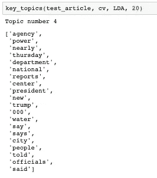

# Limericking 第 2 部分:用 LDA 进行主题建模

> 原文：<https://towardsdatascience.com/limericking-part-2-topic-modeling-with-lda-45476ab9af15?source=collection_archive---------27----------------------->

## 石灰工程

## 没有监督的情况下找话题

欢迎来到我构建自动打油诗生成器的第 2 部分。正如我在第 1 部分中详述的，我受到了令人难以置信的 twitter 账户 Limericking 的启发，该账户根据新闻事件制作热门打油诗。我发现我更喜欢阅读打油诗形式的新闻；这些天的新闻是如此沉闷，以至于我发现越来越难以任何其他方式阅读新闻。

Why contemplate concentration camps on the border without a poem at Mike Pence’s expense?

不幸的是，Limericking twitter 帐户背后的孤独天才只能产生这么多。毕竟，每首诗都必须根据节拍、韵律和喜剧性来精心制作，所以 Limericking 每周只创作几首诗也就不足为奇了。我赞扬该账户对质量的奉献，并拒绝出版任何不到一个辉煌的打油诗，但我哀叹内容的匮乏。有没有一种方法可以自动化主题五行打油诗的制作过程(从而让我在继续阅读轻松诗的同时也能合理地了解时事)？

也许有，但不幸的是，首先需要解决一系列棘手的数据科学问题。我们的打油诗生成器需要能够接收文本并解析其含义，得出一两个总结句子(或至少一个主题和关键词/数字)，然后生成有意义的文本，这些文本经过调整以适应打油诗的形式，而不会失去其连贯性。我想最重要的是，你会希望打油诗是幽默的，尽管这可能超出了我的能力。

为了支持我的第一篇文章，我把这个任务分解了，最后得到了一系列基于新闻文章的俳句。我的程序试图通过查看文本中最常出现的专有名词来确定文本的主题(这种策略通常会产生合理的结果)，但在其他情况下会半随机地将单词放入俳句中:选择单词的概率由该单词在文本中出现的频率来加权。改进该计划的第一步是什么？limerick 生成器需要采取的第一步是解析文本的含义，所以这篇文章的主题是主题建模，特别是一种叫做潜在 Dirichlet 分配的方法。

主题建模本质上是一个复杂的分类问题，它提出了两个挑战。首先，虽然计算机可以对文本做一些事情，比如计算字数，但文本信息对计算机来说并没有内在的意义。人类在文本中看到的意义既有单个单词的层面，也有来自句法和句子中单词之间关系的更高层次(“猫咬了狗”和“狗咬了猫”的意思非常不同，尽管都是相同的单词)。这些意义的形式对计算机来说是困难的；第一个原因是单词的意思从定义上来说是抽象的，是基于人类的语境，第二个原因是人类语言的语法结构复杂得令人难以置信。

有一些自然语言处理的方法完全避免了意义，但仍然可以获得强有力的结果。所谓的“单词袋”模型忽略了所有的语法或词序，只是将文本表示为单词的集合，然后可以进行概率比较。像朴素贝叶斯分类器这样的概率模型查看不同单词在不同上下文中出现的相对频率。在主题检测用例中，您可以想象特定领域的词汇在一些主题中比在其他主题中使用得更多:技术文章可能有技术词汇，如“处理器”或“千兆字节”，而政治文章可能有政治词汇，如“选举”或“勾结”。假设你有一个标记良好且足够大的数据集，这样的模型可能非常强大，即使是在相对微妙的问题上:一个训练有素的贝叶斯分类器可以以 98%的准确率区分合法的新闻故事和来自洋葱等来源的讽刺文章。

不幸的是，这给我们带来了第二个挑战，数据标注。为了训练一个分类器，你需要一个训练数据集，这个数据集已经被很好地标记，并被分成适当的组。对于讽刺分类器这样的东西来说，这不会是一个挑战——任何来自洋葱这样的来源的东西都将是讽刺，而任何来自路透社的东西都不是，所以数据几乎被默认标记。对于像主题这样的东西，就有点难了，特别是当文章被发布它们的新闻机构标记为不同的主题部分时，不同的组织可能使用不同的分类方案。例如，想象一下“政治”新闻和“国际”栏目中的英国退出欧盟新闻之间的区别。

手动标注一大堆新闻文章会非常麻烦。幸运的是，也有无监督的主题建模方法，包括潜在的狄利克雷分配，不需要良好标记的训练数据。LDA 和类似的方法可能更好地称为“主题聚类”,而不是主题建模。使用 LDA 的计算机不能准确地“命名”一个主题，它不能接受一篇文章并明确地说它来自报纸的艺术部分。毕竟，我们考虑使用 LDA 的全部原因是它不需要预先标记的数据，所以计算机无法知道它收到的文章来自艺术部分。

相反，LDA 和类似方法试图做的是将文章组合在一起，返回未命名的“主题”,代表它认为相似的文章簇。希望该模型将艺术部分的文章分组在一起，而不需要被告知哪些文章在艺术部分开始。这种方法的两个怪癖是:a)计算机不会，也不能直接返回它所找到的群体的可解释信息(这需要人工干预), b)没有真正的方法来验证它所识别的群体，因为它是以一种无人监督的方式找到这些群体的。

LDA 是一个“单词包”模型，因为它将每个文档或文本视为本质上只是一个没有任何语法或词序的单词集合。它基本上将“主题”概念化为单词的概率分布，将单个文档/文本概念化为主题的概率分布。在这个视图中，任何给定的文本本质上都是通过从某些主题中随机抽取单词来生成的。一个带有 LDA 功能的统计软件包(比如我使用的 [scikit learn 的](https://scikit-learn.org/stable/modules/generated/sklearn.decomposition.LatentDirichletAllocation.html))试图在给定文本数据集和一些预期主题的情况下，找到主题中最合理的单词分组。

您可以想象 LDA 模型的工作方式，如下所示:该模型基于一组似乎有许多共同词汇的文章来识别主题。人类翻译可能会给这个话题贴上“政治”的标签:像“参议院”、“政党”和“投票”这样的词在这个话题中很常见，而像“薄饼”或“血红蛋白”这样的词不常出现。由模型识别的另一个主题可以与电影评论一致，并且对应于诸如“电影”、“动作”和“电影摄影”之类的词。当呈现一篇新文章时，比如说，一篇政治惊悚片的评论，该模型将有希望能够识别出它与这两个主题最强烈地对应。

LDA 实际上如何找到主题聚类的数学基础稍微复杂一些，尽管像许多数据科学工具一样，使用广泛可用的 python 库来实现它是很容易的。我决定尝试使用 LDA 来改进我的俳句生成器。第一步是建立一个文本训练语料库。我一直在与 NPR 的文章，因为 NPR 有一个方便，容易刮，纯文本版本的网站，其网址都是相同的保存一篇文章的 id 号。不幸的是，id 不是连续的，也没有一个容易访问的列表。比我有更多网络抓取技能的人会找到更好的方法来自动抓取 NPR 网站，我手工从最近的文章中编辑了大约 250 个文章 id 号。这是一个足够大的语料库，但远没有你想要的那么大。

下一步是对数据进行“矢量化”,将每篇文章从计算机无法真正处理的字符串转换成它可以处理的数学对象。我使用了一个简单的“计数矢量器”,它的功能和听起来差不多:整个文本语料库中的所有独特单词都被表示为一个大矩阵中的列。对应于任何给定文本的向量就像这个矩阵中的一行，每一列中的值对应于该列在文本中出现的单词的计数。因此，矩阵是“稀疏的”:因为大多数可能的单词不会出现在任何给定的文本中，所以有许多零。简单计数矢量化的一种替代方法可能是词频-逆文档频率(TF-IDF ),它实质上是与相应单词在整个语料库中出现的频率成反比地对文本向量中的条目进行加权。因此，在多个主题中常见的单词，如“good”或一周中各天的名称，将具有较低的权重，而相对罕见的单词则具有较高的权重。

最后，使用 scikit learn 运行 LDA 模型是一个简单的两行代码。我选择运行 10 个主题的模型，并打印出每个主题中最重要的单词，以直观地检查它们的连贯程度。

在某些情况下，该模型在将相关术语组合在一起方面做得非常好，特别是对于与当前事件相关的这些组，我认为不需要任何解释:

News articles from the border

News article about business as usual

其他主题表面上看不太清楚，不过，拥有较小数据集的一个意想不到的好处是，很容易找到一些联系。第七个话题起初看起来很奇怪，热门词汇大多与健康和医学有关，但也包含像“气候变化”这样的内容。这种联系是由一篇文章建立的，这篇文章讨论了炎热的夏天和其他与全球变暖相关的压力对健康造成的一些后果:[你的医生和你谈过气候变化吗](https://www.npr.org/sections/health-shots/2019/07/13/734430818/has-your-doctor-talked-to-you-about-climate-change)。因为这是一个相对较小的训练集，所以像这样的一篇文章可以在模型中不同的主题之间建立重要的联系。有了更大的文本集和更多的主题，LDA 模型可能会将医学和气候变化文章作为单独的主题进行分组，并认为链接这两个主题的文章是这两个主题的混合。

一旦模型被训练，它可以评估新文本，并根据它认为它属于哪个主题簇来对它们进行分类。例如，给定[这篇关于飓风巴里在路易斯安那州登陆的文章](https://www.npr.org/2019/07/13/741382999/hurricane-barry-makes-landfall-in-louisiana)，该模型认为它最有可能属于主题#4，这是一个具有大量政府和政治相关单词的主题。考虑到这篇文章讨论的是联邦政府对飓风的反应，这个猜测不错。为了更好地说明实际情况，我编写了一个函数来返回文本中在所选主题中权重最大的单词，因此这些单词对与该主题分组的文章贡献最大:

这个函数在我的测试文章中的输出有助于阐明为什么它被归入那个主题:

测试文章与其他新闻文章的分组是正确的，如果你仔细阅读与它所识别的主题群最相关的单词，你会看到“新闻演讲”的明显例子:“居民”、“报道”、“官员”等。不过，也有一些怪癖:一方面，它把“星期四”定为重要的一天。也许这真的有道理！也许新闻文章(而不是艺术部分的文章)更可能指定一周中的某一天。在我看来，有些词可能会出于“错误”的原因将模型指向某个特定的主题群。例如,“水”这个词。稍微了解一下进入这一模式的文章，我并不感到意外的是，水可能会聚集特朗普和其他与新闻相关的词:今年夏天，有许多关于南部边境拘留中心的文章，包括讨论被可耻地关押在那里的人是否能获得干净的水。然而，在本文的上下文中，它是一种不同的水，雨/洪水，被用来将本文链接到这个主题集群。

当然，整个练习的目的是提高我的打油诗写作能力。您如何将此用于该目的？两种方式。第一，这提供了一种从文章中过滤掉不太“有用”的单词的方法:您需要确定哪些单词是“内容”单词，并比所有主题的文章中常见的单词更频繁地使用它们。第二，这可能会释放文章文本中找不到的额外词汇。如果你正在创作一首打油诗，你可能需要寻找没有出现在文本中的单词，以便找到押韵或生成新的句子，并正确扫描。计算机怎么知道哪种词有意义呢？这可能是对单词进行分组的一种方式:“我看到本文属于这个主题组，与这个组相关的其他单词是……”

我试着调整我的俳句生成器，以便在组合俳句时使用输出的、高度加权的单词作为单词字典。在之前关于飓风巴里的文章中，我的新俳句生成器产生了这首诗:

> 路易斯安那
> 
> 新应急水
> 
> 中央报告日

鉴于这篇关于新任白宫新闻秘书斯蒂芬妮·格里沙姆的文章，它产生了以下内容:

> Grisham 发言人
> 
> 最大的政府
> 
> 白色中等好

这个过程能提高我的俳句创作吗？不完全是。如果说有什么不同的话，那就是有几个原因让情况变得更糟。我以前的生成器按照单词在文本中的出现频率使用单词，除了停用词之外，没有丢弃任何单词。然而，现在，文本单词通过矢量器传递，该矢量器丢弃在语料库的所有文本中出现频率不够高的单词，并使用受模型/语料库整体影响的权重。因此，对于给定的文章来说相对特殊的单词可能不会出现在要使用的单词列表中，即使这些正是你想要出现在摘要俳句中的单词！从项目的长期来看，可能需要一个策略来打开一个更广泛的单词字典。然而，对我来说很明显，为了使用这种策略，你只需要更多:更多的文本，更多样化的文本，可以被分组到更多的主题群中。