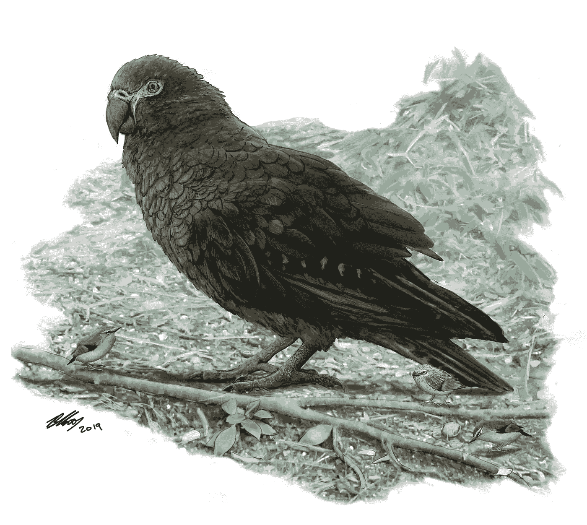

# Limericking 第 3 部分:文本摘要

> 原文：<https://towardsdatascience.com/limericking-part-3-text-summarization-f715841a8765?source=collection_archive---------21----------------------->

## 石灰工程

## 从文本中识别关键的摘要句子

欢迎来到我正在进行的 Limericking 系列的第 3 部分，在这里我将探索自然语言处理在解析新闻文本和写诗方面的巨大潜力。正如我在系列文章的第一部分[中解释的那样，我是 Twitter 账户 Limericking 的狂热粉丝，该账户能够消化新闻并创作出精彩的打油诗。](/limericking-part-1-context-and-haikus-3eb057c8154f)

So much more pleasant that watching the Democratic primary debate

唯一的问题是 Limericking 只是一个帐户。到目前为止，其他主流媒体都无视我的要求，用押韵诗报道所有新闻，让我们的大部分新闻消费处于危险的非多样化状态。我希望通过创造一个自动计算程序，利用自动化的强大力量来解决这个问题，从而帮助弥合这一鸿沟。一个函数能接受一篇新闻文本，恰当地解释它的意思，并把它改写成一首打油诗吗？我相信答案是肯定的，尽管我可能需要更多的博客文章来解决所有的问题。然而，我已经自动生成了一些非常成功的俳句。

第一大任务是找到一种方法，让计算机“阅读”给定的新闻文本，并返回某种摘要或一组关键词。稍后，我们将不得不考虑如何让计算机生成自己的文本，该文本扫描正确且押韵(并有适当的喜剧性转折)，但目前，简单地从文本中提取主题已被证明足够困难。[我在这个系列中的最后一篇文章](/limericking-part-2-topic-modeling-with-lda-45476ab9af15)讨论了使用潜在的狄利克雷分配来尝试将文章分组到“主题”中，并识别与这些主题相关联的有意义的单词。结果不是很好。

不过，也许我对这部分挑战想得太多了。尽管主题建模是一个困难的问题，但我在第 1 部分中最初的俳句写作功能令人惊讶地做得很好的事情之一是识别新闻文章是关于什么的。我只是推断这篇文章可能是关于一个专有名词，比如一个人或一家公司，并且这个主题可能会在文章的正文中出现多次。简单地找到专有名词，并计算出哪些是最常出现的，对确定文章的内容大有帮助。像这样的策略的关键之一是它完全基于规则:它不需要在一组标记良好的文章样本上训练模型，也不需要计算机“理解”给定单词的意思，或者为什么它可能是文章的主题。更重要的是，该函数只是识别并返回原始文本的一个元素，所以您还不需要处理文本生成。

也许有一种方法可以做类似的事情，但它可以在更大的文本块上工作:比如说，一个函数可以根据一些容易计数的特征比较文本中的不同句子，然后返回一个似乎最重要的句子，就像最常重复的专有名词似乎“重要”一样。事实证明，有一种方法可以做到这一点，这种方法很容易实现，而且效果很好。关键的洞见是弄清楚如何衡量一个给定句子的“中心”或“主题”程度。寻找最常用的专有名词的句子长度是多少？

解决这个问题的一种方法是，根据文本中包含的单词来比较这些句子之间的相似程度。想象一下，例如，一个关于你所在城镇的市长的当地新闻故事。哪些单词最有可能出现在故事中，出现在最多的句子中？当然，你会期望城镇的名字和市长的名字会出现很多次，出现在很多不同的句子中。文章可能会有一个更具体的主题，比如某个特定的事件或市长工作的某个方面，这也会在文章中多次出现。其他事情可能在文本中出现得不太频繁，也许有一句话可能会提到市长的前任或邻镇正在发生的事情。

根据我们对这些单词分布的预期，你如何教计算机识别哪些句子看起来最重要？一种方法是简单地找出与文章中其他句子有最多共同点的句子。如果句子中有像市长的名字或城镇的名字这样的词，它看起来会和文章中包含这些词的许多其他句子相似。如果一个句子在谈论下一个城镇，而那个城镇的名字只被提到过一次，那么这个句子看起来就不像文章中的其他句子。举个具体的例子，考虑一篇关于纽约地铁糟糕状况的文章。像“纽约人指责白思豪造成地铁灾难”这样的句子可能会与文章中的其他句子相似，只是基于单词数:“纽约”、“地铁”等。像“彭博治下的情况没那么糟”这样的句子看起来不太相似，包含了像“彭博”这样的新词。

为了实现这个策略，首先我们需要将每个句子转换成计算机更容易处理的东西，比如一个向量，其中不同列中的值对应于给定单词在句子中出现的次数。然后计算机可以很容易地用余弦相似度这样的方法比较任意两个给定句子对应的向量。幸运的是，sklearn 很容易处理矢量化和相似性。考虑下面的实现，除了两个小问题之外，它非常简单:1)我使用优秀的 [NLP 包 spaCy](https://spacy.io/) 将一大块文本分割成句子，但随后必须将句子转换回字符串对象(而不是 spaCy 标记), 2)我在第一个函数中有一个小循环，它将排除完全重复的句子。我之所以包括这个，是因为根据文本的来源，我发现我会重复使用类似“点击此处订阅”的短语，我想排除这些短语:

这在实践中是如何运作的？好吧。考虑到它的简单性，甚至可能出乎意料地好。例如，[这篇关于农业对气候变化影响的文章](https://www.npr.org/sections/thesalt/2019/08/08/748416223/to-slow-global-warming-u-n-warns-agriculture-must-change)有 23 个句子。我的函数将这些定义为最有用的 5:

```
The panel of scientists looked at the climate change effects of agriculture , deforestation and other land use , such as harvesting peat and managing grasslands and wetlands . The new report adds weight and detail to a warning put out by the same panel of scientists last fall , in which they sounded the alarm about the inadequacy of the pledges countries have made so far to reduce greenhouse gas emissions. At that time, the panel broadly suggested that farmland would need to shrink and forests would need to grow to keep Earth from getting more than 1.5 degrees Celsius hotter than it was in the preindustrial era. Scientists say the only way to achieve that reduction is to significantly increase the amount of land that ‘s covered in trees and other vegetation and significantly reduce the amount of methane and other greenhouse gases that come from raising livestock such as cows , sheep and goats. The U.N. panel is the latest group of experts to grapple with a global conundrum: how to reduce greenhouse gas emissions from agriculture , deforestation and other land use without creating food shortages or displacing people whose livelihoods rely on practices that are unsustainable globally.
```

一点都不差！整篇文章中有几个奇怪的遗留部分(比如以“当时”开头的句子没有明确的指代)，但这篇文章的主旨很容易理解。

我想将实际的诗歌生成留到本系列的后续文章中，但我认为一个简单的系统将文本压缩成一个摘要有一些明显的好处。我们未来的五行打油诗生成器不必凭空创造文本，它会识别出重要的句子，只需要将它们恰当地塑造成五行打油诗的形式。它将能够借用整块的文本，而不需要担心词法或词序。

我的俳句生成器的含义也很清楚。这提供了一种非常有用的方法来识别要插入到俳句中的主题(所识别的句子之一的字面、语法主题)，以及一种方法来识别应该选择的一组单词(从摘要句子中派生的词汇，而不是整个文本本身)。我将这些变化应用到我的俳句生成器中，它立即返回了这篇来自气候变化文章的精彩文章:

```
Sheep global need food,The panel of scientists,New effects countries.
```

从这个关于发现一只[巨大史前鹦鹉](https://www.npr.org/2019/08/07/749224941/scientists-discover-prehistoric-giant-squawkzilla-parrot-as-big-as-small-child)的令人愉快的故事中，我们得到了这个相当贴切的金块:

```
Scientists small lint,Bird fauna island story,Ornithology.
```

但是，我想，当你的出发点是发现一只古老的儿童大小的鹦鹉的好消息时，结果一定会很有趣。



Artist’s rendering of the bird in question