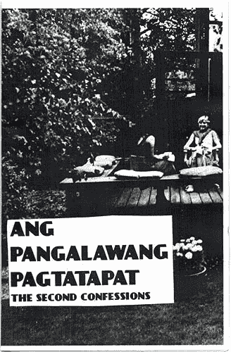
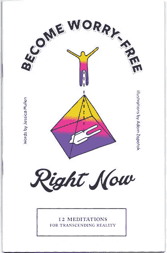
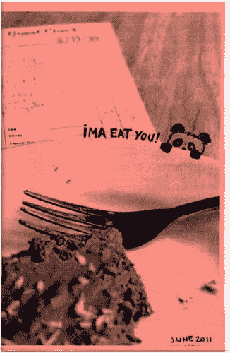
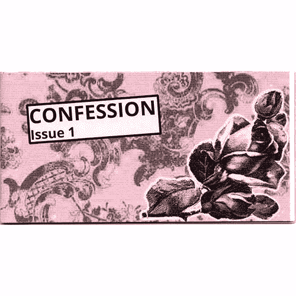

# 协同推荐系统的局限性

> 原文：<https://towardsdatascience.com/limitations-of-collaborative-recommender-systems-9801036941b3?source=collection_archive---------16----------------------->

## 从一个小杂志发行版的角度来看

Zines on display at the Stay Kind! table at Pioneer Valley Zine Fest in April 2018\. (Source: [Stay Kind! Instagram](https://www.instagram.com/p/BhjhLvqBmnv/))

*本文包括一些关于 Stay Kind 的背景！zine 发行版，构建基于购买的协作推荐系统的过程，对推荐的评估，对该系统的局限性的讨论，以及对未来发展的想法。*

# 背景

我记不清[的确切历史了，保持善良！锌发行版](https://www.staykind.com/)。它开始是一个非常非正式的附带项目，经历了几次迭代，从来没有严肃或重要到足以记录。也许这是杂志本质的恰当反映。作为“杂志”的简称，这些自行出版的作品本身就是一种文档——但也可能是有限的、短暂的，并且容易消失。

我没有开始记录任何事情，直到 2016 年年中发生了两个重大变化:

1.  我开始拿别人的杂志。
2.  我承诺将所有销售额的 20%捐赠给有益于我们社区的组织。

这两个改变意味着除了我自己之外，还要对其他人负责。这意味着要跟踪销售和交易情况，而不是随便就把东西送人。

## 决定建立一个推荐系统

制作一个简单推荐系统的最初动力来自几个地方:

*   人们经常向我寻求建议，我不知道该怎么回答他们。
*   [MovieLens data](https://grouplens.org/datasets/movielens/) 很有趣，但我也想建立一个推荐器，为我提供新的信息和实际应用。
*   我认为这将是超级快速和容易的，因为我已经有了所有的数据。(大部分都很快很容易——但是没有什么比你想象的更快更容易。)

该计划是建立一个推荐系统，使用基于购买的协同过滤。你可以在任何时候看到这样的系统，你可以看到“买这个的人也买了…”听这个的人也听…”等等。

# 构建协同推荐系统

## 数据收集

我计划从 Square 和 Stay Kind 上提取交易记录！网站。Square transactions 记录了活动期间面对面的销售和交易。该网站由 WooCommerce 提供支持，由于其报告选项，最终变得有点棘手。我最终从一个单独的电子表格中获取了网上销售信息，这个电子表格是我为跟踪交易而创建的。

Tabling at New Zineland in April 2018.

## 数据探索和预处理

在这两个数据集之间，我有从 2016 年春天到现在(可能)所有销售和交易的记录。有一次，一家图书馆购买了我当时库存的全部 48 本书的两本。我从最终数据中排除了这次销售。

正如所料，大部分事务来自事件，并在 Square 报告中捕获。这里的挑战是，这些购买大多是用现金进行的。虽然我可以对一起购买的物品进行分组，但我无法对同一个人在不同场合购买的物品进行分组，除非他们用一张卡支付，并且每次都使用同一张卡。一个人在三个不同的活动上用至少两张不同的卡从网站上购买杂志。我能够对这些购买进行分组，因为这个人的所有卡上都有相同的名字，但它们是规则的例外。

(在这个过程中，我还注意到有一个人的名片上有埃玛·戈尔德曼这个名字。虽然有可能这是这个人的真名，但我更倾向于相信这是对[活动家](https://en.wikipedia.org/wiki/Emma_Goldman)的致敬，他经常被错误地引用说，“如果我不能跟着它跳舞，那就不是我的革命。”不管怎样，我都笑得很开心。)

总之，在组合、清理和匿名化数据集之后，我最终得到了类似这样的东西:

从这个片段中，我们可以看到客户#544 和#527 都购买了 2015 年 6 月和 7 月的 *Ima Eat You！*

## 协同推荐器

现在我们有了一个单一的数据框架，表明哪些客户拥有哪些商品，我们准备好根据购买情况构建推荐器了。我采取的步骤是:

1.  添加一个名为`Purchased`的新列，所有值都设置为`1`。
2.  在`index='Item', columns='Customer', values='Purchased'`处创建一个数据透视表。
3.  用`0`填充缺失值，创建一个稀疏矩阵。
4.  使用`pairwise_distances`计算余弦相似度。
5.  将距离放入数据帧中，使其易于阅读。

以下是最终数据帧一部分:

(Scroll to the right to view more.)

一个值越接近`0`，这两件商品就是否被同一个人购买而言就越相似。因此与其自身交叉引用的项目将始终等于`0`。

同时，`1`的值表示这两件商品从未被同一个人购买过。看上面的一个例子，这意味着已经买了 *1 周半*的人，没有一个还买了 *9 的爱情药水*。

## 估价

让我们看几个例子来了解这个推荐器实际上做得有多好。

**Ang Pangalawang Pagtatapat:第二部告白**

***Ang Pangalawang Pagtatapat***(Source: [Stay Kind!](https://www.staykind.com/catalog/ang-pangalawang-pagtatapat-second-confessions/))

售出数量:23

以下是网站上的描述:

> 杂志系列的第二期《自白》讲述了不安全感、菲律宾政治的本质以及菲律宾人的心态。作者:苏迈.夏琳。
> 
> 16 页，5.5 x 8.5 英寸

这些建议是基于购买了这个产品的人也买了什么:

People who got **Ang Pangalawang Pagtatapat: The Second Confessions** also got these zines by the same creator. (Source: [Stay Kind!](https://www.staykind.com/))

前两个推荐，*自白*和 *Kulay Ng Balat* ，实际上是提供种族反思的同一系列杂志的一部分。*如果你讨厌一个人…* 是同一作者的另一本杂志。《活着的南方人》是由另一位创作者制作的系列节目，他也专门谈论种族问题。总的来说，这一套建议还是不错的。

**焦虑工具包**

**Anxiety Toolkit** (Source: [Stay Kind!](https://www.staykind.com/catalog/anxiety-toolkit/))

售出数量:26

来自网站的描述:

> 焦虑工具包是我在 48 小时内专门为 2014 年布鲁克林杂志节制作的一次性杂志。这是一个可以用来缓解焦虑的 15 个工具的列表(以及这些工具如何/为什么对我有用的描述)。安妮·h。
> 
> 28 页，4.25 x 5.5 英寸

这些建议是基于购买了这个产品的人也买了什么:

People who got **Anxiety Toolkit** also got these zines by other creators. (Source: [Stay Kind!](https://www.staykind.com/))

这个的结果有点复杂。虽然这本杂志的标题中有“工具包”，并包括降级策略，但作者以非常随意的语气写作，并分享个人故事。这样看来，其实类似于 *Kulay Ng Balat* 和 *Fixer Eraser #2 这样的推荐书目。*其他标题更明显。*心理收缩*、*如何爱我*、*马上变得无忧无虑*、*一切都会好起来*这些都是关于心理健康、正念或自我保健的策略。

我要吃了你！2011 年 6 月

**Ima Eat You! June 2011** (Source: [Stay Kind!](https://www.staykind.com/catalog/ima-eat-you-june-2011/))

售出数量:5

来自网站的描述:

> Dawn“Zilla”Graham 撰写的杂志，主要涵盖日常经历、观察和思考。2011 年 6 月包括寻找一个新的公寓，成为一个容易被说服的人，波士顿之旅，治疗，课程，寓言，食谱，去法院，性暴力，等等。
> 
> 32 页，5.5 x 8.5 英寸

以及基于购买的推荐:

People who got **Ima Eat You! June 2011** also got these other items created by me. (Source: [Stay Kind!](https://www.staykind.com/))

在这种情况下，根据人们的购买情况，只推荐五种商品。所有其他项目都有一个`1`的距离，这意味着——根据记录——没有人得到这个问题的*我吃你！除了上面提到的物品，还有其他物品吗？五个项目中有三个也是我做的。*

同样值得注意的是，售出的总数量是 5 台，远远少于前两个示例中售出的 20 多台。这一期*的大部分份数我吃了你！早在我开始追踪这些东西之前，它们就已经被送走了。虽然*Ang pangala Wang Pagtatapat*和*焦虑工具包*都被它们的创作者多次重新进货，但这一期的所有副本 *Ima 吃了你！*已被认领，绝不转载。*

# 限制

最后一个例子暴露了这种推荐系统在应用于 zine 发行版时的一些局限性。让我们更深入地探讨一下:

杂志通常限量供应。有些用完了也不一定能补上。正因为如此，一份杂志上市的时间也是有限的。根据某本杂志第一次被添加到发行版的时间，或者它脱销的时间，它将与网站上列出的其他杂志中的一部分同时可用。这引发了两个问题。当第一次添加杂志时，存在“**冷启动**问题，这意味着没有以前的购买历史来通知推荐。人们不是从相同的总体选择中进行选择。

同样，由于**有限的桌子空间**，并非所有可用的杂志都会在活动中展示。因为人们从《保持友好》中获得了大部分杂志！在活动中而不是通过网站，这很重要。当杂志卖光后，我会用其他杂志取代它们在桌子上的位置。一天开始时的显示通常与一天结束时完全不同。焦虑工具包在之前的一次活动的第一个小时内就已经销售一空。如果那本杂志还能买到的话，很有可能那些随后过来并得到其他杂志的人也会对那本感兴趣。

另一方面，有些人在活动开始时收到几份杂志，后来又收到更多，因为他们看到新的杂志在展出。这将我们带回另一个限制。由于大多数销售是面对面进行的，使用现金，由同一个人进行的购买通常不能归在一起，即使是在同一天进行的。

最后，虽然这个推荐系统确实提供了关于一起购买的物品的准确信息，但它并不能很好地表明人们实际上喜欢什么。大多数面对面交易的好处在于，人们有机会先浏览一下。这意味着他们非常喜欢他们所看到的东西，并愿意去得到它。我带的大多数杂志都是文字内容丰富的。虽然有些人会站在那里阅读整本杂志，但大多数人直到后来才知道他们对新杂志的感觉。也有这样的情况，人们既给自己买了东西，也给别人买了礼物——所以一起购买的杂志不一定反映一个人的喜好。

(在列举了所有这些限制之后，我觉得有必要列举这个小项目的一个优点:基于购买的协作推荐器构建起来既快又容易。写这篇文章花费的时间比数据收集、预处理和创建推荐系统的时间加起来还要长。)

Zines on display at the Stay Kind! table at Not Another Punk Rock Flea Market in July 2018\. (Source: [Stay Kind! Instagram](https://www.instagram.com/p/BlON_xlBAnI/))

# 未来发展

有很多方法可以为发行版建立一个更好的推荐系统。一些想法包括:

*   使用基于内容的过滤和协作过滤创建一个混合系统。这就意味着要包含各个项目的信息，包括主题、页面大小、彩色与黑白、创作者姓名、文字与图像的比例、成本等。
*   该网站已经允许人们留下评分和评论。我可以更有意识地鼓励人们留下反馈，这样我就可以包括基于评级的协同过滤。
*   如果我在网站上实现这个推荐系统，我会对它进行调整，这样登录的人就不会收到对他们已经拥有的商品的推荐。

*感谢阅读！想法、问题和反馈总是很受欢迎。还可以查看本项目* *的* [*GitHub 回购。*](https://github.com/dawngraham/sk-recommender)