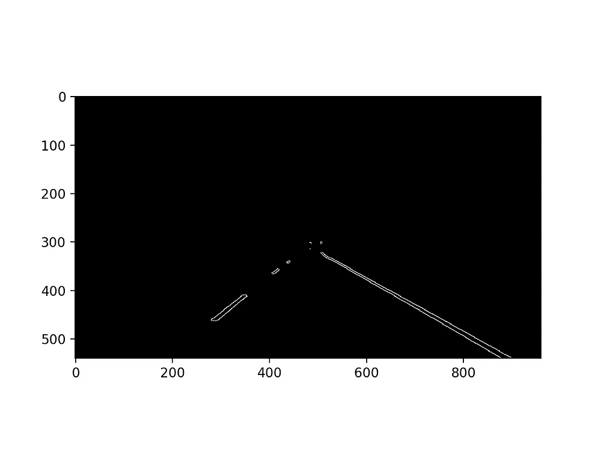

# 线检测:让自动驾驶汽车看到道路线

> 原文：<https://towardsdatascience.com/line-detection-make-an-autonomous-car-see-road-lines-e3ed984952c?source=collection_archive---------10----------------------->


*通过计算机视觉，你可以一步一步地将视频流转换成线状探测器*

# 动机

全自动驾驶乘用车并非“指日可待”。埃隆·马斯克声称**特斯拉**将在 2020 年年底[具备“完全自动驾驶”能力。特别是，他说特斯拉的硬件已经为自动驾驶做好了准备，剩下的只是对他们当前软件的更新，许多杰出的科学家正在为此努力。](https://www.wired.com/story/elon-musk-tesla-full-self-driving-2019-2020-promise/)

我们人类作为司机的第一本能，很可能是看着前方，决定车该往哪里开；在哪个方向，在哪些线之间，等等。由于每辆自动驾驶汽车前面都有一个摄像头，因此一项非常重要的任务是决定汽车应该在其间移动的边界。对人类来说，我们在道路上画线。现在我们将教一辆自动驾驶汽车看到这些线。我保证会很好玩:)

***鸣谢—参考文献***

*这些项目大部分是由麻省理工学院的* [*自动驾驶汽车深度学习*](https://selfdrivingcars.mit.edu) *课程和 Udacity 的* [*自动驾驶汽车工程师*](https://www.udacity.com/school-of-autonomous-systems) *激发的。后者是学习和扩展你的领域技术知识的良好开端。*

# 议程

我们将一步一步地设计孔管道，其中我们将激励我们为什么这样做。
灰度变换
高斯模糊
Canny 边缘检测
遮蔽感兴趣区域
霍夫线检测器
寻找道路线

> 完整的**代码**可以在[这里](https://github.com/ioangatop/AutonomousCar)找到。

在这里，我们将一步一步，提供整个代码的快照。然而，一些部分被省略了，因为这将使邮件非常沉重，并分散我们的目标。因此，如需更多信息，请参考上述知识库。

# **步骤 0:读取图像**

在`matplotlib`的帮助下，我们可以轻松地将 python 脚本中的任何图像加载为三维张量 C-H-W(颜色通道，图像的高度和宽度)

```
import matplotlib.image as mpimgimg_path = 'test_images/solidWhiteCurve'
img = mpimg.imread(img_path)
plt.imshow(img)
plt.show()
```


# **第一步:灰度**

首先，我们要把图像变成灰度图像；只有一个颜色通道。这将有助于我们识别棱角。
我们可以通过`opencv`轻松做到这一点

```
import cv2gray_img = cv2.cvtColor(img, cv2.COLOR_RGB2GRAY)
plt.imshow(gray_img, *cmap*='gray')
plt.show()
```


# 第二步:高斯模糊

将高斯噪声添加到图像中，这非常有用，因为它平滑了像素之间的插值，并且是一种超越噪声和伪梯度的方法。`kernel`越高，结果图像越模糊。

```
kernel_size = 5
gauss_img = cv2.GaussianBlur(gray_img,(kernel_size, kernel_size), 0)
```


# **第三步:** Canny 边缘检测

Canny 边缘检测提供了一种检测图像边界的方法。这是通过图像的渐变来完成的。

> 后者只不过是一个函数，其中每个像素的亮度对应于梯度的强度。

我们将通过追踪沿着最强梯度的像素来找到边缘！一般来说，梯度显示函数变化有多快，像素之间强烈的密度变化将指示边缘。

```
low_threshold, high_threshold = [200, 300]
canny_img = cv2.Canny(gauss_img, low_threshold, high_threshold)
```


正如你所看到的，我们现在可以清楚地识别道路线！(我们甚至可以看到汽车的外形！)

# 步骤 4:遮蔽感兴趣的区域

上图中，有一些离群值；来自道路的其他部分、来自风景(山脉)等的一些边缘。由于我们的相机是固定的，我们可以在图像上加一个*遮罩*，只保留那些我们感兴趣的线条。因此，画一个*梯形*是非常自然的，目的是只保留一个区域，在那里我们应该期望道路线。`cv2`再次为我们而来；)

```
# Setting the corners of the trapezium
vertices = np.array([[(0, img_line.shape[0]), (img_line.shape[1], img_line.shape[0]), (400, 260), (600, 260)]])# make a blank/white image
mask = np.zeros_like(img)
mask_channels = (255,) * img.shape[2]# Fill the area of interest with 0 and 255 these
# which lie outside of it, thoughout all color channels
cv2.fillPoly(mask, vertices, mask_channels)# Keep only the pixels with 0 value of the canny_img
masked_img = cv2.bitwise_and(canny_img, mask)
```



**Left**: Selected Region **Right**: After applying the mask

# 第五步:霍夫线检测器

上面的图像只代表了边缘的点。剩下的就是把边缘连接起来。在这种情况下，我们正在寻找直线，我们将通过将图像传输到称为*霍夫空间*的参数空间来实现这一点。我们现在将处理*极坐标* (rho 和 theta)，其中我们将搜索相交线。

```
import mathlines = cv2.HoughLinesP(img, rho=1, theta=math.pi/180,
                        threshold=15, np.array([]),        
                        *minLineLength*=30,
                        *maxLineGap*=40)line_img = np.zeros((img.shape[0], img.shape[1], 3), *dtype*=np.uint8)
```

以上将返回许多小车道(最小长度是一个超参数 *minLineLength* )。 *line_img* 将是一个列表，其中它的元素是一个列表，由图像空间{(x1，y1)，(x2，y2)}中的两个点组成。众所周知，在 2D 空间中，只有一条直线经过两点。

这里自然会出现一个问题:我们如何连接这些线，并导致只有两条，他们将是道路吗？这可能是这篇文章中最具挑战性的部分。

# **第六步:找到道路线路**

我们的策略如下:
。参照 x 轴将图像分成两半
。用线性回归模型拟合这些点，以找到一条平滑的线。
由于离群值，我们想要一个可以有效处理它们的回归模型。我们将使用`HuberRegressor`。然后，我们将图像限制在 y 轴的某个范围内，并在`cv2.polylines`的帮助下绘制直线。请记住，为了有一条平滑的线，**我们将通过给定的回归量绘制给定的** `**x**` 的 `**y**` **的预测。**

```
import mathdef draw_lines(line_img, lines):
   # CODE HERE
   passlines = cv2.HoughLinesP(img, rho=1, theta=math.pi/180,
                        threshold=15, np.array([]),        
                        *minLineLength*=30,
                        *maxLineGap*=40)line_img = np.zeros((img.shape[0], img.shape[1], 3), *dtype*=np.uint8)
draw_lines(line_img, lines)plt.imshow(line_img)
plt.show()
```

此时，鼓励读者编写上述函数。如果你卡住了或者只是想看看我的版本是什么样子，请在这里看。

我们的结果会是…


# 步骤 7:将线条与原始图像连接起来

通过对两幅图像进行加权，我们可以将它们相加。记住`img_lines`的黑色区域有值`0`，因此相加不会改变输出值。

```
out_img = cv2.addWeighted(img, 0.9, img_lines, 1.0, 0.0)
plt.imshow(out_img)
plt.show()
```


# **备注**

瞧啊。我们已经成功探测到道路了！视频只是一个图像序列，因此，在`moviepy`的帮助下，我们为每一帧绘制上述管道！视频管道将看起来像:

```
from moviepy.editor import VideoFileClipin_video = 'test_videos_output/solidWhiteCurve.mp4'
output_video = 'test_videos_output/out.mp4'clip = VideoFileClip(in_video).subclip(0, 8)
empty_clip = clip.fl_image(YOUR PIPELINE AS A FUNCTION THAT 
                           RETURNS THE WEIGHTED IMAGE)out_clip.write_videofile(output_video, *audio*=False)
```

如前所述，完整的代码可以在这里找到[。随意摆弄参数，想出新的方法来检测道路线。](https://github.com/ioangatop/AutonomousCar)

下次再见，保重！