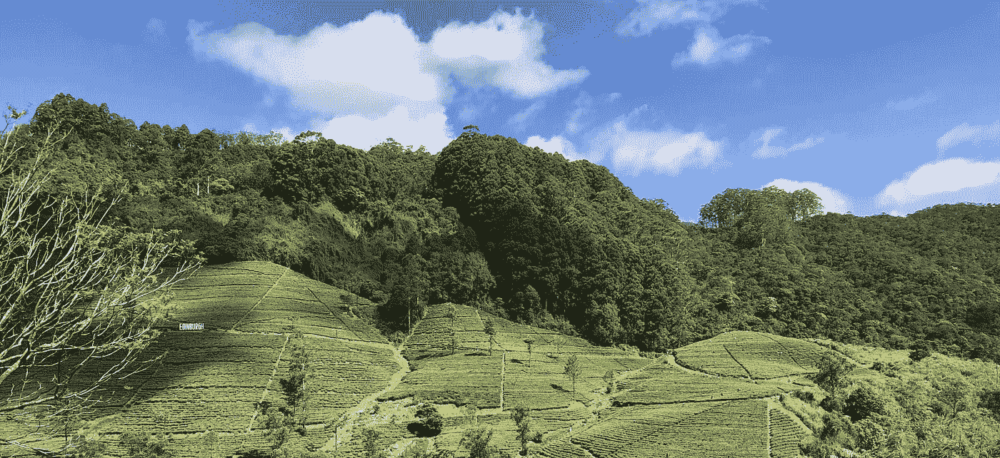
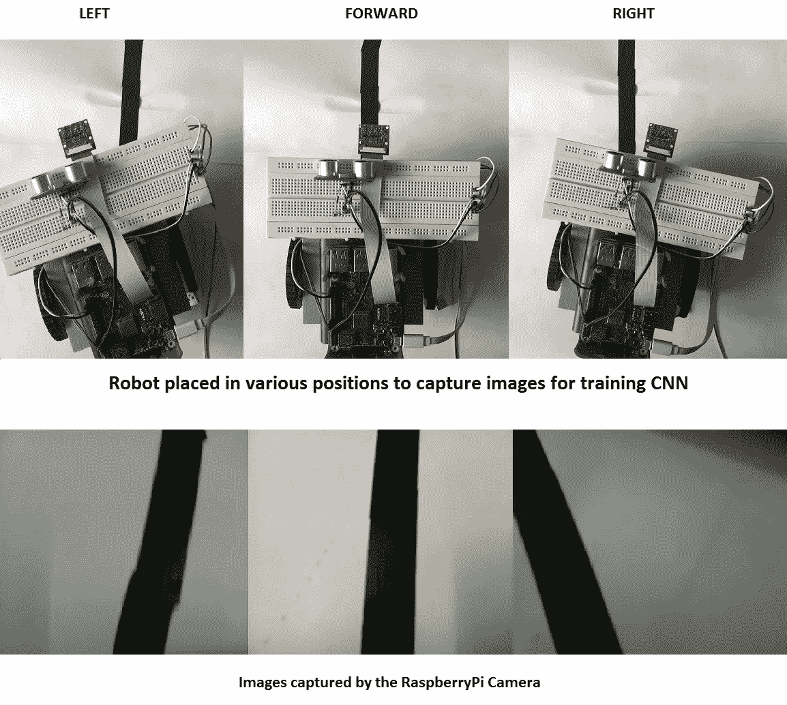
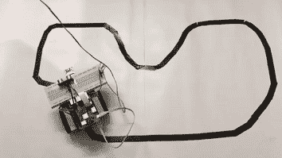

# 基于 CNN 的直线跟随机器人

> 原文：<https://towardsdatascience.com/line-follower-robot-using-cnn-4bb4f297c672?source=collection_archive---------8----------------------->



Image by author

在本教程中，我们将学习如何制作一个线跟随机器人。虽然，有大量的线追随者教程，因为这个概念本身是相当古老的。然而，这里我们将学习如何使用卷积神经网络(CNN)来检测直线。基本上，我们将使用我们的 Raspberry Pi 相机以预定的间隔捕捉一系列图像，然后我们将使用预先训练的 CNN 来预测我们的机器人应该移动的方向，即向前、向右或向左。本教程需要以下内容:-

1.  树莓 Pi 板，
2.  Pi 相机，
3.  跳线
4.  底盘、电机、轮胎
5.  电机控制 IC (L293d)

我假设你已经知道如何使用你的 Raspberry Pi 的 GPIO 引脚来控制电机。如果你想提高你的技能，请浏览我之前的教程。此外，在继续下一步之前，请确保您的 Pi 上安装了 tensorflow 1.1 和 open CV。

我将把本教程分为三个部分

1.  为 CNN 捕捉图像。
2.  训练 CNN
3.  在树莓派上部署 CNN

# 为 CNN 捕捉图像

我们需要三组图像用于三种条件中的每一种，即向前、向左和向右，来训练我们的 CNN。一旦我们训练了我们的 CNN，它将能够预测机器人在哪个方向移动，然后我们可以相应地采取纠正措施。例如，如果生产线左转，CNN 将预测机器人相对于生产线向右移动，因此，我们应该向左移动机器人。



Fig. depicting robot moving in various directions and the corresponding images captured by the camera

可以有各种方法来创建用于训练 CNN 的数据集。在我的例子中，我首先建造了一个轨道。然后，我使用下面提到的代码以 0.5 秒的间隔捕捉一系列图像。然后你把机器人放在轨道上的不同位置，捕捉一系列图像。例如，在第一个图像中，我放置了机器人，这样我希望 CNN 检测到机器人应该向左移动。同样，你在赛道的不同位置重复这个过程。一旦完成，你可以重复这个过程向前和向右。一旦你捕捉到三个方向的图像，将它们分别放入分别命名为向前、向左和向右的文件夹中。

```
# import the necessary packages
from picamera.array import PiRGBArray
from picamera import PiCamera
import time
import cv2

# initialize the camera and grab a reference to the raw camera capture
camera = PiCamera()
camera.resolution = (640, 480) # set the resolution
camera.framerate = 32 # set the frame rate
rawCapture = PiRGBArray(camera, size=(640, 480))

# allow the camera to warm up
time.sleep(0.1)

# capture frames from the camera
start = 1for frame in camera.capture_continuous(rawCapture, format="bgr", use_video_port=True):
  # grab the raw NumPy array representing the image, then initialize the timestamp and occupied/unoccupied text
  image = frame.array
  # show the frame
  cv2.imshow("Frame", image)
  key = cv2.waitKey(1) & 0xFF
  cv2.imwrite(str(start) + ".jpg", image)
  start = start + 1

  # clear the stream in preparation for the next frame
  rawCapture.truncate(0)

  # if the `q` key was pressed, break from the loop
  if key == ord("q"):
    break
  time.sleep(.5)
```

# 训练 CNN

您可以在 raspberry PI 本身或不同的更强大的系统上训练 CNN，然后保存训练好的模型，PI 可以读取该模型。下面是训练 CNN 捕捉图像的代码。

首先，我们导入必要的库。

```
# import the necessary packages
from keras.models import Sequential
from keras.layers.convolutional import Conv2D, MaxPooling2D 
from keras.layers.core import Activation, Flatten, Dense
from keras import backend as K
from keras.preprocessing.image import ImageDataGenerator
from keras.preprocessing.image import img_to_array
from keras.optimizers import Adam
from sklearn.model_selection import train_test_split
from keras.utils import to_categorical
from imutils import paths
import numpy as np
import argparse
import random
import cv2
import os
import matplotlib
```

然后我们定义一个可以用来构建 CNN 的类`LeNet`。这里你可以看到这个类有一个函数`build` ，它接受参数`width`、`height`、`depth`和`classes`。宽度和高度应该等于您将用作 CNN 输入的图像的宽度和高度。在我的例子中，我使用的是 28x28 的图像，因此宽度和高度分别是 28。深度定义输入图像中的通道数。单色的深度为 1，RGB 的深度为 3。类别定义了您希望 CNN 检测的不同类型图像的数量。在我们的例子中，我们想要区分 3 种类型的图像——前向、左向和右向。

```
class LeNet:
  [@staticmethod](http://twitter.com/staticmethod)
  def build(width, height, depth, classes):
    # initialize the model
    model = Sequential()
    inputShape = (height, width, depth)# first set of CONV => RELU => POOL layers
    model.add(Conv2D(20, (5, 5), padding="same",
      input_shape=inputShape))
    model.add(Activation("relu"))
    model.add(MaxPooling2D(pool_size=(2, 2), strides=(2, 2)))# second set of CONV => RELU => POOL layers
    model.add(Conv2D(50, (5, 5), padding="same"))
    model.add(Activation("relu"))
    model.add(MaxPooling2D(pool_size=(2, 2), strides=(2, 2)))# first (and only) set of FC => RELU layers
    model.add(Flatten())
    model.add(Dense(500))
    model.add(Activation("relu"))# softmax classifier
    model.add(Dense(classes))
    model.add(Activation("softmax"))# return the constructed network architecture
    return model
```

当您调用`build` 函数时，它将定义一个具有两个卷积层和一个两个密集层的神经网络。人们可以试验这些层的参数，或者甚至添加额外的层来提高模型的准确性。接下来，提供培训图像文件夹所在的路径。您必须已经创建了三个文件夹向前、向左和向右，并将上面捕获的相应图像放在各自的文件夹中。

```
dataset = '/home/pi/Desktop/tutorials/raspberry/trainImages/' # please change this path
# initialize the data and labels
print("[INFO] loading images...")
data = []
labels = []

# grab the image paths and randomly shuffle them
imagePaths = sorted(list(paths.list_images(dataset)))
random.seed(42)
random.shuffle(imagePaths)# loop over the input images
for imagePath in imagePaths:
    # load the image, pre-process it, and store it in the data list
    image = cv2.imread(imagePath)
    image = cv2.resize(image, (28, 28))
    image = img_to_array(image)
    data.append(image)# extract the class label from the image path and update the
    # labels list
    label = imagePath.split(os.path.sep)[-2]
    print(label)
    if label == 'forward':
        label = 0
    elif label == 'right':
        label = 1
    else:
        label =2
    labels.append(label)
```

然后，上面的代码获取子文件夹中每个图像的路径，存储在列表`imagePaths`中，并对它们进行重排。在训练模型时，随机提供来自每个类的数据是必要的。此外，每个图像然后被读取、调整大小、转换成 numpy 数组并存储在`data`中。现在，我们还必须给每个图像分配一个标签。为此，我们从每个图像的图像路径中提取文件夹名称。然后，我们比较文件夹名称是否为“转发”,我们指定标签为 0。类似地，标签 1 和 2 被分配给文件夹“右”和“左”中的图像。这就是为什么需要创建子文件夹，并将相似的图像放在不同的文件夹中。

```
# scale the raw pixel intensities to the range [0, 1]
data = np.array(data, dtype="float") / 255.0
labels = np.array(labels)

# partition the data into training and testing splits using 75% of
# the data for training and the remaining 25% for testing
(trainX, testX, trainY, testY) = train_test_split(data,
    labels, test_size=0.25, random_state=42)# convert the labels from integers to vectors
trainY = to_categorical(trainY, num_classes=3)
testY = to_categorical(testY, num_classes=3)
```

接下来，图像被归一化，使得每个像素的值在 0 和 1 之间。然后，将图像划分为训练集和测试集，以检查模型性能。在接下来的步骤中，我们使用 LeNet 类构建模型，根据训练数据训练模型，然后保存训练数据。

```
# initialize the number of epochs to train for, initial learning rate,
# and batch size
EPOCHS = 15
INIT_LR = 1e-3
BS = 32# initialize the model
print("[INFO] compiling model...")
model = LeNet.build(width=28, height=28, depth=3, classes=3)
opt = Adam(lr=INIT_LR, decay=INIT_LR / EPOCHS)
model.compile(loss="binary_crossentropy", optimizer=opt,
    metrics=["accuracy"])

# train the network
print("[INFO] training network...")
H = model.fit(trainX, trainY, batch_size=BS,
    validation_data=(testX, testY),# steps_per_epoch=len(trainX) // BS,
    epochs=EPOCHS, verbose=1)

# save the model to disk
print("[INFO] serializing network...")
model.save("model")
```

# 部署 CNN

一旦我们训练了我们的模型，我们就可以在我们的 Pi 上部署它。你可以使用下面提到的代码根据 CNN 的预测来控制机器人的方向。首先，我们从导入必要的库开始。这里我们也使用了`motor_control.py`文件，你可以在我之前的教程中找到。

```
# import the necessary packages
from keras.preprocessing.image import img_to_array
from keras.models import load_model
import numpy as np
import cv2, time, sys, imutils, argparse
import RPi.GPIO as GPIO
from picamera.array import PiRGBArray
from picamera import PiCamera
import motor_control as mc
```

接下来，定义您将用来控制电机的 raspberryPi 的引脚。

```
GPIO.setmode(GPIO.BCM)#choose the GPIO pins for mptor control
fwd1 = 23  # pin 16
bwd1 = 24 #pin 18
fwd2 = 16 # pin 36
bwd2 = 20 # pin 38# declare selected pin as output pin
GPIO.setup(fwd1, GPIO.OUT)
GPIO.setup(bwd1, GPIO.OUT)
GPIO.setup(fwd2, GPIO.OUT)
GPIO.setup(bwd2, GPIO.OUT)
```

接下来，我们定义一个函数`control_robot`，它将根据模型的预测控制机器人的方向。

```
#function to control direction of robot based on prediction from CNN
def control_robot(image):
  prediction = np.argmax(model.predict(image))
  if prediction == 0:
    print("forward")
    mc.forward()
  elif prediction == 2:
    print("left")
    mc.left()
  else:
    print("right")
    mc.right()
```

接下来，我们初始化相机，并开始在预定的时间间隔抓取图像。这些图像中的每一个都经过预处理，类似于我们对训练图像所做的那样。然后，该图像被传递给控制机器人方向的功能`control_robot`。

```
model = load_model("model")if __name__ == "__main__":
  try:
    mc.stop()
    # initialize the camera and grab a reference to the raw camera capture
    camera = PiCamera()
    camera.resolution = (640, 480)
    camera.framerate = 32
    rawCapture = PiRGBArray(camera, size=(640, 480))
    # allow the camera to warmup
    time.sleep(0.1)
    # capture frames from the camerafor frame in camera.capture_continuous(rawCapture, format="bgr", use_video_port=True):
     # grab the raw NumPy array representing the image, then initialize the timestamp
     # and occupied/unoccupied text
     image = frame.array
     # show the frame
     key = cv2.waitKey(1) & 0xFF image = cv2.resize(image, (28, 28))
     image = img_to_array(image)
     image = np.array(image, dtype="float") / 255.0
     image = image.reshape(-1, 28, 28, 3)
     #cv2.imshow("Frame", image[0]) control_robot(image) # clear the stream in preparation for the next frame
     rawCapture.truncate(0) except KeyboardInterrupt:
    mc.stop()
    GPIO.cleanup()
    sys.exit()
```

如果一切顺利，当您在 Raspberry Pi 上运行这段代码时，您将能够看到类似的结果。



我希望你喜欢这个教程。请随时评论和询问或提出一些建议。非常感谢 Adrian Rosebrock 关于 RaspberryPi 的精彩教程，我在这里以此为基础。做检查他的[网站](https://www.pyimagesearch.com/)。