# ML 线性代数与概率论复习

> 原文：<https://towardsdatascience.com/linear-algebra-and-probability-theory-review-for-ml-e3d2d70c5eb3?source=collection_archive---------30----------------------->

## 任何数据科学家都必须知道的矩阵、向量和概率论基础知识

Photo by [Oleg Magni](https://www.pexels.com/@oleg-magni?utm_content=attributionCopyText&utm_medium=referral&utm_source=pexels) from [Pexels](https://www.pexels.com/photo/human-hand-on-computer-keyboard-2058144/?utm_content=attributionCopyText&utm_medium=referral&utm_source=pexels)

# 矩阵

*   按行和列组织的一组元素。
*   行是水平线，列是垂直线，它们通常都是零索引的。

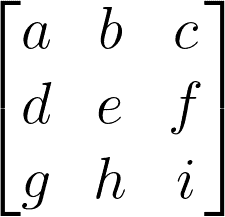

Matrix Example

*   矩阵维度: (行数)x(列数)
*   矩阵加法和减法

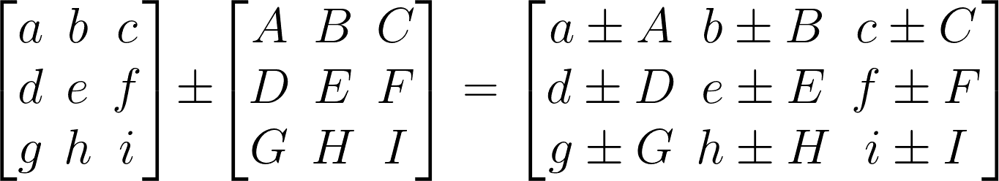

Matrix summation/subtraction example

*   矩阵乘法
    Mat A x Mat B
    (2，3) x (3，2)
    (Ai，Aj) x (Bi，Bj)内部尺寸(Aj & Bi)必须相等，以便能够执行具有外部尺寸(Ai，Bj)大小的输出矩阵的矩阵乘法

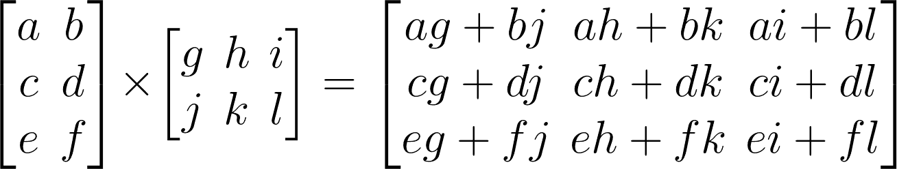

Matrix multiplication example

*   矩阵转置
    一个(3x2)矩阵转置产生一个(2x3)矩阵

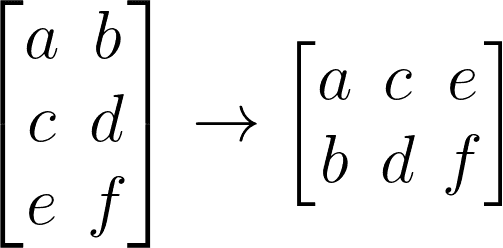

Matrix transpose example

*   矩阵的逆矩阵
    I 被称为单位矩阵，它全是 0，对角线上的 1 与 a 的维数相同

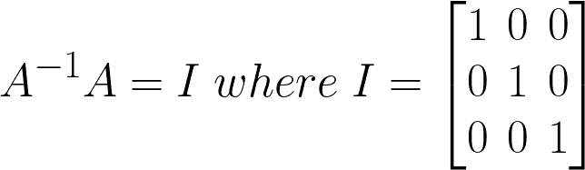

# 向量

*   向量是 n×1 矩阵
*   表示 n 维空间中的直线

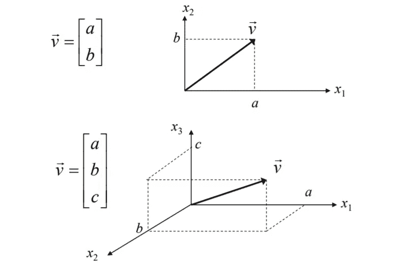

*   向量幅度(范数):给出向量的长度

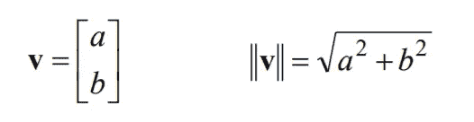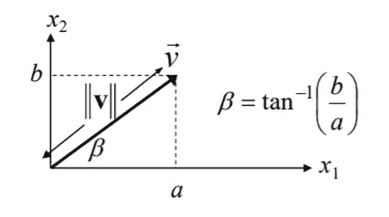

*   单位向量:范数= 1 的向量
*   对于 n 维向量

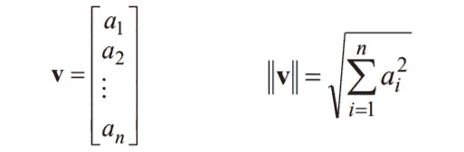

*   向量平方的范数等于

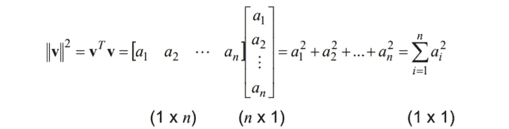

*   向量点积

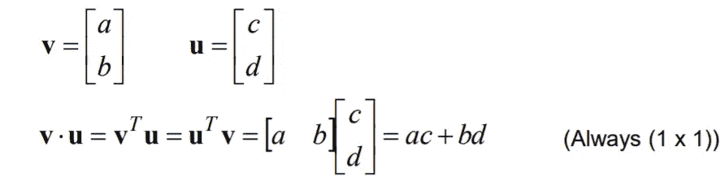

*   对于 n 维向量

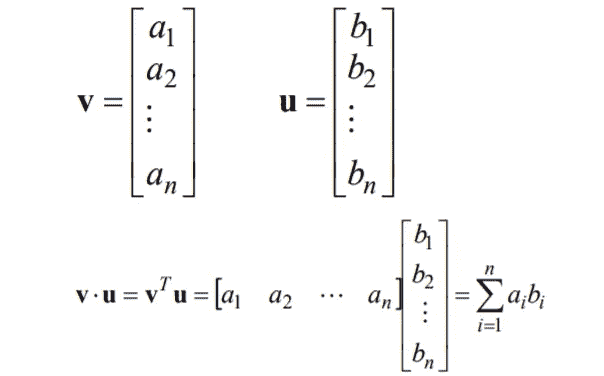

*   点积可以表示为

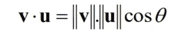

Dot product rule

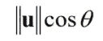

The projection of the vector u on the vector v,

*   如果 v 是一个单位向量，那么点积等于向量 u 在向量 v 上的投影
*   如果两个向量都是单位向量，那么如果两个向量完全对齐，点积将最大
*   如果两个向量正交，那么点积等于 0

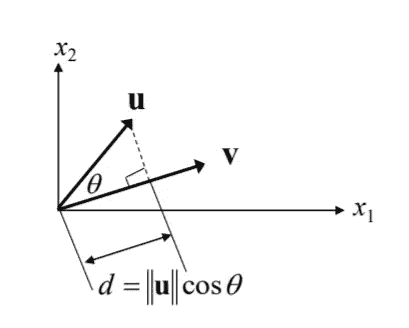

# 概率论

概率论是我们处理世界不确定性的方式，它是一个数学框架，估计一个事件相对于其他可能事件发生的概率。概率是很多机器学习算法的非常深的层次。

我们来讨论一下解释概率论最著名的经验。**掷两次公平硬币**
在这个例子中，样本空间是所有可能结果的集合。
SS = { HH，TH，HT，TT }T 是反面， *H* 是正面。在大多数情况下，你会对所有可能结果的子集感兴趣，例如，你可能只对两次投掷都是正面的结果感兴趣 *{HH}* ，或者对两次投掷产生不同正面的事实感兴趣 *{HT，TH}。*
一个事件的概率是分配给一个事件的数 *Pr(X)* 。
*>= 0
Pr(SS)= 1*(记住 *SS* 是样本空间)
Frequentists 统计:
*Pr(X)= N(X)/N*
—如果我们重复实验 *X* *N* 次。如果 *n(X)* 是我们观察 *X.* 的次数，那么 *Pr(X) = n(X)/N*

## 联合概率

对于两个事件 X 和 Y，联合概率是 X 和 Y 同时发生的概率，第一次掷是正面，第二次掷是反面的概率是多少。
*Pr(1st 是 H，2nd 是 T) = Pr(1st 是 H) Pr(2nd 是 T) = 0.5 * 0.5 = 0.25。* 如果 *X* 是*{ HH }**B*是 *{HT，TH}，*联合概率 *P(XY)* 为 0，因为 *X* 和 *Y* 不可能同时发生。

## 独立性ˌ自立性

如果两个事件 *X，Y* 是独立的，那么

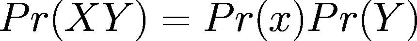

也就是说, *X* 发生，并没有说明 y 发生的概率。在硬币的例子中，如果第一次投掷产生了 H，这并不意味着第二次投掷也有可能是 H 和 T，仍然有 50%的机会。

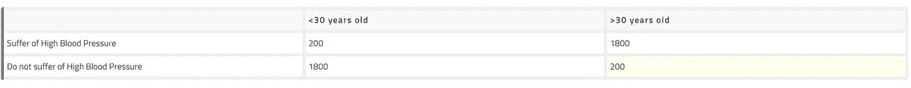

High Blood Pressure test results

在上图中，是对 30 岁以下的人和 30 岁以上的人进行高血压测试的结果。该表显示了一个样本的结果。
如果 *X* 是{受试者不到 30 岁}， *Y* 是{受试者没有高血压}

*Pr(XY)* 是 1800/4000，
*Pr(X)* 是 2000/4000，
*Pr(Y)* 是 2000/4000
由于 *Pr(XY)* 不等于 *Pr(X)PR(Y)* ，这就意味着 *X* 和

## *调节*

*如果 *X* 和 *Y* 都是 *Pr(X) > 0* 的事件，则 *Y* 给定 *X* 的条件概率为*

*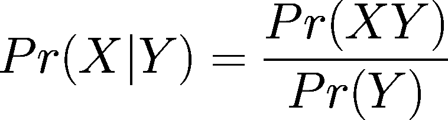*

*简单来说，这意味着如果我们知道 *Y* 发生了，那么 *X* 的概率是多少？*

**

*High Blood Pressure test results*

*再次回到上图中的例子，如果 *X* 是{受试者不到 30 岁}， *Y* 是{受试者没有高血压}*

**Pr(X|Y)* =？
在我们知道受试者没有高血压的情况下，他/她不到 30 岁的概率是多少？
*Pr(X | Y)= Pr(XY)/Pr(X)*=(1800/4000)/(2000/4000)= 0.9
*Pr(Y | X)= Pr(XY)/Pr(Y)*=(1800/4000)/(2000/4000)= 0.9
两者相同只是*

*如果我们知道 *X* 和 *Y* 是独立的，那么 *Pr(A|B) = Pr(A)* ，请记住掷硬币的例子，如果我们知道没有一个输出对另一个输出有特殊影响，那么任何输出发生的概率既不影响任何先前条件，也不受任何先前条件的影响。*

## *贝叶斯法则*

*给定 2 个事件 X 和 Y，并假设 Pr(X) > 0，则*

***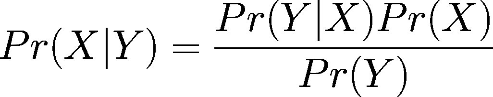**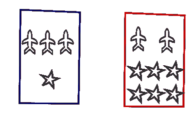*

*Boxes example, a sketch made by skettchboard*

*如果我们有两个盒子，其中一个是红色的，另一个是蓝色的，蓝色的盒子包含 3 个平面和 1 颗星，红色的盒子包含 6 颗星和 2 个平面。
让 *Pr(从蓝色盒子中挑选)*为 60%， *Pr(从红色盒子中挑选)*为 40%。*

*形状是 S，盒子是 B
*Pr(B = r)= 0.4
Pr(B = B)= 0.6**

*条件概率:
*Pr(S = p | B = r)= 1/4
Pr(S = h | B = r)= 3/4
Pr(S = p | B = B)= 3/4
Pr(S = h | B = B)= 1/4**

*挑平面的概率:
这可以解释为我们选蓝框就从蓝框里挑平面的概率，选蓝框就从蓝框里挑平面的概率。
*Pr(S = p)= Pr(S = p | B = r)p(B = r)+Pr(S = p | B = B)p(B = B)=*1/4 * 4/10+3/4 * 6/10 = 11/20*

*这是你继续你的 ML 之旅所需要了解的基本知识，祝你好运！*