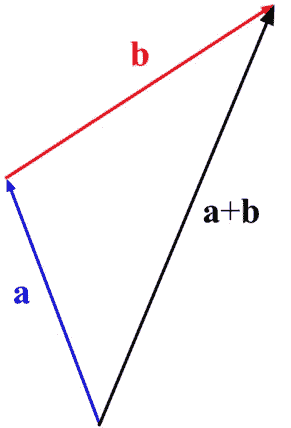
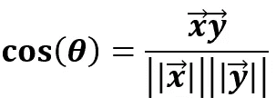

# Numpy 线性代数基础(第一部分)

> 原文：<https://towardsdatascience.com/linear-algebra-essentials-with-numpy-part-1-af4a867ac5ca?source=collection_archive---------4----------------------->

啊，数学。你不可能永远回避它。你可以尝试，然后更努力地尝试，但迟早需要一些基本的直觉，前提是你认真努力推进你在数据科学领域的职业生涯。


Photo by [Antoine Dautry](https://unsplash.com/@antoine1003?utm_source=medium&utm_medium=referral) on [Unsplash](https://unsplash.com?utm_source=medium&utm_medium=referral)

说到线性代数，我非常喜欢这句话:

> 如果数据科学是蝙蝠侠，线性代数就是罗宾。[1]

它以一种非技术性的方式巧妙地抓住了本质。

***为什么要学习线性代数？***

问得好。
简单来说，如果你理解了它，你将能够为机器学习和深度学习算法开发出更好的直觉，而不会把它们视为黑盒。此外，你还可以从头开始开发算法，并对它们进行自己的修改。

不仅如此，你还会被认为是一个很酷的孩子，就像这两个:

By [GIPHY](https://giphy.com/gifs/ggXevqJhT6cLe/html5)

太棒了。

***我为什么要看这个帖子？***

这篇文章当然不会教你关于这个话题的每一个细节，有太多的书涵盖了这些。这篇文章也不会深究证据，再说一遍，如果你对数学或科技感兴趣的话，就去读一本书吧。然而，这篇文章将为你提供 14 个不同领域的线性代数(和一些简单的计算)背后的基本直觉。

是的，你没看错。我计划在两篇文章中涵盖 14 个不同的主题。你会花一些时间去阅读(我也会花一些时间去写)，但是如果你是新手，我强烈建议你每天最多阅读 2-3 个主题，然后在网上搜索更多的练习题。

***文章结构如何？***

因此，每个主题分为 3 个部分:

1.  理论解释
2.  示例(手工计算)
3.  用 Python 实现(用 Numpy)

我不骗你，这将是一个很大的工作量。这第一部分将涵盖[向量](https://en.wikipedia.org/wiki/Vector_(mathematics_and_physics))，以下是主题列表:

1.  添加
2.  纯量乘法
3.  点积
4.  标准
5.  单位向量
6.  向量之间的角度

现在介绍完了，就不要推迟必然了。喝杯咖啡(或者更烈的东西)，和我一起去线性代数的神奇世界吧。

You after finishing this article. By [GIPHY](https://giphy.com/gifs/BmmfETghGOPrW/html5)

# 什么是向量？

是啊，如果你不知道向量是什么，就没有必要从向量加法开始。首先，把向量想象成空间中的箭头。这里你需要记住两个量:

*   方向
*   重要

我说的方向是指**箭头指向**的空间位置，而大小告诉你**在那个方向上你应该走多远**。如果你只有大小，没有方向，那么你说的就是*标量*。一旦给标量一个方向，它就变成了矢量。

我说你应该试着把向量想象成箭头——这是一个完美的术语，因为箭头既有明确的方向，也有明确的大小(长度)。

向量通常用小写字母**和上面指向右边的箭头**表示:


**简单，对吧？**
现在让我们开始一些向量运算吧，我知道你一定很不耐烦(* *笑* *)。

# 1.向量加法

让我们开始第一个向量运算，这是向量加法(减法的工作方式是一样的，显然，只是你用减号代替了加号)。

这个基本操作真的没什么好说的，只说是通过**添加相应的组件**来执行的。如果你考虑向量会发生什么，而不仅仅是单纯的数字相加，这有助于理解这个观点。

看看这张来自[维基共享](https://commons.wikimedia.org/wiki/File:Vector_addition.png)的照片:



Vector Addition

简单来说，就是把矢量 ***b*** 加到矢量*(得到 ***a+b*** )，从原点画出矢量 ***a*** ，再从矢量 ***a*** 的尖端画出矢量 ***b*** 。现在要得到 ***a+b*** ，只需要将原点连接到矢量 ***b*** 的尖端。*

*如果你第一次听到这个，可能会觉得有点夸张，但是只要拿起笔和纸画出来，你马上就会明白它的要点。*

*这是矢量加法的一般公式:*

**

*现在我将手工做一个简单的例子，稍后我将用 Python 实现这个例子。*

**

*再一次，拿一张纸来画这个——这非常直观。*

*Python 中的实现:*

```
*v = np.array([3, 7])
u = np.array([2, 2])print(v + u)*
```

*如您所见，Numpy 允许您使用加法运算符，非常简洁！*

# *2.纯量乘法*

*让我引用我在本文前面说过的话:*

> *如果你只有大小，没有方向，那么你说的就是标量。*

*这实质上意味着标量是一个单一的数字，它只能改变矢量的大小，而不能改变它的方向。这实际上意味着，乘以任何标量的矢量将保持在同一条“线上”，它将具有相同的方向，只是它的长度会改变。*

*太棒了，让我们看看标量乘法的公式:*

**

*以上， ***n*** 代表任意数字。让我们看一个例子。标量 ***n*** 将为 2，这意味着向量的每个分量都将乘以 2。*

**

*Python 中的实现:*

```
*v = np.array([3, 7])print(2 * v)*
```

*太棒了，我们进入下一个话题！*

# *3.点积*

*要计算两个向量的点积，首先需要用**乘以对应的元素** ( ***x1*** 乘以 ***y1*** 、 ***x2*** 乘以 ***y2*** 等等)，然后**求和乘积项**。*

*当你看到通式时，这个概念实际上更容易理解，所以它是这样的:*

**

*现在我将写下一个二维空间中两个向量的基本例子:*

**

*Python 中的实现:*

```
*v = np.array([3, 7])
u = np.array([2, 2])print(v.dot(u))*
```

*是的，这就是关于点积的大部分内容——没什么可谈的。*

# *4.向量范数*

*范数是向量长度或大小的另一个术语，用两边的双管(||)表示。它被定义为一个矢量的每个分量的平方和的平方根，你将在下面的公式中看到。*

*计算过程分为三步:*

1.  *将每个组件平方*
2.  *对所有平方求和*
3.  *求平方根*

*你可以想象，这个公式简单得愚蠢:*

**

*这是一个二维空间中向量的实际例子:*

**

*Python 中的实现:*

```
*v = np.array([3, 2, 7])print(np.linalg.norm(v))*
```

# *5.单位向量*

*计算单位向量的主要原因是，你只关心方向，而不关心大小。这个标准化过程包括去除幅度，这样就不会影响其他计算。[2]*

*单位矢量通常用帽子符号(^)表示，通过计算范数，然后用该范数除矢量的每个分量来计算。*

*事不宜迟，公式如下:*

**

*作为一个例子，我将从一个任意的三维向量计算单位向量:*

**

*你不必做最后一步——除以平方根——但它使最终结果更有吸引力。*

*Python 中的实现在这里会有点不同。Numpy 中没有**内置函数**用于计算单位向量(至少我不知道)，但是因为你知道公式，所以计算过程比较繁琐。我已经声明了一个函数，它将一个向量作为输入，然后返回这个向量除以它的范数:*

```
*def unit_vector(v):
    return v / np.linalg.norm(v)u = np.array([3, 6, 4])
print(unit_vector(u))*
```

# *6.向量之间的角度*

*这可能是线性代数中我最感兴趣的话题。原因是我在日常工作中到处用它来做一些很酷的事情。*

*向量之间的角度计算有很多实际应用。在 **NLP** ( [*自然语言处理*](https://en.wikipedia.org/wiki/Natural_language_processing) )中寻找非常相似的字符串时广泛使用。例如，当对一些文本数据使用 [TF-IDF](https://en.wikipedia.org/wiki/Tf%E2%80%93idf) 时，每个输入(试着把输入想象成一个单独的电子邮件文本)都被转换成一个向量。*

*通过这样做，您将确保所有向量都是相同的维数，如果输入在某个位置包含某个单词，则向量的相应分量的值将是 1，否则为 0。如果你计算向量之间的角度，角度最小的向量会更相似(在电子邮件的例子中，就像两封邮件是关于同一个主题的)。*

*希望你能看到你的项目中潜在的用例，如果没有，不要担心，你最终会看到的。*

*这是计算角度的公式。没什么特别的，你把两个向量的**点积**除以范数的**积:***

**

*这是两个任意三维向量的简单例子:*

**

*与单位向量一样，Numpy 没有用于角度计算的内置函数。但是嘿，你知道这个公式，*所以这能有多难呢？*
这里唯一的“窍门”是将弧度转换成度数，因为 Numpy 默认情况下将以弧度返回结果。其他的一切都和你想象的一样简单。*

*代码如下:*

```
*def angle_between(v1, v2):
    dot_pr = v1.dot(v2)
    norms = np.linalg.norm(v1) * np.linalg.norm(v2)

    return np.rad2deg(np.arccos(dot_pr / norms))v = np.array([1, 4, 5])
u = np.array([2, 1, 5])print(angle_between(v, u))*
```

*这基本上结束了关于向量的讨论。没那么糟吧？*

# *结论*

*这就是数据科学中线性代数的一些基本要素，至少对于向量来说是这样。下一篇文章将会隐藏矩阵，并且会比这篇文章长一点。*

*在你等待的时候，我强烈建议你去 YouTube 上看看这个精彩的频道，尤其是这个播放列表。它真正深入到线性代数的基本和高级概念背后建立直觉。如果你知道如何计算，但不知道为什么要计算，这个频道是我真诚的推荐。*

*3Blue1Brown — Essence of linear algebra playlist*

*感谢阅读。*

# ***第二部分:***

*[](/linear-algebra-essentials-with-numpy-part-2-d15717eebfd9) [## Numpy 线性代数基础(第二部分)

### 学习数据科学的基本线性代数技能—第 2/2 部分

towardsdatascience.com](/linear-algebra-essentials-with-numpy-part-2-d15717eebfd9) 

By [GIPHY](https://giphy.com/gifs/3o7qE1Thg4KxFpMGSk/html5)* 

**喜欢这篇文章吗？成为* [*中等会员*](https://medium.com/@radecicdario/membership) *继续无限制的学习。如果你使用下面的链接，我会收到你的一部分会员费，不需要你额外付费。**

*[](https://medium.com/@radecicdario/membership) [## 通过我的推荐链接加入 Medium-Dario rade ci

### 作为一个媒体会员，你的会员费的一部分会给你阅读的作家，你可以完全接触到每一个故事…

medium.com](https://medium.com/@radecicdario/membership)* 

# *参考*

*[1][https://www . analyticsvidhya . com/blog/2019/07/10-应用-线性代数-数据-科学/](https://www.analyticsvidhya.com/blog/2019/07/10-applications-linear-algebra-data-science/)*

*[2][https://stack overflow . com/questions/2304634/why-do-we-need-a-unit-vector-in-other-words-why-do-we-need-normalize-vector](https://stackoverflow.com/questions/2304634/why-do-we-need-a-unit-vector-in-other-words-why-do-we-need-to-normalize-vector)*