# Numpy 线性代数基础(第二部分)

> 原文：<https://towardsdatascience.com/linear-algebra-essentials-with-numpy-part-2-d15717eebfd9?source=collection_archive---------12----------------------->


Photo by [Markus Spiske temporausch.com](https://www.pexels.com/@markusspiske?utm_content=attributionCopyText&utm_medium=referral&utm_source=pexels) from [Pexels](https://www.pexels.com/photo/photo-of-green-data-matrix-1089438/?utm_content=attributionCopyText&utm_medium=referral&utm_source=pexels)

几天前，我发表了数据科学线性代数系列的第一部分。它涵盖了 6 个关键概念和术语，因此如果您还没有阅读，我强烈建议您先阅读该部分:

[](/linear-algebra-essentials-with-numpy-part-1-af4a867ac5ca) [## Numpy 线性代数基础(第一部分)

### 学习数据科学的基本线性代数技能—第 1/2 部分

towardsdatascience.com](/linear-algebra-essentials-with-numpy-part-1-af4a867ac5ca) 

由于前一部分已经讲述了为什么和这个故事是什么(例如*为什么线性代数*)，这一部分将直接切入正题。文章的结构是一样的。每个主题分为 3 个部分:

1.  理论解释
2.  示例(手工计算)
3.  用 Python 实现(用 Numpy)

关于主题，我想说的是:

1.  矩阵加法
2.  纯量乘法
3.  矩阵乘法
4.  矩阵的转置
5.  单位矩阵
6.  决定因素
7.  矩阵求逆

是的，我知道，这将是一个很大的工作量，再次。你对此无能为力——拿起一杯咖啡(*或苏格兰*)，让我们开始吧！

By [GIPHY](https://giphy.com/gifs/26BRzQS5HXcEWM7du/html5)

# 什么是矩阵？

据[维基百科](https://en.m.wikipedia.org):

> 矩阵是数字或其他数学对象的矩形阵列，定义了加法和乘法等运算。[1]

作为一名数据科学家，你一直在使用矩阵，但你可能还不知道(只是还不知道)。您过去使用的任何数据集都可以被认为是一个矩阵——一个由数字组成的矩形阵列— **行和列**更具体地说。

从数据科学家的角度来看，你可能想知道矩阵和向量有什么不同。简单来说，vector 是你数据集中的一个**单列**(属性)，而 matrix 是所有列的**集合。**

矩阵通常用大写加粗字母表示，例如:

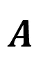

和向量一样，掌握关键概念并不困难。

让我们深入一些例子。

# 1.矩阵加法

矩阵加法(或减法)和你之前用向量做的很相似。唯一的区别是有多列而不是只有一列。

整个想法保持不变，你只需要**把相应的组件**加起来。在通式中，我使用了 ***a*** 和 *b* 作为占位符，你可以看到每个部分是如何相加的:

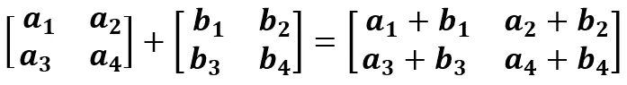

虽然这很容易理解，但这里有一个简单的 2 矩阵加法的例子:

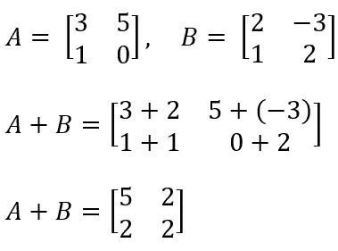

矩阵加法在 [Numpy](https://numpy.org/) 中实现非常简单。同样，与向量一样，您可以使用加号:

```
A = np.matrix([
    [3, 5],
    [1, 0]
])
B = np.matrix([
    [2, -3],
    [1, 2]
])print(A + B)
```

# 2.纯量乘法

这些概念与向量或多或少是一样的。矩阵中的每一个数字都会乘以一些标量 ***n*** 。

公式也很相似:

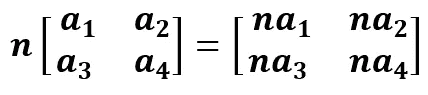

对于这个例子，我选择使用一个任意的矩阵，并将标量 ***n*** 设置为 2:

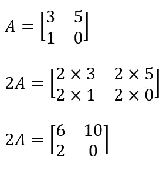

Python 中的实现:

```
A = np.matrix([
    [3, 5],
    [1, 0]
])print(2 * A)
```

*一切都和向量非常相似，对吗？*

保持这种想法。

# 3.矩阵乘法

这里有一个话题，我想说的是，它比迄今为止遇到的其他话题要稍微复杂一些。这并不像一开始看起来那么难，但是你需要解决几个例子才能完全理解要点。

对于矩阵乘法部分的以下示例，声明了两个矩阵:

1.  矩阵 **A** —尺寸为 *m* 乘 *n* ( *m* 行， *n* 列)
2.  矩阵 **B** —尺寸为 *n* 乘 *p* ( *n* 行， *p* 列)

将 **A** 和 **B** 相乘将产生一个新矩阵，其尺寸为 *m* 乘以 *p* ( *m* 行乘以 *p* 列)。简单地说，得到的矩阵将具有矩阵 **A** 的行数和矩阵 **B** 的列数。

By [GIPHY](https://giphy.com/gifs/fpXxIjftmkk9y/html5)

在你完全理解最后一段之前，你可能需要读几遍，这没关系。为了帮助你，我现在所说的一切都是可视化的:

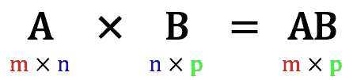

This helps, right?

如你所见，中间的两个 *n* 需要匹配。如果它们不相等，**矩阵乘法不能被执行**。大多数编程语言都会抛出一个关于**尺寸不匹配**的错误。

好了，现在当你理解了矩阵乘法的基本规则，你就为通式做好了准备:

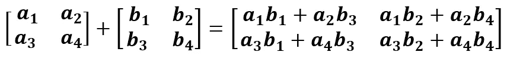

用最普通的方式陈述(*请把这个嵌入你的大脑*):

> 通过计算矩阵 A 的相应行和矩阵 b 的相应列的点积来执行矩阵乘法

如果你理解了那句话，你就理解了矩阵乘法。如果没有，让我们用一个简单的例子来说明这一点:

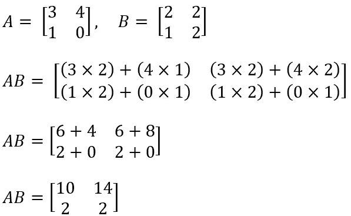

与向量一样，您可以使用 ***点*** 函数来执行与 Numpy 的乘法:

```
A = np.matrix([
    [3, 4],
    [1, 0]
])
B = np.matrix([
    [2, 2],
    [1, 2]
])print(A.dot(B))
```

如果第一次阅读后很难理解，不要担心。矩阵乘法对我来说也是一个很难理解的概念，但是真正有帮助的是在纸上手工做。网上有很多例子。

不想找例子就自己编，然后用 Numpy 验证——*像个 boss* 。

# 4.矩阵转置

现在来点简单的，让你的大脑休息一分钟。但就一分钟。

矩阵转置是其中一个听起来非常奇特的话题，特别是如果你不是以英语为母语的人，你不知道转置是什么意思。

这个想法非常简单——你只需要**交换矩阵的行和列**。转置运算符在大多数情况下用大写字母 **T** 表示，符号可以放在矩阵前或作为指数。无论哪种方式，下面是一般公式:

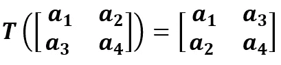

正如你所看到的，对角线元素保持不变，而非对角线元素改变了位置。

下面是一个 2x2 矩阵的简单示例:

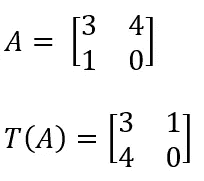

用 Python 实现真的不能再简单了:

```
A = np.matrix([
    [3, 4],
    [1, 0]
])print(A.T)
```

# 5.单位矩阵

正如转置一样，单位矩阵也很容易掌握。这是一个矩阵，其中:

1.  每个对角元素都是 1
2.  所有其他元素都是 0

就是这样！通常用大写字母 **I** 表示，下标中的数字代表它的大小。

以下是大小为 3 的单位矩阵的样子:

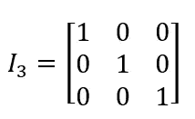

不会有任何单位矩阵的例子(目前)，我将只向您展示如何用 Python 创建它们:

```
A = np.eye(3)print(A)
```

现在回到更难的事情上来。

# 6.决定因素

根据维基百科:

> 行列式是一个标量值，可以从方阵的元素中计算出来，并对矩阵所描述的线性变换的某些属性进行编码。
> 矩阵 *A* 的行列式表示为 det( *A* )，det *A* ，或| *A* |。从几何学上讲，它可以看作是矩阵所描述的线性变换的体积比例因子。[2]

为了更直观地了解行列式是什么，以及它的用途，请参考文章结论部分的视频播放列表。

对于 2x2 矩阵，计算过程很简单，对于 3x3 矩阵，get 有点困难，对于更大的矩阵，不应该手动计算。我是说如果你想的话你可以，但是为什么呢？这里的目标是**发展直觉**，计算机是用来做计算的。

下面是计算 2x2 矩阵行列式的一般公式:

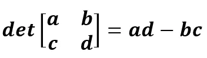

为了说明问题，这里有一个最基本的手工计算的例子:

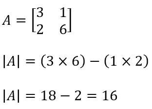

Python 中的实现:

```
A = np.matrix([
    [3, 2],
    [1, 6]
])print(np.linalg.det(A))
```

你做得很好。后面是最后一节，然后就大功告成了！

# 7.矩阵求逆

如果**原矩阵与其逆矩阵相乘得到单位矩阵**，则称方阵可逆(或非奇异*)。*

*从这句话，你可以得出结论，不是所有的矩阵都有逆。对于可逆矩阵，它必须满足以下条件:*

*   *必须是方形的*
*   *行列式不能为 0*

*不可逆的矩阵称为奇异矩阵。从逻辑上讲，方阵要奇异，其行列式必须等于 0。让我们通过探索一般公式来看看为什么:*

*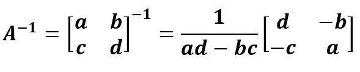*

*如你所见，矩阵的逆由上标中的这个 **-1** 项表示。这个公式你可能已经很熟悉了——之前见过***ad——BC***term(行列式*)。这里可以看出为什么行列式不能是 0 — **除以 0 是未定义的**。**

**这一项然后乘以稍微重新排列的原始矩阵。对角元素被交换，非对角元素被乘以负一(-1)。**

**下面是一个计算 2x2 矩阵逆矩阵的简单示例:**

**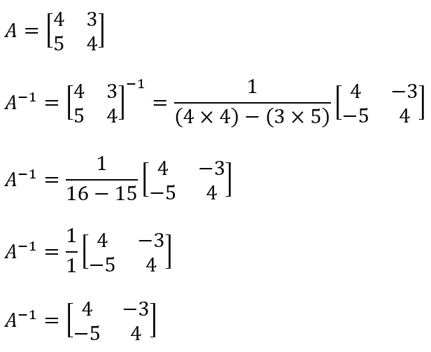**

**Python 中的实现:**

```
**A = np.matrix([
    [4, 3],
    [5, 4]
])print(np.linalg.inv(A))**
```

**现在让我们来验证一下先前的说法，即原始矩阵与其逆矩阵相乘产生单位矩阵:**

**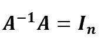**

**这是一个手工计算的例子，这些陈述是正确的！**

**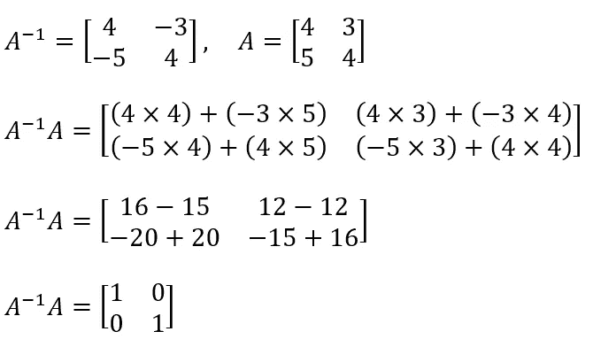**

**Python 中的实现:**

```
**print(A.dot(np.linalg.inv(A)))**
```

# **结论**

**花点时间祝贺自己坚持到了最后。我希望你已经阅读了文章的第一部分，如果你已经阅读了，谢谢你。**

**By [GIPHY](https://giphy.com/gifs/7n5cJwzRYBaBG/html5)**

**也许并非所有讨论的术语都直接适用于数据科学(从你的角度来看)，但线性代数通常是值得了解的——这可能会在你即将到来的数据科学**面试**中被问到，所以了解基础知识是必须的。**

**现在放松一下，看部电影，喝几杯啤酒，让一切都沉淀下来。大约一周后，我建议你自己进一步探索线性代数，当然，一定要看这个播放列表:**

**我可以强调这对你发展线性代数的直觉方法有多大的帮助。**

**感谢阅读…**

***喜欢这篇文章吗？成为* [*中等会员*](https://medium.com/@radecicdario/membership) *继续无限制学习。如果你使用下面的链接，我会收到你的一部分会员费，不需要你额外付费。***

**[](https://medium.com/@radecicdario/membership) [## 通过我的推荐链接加入 Medium-Dario rade ci

### 作为一个媒体会员，你的会员费的一部分会给你阅读的作家，你可以完全接触到每一个故事…

medium.com](https://medium.com/@radecicdario/membership)** 

# **参考**

**[1][https://en . Wikipedia . org/wiki/Matrix _(数学)](https://en.wikipedia.org/wiki/Matrix_(mathematics))**

**[https://en.m.wikipedia.org/wiki/Determinant](https://en.m.wikipedia.org/wiki/Determinant)**