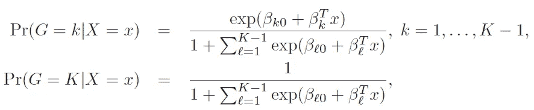

# 线性分类器:综述

> 原文：<https://towardsdatascience.com/linear-classifiers-an-overview-e121135bd3bb?source=collection_archive---------6----------------------->

## 本文讨论了四种流行的线性分类方法的数学属性和实际 Python 应用。

本文基于优秀的 Hastie，t .，Tibshirani，r .，& Friedman，J. H. (2009)的一章。统计学习的要素:数据挖掘、推理和预测。第二版。纽约:斯普林格。

用于解决分类任务的一类流行程序是基于线性模型的。这意味着，他们旨在将特征空间划分为根据目标可以采用的值标记的区域集合，其中这些区域之间的决策边界是线性的:它们是 2D 中的线、3D 中的平面和具有更多特征的超平面。
本文回顾了流行的线性分类模型，提供了对所讨论的方法以及 Python 实现的描述。我们将介绍以下方法:

*   线性判别分析，
*   二次判别分析，
*   正则化判别分析，
*   逻辑回归。

出于演示的目的，我们将把每个讨论的方法应用于垃圾邮件数据集，其中的任务是基于描述电子邮件中使用的词频的一组特征来将电子邮件分类为垃圾邮件或非垃圾邮件。数据集以及一些变量的描述可以在哈斯蒂等人的网站[“统计学习的要素”教科书](https://web.stanford.edu/~hastie/ElemStatLearn/)的数据部分找到。

让我们从导入本教程中使用的所有包并加载数据开始。

# 线性判别分析

要讨论的第一种方法是线性判别分析(LDA)。它假设所有特征的联合密度(取决于目标的类别)是一个多元高斯分布。这意味着，假设目标 *y* 在类别 *k* 中，特征 *X* 的密度 *P* 假定由下式给出

其中 *d* 是特征的数量，μ是平均向量，σ_*k*是类别 *k* 的高斯密度的协方差矩阵。

两个类之间的判定边界，比如说 *k* 和 *l* ，是属于任一类的概率相同的超平面。这意味着，在这个超平面上，两个密度之间的差异(以及它们之间的对数优势比)应该为零。

**LDA 中的一个重要假设是不同类别的高斯分布共享同一个协方差矩阵**:上式中σ_*k*的下标 *k* 可以去掉。这个假设对于计算对数优势比很方便:它使标准化因子和指数中的一些二次部分相互抵消。这产生了在 *k* 和 *l* 之间的判定边界，其在 *X* 中是线性的:

为了计算特征的密度，*P*(*X*|*y*=*k*)，只需估计高斯参数:均值μ *_k* 作为样本均值，协方差矩阵σ作为经验样本协方差矩阵。计算后，目标属于类别 *k* 的概率可以从贝叶斯规则中获得:

其中*P*(*y*=*k*)是属于 *k* 类的先验概率，可以通过样本中 *k* 类观测值的比例来估计。

请注意，LDA 没有要优化的超参数。只需几行代码就可以将其应用于垃圾邮件数据。

# 二次判别分析

LDA 假设不同类的高斯分布共享相同的协方差矩阵，这很方便，但对于特定数据可能不正确。下图的左栏显示了 LDA 如何处理来自具有共同协方差矩阵的多元高斯分布的数据(上图)，以及不同类别的数据具有不同协方差时的情况(下图)。

Source: [https://scikit-learn.org/stable/modules/lda_qda.html](https://scikit-learn.org/stable/modules/lda_qda.html)

因此，人们可能希望放松公共协方差假设。在这种情况下，要估计的协方差矩阵不是一个，而是 *k* 个。如果有许多特征，这可能导致模型中的参数数量急剧增加。另一方面，高斯指数中的二次项不再相互抵消，决策边界在 *X* 中也是二次的，这给了模型更多的灵活性:见上图。这种方法被称为二次判别分析(QDA)。

多亏了 scikit-learn，QDA 的 Python 实现和 LDA 一样简单。

# 正则判别分析

正如[用于回归的线性模型可以被正则化](/a-comparison-of-shrinkage-and-selection-methods-for-linear-regression-ee4dd3a71f16)以提高准确性，线性分类器也可以。可以引入收缩参数α，其将 QDA 的独立协方差矩阵收缩到公共 LDA 矩阵:

收缩参数可以取从 0 (LDA)到 1 (QDA)的值，任何介于两者之间的值都是两种方法的折衷。α的最佳值可以基于交叉验证来选择。要在 Python 中做到这一点，我们需要将收缩参数传递给 LDA 函数，并将计算算法指定为最小二乘法，因为其他计算方法不支持收缩。

# 逻辑回归

线性分类的另一种方法是逻辑回归模型，尽管它的名字，它是一种分类而不是回归方法。**逻辑回归通过线性函数对属于每个 *K* 类的观察值的概率进行建模，确保这些概率总和为 1，并保持在(0，1)范围内。**根据 *K* -1 对数优势比指定模型，选择任意类别作为参考类别(在本例中是最后一个类别， *K* )。因此，属于给定类别和属于参考类别的对数概率之间的差异被线性建模为

其中 *G* 代表真实的、被观察的类。从这里，属于每个类别的观察值的概率可以计算如下

这清楚地表明所有类别的概率总和为 1。

逻辑回归模型通常由 scikit-learn 负责的最大似然估计。正如[回归的线性模型可以被正则化](/a-comparison-of-shrinkage-and-selection-methods-for-linear-regression-ee4dd3a71f16)以提高准确性，逻辑回归也是如此。事实上， *L2* 惩罚是 scikit-learn 中的默认设置。它还支持 *L1* 和*弹性网*惩罚(要了解更多信息，请查看上面的链接)，但并非所有解算器都支持它们。 [Scikit-learn 的逻辑回归文档](https://scikit-learn.org/stable/modules/generated/sklearn.linear_model.LogisticRegression.html)有详细描述。

虽然逻辑回归主要用作任务中的推理工具，目标是理解输入变量在解释结果中的作用(它产生易于解释的系数，就像线性回归一样)，但它也可以证明具有重要的预测能力，如下例所示。

# 总结和结论

本文讨论了几个线性分类器:

*   **线性判别分析(LDA)** 假设给定目标类别的所有特征的联合密度是多元高斯分布，每个类别具有相同的协方差。公共协方差的假设是一个很强的假设，但如果正确，允许更有效的参数估计(较低的方差)。另一方面，该公共协方差矩阵是基于所有点来估计的，也包括那些远离决策边界的点。这使得 LDA 容易出现异常值。
*   **二次判别分析(QDA)** 通过为每个类别估计单独的协方差矩阵，放松了 LDA 的公共协方差假设。这给了模型更多的灵活性，但是在许多特征的情况下会导致模型中参数数量的急剧增加。
*   **正则化判别分析**是 LDA 和 QDA 之间的一种折衷:正则化参数可以调整为将协方差矩阵设置在所有类别的 1(LDA)和每个类别的完全分离(QDA)之间的任何位置。
*   **逻辑回归**通过线性函数模拟属于每个类别的观察值的概率。一般认为它比判别分析方法更安全、更稳健，因为它依赖的假设更少。对于我们的示例垃圾邮件数据来说，这也是最准确的。

感谢阅读！我希望你已经学到了对你的项目有益的东西🚀

如果你喜欢这篇文章，试试我的另一篇文章。不能选择？从这些中选择一个:

 [## 线性回归中收缩法和选择法的比较

### 详细介绍 7 种流行的收缩和选择方法。

towardsdatascience.com](/a-comparison-of-shrinkage-and-selection-methods-for-linear-regression-ee4dd3a71f16)  [## 增强你对助推的把握

### 揭秘著名的竞赛获奖算法。

towardsdatascience.com](/boost-your-grasp-on-boosting-acf239694b1)  [## 模型选择和评估

### 超越火车价值测试分裂

towardsdatascience.com](/model-selection-assessment-bb2d74229172) 

# 来源

1.  Hastie，Tibshirani，r .，，j . h . Friedman(2009 年)。统计学习的要素:数据挖掘、推理和预测。第二版。纽约:斯普林格。
2.  [https://scikit-learn.org/stable/modules/lda_qda.html](https://scikit-learn.org/stable/modules/lda_qda.html)
3.  [https://sci kit-learn . org/stable/modules/generated/sk learn . linear _ model。LogisticRegression.html](https://scikit-learn.org/stable/modules/generated/sklearn.linear_model.LogisticRegression.html)