# Python 中的线性判别分析

> 原文：<https://towardsdatascience.com/linear-discriminant-analysis-in-python-76b8b17817c2?source=collection_archive---------0----------------------->

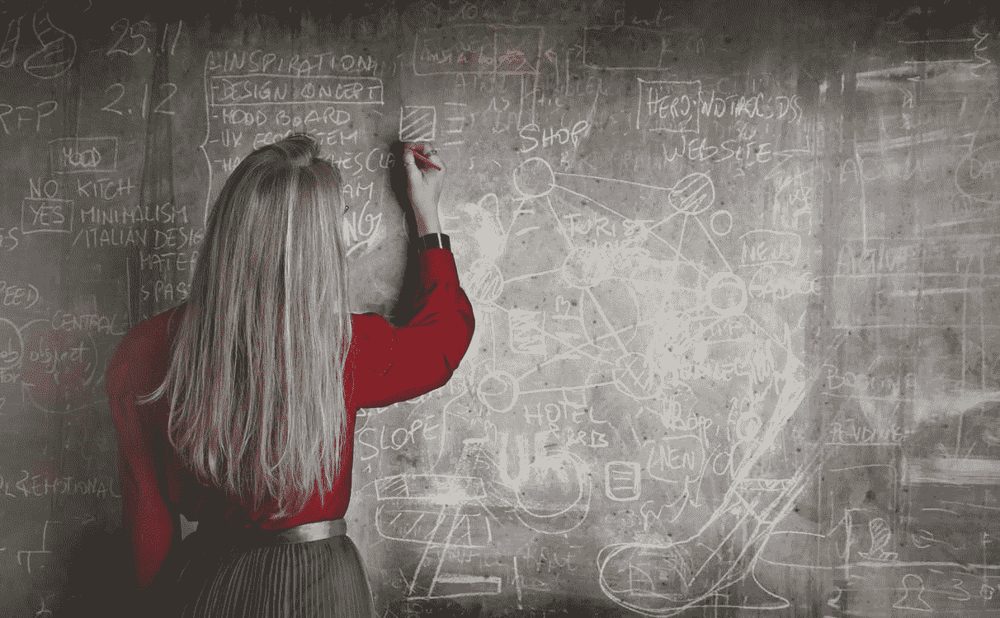

[https://www.pexels.com/photo/woman-in-red-long-sleeve-writing-on-chalk-board-3769714/](https://www.pexels.com/photo/woman-in-red-long-sleeve-writing-on-chalk-board-3769714/)

线性判别分析(LDA)是一种降维技术。顾名思义，降维技术减少了数据集中的维数(即变量)，同时保留了尽可能多的信息。例如，假设我们绘制了两个变量之间的关系，其中每种颜色代表一个不同的类。

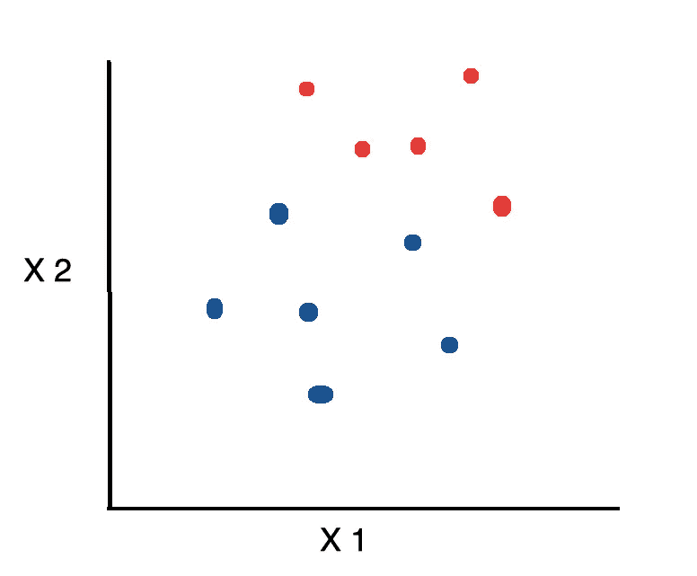

如果我们想把维数减少到 1，一种方法是把所有东西都投影到 x 轴上。

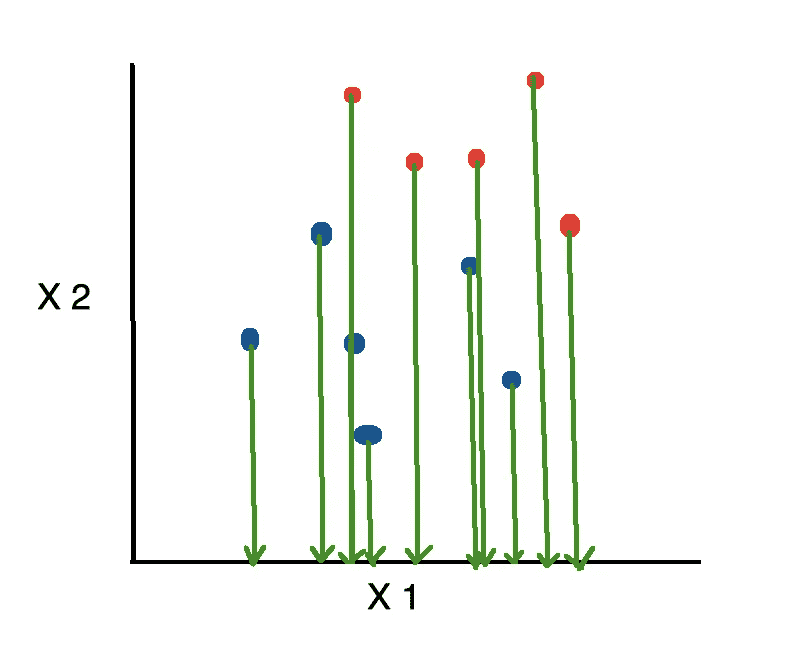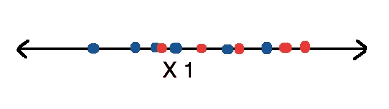

这很糟糕，因为它忽略了第二个特性提供的任何有用信息。另一方面，线性判别分析(LDA)使用来自两个特征的信息来创建新的轴，并将数据投影到新的轴上，从而最小化方差并最大化两个类的平均值之间的距离。

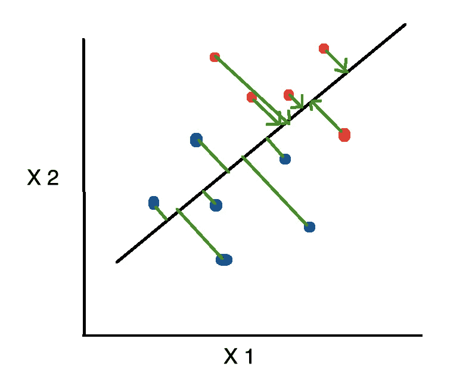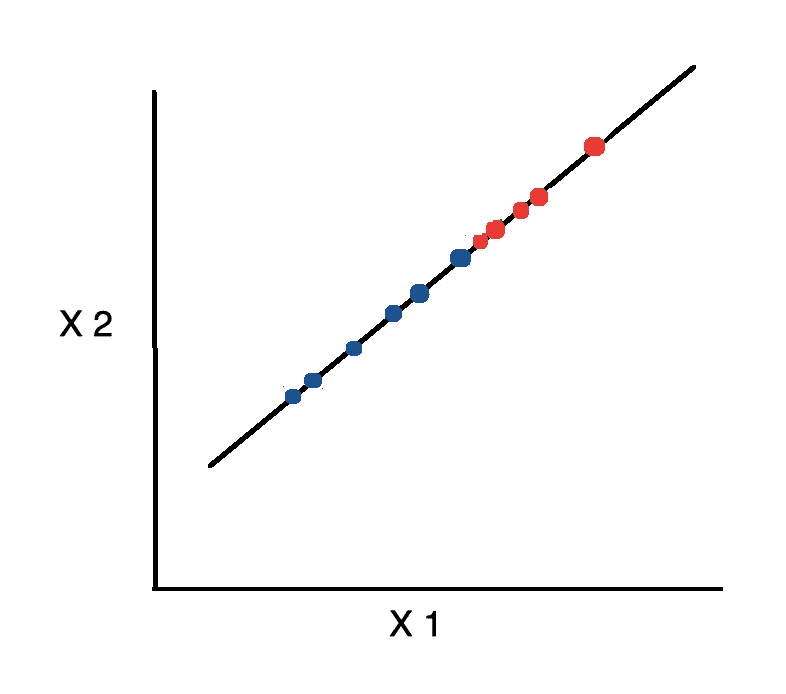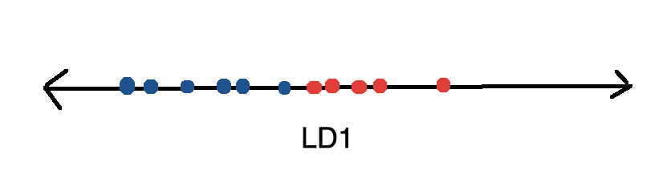

# 密码

让我们看看如何使用 Python 从头开始实现线性判别分析。首先，导入以下库。

```
from sklearn.datasets import load_wine
import pandas as pd
import numpy as np
np.set_printoptions(precision=4)
from matplotlib import pyplot as plt
import seaborn as sns
sns.set()
from sklearn.preprocessing import LabelEncoder
from sklearn.tree import DecisionTreeClassifier
from sklearn.model_selection import train_test_split
from sklearn.metrics import confusion_matrix
```

在接下来的教程中，我们将使用可以从 UCI 机器学习知识库中获得的葡萄酒数据集。幸运的是，`scitkit-learn`库提供了一个包装器函数，用于下载和

```
wine = load_wine()X = pd.DataFrame(wine.data, columns=wine.feature_names)
y = pd.Categorical.from_codes(wine.target, wine.target_names)
```

数据集包含 178 行，每行 13 列。

```
X.shape
```

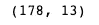

特征由各种特征组成，例如酒的镁和酒精含量。

```
X.head()
```

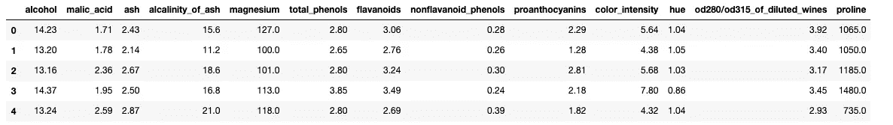

有三种不同的酒。

```
wine.target_names
```

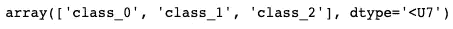

我们创建一个包含特性和类的数据框架。

```
df = X.join(pd.Series(y, name='class'))
```

**线性判别分析**可以分解为以下步骤:

1.  计算类内和类间散布矩阵
2.  计算散布矩阵的特征向量和相应的特征值
3.  对特征值排序，选择最上面的 ***k***
4.  创建一个包含映射到 ***k*** 特征值的特征向量的新矩阵
5.  通过对步骤 4 中的数据和矩阵进行点积，获得新的特征(即 LDA 成分)

## 类内散布矩阵

我们使用以下公式计算类别散布矩阵中的*。*

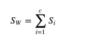

其中 ***c*** 是不同类的总数，并且

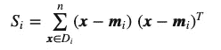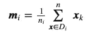

其中 ***x*** 为样本(即行) ***n*** 为给定类别的样本总数。

对于每个类，我们用每个特征的平均值创建一个向量。

```
class_feature_means = pd.DataFrame(columns=wine.target_names)for c, rows in df.groupby('class'):
    class_feature_means[c] = rows.mean()class_feature_means
```

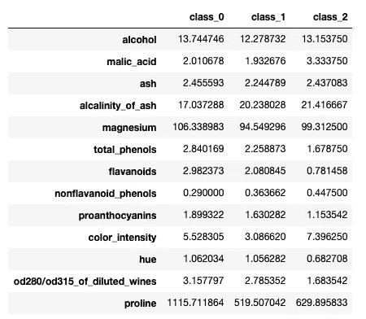

然后，我们将均值向量( ***mi*** )代入之前的等式，以获得类内散布矩阵。

```
within_class_scatter_matrix = np.zeros((13,13))for c, rows in df.groupby('class'):rows = rows.drop(['class'], axis=1)

    s = np.zeros((13,13))for index, row in rows.iterrows():
        x, mc = row.values.reshape(13,1), class_feature_means[c].values.reshape(13,1)

        s += (x - mc).dot((x - mc).T)

    within_class_scatter_matrix += s
```

## 类间散布矩阵

接下来，我们使用下面的公式计算类间散布矩阵的*。*

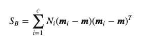

在哪里

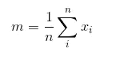

```
feature_means = df.mean()between_class_scatter_matrix = np.zeros((13,13))for c in class_feature_means:    
    n = len(df.loc[df['class'] == c].index)

    mc, m = class_feature_means[c].values.reshape(13,1), feature_means.values.reshape(13,1)

    between_class_scatter_matrix += n * (mc - m).dot((mc - m).T)
```

然后，我们求解广义特征值问题

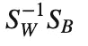

以获得线性判别式。

```
eigen_values, eigen_vectors = np.linalg.eig(np.linalg.inv(within_class_scatter_matrix).dot(between_class_scatter_matrix))
```

具有最高特征值的特征向量携带关于数据分布的最多信息。于是，我们将特征值从最高到最低排序，选择第一个 ***k*** 特征向量。为了保证排序后特征值映射到同一个特征向量，我们把它们放在一个临时数组中。

```
pairs = [(np.abs(eigen_values[i]), eigen_vectors[:,i]) for i in range(len(eigen_values))]pairs = sorted(pairs, key=lambda x: x[0], reverse=True)for pair in pairs:
    print(pair[0])
```

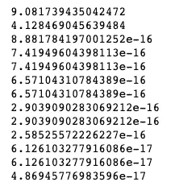

只看这些值，很难确定每个组件解释了多少差异。因此，我们用百分比来表示。

```
eigen_value_sums = sum(eigen_values)print('Explained Variance')
for i, pair in enumerate(pairs):
    print('Eigenvector {}: {}'.format(i, (pair[0]/eigen_value_sums).real))
```

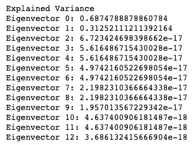

首先，我们用前两个特征向量创建一个矩阵 ***W*** 。

```
w_matrix = np.hstack((pairs[0][1].reshape(13,1), pairs[1][1].reshape(13,1))).real
```

然后，我们把 ***X*** 和 ***W*** 的点积保存成一个新的矩阵 ***Y*** 。

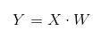

其中 ***X*** 是一个 ***n×d*** 矩阵，具有 ***n*** 样本和 ***d*** 维度， ***Y*** 是一个 ***n×k*** 矩阵，具有 ***n*** 样本和换句话说，*是由 LDA 组件组成的，或者换一种说法，新的特征空间。*

```
*X_lda = np.array(X.dot(w_matrix))*
```

*`matplotlib`不能直接处理分类变量。因此，我们将每个类别编码为一个数字，这样我们就可以将类别标签合并到我们的绘图中。*

```
*le = LabelEncoder()y = le.fit_transform(df['class'])*
```

*然后，我们将数据绘制为两个 LDA 分量的函数，并为每个类别使用不同的颜色。*

```
*plt.xlabel('LD1')
plt.ylabel('LD2')plt.scatter(
    X_lda[:,0],
    X_lda[:,1],
    c=y,
    cmap='rainbow',
    alpha=0.7,
    edgecolors='b'
)*
```

*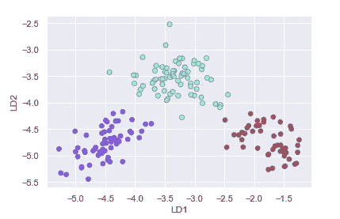*

*我们可以使用由`scikit-learn`库提供的预定义的`LinearDiscriminantAnalysis` 类，而不是每次都从头开始实现线性判别分析算法。*

```
*from sklearn.discriminant_analysis import LinearDiscriminantAnalysislda = LinearDiscriminantAnalysis()X_lda = lda.fit_transform(X, y)*
```

*我们可以访问下面的属性来获得每个组件解释的方差。*

```
*lda.explained_variance_ratio_*
```

*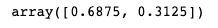*

*与之前一样，我们绘制了两个 LDA 组件。*

```
*plt.xlabel('LD1')
plt.ylabel('LD2')plt.scatter(
    X_lda[:,0],
    X_lda[:,1],
    c=y,
    cmap='rainbow',
    alpha=0.7,
    edgecolors='b'
)*
```

*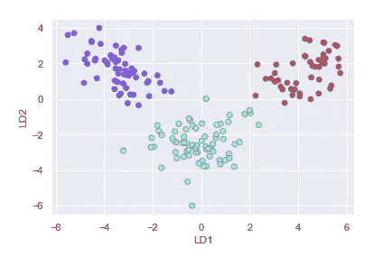*

*接下来，我们来看看 LDA 与主成分分析或 PCA 相比如何。我们首先创建并装配一个`PCA`类的实例。*

```
*from sklearn.decomposition import PCApca = PCA(n_components=2)X_pca = pca.fit_transform(X, y)*
```

*我们可以访问`explained_variance_ratio_`属性来查看每个组件解释的方差的百分比。*

```
*pca.explained_variance_ratio_*
```

*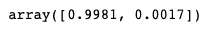*

*正如我们所看到的，PCA 选择了导致最高分布(保留最多信息)的成分，而不一定是最大化类间分离的成分。*

```
*plt.xlabel('PC1')
plt.ylabel('PC2')plt.scatter(
    X_pca[:,0],
    X_pca[:,1],
    c=y,
    cmap='rainbow',
    alpha=0.7,
    edgecolors='b'
)*
```

*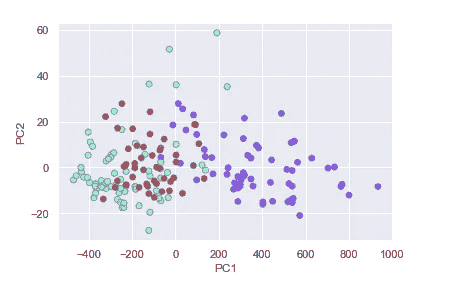*

*接下来，让我们看看是否可以创建一个模型，使用 LDA 组件作为特征对进行分类。首先，我们将数据分成训练集和测试集。*

```
*X_train, X_test, y_train, y_test = train_test_split(X_lda, y, random_state=1)*
```

*然后，我们建立并训练一个决策树。在预测了测试集中每个样本的类别后，我们创建一个混淆矩阵来评估模型的性能。*

```
*dt = DecisionTreeClassifier()dt.fit(X_train, y_train)y_pred = dt.predict(X_test)confusion_matrix(y_test, y_pred)*
```

*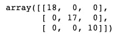*

*正如我们所看到的，决策树分类器正确地对测试集中的所有内容进行了分类。*