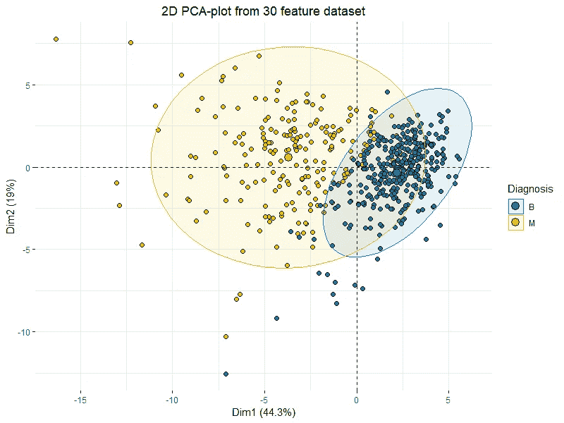
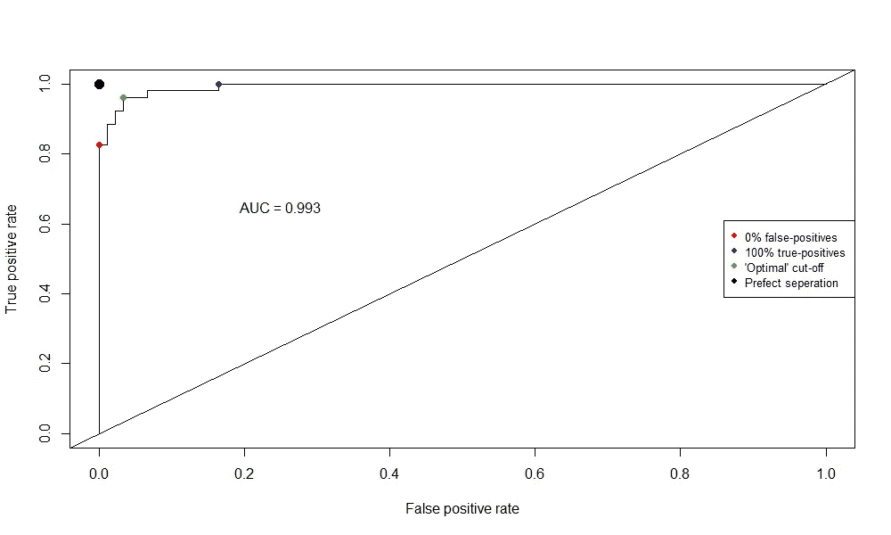
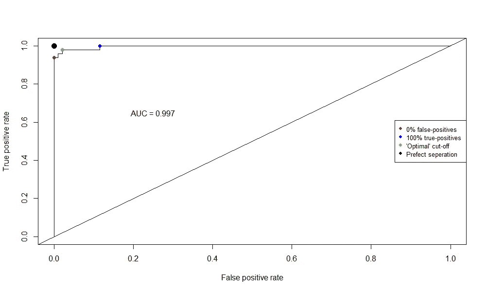
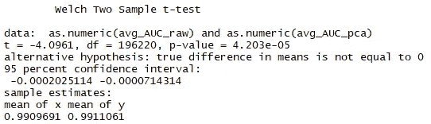
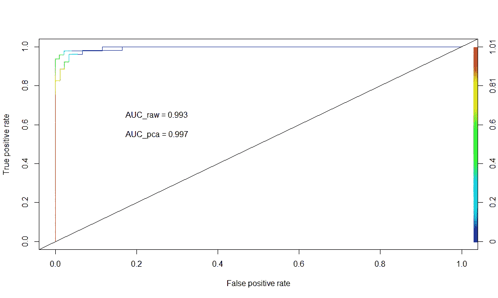

# 线性判别分析(LDA) 101，使用 R

> 原文：<https://towardsdatascience.com/linear-discriminant-analysis-lda-101-using-r-6a97217a55a6?source=collection_archive---------2----------------------->

## 决策边界、分离、分类等等。让我们潜入 LDA！


**Marcin Ryczek** — **A man feeding swans in the snow** (*Aesthetically fitting to the subject*)

这是我上一篇关于**主成分分析**的文章的后续文章，所以如果你喜欢的话可以看看:

[](/principal-component-analysis-pca-101-using-r-361f4c53a9ff) [## 主成分分析(PCA) 101，使用 R

### 一次提高一个维度的可预测性和分类能力！使用 2D 图“可视化”30 个维度！

towardsdatascience.com](/principal-component-analysis-pca-101-using-r-361f4c53a9ff) 

如果没有**就继续读**，我们先处理一个没有 PCA 的案例**，然后用 **LDA 跟进 PCA-‘转换’数据**。**

> **在构建你的 LDA 模型之前，用 PCA 进行降维会得到(稍微)更好的结果。**

**如果你喜欢这篇文章并想看更多，请务必关注我的简介。**

# **设置**

**对于本文，我们将使用来自 [*UCI 机器学习报告*](http://archive.ics.uci.edu/ml/datasets/Breast+Cancer+Wisconsin+%28Diagnostic%29) 的乳腺癌威斯康星州数据集作为我们的数据。如果您想继续学习，请继续为自己加载:**

```
**wdbc** <- read.csv("wdbc.csv", header = F)**features** <- c("radius", "texture", "perimeter", "area", "smoothness", "compactness", "concavity", "concave_points", "symmetry", "fractal_dimension")names(**wdbc**) <- c("**id**", "**diagnosis**", paste0(**features**,"**_mean**"), paste0(**features**,"**_se**"), paste0(**features**,"**_worst**"))
```

**上面的代码将简单地加载数据并命名所有 32 个变量。 **ID** 、**诊断**和十(30)个不同的特征。来自 UCI:**

******表示*******标准误差*** *以及***最差或者最大(三个最大值的平均值)的这些特征被计算用于每个图像，从而得到* ***30 个特征*** *。例如，字段 3 是平均半径，字段 13 是半径 SE，字段 23 是最差半径。”******

# ****为什么是艾达？****

****让我们提醒自己，我们的数据的“点”是什么，**我们试图描述肿瘤的什么性质** **决定了它是否是恶性的。换句话说:“比如说，如果肿瘤有一定的大小、质地和凹陷，那么它很有可能是恶性的。”******

****这确实是**‘分类’**的基本概念，广泛应用于各种**数据科学**领域，尤其是**机器学习**。****

****现在，即使你没有读过我关于主成分分析的文章，我相信你也能体会这个图的简单性:****

********

****2D PCA-plot showing clustering of “Benign” and “Malignant” tumors across 30 features.****

****我们在这里看到的是'*'和' ***良性*** '这两个类别之间的“清晰”**分离**，在一个 30 维数据集中只有 **~63%方差的图上。*******

****简单地使用上面图中的二维，我们可能会得到一些很好的估计，但更高维的数据很难掌握(但也说明了更多的差异)，谢天谢地，这就是 **LDA** 的作用，它会试图找到我们在分类中最成功的“**截止点**或“**决策界限**，所以现在我们知道*为什么*，让我们更好地了解*如何:【T21*****

********

****只考虑**二维**和**两个不同的集群**。LDA 会将这些聚类投影到一维。想象它为每个类别/聚类创建单独的概率密度函数，然后我们尝试**最大化这些之间的差异**(有效地通过**最小化它们之间的‘重叠’区域**):****

********

****From Sebastian Raschka: [https://sebastianraschka.com/Articles/2014_python_lda.html](https://sebastianraschka.com/Articles/2014_python_lda.html)****

****在上面的例子中，我们有一个沿着 x 轴**的**蓝色**和**绿色**集群的完美分离。这意味着，如果数据的未来点根据提出的**概率密度函数**表现，那么我们应该能够将它们完美地分类为**蓝色**或**绿色**。******

## ****好了，到此为止，让我们进入 R 并尝试一下！****

# ****原始数据的 LDA(所有 30 个维度)****

****好了，继续节目，让我们从定义数据开始:****

```
****wdbc.data** <- as.matrix(wdbc[,c(3:32)])
row.names(wdbc.data) <- wdbc$id
**wdbc_raw** <- cbind(**wdbc.data**, as.numeric(**wdbc$diagnosis**)-1)
colnames(wdbc_raw)[31] <- "diagnosis"**
```

****这只是简单地**将 ID 作为变量**移除，并将我们的数据定义为一个**矩阵**而不是**数据框架**，同时仍然保留 ID，但是在列名**中。******

****现在我们需要定义一个**训练/测试分割**，这样我们就有一些数据可以**测试我们的模型**:****

```
****smp_size_raw** <- floor(0.75 * nrow(**wdbc_raw**))
train_ind_raw <- sample(nrow(wdbc_raw), size = **smp_size_raw**)
**train_raw.df** <- as.data.frame(wdbc_raw[**train_ind_raw**, ])
**test_raw.df** <- as.data.frame(wdbc_raw[**-train_ind_raw**, ])**
```

****这将使用 **R** 中的 ***sample()*** 函数对我们的数据进行 **75/25 分割**，这非常方便。然后我们将我们的**矩阵**转换成**数据帧**。****

****现在我们的数据已经准备好了，我们可以使用***【LDA()***函数 i **R** 进行我们的分析，它在功能上与 ***lm()*** 和*【glm()*函数相同:****

```
****f** <- paste(names(**train_raw.df**)[31], "~", paste(names(**train_raw.df**)[-31], collapse=" + "))**wdbc_raw.lda** <- **lda**(as.formula(paste(**f**)), data = **train_raw.df**)**
```

****这是一个小小的 **lifehack** 粘贴所有的变量名，而不是全部手动编写。如果你想看你的 **FDA** 的**系数**和**组意味着**的话，你可以调用对象' *wdbc_raw.lda* ，但是它相当冗长，所以我不会在本文中发布输出。****

****现在让我们根据我们的**测试数据**做出一些**预测**:****

```
****wdbc_raw.lda.predict** <- predict(**wdbc_raw.lda**, newdata = **test_raw.df**)**
```

****如果你想检查预测，只需调用'*wdbc _ raw . LDA . predict $ class*'****

## ****估价****

****这是令人兴奋的部分，现在我们可以看到**我们的模型表现有多好**！****

```
**### CONSTRUCTING ROC AUC PLOT:# Get the posteriors as a dataframe.
**wdbc_raw.lda.predict.posteriors** <- as.data.frame(**wdbc_raw.lda.predict$posterior**)# Evaluate the model
**pred** <- prediction(**wdbc_raw.lda.predict.posteriors**[,2], **test_raw.df$diagnosis**)
**roc.perf** = performance(**pred**, measure = "tpr", x.measure = "fpr")
**auc.train** <- performance(**pred**, measure = "auc")
**auc.train** <- **auc.train**@y.values# Plot
plot(**roc.perf**)
abline(a=0, b= 1)
text(x = .25, y = .65 ,paste("AUC = ", round(**auc.train**[[1]],3), sep = ""))**
```

****我们开始了，一个美丽的**大鹏图**！在这里，我简单地画出了**兴趣点**，并添加了**图例**来解释它。现在，我绘制为**“最佳”截止点**的点就是我们曲线中具有最低**欧几里德距离**的点到点 *(0，1)* 的点，该点表示 **100%真阳性率**和 **0%假阳性率**，这意味着我们有一个**完美分离** /预测。****

********

*******那么这是什么意思？这意味着根据我们希望我们的模型如何“表现”,我们可以使用不同的截止值。我们想要 **100%的真阳性率**以得到一些假阳性为代价吗？或者，我们希望 **0%的假阳性**以一个爱真阳性率为代价？如果是良性肿瘤，被诊断为恶性肿瘤会更糟吗？如果是恶性肿瘤，被告知你很健康会更糟吗？*******

****我们的**点的 **TRP 为 96.15%** 和 **FPR 为 3.3%** 这看起来不错，但我们真的想告诉 **3.3%的健康人他们患有癌症**和 **3.85%的病人他们很健康**吗？******

******请记住，您的结果肯定会与我的不同，因为进行训练/测试分割的样本方法是随机的。******

******让我们在 PCA 变换的数据上看一看 LDA，看看我们是否得到一些更好的结果。******

# ******基于降维数据(6 维)的 LDA******

******如果您想继续学习，请阅读我关于 PCA 的文章:******

******[](/principal-component-analysis-pca-101-using-r-361f4c53a9ff) [## 主成分分析(PCA) 101，使用 R

### 一次提高一个维度的可预测性和分类能力！使用 2D 图“可视化”30 个维度！

towardsdatascience.com](/principal-component-analysis-pca-101-using-r-361f4c53a9ff) 

好了，我们有了包含 **6 个组件**的 PCA，让我们创建一个由这些组件和我们的**响应**组成的**新数据集**:

```
**wdbc.pcst** <- **wdbc.pr$x[,1:6]**
**wdbc.pcst** <- cbind(**wdbc.pcst**, as.numeric(**wdbc$diagnosis**)-1)
colnames(wdbc.pcst)[7] <- "diagnosis"
```

我们将使用**完全相同的**方法来制作**训练/测试分割**，所以让我们跳到 **LDA** 和**预测**:

```
**wdbc.lda** <- **lda**(diagnosis ~ PC1 + PC2 + PC3 + PC4 + PC5 + PC6, data = **train.df**)**wdbc.lda.predict** <- predict(**wdbc.lda**, newdata = **test.df**)
```

现在，我们可以像以前一样简单地创建我们的 **ROC 图**,看看我们会得到什么样的结果:



很快，我们得到了一些更好的结果，但这可能仍然是纯粹的运气。

我们必须运行一些模拟并比较这两者！****** 

# ******比较******

******现在看你的“*运气*”你可能会看到 **PCA 转换的 LDA** 在 **AUC** 方面比**原始 LDA 的 ***稍好*** 。然而，这可能只是随机发生的..那么让我们借助于 **PCA 变换 LDA** 和**原始 LDA** 的 **100.000 模拟**来做一个*快速***T-检验**:********

```
****t.test(as.numeric(**AUC_raw**),as.numeric(**AUC_pca**))****
```

*******AUC_raw*** 和 ***AUC_pca*** 是简单的数组，带有我运行的每次迭代的结果 **AUC** 分数。****

****我不会用模拟部分来烦你，因为这是一大块丑陋的代码，所以请相信我！同时查看下面测试结果中的**测向计数**:****

********

****非常低的 p 值，这意味着两者之间存在统计学差异！因此，尽管他们的平均值仅相差 **0.000137** 到**100.000**尾这是一个**统计上显著的差异**。换句话说:****

> *******“在构建你的 LDA 模型之前，用 PCA 进行降维将会得到(稍微)更好的结果！”*******

****因为每篇文章都需要一个花哨的情节:****

********

# ****结束语****

****如果你想多看多学，一定要 [**跟着我上**](https://medium.com/@peter.nistrup) 🔍**[**推特**](https://twitter.com/peternistrup) 🐦******

******[](https://medium.com/@peter.nistrup) [## 彼得·尼斯特鲁普-中等

### 阅读彼得·尼斯特拉普在媒介上的作品。数据科学、统计和人工智能...推特:@PeterNistrup，LinkedIn…

medium.com](https://medium.com/@peter.nistrup)******