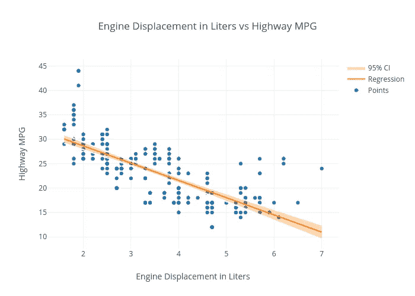
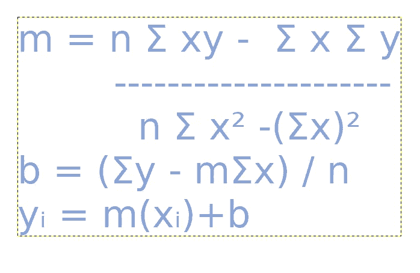
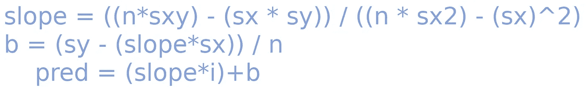

# 线性最小二乘法解释得好像你只有两岁

> 原文：<https://towardsdatascience.com/linear-least-square-explained-like-youre-two-1b3eaca70120?source=collection_archive---------33----------------------->

线性最小二乘模型是一种机器学习和统计基础，因为它的可变性和多功能性，在你的武器库中拥有它是很棒的。只要深入研究线性最小二乘模型的表面，就会发现它作为一个模型的多功能性。线性最小二乘法有成百上千种不同的变体，其中最重要的一种从加权最小二乘法到线性最小二乘法回归。

正如我提到的，线性最小二乘模型有成百上千个不同的公式，但最值得注意的可能是你应该知道的。虽然这个列表可能会很不一样，但我还是选择了我认为最具可构建性的版本。此列表包括…

*   普通最小二乘法
*   线性最小二乘回归
*   加权最小二乘法
*   广义最小二乘

# 基础知识

定义一个如此多才多艺的模型的问题是，当它做了这么多事情时，很难描述它能做什么。然而，这个模型也有明显的缺点，如果你不是篡改方程的那种人，我当然只会建议偶尔把它用在手边的用例场景中。也就是说，您可以改进基本算法，编写一个非常有趣的算法，不管它是否是您的数据所独有的。

建立在线性最小二乘法基础上的模型的例子包括荣誉提名，如保序回归、迭代加权最小二乘法、工具变量、最佳工具、百分比最小二乘法和总体最小二乘法。

考虑到所有这些不同的模型，可以肯定的是，你应该知道的是线性最小二乘回归。今天有如此多的问题可以用基于回归的算法来解决，以至于这个模型一定会找到它偶尔的主流用途。

# 线性最小二乘回归示例

当谈到基于推理方程的机器学习模型时，开始伟大学习体验的最佳方式是断言方程。然而，这在教学中最不足的地方是缺乏对如何使用方程的解释。

像这样的等式可能看起来有点吓人，但是分解一下，它很简单，而且是基于斜率的。我们的斜率 m 等于群体大小(n)乘以 x 和 y 的点积之和减去 x 之和乘以 y 之和的乘积。

我没有忘记，我正试图像你们两个一样解释这一点，所以我首先要指出的是，求和(σ)只是将所有值相加的一种奇特方式，换句话说，就是使用 sum()方法。我想指出的另一点是，σxy 是 x 和 y 相加的点积，所以首先我们将两个数组的每个值相乘，然后将结果相加。最后但同样重要的是，当你大声说出σx 和(σx)时，它们听起来是一样的，但σx 是数组总和的点指数，而(σx)只是我们之前的σx，但我们对结果求平方。

这样一来，理解和复制这样一个方程最令人困惑的部分之一就是括号，所以我冒昧地把它写出来，所以希望如果你像我一样更有程序员头脑，这就更容易理解了。

# 在此基础上构建

我们对每个线性最小二乘公式的核心值了解得越多，我们就越能理解在处理不同数据时，操纵模型如何对我们有利。简而言之，有如此多的变体，你不可能全部学会，但是衍生出你自己的变体是 LLSQ 的真正优势，至少我是这么认为的。