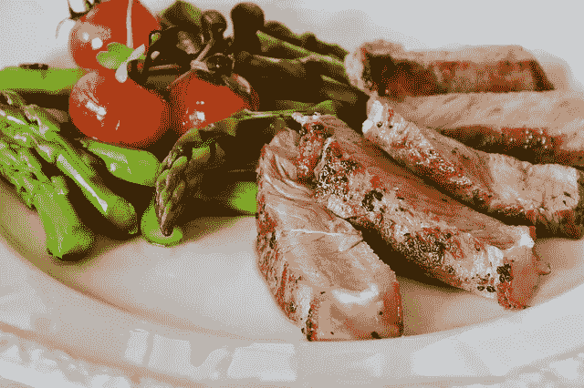
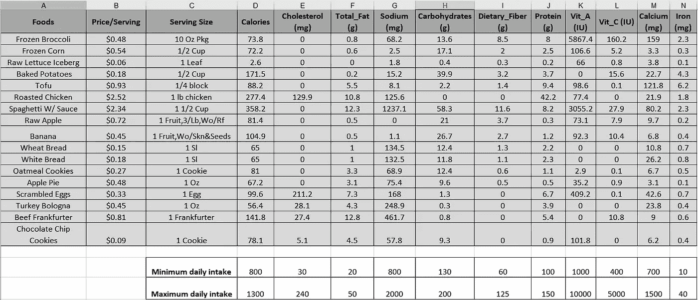
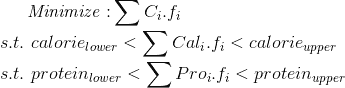

# 用 Python 实现线性规划和离散优化

> 原文：<https://towardsdatascience.com/linear-programming-and-discrete-optimization-with-python-using-pulp-449f3c5f6e99?source=collection_archive---------0----------------------->

## 线性和整数规划是离散优化问题的关键技术，它们在现代商业和技术领域几乎无处不在。我们将讨论如何使用 Python 库 PuLP 解决这类问题，并获得一个快速且健壮的解决方案。

# 介绍

[离散优化](https://neos-guide.org/optimization-tree)是优化方法的一个分支，处理离散量，即非连续函数。它在各种各样的应用中无处不在，如[金融投资](https://study.com/academy/lesson/financial-applications-of-linear-programs-for-portfolio-selection-financial-planning-financial-mix-strategy.html)、[饮食规划](https://neos-guide.org/content/diet-problem)、[制造过程](https://www.quora.com/How-do-I-solve-a-manufacturing-problem-in-linear-programming)、以及[职业运动的运动员或赛程选择](https://www2.cs.duke.edu/courses/fall10/cps296.1/joe_siyang.pdf)。

**线性和(混合)整数规划**是解决问题的技术，这些问题可以在离散优化的框架内公式化。

这种优化技术的知识对数据科学家和机器学习(ML)从业者非常有用，因为离散和连续优化是现代 ML 和 AI 系统以及[数据驱动的商业分析流程](https://www.edx.org/course/optimization-methods-business-analytics-mitx-15-053x)的核心。

> 有许多商业优化工具，但拥有以编程方式进行优化的实践经验是非常宝贵的。

针对优化问题的强大而高效的求解器的理论发展有着悠久而丰富的历史。然而，着眼于实际应用，我们将跳过这段历史，直接进入学习如何使用编程工具来制定和解决这种优化问题的部分。

Python 中有很多优秀的优化包。在本文中，我们将具体谈谈**纸浆**。但是在使用 Python 库之前，让我们先了解一下我们可以用它来解决什么样的问题。

# 一个(或两个)例题

假设你**负责高中午餐**的饮食计划。你的工作是确保学生从选择的食物中获得正确的营养平衡。



然而，在预算和食物种类方面有一些限制，需要在饮食中使其有趣。下表详细显示了每种食物的完整营养价值，以及它们的最大/最小日摄入量。



> 离散优化问题很简单:**在给定这些约束条件**(总热量以及每种营养成分，如胆固醇、维生素 A、钙等)的情况下，最小化午餐成本。

本质上，用一种随意的数学语言来说，问题是，



请注意，不等式关系本质上都是线性的，即变量 ***f*** 乘以常系数，所得项受常数极限的限制，这使得该问题可通过 LP 技术解决。

你可以想象这种问题在**商业战略**中可能会极其频繁地冒出来。取代营养价值的是利润和其他类型的商业收益，取代价格/服务的可能是数千美元的项目成本。作为一名经理，你的工作将是选择项目，在不超过项目资金总预算的情况下，获得最大的投资回报。


类似的优化问题也可能出现在**工厂生产计划**中，其中最大生产能力将是所用机器的函数，并且单个产品将具有不同的利润特征。作为一名生产工程师，你的工作可能是仔细分配机器和劳动力资源，以最大限度地提高利润，同时满足所有的能力限制。


从根本上说，来自不同领域的这些问题之间的共性在于，它们涉及最大化或最小化线性 ***目标函数*** ，服从一组线性 ***不等式或等式约束*** 。

对于饮食问题，目标函数是我们试图最小化的总成本。不等式约束由每个营养成分的最小和最大界限给出。

# PuLP——用于线性优化的 Python 库

Python 生态系统中有许多针对这类优化问题的库。**纸浆**是一个开源的 [**线性编程**](https://en.wikipedia.org/wiki/Linear_programming) (LP)包，它大量使用 Python 语法，并附带了许多行业标准的解算器。它还可以很好地与一系列开源和商业 LP 求解器集成。

您可以使用 pip(以及其他一些解算器)来安装它

```
$ sudo pip install pulp            *# PuLP* $ sudo apt-get install glpk-utils  *# GLPK* $ sudo apt-get install coinor-cbc  *# CoinOR*
```

[关于安装和测试的详细说明在这里](https://pythonhosted.org/PuLP/index.html)。然后，从库中导入所有内容。

```
from pulp import *
```

在这里看一个很好的解决线性规划的视频。

# **最优化问题如何公式化？**

首先，我们用 PuLP 中的方法`**LpProblem**`创建一个 LP 问题。

```
prob = LpProblem("Simple Diet Problem",LpMinimize)
```

然后，我们需要用表中的信息创建一堆 Python 字典对象。代码如下所示，

为了简洁起见，我们没有在这里展示完整的代码。你可以把所有的营养成分都拿出来，为它们创建单独的字典。

然后，我们创建一个食品项目变量字典，其中**下界=0** 且**类别连续**，即优化解决方案可以采用任何大于零的实数。

注意下界的特殊重要性。

> 在我们的头脑中，我们不能认为食物的一部分是一个非负的有限的量，但是数学并不知道这一点。

没有这个界限的明确声明，解决方案可能是无意义的，因为求解者可能试图提出负的食物选择量来减少总成本，同时仍然满足营养需求！

```
food_vars = LpVariable.dicts("Food",food_items,**lowBound=0,cat='Continuous'**)
```

接下来，我们通过添加主目标函数开始构建 LP 问题。注意`**lpSum**`方法的使用。

```
prob += lpSum([costs[i]*food_vars[i] for i in food_items])
```

我们在此基础上进一步增加了热量限制，

```
prob += lpSum([calories[f] * food_vars[f] for f in food_items]) >= 800.0
prob += lpSum([calories[f] * food_vars[f] for f in food_items]) <= 1300.0
```

我们可以把所有的营养限制堆积起来。为了简单起见，我们只是增加了脂肪、碳水化合物、纤维和蛋白质的四个限制。代码如下所示，

我们已经解决了这个问题！

> 在任何优化场景中，困难的部分是以一种结构化的方式表述问题，这种方式可以呈现给求解者。

我们已经完成了最困难的部分。现在，这是运行求解器和检查解的相对容易的部分。

# 解决问题并打印解决方案

纸浆有[相当多的求解器算法选择](https://pythonhosted.org/PuLP/solvers.html)(如 COIN_MP，Gurobi，CPLEX 等。).对于这个问题，我们不指定任何选项，让程序根据问题结构默认自己的选择。

```
prob.solve()
```

我们可以打印溶液的**状态**。注意，尽管在这种情况下状态是*最佳*，但并不需要如此。如果问题是不适定的或者没有足够的信息，解决方案可能*不可行*或者*无界*。

```
# The status of the solution is printed to the screen
print("Status:", LpStatus[prob.status])>> Status: Optimal
```

完整解包含所有变量，包括权重为零的变量。但是对我们来说，**只有那些具有非零系数**的变量才是感兴趣的，也就是说，那些变量应该包含在最佳饮食计划中。所以，我们可以扫描问题变量，只有变量数量为正数时才打印出来。

```
for v in prob.variables():
    if v.varValue>0:
        print(v.name, "=", v.varValue)>> Food_Frozen_Broccoli = **6.9242113**
   Food_Scrambled_Eggs = **6.060891**
   Food__Baked_Potatoes = **1.0806324**
```

所以，最佳方案是吃 6.923 份冷冻西兰花，6.06 份炒鸡蛋和 1.08 份烤土豆！


欢迎你下载整个笔记本，数据文件，用各种约束来实验改变你的饮食计划。[代码在我的 Github 库](https://github.com/tirthajyoti/Optimization-Python)里。

最后，我们可以打印出**目标函数，即饮食成本**，

```
obj = value(prob.objective)
print("The total cost of this balanced diet is: $**{}**".format(round(obj,2)))>> The total cost of this balanced diet is: $5.52
```

# 如果我们想要一个整数解呢？

正如我们所看到的，最佳结果返回了一组食物的分数。这可能是不切实际的，我们可能希望解决方案强制只有整数数量的服务。

这就给我们带来了 [**整数规划**](https://en.wikipedia.org/wiki/Integer_programming) 的技巧。用于先前优化的算法是简单的线性规划，其中允许变量采用任何实数值。**整数编程强制某些或所有变量仅采用整数值。**

事实上，整数规划是一个比线性规划更难的计算问题。整数变量使得优化问题[非凸](https://www.solver.com/convex-optimization)，因此更难解决。随着您添加更多的整数变量，内存和求解时间可能会呈指数增长。

幸运的是，纸浆也可以解决这种限制的优化问题。

代码和之前几乎一模一样，这里不再赘述。唯一的区别是变量被定义为属于`**Integer**`类别，而不是`**Continuous**`。

```
food_integer = LpVariable.dicts("Food",food_items,0,cat='Integer')
```

对于这个问题，它稍微改变了最优解，在饮食中加入了卷心莴苣，成本增加了 0.06 美元。您还会注意到求解过程的计算时间明显增加。

```
Therefore, the optimal balanced diet with whole servings consists of
--------------------------------------------------------------------
Food_Frozen_Broccoli = **7.0**
Food_Raw_Lettuce_Iceberg = **1.0**
Food_Scrambled_Eggs = **6.0**
Food__Baked_Potatoes = **1.0**
```

整数规划的一个很酷的应用是解决一个 [**司机调度问题**](https://en.wikipedia.org/wiki/Driver_scheduling_problem) ，这可能是一个 [NP-hard](https://en.wikipedia.org/wiki/NP-hardness) 问题。见这篇文章(也请注意文章中，他们如何计算各种行动的成本，并在优化问题中使用它们)，

[](https://blog.remix.com/an-intro-to-integer-programming-for-engineers-simplified-bus-scheduling-bd3d64895e92) [## 工程师整数编程导论:简化的总线调度

### 本文是 Remix 关于我们面临的软件工程问题的系列文章的一部分。在这一期中，重新混合…

blog.remix.com](https://blog.remix.com/an-intro-to-integer-programming-for-engineers-simplified-bus-scheduling-bd3d64895e92) 

# 如何将二元决策合并到线性规划问题中？

通常，我们希望在优化问题中包含某种“如果-那么-否则”的决策逻辑。

> 如果我们不希望西兰花和卷心莴苣都包含在饮食中(但只有其中一种是好的)怎么办？

我们如何在这个框架中表示这样的决策逻辑？


事实证明，对于这种逻辑，您需要引入另一种类型的变量，称为**指示变量**。它们本质上是二元的，并且可以指示最优解中变量的存在或不存在。

[](https://math.stackexchange.com/questions/2220355/involving-indicator-function-as-a-constraint-in-a-lp-problem) [## 将指示函数作为约束包含在 LP 问题中

### 感谢为数学栈交换贡献一个答案！请务必回答问题。提供详细信息…

math.stackexchange.com](https://math.stackexchange.com/questions/2220355/involving-indicator-function-as-a-constraint-in-a-lp-problem) 

但是对于这个特殊的问题，使用指示变量有一个明显的问题。理想情况下，如果指标变量为 1，您希望食品的成本/营养价值包含在约束等式中，如果为零，则忽略它。从数学上来说，将此写成原始术语(涉及食品项目)和指示变量的**乘积是很直观的。但是当你这样做的时候，你就把两个变量相乘，使问题变成非线性的！在这种情况下，它属于 [**二次规划**](https://en.wikipedia.org/wiki/Quadratic_programming) (QP)的范畴(*二次*因为现在项是两个线性项的乘积)。**

> 流行的机器学习技术支持向量机本质上解决了二次规划问题。

[](https://www.quora.com/What-is-an-intuitive-explanation-of-quadratic-programming-and-how-is-it-defined-in-SVM) [## 什么是二次规划的直观解释，在 SVM 是怎么定义的？

### 答:二次规划包括最小化未知向量的分量为二次的形式…

www.quora.com](https://www.quora.com/What-is-an-intuitive-explanation-of-quadratic-programming-and-how-is-it-defined-in-SVM) 

然而，在线性规划问题中使用指示符变量来表示二进制逻辑的一般概念也是非常有用的。在下一节中，我们给出了一个用 LP 解决数独难题的链接。

事实证明，有一个聪明的技巧可以将这样的二进制逻辑合并到这个 LP 中，而不会使它成为 QP 问题。

我们可以将二进制变量表示为`food_chosen`，并将它们实例化为`Integer`，上下界分别为 0 和 1。

```
food_chosen = LpVariable.dicts("Chosen",food_items,0,1,cat='Integer')
```

然后我们编写一个特殊的代码来链接通常的`food_vars`和二进制的`food_chosen`，并将这个约束添加到问题中。

```
**for** f **in** food_items:
    prob += food_vars[f]>= food_chosen[f]*0.1
    prob += food_vars[f]<= food_chosen[f]*1e5
```

如果你盯着代码足够长的时间，你会意识到这实际上意味着只有当相应的`food_chosen`指示变量为 1 时，我们才赋予`food_vars`重要性。但这样我们就避免了直接乘法，保持了问题结构的线性。

为了包含花椰菜和卷心莴苣的非此即彼条件，我们只需输入一个简单的代码，

```
prob += food_chosen['Frozen Broccoli']+food_chosen['Raw Iceberg Lettuce']<=1
```

这确保了这两个二元变量的和最多为 1，这意味着它们中只能有一个包含在最优解中，而不能两个都包含。

# 线性/整数规划的更多应用

在本文中，我们展示了用 Python 建立和解决一个简单的线性编程问题的基本流程。然而，如果你环顾四周，你会发现无数的工程和商业问题的例子可以转化为某种形式的线性规划，然后使用高效的解决方案来解决。下面是一些典型的例子，让你开始思考，

*   [解决数独的 LP 问题](https://pythonhosted.org/PuLP/CaseStudies/a_sudoku_problem.html)
*   [将长期投资回报最大化作为 LP 问题](https://www.mathworks.com/help/optim/ug/maximize-long-term-investments-using-linear-programming.html)
*   [LP 应用于生产计划](http://www.me.utexas.edu/~jensen/or_site/models/unit/lp_model/prod/prod.html)
*   [使用 ILP 解决仓库选址问题](https://www.ibm.com/support/knowledgecenter/SSSA5P_12.8.0/ilog.odms.ide.help/OPL_Studio/opllanguser/topics/opl_languser_app_areas_IP_warehse.html)

许多机器学习算法也使用线性规划为子集的优化的一般类别— [**凸优化**](https://web.stanford.edu/~boyd/cvxbook/bv_cvxbook.pdf) 。有关它的更多信息，请参阅下面的文章，

[](/a-quick-overview-of-optimization-models-for-machine-learning-and-statistics-38e3a7d13138) [## 下面是什么？机器学习的核心是优化

### 我们展示了最流行的机器学习/统计建模技术背后的核心优化框架。

towardsdatascience.com](/a-quick-overview-of-optimization-models-for-machine-learning-and-statistics-38e3a7d13138) 

# 总结和结论

在本文中，我们展示了使用 Python package PuLP 通过线性和整数编程技术解决一个简单的饮食优化问题。值得注意的是，即使是广泛使用的 [SciPy 也内置了线性优化方法](https://docs.scipy.org/doc/scipy/reference/generated/scipy.optimize.linprog.html#scipy.optimize.linprog)。鼓励读者尝试各种其他 Python 库，并为自己选择一个好方法。

*喜欢这篇文章吗？成为* [***中等成员***](https://medium.com/@tirthajyoti/membership) *继续* ***无限制学习*** *。如果你使用下面的链接，我会收到你的一部分会员费，* ***而不增加你的额外费用*** *。*

[](https://medium.com/@tirthajyoti/membership) [## 通过我的推荐链接加入媒体

### 作为一个媒体会员，你的会员费的一部分会给你阅读的作家，你可以完全接触到每一个故事…

medium.com](https://medium.com/@tirthajyoti/membership)