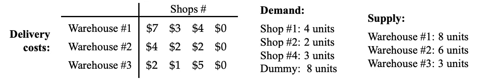

# 数据科学家的线性编程

> 原文：<https://towardsdatascience.com/linear-programming-for-data-scientists-e9cf1ddf1331?source=collection_archive---------6----------------------->

作为数据科学家，我们在职业生涯的早期就熟悉了优化的概念。优化是每个机器学习模型的核心。但是我们与优化的关系可以追溯到很久以前；自从我们有记忆以来，我们就在不知不觉中解决最优化问题:

*   去上班最快的方法
*   组织我们的预算以获得最大收益
*   规划训练，在最短的时间内获得最大的效果
*   每个星期天都要做饭
*   为漫长的假期打包行李

这些只是日常优化的几个例子。**优化是生活方式**。它可以像我刚才提到的例子一样简单，也可以像[旅行推销员问题](https://en.wikipedia.org/wiki/Travelling_salesman_problem)一样复杂。

[**数学优化**](https://en.wikipedia.org/wiki/Mathematical_optimization#cite_note-1) 是在给定一些约束条件的情况下，从一组可用的备选方案中选择最佳备选方案的问题。一个优化问题有三个基本组成部分:(1)一个**目标函数**，我们要么最大化要么最小化它；(2)控制目标函数的一组变量**；(3)一组**约束**，允许变量取某些值，同时排除其他值。**

> **[因此，优化问题是找到最大化或最小化目标函数的变量的值集，同时满足约束集。](/navigating-the-hyperparameter-space-32f48be2c12d)**

**线性规划是数学优化的主要分支之一。这也是解决优化问题的最简单的方法之一。**

# **什么是线性规划？**

**我先说一下，这里的编程不是指计算机编程。 [**线性规划** —又名](https://en.wikipedia.org/wiki/Linear_programming)**是一种在数学模型中寻找最佳结果的技术，其中**目标函数**和**约束**由**线性关系**表示。****

****为了用公式表示一个线性程序，我们需要理解它的各部分的概念。****

1.  ****决策变量:我们想要确定的。**未知数**。****
2.  ****目标函数:代表最大化或最小化数量的线性函数。****
3.  ****约束:代表决策变量限制的等式或不等式系统。****
4.  ****非负性限制:决策变量的值应该大于或等于零。****

# ****解决线性规划问题****

****根据上面的四个定义，我们可以[一般地建立一个解决 LP 问题的过程](https://www.analyticsvidhya.com/blog/2017/02/lintroductory-guide-on-linear-programming-explained-in-simple-english/):****

1.  ****识别决策变量****
2.  ****确定目标函数****
3.  ****指定约束****
4.  ****陈述非消极限制****

****解决一个线性规划问题有几种不同的方法:T2 图解法、[傅立叶-莫茨金消元法](https://en.wikipedia.org/wiki/Fourier%E2%80%93Motzkin_elimination)、[单纯形法](https://en.wikipedia.org/wiki/Simplex_algorithm)、[十字交叉算法](https://en.wikipedia.org/wiki/Criss-cross_algorithm)、[卡玛卡尔算法](https://en.wikipedia.org/wiki/Karmarkar%27s_algorithm)等等。也有一些商业和开源软件可供选择:Gurobi，CPLEX，MATLAB，SAS，GAMS，Mathematica， [PuLP](https://www.coin-or.org/PuLP/index.html) ， [Pyomo](http://www.pyomo.org/) ， [SciPy](https://www.scipy.org/) ，是[可用内容](https://en.wikipedia.org/wiki/List_of_optimization_software)的一些例子。****

# ****通过实例学习——使用纸浆的实用教程****

****让我们看一个基于运输问题的例子，这是线性规划模型的最初应用之一。****

****以下摘自 Juraj Stacho 著 [*运筹学*导论:](http://www.cs.toronto.edu/~stacho/public/IEOR4004-notes1.pdf)****

> ****一家家具公司在纽约地区拥有三个仓库，需要在明天将椅子运送到该市的三家商店。这三家商店分别需要 4、2 和 3 个单位。三个仓库中椅子的当前库存水平分别为 8、6 和 3。由于距离不同，每个仓库到每个门店的配送成本也不同。**寻找将椅子运送到商店的最便宜方式。******

****公式化线性问题:****

*   ****决策变量:从第*个*仓库运送到第*个*店铺的椅子数量****
*   ****来源:三个仓库****
*   ****目的地:三家商店****
*   ****约束:来自第*个*仓库的供应，来自第*个*商店的需求****
*   ****目标:最小化总运输成本****

********

****[Information for the Transportation Problem](http://www.cs.toronto.edu/~stacho/public/IEOR4004-notes1.pdf)****

****因为只有当`supply = demand`一个虚拟需求变量被创建时，解决方案才存在。下面是使用 [PuLP](https://www.coin-or.org/PuLP/index.html) 库解决这个 LP 问题的代码。****

# ****结论****

****优化对于调查复杂问题、识别和解决问题以及数据驱动的决策至关重要。此外，理解最优化理论对于数据科学这门手艺来说是必不可少的。许多实际问题可以用数学优化技术来建模和解决，其中输入和约束是从机器学习模型的预测中获得的-但这只是一个新手数据科学家的一个想法。****