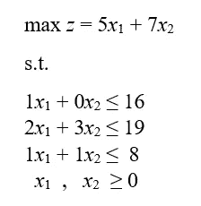

# R 线性规划

> 原文：<https://towardsdatascience.com/linear-programming-in-r-444e9c199280?source=collection_archive---------5----------------------->

## r 代表工业工程师

## 探索“LP solve”*R*包

Image by Arnold Francisca available at [Unsplash](https://unsplash.com/photos/nPhl2x4fk2s)

# 运筹学

运筹学是一种科学的决策方法，通常在需要分配稀缺资源的条件下，寻求系统的最佳设计和操作。制定决策的科学方法需要使用一个或多个数学/优化模型(即实际情况的表示)来做出最佳决策。

优化模型寻求在满足给定 ***约束*** 的决策变量的所有值的集合中找到优化(最大化或最小化) ***目标函数*** 的 ***决策变量*** 的值。它的三个主要组成部分是:

*   目标函数:要优化的函数(最大化或最小化)
*   决策变量:影响系统性能的可控变量
*   约束:决策变量的一组限制(即线性不等式或等式)。非负约束限制决策变量取正值(例如，您不能产生负的项目数 *x* 1、 *x* 2 和 *x* 3)。

优化模型的解称为**最优可行解**。

# 建模步骤

精确地模拟一个运筹学问题是最重要的——有时也是最困难的——任务。一个错误的模型将导致一个错误的解决方案，因此，不会解决原来的问题。以下步骤应该由具有不同专业领域的不同团队成员执行，以获得模型的准确和更好的视图:

1.  **问题定义**:定义项目的范围，确定结果是三个要素的确定:决策变量的描述、目标的确定和限制条件(即约束条件)的确定。
2.  **模型构建**:将问题定义转化为数学关系。
3.  **模型求解**:使用标准优化算法。在获得解决方案后，应进行敏感性分析，以找出由于某些参数的变化而导致的解决方案的行为。
4.  **模型有效性**:检查模型是否如预期的那样工作。
5.  **实施**:将模型和结果转化为解决方案的建议。

# 线性规划

线性规划(也称为 LP)是一种运筹学技术，当所有目标和约束都是线性的(在变量中)并且所有决策变量都是**连续的**时使用。在层次结构中，线性规划可以被认为是最简单的运筹学技术。

来自 R 的 *lpSolve* 包包含了几个用于解决线性规划问题和获得重要统计分析的函数。对于下面的例子，让我们考虑下面要求解的数学模型:

我们来看看 R 代码！

Linear Programming R Code

**解决方案:**

在满足给定约束的情况下可以获得的最大 *z* 值(因此也是最优值)是 46，其中 *x* 1 = 5， *x* 2 = 3。敏感系数从 4.667 和 5.0 到 7.0 和 7.5。约束的影子/对偶价格分别为 0、2 和 1，而决策变量的影子/对偶价格分别为 0 和 0。约束条件的影子/双重价格下限分别为-1.0e+30、1.6e+01 和 6.3e+00，而决策变量分别为-1.0e+30 和-1.0e+30。最后，约束的影子/双重价格上限分别为 1.0e+30、2.4e+01 和 9.5e+00，而决策变量的上限分别为 1.0e+30 和 1.0e+30。

# 总结想法

线性规划代表了一个更好的决策制定的伟大的优化技术。 *lpSolve* R 包允许用几行代码解决线性规划问题并获得重要的统计信息(即敏感性分析)。虽然有其他免费的优化软件(如 GAMS、AMPL、TORA、LINDO)，但在您的个人代码库中存储一个线性优化 R 代码可以节省您大量的时间，因为您不必从头开始编写公式，而只需更改相应矩阵的系数和符号。

# 确认

特别感谢[édgar Granda](https://www.linkedin.com/in/edgar-m-a-granda-gutiérrez-67824935/)博士在线性编程课程和我作为工业和系统工程师本科生的学术生涯中的所有教导。

*— —*

*如果你觉得这篇文章有用，欢迎在* [*GitHub*](https://github.com/rsalaza4/R-for-industrial-engineering/blob/master/Operations%20Research/Linear%20Programming.R) *上下载我的个人代码。也可以直接发邮件到*[*rsalaza4@binghamton.edu*](mailto:rsalaza4@binghamton.edu)*找我，在*[*LinkedIn*](https://www.linkedin.com/in/roberto-salazar-reyna/)*找我。有兴趣了解工程领域的数据分析、数据科学和机器学习应用的更多信息吗？通过访问我的媒体* [*个人资料*](https://robertosalazarr.medium.com/) *来探索我以前的文章。感谢阅读。*

*——罗伯特*