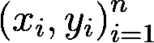
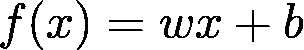
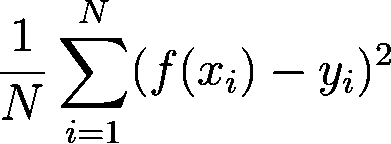
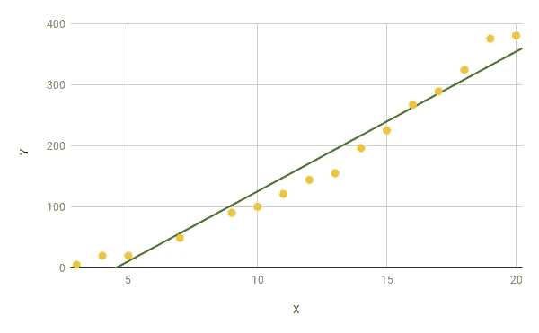
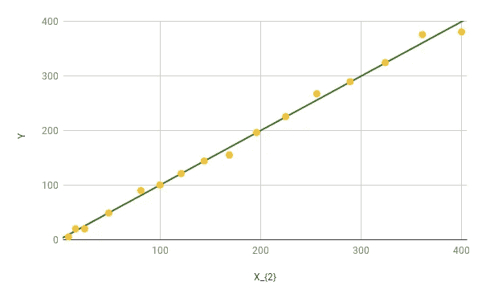
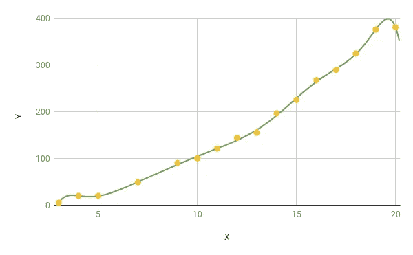

# 线性回归

> 原文：<https://towardsdatascience.com/linear-regression-70cca59678ec?source=collection_archive---------30----------------------->

## 更简单直观的解释。

线性回归是一种著名的监督学习算法，用于预测实值输出。线性回归模型是输入示例特征的线性组合。

```
A note on the notation. *x_{i}* means x subscript i and *x_{^th}* means x superscript th.
```

# 数据的表示

如定义中所述，线性回归是一种监督学习算法，因此，有一组 *N* 标记的示例，表示为:



Data used to construct a linear regression model.

这里， *x_{i}* 表示对应于 *i_{^th}* 示例的一组属性。这些属性集合统称为特征向量。所有来自 *i=1，2，3，…，n* 的例子都有一个对应的实值 *y，*表示一个物理量，如成本、温度或任何其他连续值。

Here each feature vector is 3-dimensional consisting of the area of house in square metres, the number of rooms and the age of house in years. The target variable is the price of house in USD.

# 模型

现在，我们已经准备好了我们的例子，我们想要制作我们的模型 *f(x)* 来帮助我们预测未知的*x*的输出 *y*



Model of linear regression learning algorithm. Here, ***w*** is an *R-dimensional* parameter vector (*x* is an R-dimensional feature vector) and ***b***is the bias.

模型的工作是预测特征向量 *x.* 的未知值的真实值 *y* ，但是，我们想要找到一个模型，使得它在预测 *y* 的值方面做得最好，因此，我们想要找到 *w* 和 *b* 的值，使得预测尽可能接近实际答案。很明显， *w* 和 *b* 的不同值会导致生产不同型号、不同能力的产品。因此，我们的工作是找到值 *w** 和 *b** 的最优集合，该集合将最小化模型 *f(x)* 所做的预测与*训练集*的实际结果 *y* 之间的误差。

# 最佳模特

如前所述，我们有 *N 个*示例和一个模型 *f(x)* ，我们需要找到 *w* 和 *b 的最佳值。*让我们使用所有这些 *N* 示例来找到 *w* 和 *b 的最佳值，*通常称为*训练*我们的模型*。*我们需要找到 *w* 和 *b* 的值，使得下面的表达式最小。



Cost function for linear regression.

这是我们的*目标*函数，因为我们要将其最小化。学习算法具有我们试图最小化或最大化的功能。这些函数被称为*损失函数*或*成本函数。*这种特殊形式被称为*均方误差*损失函数。

如果你观察损失函数:

*   就是简单的减去模型的输出， *f(x_{i})* 和实际输出 *y_{i}* ，
*   把它摆正，
*   最后取其平均值。

为了更好地理解这一点，让我们假设约翰最近参加了一个有 10 道数学问题的考试，并且答案已经公布。现在约翰决定看看他的表现如何？于是，他将自己的答案 *f(x)_{i}* 与答案键上对应的答案 *y_{i}* 进行了比较。如果约翰的答案和实际答案 *f(x)_{i}-y_{i}* 之差是 *0* 他就答对了那个问题。如果他正确回答了所有问题，那么*平均值*也将是 *0* ，这对应于最佳性能，意味着*最佳型号*。平方误差有助于强调模型的误差。我们也可以取一个立方或者更高的幂，但是这样导数就更难计算了。我们担心成本函数的导数，因为将它们设置为零给出了模型的最佳值 *w** 和 *b** 。

# 一般问题和示例

让我们讨论一下在学习线性回归时困扰我的几个问题。但是，在我们开始之前，让我们看看一个非常原始的线性回归的例子。

因此，约翰和他的朋友们决定从头开始研究线性回归，所以他们开始自己收集样本。他们收集的例子如下所示。

The tabular form of data. Here *x is a single dimensional feature vector any y is a real-valued output corresponding to each feature vector.*

收集完数据后，John 决定用线性回归模型来拟合数据。



The linear regression model of form f(x)=wx+b.

这是形式为 *f(x)=wx+b* 的模型，其中 *w* 是标量，因为 *x，*特征向量是一维的。更好地理解这个模型是将它与直线方程 *y=mx+c* 进行比较，其中 *m* 类似于 *w* 和 *c* 到*b。*这是一个线性模型。

但是，我们能做得更好吗？我们能想出一个比现在的表现更好的模型吗？是的，我们可以。线性回归只包含直线模型，这是一种常见的混淆。然而，我们也可以通过转换数据来拟合曲线。让我们通过平方每个 *x_{i}* 值来转换我们的特征向量。

在转换了我们的特征向量之后，让我们尝试在新的特征向量 *x* 和输出 *y* 上拟合模型(原始特征向量 *x* 不被考虑用于训练模型，它的转换 *x_{^ 2}* 已经被用于训练模型)。



The model is a better fit than the previous linear model. Here the original feature vector x_{i} is transformed to it’s square and then the model is computed.

因此，现在我们通过将原始特征向量 *x_{i}* 变换为其平方，预测了一个比线性模型更好的多项式模型。新模型对应于*f(x)= wx+b。*


This is a plot of the polynomial regression model. Note that this plot is between X and Y with the polynomial model of degree two. The previous plot was between X² and Y, therefore, it was linear.

通过转换特征向量，模型预测更好结果的能力有所提高，但我们需要注意*过度拟合。*当模型在训练阶段预测得太好，但在预测看不见的示例时出错时，会发生过度拟合。过度拟合不能反映动态的真实情况。它不产生一般化的模型。



This is an example of overfitting where the model is too accurate on the training examples.

假设特征向量是 R 维的。我们已经看到了 R=1 的情况，也预测了线性和多项式模型。如果 R=2，则预测一个平面作为模型。通常，线性回归用 R 维特征向量 *x* 和 1 维输出 *y* 为数据集建模超平面。

超平面是一个比其周围空间的维度少一个维度的子空间。在 1 维线的情况下，*点*是超平面，在 2 维区域的情况下，线*是超平面，在 3 维空间的情况下，*平面*是超平面，依此类推。*

## 偏差项

让我们讨论一下偏差项的效用。考虑直线的方程 *y=mx* 。在这种情况下, *m* 控制直线的斜率，可以在任何地方旋转直线，但只能围绕原点旋转。

假设您决定将这个模型用于一个简单的线性回归问题。然而，你产生的任何假设总是会通过原点，可能无法一般化。添加偏置项将导致假设 *y=mx+c* ，从而允许您在平面内的任何地方移动线。偏差项有助于概括假设。