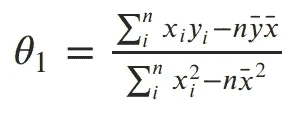

# 线性回归

> 原文：<https://towardsdatascience.com/linear-regression-91eeae7d6a2e?source=collection_archive---------9----------------------->

## 最大似然估计和最小平方和的统一。

# 介绍

我最近在我正在进行的机器学习基础系列中写了关于最大似然估计的文章:

[](/maximum-likelihood-estimation-984af2dcfcac) [## 最大似然估计

### 机器学习基础(二)

towardsdatascience.com](/maximum-likelihood-estimation-984af2dcfcac) 

在那篇文章中，我们学习了“建模”数据的含义，以及如何使用 MLE 来查找模型的参数。在这篇文章中，我们将深入线性回归，统计学中最重要的模型之一，并学习如何用最大似然法来构建它。解决方案是一个美丽的数学，像大多数 MLE 模型一样，充满了直觉。我假设您已经掌握了我在其他系列中涉及的词汇(概率密度、条件概率、似然函数、iid 数据等)。).如果你在这里看到一些让你不舒服的东西，看看那个系列的[概率](/probability-fundamentals-of-machine-learning-part-1-a156b4703e69)和[最大似然](/maximum-likelihood-estimation-984af2dcfcac)的帖子就清楚了。

# 模型

当我们的数据在自变量(我们的特征)和因变量(我们的目标)之间有线性关系时，我们使用线性回归。在 MLE 的帖子中，我们看到了一些看起来类似的数据:


我们观察到 x 和 y 之间似乎有线性关系，但并不完美。我们认为这些缺陷来自一些错误或噪声过程。想象一下在点云上画一条直线。每个点的误差就是该点到我们直线的距离。我们希望在模型中明确包含这些错误。一种方法是假设误差服从均值为 0 且方差σ未知的高斯分布。高斯似乎是一个不错的选择，因为我们的误差看起来是对称的，而且小误差比大误差更有可能出现。我们用高斯噪声写出线性模型，如下所示:


Linear model with Gaussian noise term.

误差项从我们的高斯方程中提取，然后通过将误差加到线性方程的输出中，计算出我们观察到的 y。这个模型有三个参数:我们的线的斜率和截距以及噪声分布的方差。我们的主要目标是找到直线斜率和截距的最佳参数。

# 似然函数

为了应用最大似然，我们首先需要导出似然函数。首先，让我们将上面的模型重写为给定 x 的单个条件分布:


Given x, y is drawn from a Gaussian centered on our line.

这相当于将我们的 x 通过直线的方程，然后加入来自 0 均值高斯的噪声。

现在，我们可以用这个高斯函数写出给定 x 的 y 的条件分布。这只是高斯分布的概率密度函数的方程，用我们的线性方程代替平均值:


PDF of y given x and our linear model.

条件分布中的分号就像一个逗号，但它是一个有用的符号，用于将我们观察到的数据与参数分开。

每个点都是独立同分布的(iid ),因此我们可以将所有观察点的似然函数写成每个个体概率密度的乘积。由于σ对于每个数据点都是相同的，因此我们可以从乘积中剔除不包括 x 或 y 的高斯项:


Likelihood for our collection of data X.

(注:此处感谢同心抓错。乘积之前的项应该提高到数据点的数量，因为我从乘积中分解了它。)

## 对数可能性:

最大似然法的下一步是找到使该函数最大化的参数。为了使我们的等式更简单，让我们取可能性的对数。回想一下，最大化对数似然性与最大化似然性是相同的，因为对数是单调的。自然对数与指数相抵消，把乘积变成对数的和，把除法变成对数的减法；所以我们的对数似然看起来简单多了:


Derivation of log-likelihood for our model.

## 误差平方和:

为了更清楚起见，让我们将这一行的输出写成一个值:


Estimate of y from our line.

现在我们的对数似然可以写成:


Simplified log-likelihood equation.

为了去掉负号，让我们回忆一下，最大化一个数和最小化这个数的负数是一回事。因此，与其最大化可能性，不如最小化负对数可能性:


Minimize the negative log-likelihood.

我们的最终目标是找到我们生产线的参数。为了最小化线性参数(θs)的负对数似然，我们可以假设方差项是一个固定常数。

去掉任何不包括θ的常数都不会改变解。因此，我们可以抛开任何常数项，优雅地将我们试图最小化的内容写成:


Sum of squared error.

线性模型的最大似然估计是使误差平方和最小的那条线！这是一个漂亮的结果，你会看到最小化平方误差在机器学习和统计中随处可见。

# 求解参数

我们已经得出结论，斜率和截距的最大似然估计可以通过最小化误差平方和得到。让我们扩展我们的最小化目标，并使用 *i* 作为我们的 *n* 个数据点的索引:


SSE 公式中的平方使其成为具有单一最小值的二次型。可以通过对每个参数求导，将其设置为 0，并依次求解参数来找到最小值。

## 截距:

让我们从求解截距开始。对截距求偏导数，我们得到:


Derivative of SSE with respect to the intercept of our line.

变量上方的横条表示这些变量的平均值。我们利用了这样一个事实:变量值的和等于这些值的平均值乘以我们有多少个值。将导数设为 0 并求解截距，得到:


MLE for intercept.

这是一个非常好的结果。这是直线方程，用 x 和 y 的平均值代替了那些变量。截距仍然取决于斜率，所以我们接下来需要找到它。

## 坡度:

我们首先对 SSE 的斜率求偏导数。我们插入截距的解，并使用代数来分离斜率项:


Derivative of SSE with respect to the slope of our line.

将该值设为 0 并求解斜率，得到:



虽然我们在技术上已经完成了，但我们可以使用一些更好的代数来重写，而不必使用 *n* :


MLE estimate of the slope.

## 将所有这些放在一起:

我们可以使用这些推导出的方程，用 python 编写一个简单的函数，用于在给定至少两点的情况下求解任何线的参数:

```
def find_line(xs, ys):
    """Calculates the slope and intercept"""

    # number of points
    n = len(xs) # calculate means
    x_bar = sum(xs)/n
    y_bar = sum(ys)/n

    # calculate slope
    num = 0
    denom = 0
    for i in range(n):
        num += (xs[i]-x_bar)*(ys[i]-y_bar)
        denom += (xs[i]-x_bar)**2
    slope = num/denom

    # calculate intercept
    intercept = y_bar - slope*x_bar

    return slope, intercept
```

使用这个代码，我们可以拟合一条线到我们的原始数据(见下文)。这是我们数据的最大似然估计。该线使误差平方和最小，这就是为什么这种线性回归方法通常被称为普通最小二乘法。


MLE solution to our Linear Regression model.

# 最后的想法

我写这篇文章主要是为了强调最小化误差平方和与线性回归的最大似然估计方法之间的联系。大多数人首先学习通过最小化平方误差来解决线性回归，但人们通常不理解这是从带有假设的概率模型(如高斯分布误差)中得出的。

有一个更优雅的解决方案来寻找这个模型的参数，但它需要线性代数。在我的基础系列中介绍了线性代数之后，我打算再次讨论线性回归，并展示如何用它来拟合更复杂的曲线，如多项式和指数。

下次见！