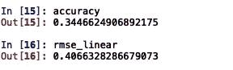

# 线性回归和一瓶优质葡萄酒

> 原文：<https://towardsdatascience.com/linear-regression-and-a-quality-bottle-of-wine-b053ab768a53?source=collection_archive---------9----------------------->

## 一个线性回归像品酒师一样预测一瓶酒的质量？请继续阅读，寻找答案。

Photo by [Scott Warman](https://unsplash.com/@scottiewarman?utm_source=medium&utm_medium=referral) on [Unsplash](https://unsplash.com?utm_source=medium&utm_medium=referral)

统计数据比我们想象的更能左右我们的生活。在一次糟糕的表现之后，你可能会表现得更好。这是弗朗西斯·高尔顿创造的一个术语，叫做“回归”。他比较了祖先和后代的身高，发现他们的身高更接近平均值。对于一个人在数学考试中的分数也可以做出同样的推论。如果你的数学考试成绩很差，那么根据回归分析，你应该在下一次数学考试中取得好成绩。

Bell curve

钟形曲线表示样本 n 的正态分布，其中 u 是平均值。*回归表示 X 轴上的数据倾向于向平均值回归。*

今天，回归算法被用来解决众多问题，这些问题涉及从统计学(这是其母领域)到股票市场前沿人工智能技术的各种应用。也许回归的最佳用途是在数据分析领域。

> 同样的模型也可以用来预测葡萄酒的质量。遵循以下方程的广义线性回归:

β0 是截距，β1…βn 是回归系数。现在，请记住，因为我们在这里使用多个变量，这意味着我们在多维超平面上解释数据。

> 广义线性回归假设因变量(本例中为 Y)与自变量(X1)具有线性关系..p)。因此，如果我们假设一个二维数据集(X1 和 Y)，它会像下面的图像。

Linear regression for one dependent variable and independent variable

记住*‘红线’*是假设线，数据点是实际数据点。当模型拟合时，假设关系是线性的，这意味着假设数据拟合在*红线附近。*首先，我们需要从 UCI 存储库中收集[数据集](https://archive.ics.uci.edu/ml/datasets/wine)。先决条件是您已经安装了 *python、spyder* 和下面指定的其他软件包:

为了提取数据，我们使用 pandas 并将我们的特征(自变量)分配给 X，将因变量分配给 y。

Extracting variables using pandas

***相关性*** 是一种统计技术，可以显示变量对的相关程度。我们使用这些变量来绘制一张*热图*，用来表示预测关系。我们发现每个特征是如何相互关联的。必须注意，特征之间的相关性并不意味着因果关系。例如，特征与其自身之间的*相关系数(r)* 等于 1。在所有其他情况下，相关性往往小于 1。相关系数也可以在特征之间具有相反的关系，在这种情况下，相关系数将等于-1。r 越接近+1 或-1，这两个变量的关系就越密切。

Heat-map of both dependent and independent variables

接下来，我们使用 *seaborn* 来绘制 x 中所有可用特性的特性与质量图。

Feature vs Quality plots for features of X

我们已经*假设*模型*是线性的*。现在数据集需要分成训练和测试数据，为此我们使用了 *Scikitlearn 的 model_selection* 模块。之后我们剩下要做的就是训练我们的线性回归模块。可以通过 *x_train* 使用 LinearRegression 类对其进行训练，也可以通过 *x_test* 对其进行测试。我们使用拟合方法来确定数据的中心，因为数据已经缩放，我们在这里不应用变换方法。

线性模型的估计是借助均方根误差或均方根偏差来完成的。

RMSE for sample n

线性回归技术的*精度*和 *RMSE(均方根误差)*或 *RMSD* (均方根偏差)用于决定算法的平滑程度。

所以 RMSE 是 0.4，老实说，也很糟糕，这个模型的精度只有 34.4%。这个模型突出了一些主要的瓶颈，这些瓶颈是在人工智能的早期科学家们无法根据质量对特征进行分类的时候研究人员遇到的。一些特征与因变量 Y 有很强的相关性，但这并不意味着该特征会导致 Y 的改善。也许，这就是我们在方法中所遗漏的。我们采用这些特征，并认为因为热图暗示了一种关系，所以该特征一定很强，但*相关性并不暗示因果关系*。

*酒的质量是一个**的定性变量，这也是算法没有做好的另一个原因。重要的是要注意，线性回归模型与定量方法相对比，与定性方法更好。当我们不能决定一个变量是否比另一个更好时，变量可以被归类为定性变量。比如:蓝色是否大于绿色？不。这意味着像决策树、随机森林这样的算法可以很好地用于葡萄酒质量的分类。让我们把它们留到下次吧。*

**干杯！**

**注意:作者不拥有 UCI 知识库提供的数据集。作者感谢数据集的所有者保持数据集开源。**