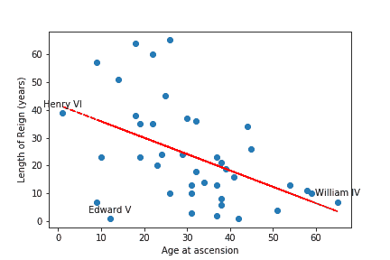
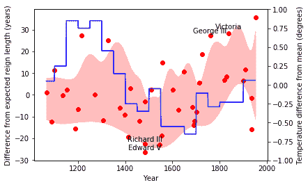
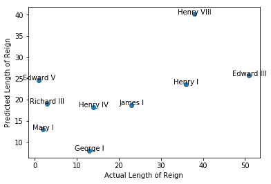
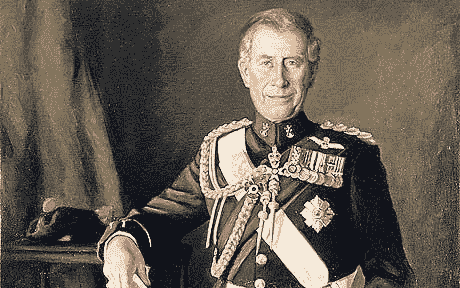

# 线性回归和继承线

> 原文：<https://towardsdatascience.com/linear-regression-and-lines-of-succession-451569c39016?source=collection_archive---------11----------------------->

## 计算机如何思考:第二部分

自从征服者威廉在 1066 年圣诞节加冕以来，英格兰和后来的大不列颠已经有近 50 位王位继承人，他们都试图在这个国家和她的人民的历史上留下自己的名字，并取得了不同程度的成功。其中，只有 36 位国王和 5 位王后被认为是具有任何合法性的君主。但是这些统治的时间长短不一。少年国王爱德华五世只统治了 86 天，直到他的突然消失为他的叔叔理查德登上王位扫清了道路。截至 2015 年 9 月，我们的现任女王在位 65 年(还在继续)，是英国或英格兰君主中在位时间最长的。

Those are rookie numbers, Edward

想象一下，如果每个君主登上王位，我们可以凝视水晶球，了解他们将被授予多少年的统治。想象一下，如果我们能在他们登基的时候，猜测他们的统治何时结束。碰巧的是，有了正确的数据，在一定的精确度范围内，我们可以做到。

我们可以通过一种支撑现代人工智能的算法来做到这一点，这种算法可能为任何关注高中统计的人(不像我)所熟悉。该算法被称为线性回归。

这个世界充满了数字，而这些数字之间往往有关系。个子高的人通常更重。较大的房子通常卖更多的钱。静息心率较低的自行车运动员的圈速较快。有时候这些关系很简单，比如你有多少钱和你能买多少罐啤酒之间的联系。有时候它们很复杂很神秘，就像你喝了多少啤酒和第二天感觉有多糟糕之间的关系。线性回归是理解这些关系的工具。从一组先前的例子中，它推导出一个最符合观察到的数字的数字比率。如果你喝了一杯啤酒后感觉很好，第二天早上三杯后感觉有点不确定，六杯后头疼得厉害，那么你可以由此推断昨晚的 12 罐狂欢明天会有可怕的后果。

线性回归用于人工智能中任何时候对数值进行预测:一块房地产的可能价值，一名棒球运动员与另一名运动员相比可能得分多少，公司股价的前景-所有这些都可以通过线性回归进行预测。通过观察以前的例子，比如一组历史上的房屋销售，或者几十场比赛的分数，我们可以得出一些规则，如果这些规则成立，可以帮助我们预测未来的事情会如何发展。回归也用于研究，例如，了解吸烟和肺癌之间的关系，或估计药物治疗疾病的效果。多种因素的影响可以被衡量和区分，从而得出对世界的复杂理解。

我们还可以使用线性回归来(粗略)预测一位英国君主还会在位多久。但是首先我们需要选择一些变量——一些关于过去君主的已知事实——这可能有助于我们做出预测

除了少数例外，英国君主的职位是终身的。除了刽子手的斧头或战争的紧急情况(或亨利一世的命运，据报道他死于食用“过量的七鳃鳗”)，君主剩余权力的主要预测者必须是他们登上王位时的年龄。因此，让我们选择“升天年龄”作为线性回归算法的第一个变量。让我们试着理解君主登基的年龄和他们在位时间的长短之间的关系。

The face of a man who is hungry for lampreys

为了理解和形象化这种关系，我们可以创建一个散点图。我们做了一个图表，横轴是“升天年龄”，纵轴是“在位时间长度”。对于每一位君主，从威廉一世到伊丽莎白二世，我们都在图表上做了标记。亨利六世在他父亲因痢疾自杀后九个月大的时候继承了王位，他位于图表的最左边。执政 39 年后，他的印记出现在 y 轴的三分之二处。他的标记在 y 轴的底部附近。

通过以这种方式绘制 40 多个帝王蝶，我们可以制作出下面的图表:

*Fig. 1: Relationship between age at ascension and length of reign*

在这张图表中，我们看到灵魂收割者咧着嘴笑的脸。尽管他们明智或愚蠢地统治，但没有一个君主能活到七十岁以上。一个统治可能会被可悲地终止——比如前面提到的爱德华五世，他 86 天的统治结束于他 12 岁时被限制在伦敦塔，然后(历史学家大多同意)被他背信弃义的叔叔理查德秘密谋杀。但是一个统治可能永远不会超过统治者的自然寿命。

Never trust a man with a pinkie ring

我们可以在图表中看到这一点。尽管我们看到一些君主(比如可怜的爱德华五世)落在了图表的左下象限——尽管他们还年轻，但他们的统治时间很短——但我们在右上角却没有看到——尽管年事已高，但仍享有长期统治的统治者。这就是线性回归非常适合发现的事实——这种关系。

升天时的年龄和君主统治时间的长短之间的关系可以用一个数字来表示，图表上的红线显示了这一点。这种关系是由线性回归算法导出的。该算法采用了一组例子——在这种情况下是我们的每个君主，并在我们展示的例子中找到最符合统治长度的升天年龄值。它在图表上画一条线，尽可能多的点靠近这条线。图表上的线条从亨利六世开始，他登基时只有 9 个月大，在苏格兰待了 40 年，还不算在苏格兰东躲西藏、被囚禁在伦敦塔、处于紧张性精神错乱状态的几年。这条线的终点非常接近威廉四世，他一直等到 64 岁才继承王位。威廉经历了他疯狂的父亲 59 年统治的大部分时间，然后是他哥哥掌权的 10 年，在他继承王位之前，他只在位 7 年。在这之间，这条线经过了许多不同年龄和任期的君主。它并没有经过所有这些地方，但是它的路线被计算为最可能符合观测数据。它的斜率与数据精确拟合，使得直线和每个数据点之间的距离最小。

I hope at 64 I still look this good in tights

这个斜率给了我们以下规则:一个君主可以期望统治 40 年多一点，即位时每多活一年少于六个月。

这里我们有一个非常简单的模型来预测君主的统治时间:

“Y = 1”或“在位时间= 40 年+(年龄 x 6 个月)”

简单！

但是这种数学精度可能会掩盖我们模型中的一些基本误解。首先，似乎很奇怪的是，每一年只占君主统治时期的六个月。在其他条件相同的情况下，登基前一年应该意味着登基后少一年。第二，当我们看图表时，我们看到大量的帝王蝶落在图表的左上方，远在红线之上，而另一组落在红线之下，在我们图表的底部中间。我们的线划得太浅了！所发生的是，我们几个英年早逝的年轻统治者已经把整条线拉向了左边。有没有可能，虽然一般来说年轻登基会导致更长的统治，但其他一些因素意味着那些太年轻的王位继承人注定会提前死亡？

碰巧的是，这是完全合理的！六个在十四岁或十四岁以下继承王位的君主中，有两个，亨利四世和六世，继承了在战争中被杀的父亲，还有三个，爱德华三世、五世和六世，是有点可疑的王位继承人。此外，年轻的统治者受制于反叛的摄政者和诡计多端的亲戚，他们可能会利用新统治者的年轻。如果我们能在分析中调整这种效应会怎样？

线性回归正好处理这种情况。对于每个君主，我们给算法两个值——升天时的年龄，然后另一个值被设置为 1，如果君主在他们登上王位时是 14 岁或更大，否则为零。该算法再次尝试找到最佳拟合线，但为了找到该线，它可以调整两个值——升天时一岁的值和升天当天小于 14 岁的值。我们制定了一个新的规则:君主将统治 50 年，如果他们登基时不满 14 岁，统治时间将减少 13 年，然后每增加一岁，统治时间将减少 9 个月。

我们可以用下面的图表来形象化这一规则:我们看到的值和以前一样，只是五位年轻统治者的统治时间已经根据他们的年轻程度进行了调整——我们给了他们额外的 13 年，红线——我们预测统治时间的指标——现在变得更加陡峭。

*Fig. 2: Age and length of reign, adjusted for accession under age fourteen*

现在，直线与数据点更加吻合。我们的模型更好地预测了君主统治的时间长度，但仍然相当糟糕。仍然有大量的帝王蝶在图表上的分数远离红线——我们对它们的预测非常差。举例来说，即使调整给他提供了额外的 14 年，这条线也比可怜的爱德华五世的分数高出了 20 年。他的继任者(也是被怀疑的杀手)，理查德三世，也从模型中得到了过于慷慨的估计。这条线给他 25 年的刑期，而事实上，在他在博斯沃思战场上为自己的罪行付出生命代价之前，他只活了 3 年。与此同时，在光谱的另一端，乔治三世、维多利亚和伊丽莎白二世的分数都超过了 30 岁。

我们需要寻找更多的变量，幸运的是，有许多可能的候选者。我们的模型缺少任何关于君主统治结束的主要原因之一——战争的变迁和英国中世纪致命的政治——的数据。在英国历史的大部分时间里，君主更有可能通过敌人的阴谋而不是时间之父的无情之手来实现自己的目的。

但是如何预测战争的爆发呢？在一个君主开始统治的时候，我们如何猜测他们的统治是否会受到挑战？一种方法是观察他们夺取王位的方式——合法继承，还是篡夺。看起来，欺骗是不会成功的。那些避开通常的继承规则的统治者，平均统治时间不到那些无争议继承王位的统治者的一半。“血腥的”玛丽一世曾召集军队废黜她的表妹简·格雷夫人，她死前只享受了三年在火刑柱上烧死新教徒的生活。但是被称为“狮子心”的理查一世也许是这种“生于刀下，死于刀下”效应的最好例子。篡夺了他自己的兄弟，并与他的父亲开战，理查德在一次叛乱中赢得了王位，但十年后去世，在一次反对他自己统治的叛乱中捍卫了他的王位。我们应该为那些在有争议的情况下登上王位的统治者调整分数。

Richard: The line art

但是即使是合法的统治者也会陷入战争，或者伴随而来的疾病。中世纪的世界很危险，容易爆发战争、饥荒和疾病。尤其是在中世纪以农业经济为主的英国，有一个因素可以帮助预测这些疾病的爆发:天气。在这个时代，经济几乎完全依赖于农业，而农业几乎完全依赖于好天气。因此，如果天气比平均水平冷，我们可能会看到更多的疾病，更多的饥荒，更多的战争，因此，比预期更短的统治。

*Fig. 3: Correlation between error in age/reign model and average temperature*

上面的图表显示了每个君主的一个点(红色),根据他们登基的年份绘制，以及根据他们登基时的年龄，他们统治的年数比我们预期的多或少。红色阴影区域显示了该值的移动平均值。蓝线代表每 50 年平均温度的估计值。整个 11 世纪后期，气温都很高——“中世纪温暖期”,但从 13 世纪中期下降到 16 世纪后期到 18 世纪早期的低点——“小冰川期”,这与英国的不稳定和革命时期相吻合，包括推翻詹姆斯二世的“光荣革命”。图表显示，在我们的模型中，温度和误差之间存在一定程度的相关性——它们沿着相同的方向移动。

James II low-key repping Westside

我们的模型现在有五个输入要素:升天时的年龄、君主是否在 14 岁以下的调整、自 1066 年以来的年数、平均温度，以及最后，君主是否是王位的合法继承人的调整。

现在很容易继续搜索更多的特征，找到模型仍然预测不佳的君主，并找到一些输入特征来解释为什么他们的统治比预期的更短或更长。但是我们应该小心。以爱德华八世为例。爱德华八世在相对年轻的 42 岁登上王位，考虑到当时的政治稳定，我们的模型预测他的统治将持续到 60 多岁。但是爱德华的统治持续了不到一年。爱德华在某种程度上是个讨女人喜欢的人(也可能是纳粹的同情者)，他在位不久就宣布打算与沃利斯·辛普森结婚，她是一个多次离婚的美国人，他与她已经有了几年的秘密恋情。这在宪法上被认为是不可接受的，于是爱德华放弃了王位。

What a dick

我们如何预测这一点？我们可能会在数据集中包含一些特征，比如“与一个美国人订婚”或“以前的婚外情次数”。这可能会让我们更好地预测爱德华统治的真实时间，但也会让我们面临风险。下一任君主在与已婚女性发生一连串婚外情后登上王位，或者打算与一个多次离婚的人结婚，可能会在一个更加开明的时代这样做，那时这些轻率的行为不会阻碍他们获得长期的王位。我们预测这位假想的风流君主的统治时间太短了。

只适用于一小部分帝王蝶的特征可能无法推广到更广泛的人群。我们为它们找到的关联在我们观察到的一组狭窄的数据中成立，但是那些观察在那组数据之外不成立。

因此，我们应该满足于我们拥有的五个特性。模型得出的最终规则如下:

38 年了

不满 14 岁的，16 岁

-一岁一年

自 1066 年以来每年+7 天

对于高于或低于平均值的每一度温度，为+/-15 年

合法统治者+10 年

我们最终得到的模型仍然很差，正如我们可以从这张绘制预测统治与实际统治的图表中看到的。在这张图表中，模型给出了所有帝王蝶的数据，除了随机选择的九只。然后对 9 个抵制者进行了预测。这样我们可以看到我们的模型概括得有多好。我们从一组君主身上学到的规则适用于另一组吗？我在 y 轴上画出了君主统治的预计时间长度，在 x 轴上画出了他们实际上在王位上待了多长时间。该图表上完全准确的预测看起来像一条由点组成的直对角线——预测与真实值完全匹配。实际的精确度要差得多。

*Fig. 4: Predicted length of reign vs actual*

该模型很好，因为它很少预测实际上统治了很长时间的君主的统治时间很短，但它经常预测实际上只在位很短时间的君主的长期统治。例如，它仍然让可怜的爱德华五世在位 25 年。此外，它还低估了大多数人的在位时间——伊丽莎白一世预计在位 27 年，而实际上她在位 45 年，乔治四世在位 11 年，而不是模型给他的 3 年。尽管对亨利来说这是一个强有力的模型。这让 24 岁的亨利七世一语中的，而亨利二世只统治了两年，超过了模型给他的 33 年。

What is he planning?

通过输入我们最有可能的下一个数据点查尔斯王子的数字，我们可以在实践中看到这一点。假设查尔斯明天登基(RIP Elizabeth)，我们的模型预测他会在位多久？

在撰写本文时，查尔斯已经 68 岁了。气温比 1066 年以来的平均气温高了整整半度，这让查尔斯又多了七年的王位。自 1066 年以来，查尔斯在 2017 年登基将有 951 年的时间，我们的模型将其转化为额外的 18 年统治时间。查尔斯将(大概)合法继承王位，而不是篡夺可怜的伊丽莎白，再增加 10 年。把所有这些因素加在一起，我们得出查尔斯只在位五年，这可能有点保守。

我们的模型并不十分精确——它的预测通常与真实值相差不到十年。在君主统治时间长短差异巨大的背景下，这看起来似乎相当不错，但我怀疑十年的误差会给相关君主带来一些实质性的问题。

线性回归算法假设特征和结果之间存在线性关系。例如，它假设温度和统治时间的关系总是正的——越暖和，英国就越稳定，君主在王位上呆的时间就越长。模型看到的所有信息都证实了这种关系。但是，认为气温升高总会导致统治时间延长的假设是短视的。事实上，气候变化很可能在不久的将来导致严重的政治不稳定，这一全球剧变的悲惨后果将是我们模型的准确性大幅下降。

We’re all rooting for you, Charlie

也有可能英国的气候与其统治者在位时间的相关性完全是虚假的。这种联系似乎是可信的，表面上看，这些数据似乎是吻合的。但很可能有几十个其他指标在那个时期显示了类似的模式，这也可以被认为有一些似乎合理的因果联系。如果事实证明我们观察到的相关性是偶然的，那么我们的模型在未来将会严重出错。

这暴露了线性回归的一个弱点，事实上也暴露了许多此类算法的弱点:我们的模型基于一系列关于英国及其统治者的强有力假设——预期寿命将继续增长，气温上升将永远意味着更大的政治稳定性，不会出现对君主统治的新威胁，等等。如果这些假设中的任何一个被证明是错误的，我们的模型的准确性就会受到影响。随着新数据的出现，我们可以通过频繁检查和重新训练我们的模型来减轻这些风险，但即使在最复杂的算法中，这仍然是一个问题。例如，金融预测模型可能会嵌入一个假设，即房地产价格将永远上涨，或者无法解释商业模型的彻底中断。

虽然我们自己的模型有点不确定，但是回归模型可以非常准确，非常有用。只要支撑它们的假设成立，这些模型就能提供非常有用的指导。但是当我们依赖这些模型时，我们希望模型创建时存在的条件将持续到未来。我们了解到的是，尽管这些模型平均来说可能创造出最佳拟合*，但是任何一个单独的例子都可能是一个实质性的异常值。当一个君主登上王位，并使用我们的模型来预测他们的未来时，他们可能会合理地从长期统治是他们最有可能的结果的预测中获得安慰。但是他们也应该注意自模型创建以来发生变化的环境。他们应该密切注意诡计多端的叔叔们。*

**本文使用的代码和数据可以在* [*我的 Github 页面*](https://github.com/SimonCarryer/Monarchs/blob/master/Analysis.ipynb) *中找到。本系列之前的文章可以在这里* *找到* [*。本系列的下一篇文章，*](/decision-trees-and-dinosaurs-c14339a37ad8) [*编织与建议*](https://medium.com/@simoncarryer/knitting-and-recommendations-b9d178a86c97) *此处可用***。***