# 线性回归:自下而上的方法

> 原文：<https://towardsdatascience.com/linear-regression-bottoms-up-approach-intro-to-spark-a-bonus-b923ae594323?source=collection_archive---------32----------------------->

## 额外收获:spark 简介

Photo by [Carlos Muza](https://unsplash.com/@kmuza?utm_source=medium&utm_medium=referral) on [Unsplash](https://unsplash.com?utm_source=medium&utm_medium=referral)

你有什么好处？

本文介绍了线性回归的细微差别，并将 spark 作为附件包括数据分析。这将作为经验丰富的数据科学家的复习资料，作为初学者的深度学习材料，以及作为新手的参考指南。

**我们来谈谈数据**

为了达到这个目标，我选择了一个 [*数据集*](https://www.kaggle.com/sohier/calcofi) ，它不会太琐碎，同时也不会太吓人。我们将着重于确定水的盐度和温度之间的关系。这个数据集有大约 10 亿条记录，是 60 多年的海洋学数据。

**免责声明！**

帖子会很大。别担心，我不会用奇怪的数学来烦你，但我会专注于获得洞察力，我保证会很有趣。

如果您正在运行整个数据集，您可能希望使用 colab。取决于您的笔记本电脑容量。

**使用 PySpark 进行数据分析**

请随意跳到下一节课。如果你对 spark 和分布式计算入门感兴趣，一般来说，[点我](/a-neanderthals-guide-to-apache-spark-in-python-9ef1f156d427)

这只是为了对 pyspark 的工作方式有所了解。

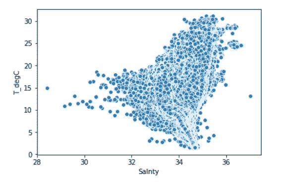

There is a negative correlation between salinity and temperature of the ocean water

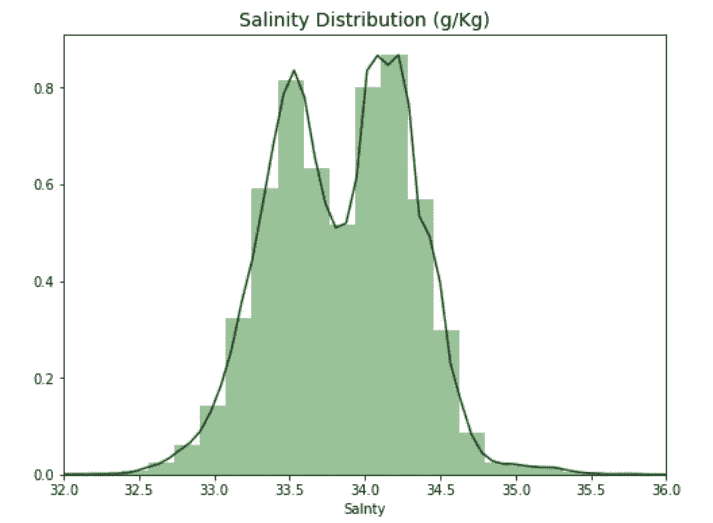

Salinity is mostly distributed around 33–34.5

建模将意味着使用机器学习技术从数据中学习一组特征和我们希望预测的东西之间的关系。在建立模型之前，我们应该了解一下成本函数。这是一个非常重要的概念，有助于构建良好的模型。

# 成本/评估功能

我们该如何处理这个问题？开始一个人的推理的一个合适的地方是:假设我们创建了许多模型来预见我们的目标，我们怎么可能选择最好的一个呢？当我们决定这样做时，我们的目标是最小化/最大化该值。

如果您能够将您的问题简化为一个单一的评估度量标准，这将是非常有用的，因为这样可以非常容易地迭代模型开发。有时候你并不十分清楚你想要你的模型最大化/最小化什么。我们将更多地讨论这个挑战，但是现在，我们将坚持使用今天使用的非常标准的评估函数。

所以对于这个问题，我会提出以下评价指标:均方误差(MSE)。为了理解 MSE，让我们定义一些术语:

*   𝑦hat——这是我们对第 I 个数据点的预测值
*   𝑦 —这是第 I 个数据点的实际值
*   𝑛 —数据点的数量

因此，MSE 为:

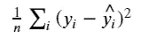

在英语中，对于每个点，我们从实际值中减去预测值。然后，因为我们不关心误差的方向，所以我们求差的平方。最后，我们取所有这些值的平均值。基本上，我们是说我们希望我们的预测和实际之间的平均距离小一些。

你可能会奇怪，为什么我们平方这个值，而不是取绝对值。事实证明，对于下面的一些数学运算来说，平方这个值效果很好。另外，它是 MSE 估计值。不过，这确实有在我们的平均值中增加大误差权重的效果，因为我们在平方所有的差异。

这取决于你的损失函数。在许多情况下，给予远离平均值的点更多的权重是有意义的——也就是说，偏离 10 比偏离 5 要糟糕两倍多。在这种情况下，RMSE 是一个更合适的误差度量。如果 10 点前的失误是 5 点前的两倍，那么 MAE 更合适。

# 我们的模型

现在我们有了成本函数，如何找到最小化它的方法呢？我们将回顾线性回归模型。该模型如下:

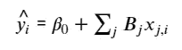

其中 j 是我们拥有的预测值的数量，β值是我们的系数，β0 是截距。基本上，我们的模型是预测值和截距的线性组合。

现在我们有了一个模型和一个成本函数，我们的挑战变成了为我们的模型找到最小化我们数据的 MSE 的β值。对于线性回归，实际上有一个封闭形式的解决方案，称为[正规方程](http://mathworld.wolfram.com/NormalEquation.html)。不过，我们将使用一种在机器学习中更常见的不同技术——梯度下降。

# 梯度下降

梯度下降是我们从最优化中借用的一种技术。这是一个非常简单，但功能强大的算法，可用于寻找一个函数的最小值。

1.  选择一个随机的起始值
2.  在当前点采取与梯度负值成比例的步长
3.  重复直到你收敛

如果一个函数是凸的，这种技术将找到全局最小值，如果不是，我们只能证明它将找到局部最小值。让我们来看一个[的例子](https://medium.com/onfido-tech/machine-learning-101-be2e0a86c96a)。

我们需要回答的第一个问题是:代价函数是凸的吗？让我们来看看:

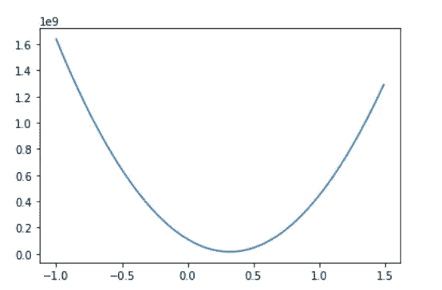

我们在上面所做的是获取盐度的一系列系数值，并根据我们的数据(温度作为目标)计算每个系数值的 MSE。如果我们画出这些，我们会得到上面的曲线——看起来很凸！事实上，我们的线性回归模型的 MSE 函数总是凸的！这意味着我们可以使用梯度下降来找到我们的模型的最佳系数！

梯度下降比机器学习的正常方程更常见的一个原因是，随着我们增加特征的数量，它的规模更大。它也是一种普遍的优化技术，在机器学习中随处可见，因此了解它的工作原理是非常有价值的。

# 梯度

梯度就是关于系数的偏导数。对于每个系数，我们需要计算 MSE 对该系数的导数。我们开始吧！

记住我们的成本函数:

现在，让我们扩展一下这个简单的例子，它有一个截距和一个变量，Salnty:

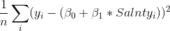

现在，对于它对β0 的导数，我们得到:

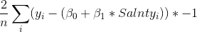

对于β1:

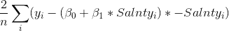

实现可以在笔记本中找到。

# 学习率

学习率是一个超参数，用于确定我们离梯度方向有多远。你怎么知道选择什么值？通常，可以尝试许多值，这里有一些我认为是吴恩达建议的值:. 001，. 003，. 01，. 03，. 1，. 3，1，3

选择一个太小的值会导致收敛速度变慢。选择太大的值会导致超过最小值和发散。

也有其他梯度下降优化，更复杂，适应学习率超时为您服务。这也是你可以自己做的事情，随着时间的推移，你会慢慢降低学习速度。你可以在这里阅读更多关于不同优化器的信息。

# 什么时候停止迭代？

在我的[代码](https://github.com/hdev7/medium-linear-regression-article-source-code)中，我简单地选择运行我们的循环 10，000 次。为什么是一万。没有真正的原因，除了我很确定它足够长的时间来收敛。这通常不是最佳实践。一些更好的想法是:

1.  在每一次循环后监控你的成本，当它的下降小于某个容差时——比如 0.001——停止。
2.  使用一个验证集，并在其上跟踪损失，例如，MSE。当它停止减少时，停止。

# 标准化数据

使用梯度下降时，您希望所有数据都进行归一化。减去平均值，然后除以所有训练特征的标准差。如果您的成本函数不是凸的，这通常会使训练更快，并减少陷入局部最优的机会。

# 何时对数据进行规范化？

当您不知道数据的分布或您知道分布不是高斯型(钟形曲线)时，归一化是一种很好的方法。当您的数据具有不同的比例，并且您使用的算法不对数据的分布进行假设时，如 k-最近邻和人工神经网络，则规范化非常有用。最小-最大缩放器。它对异常值很敏感。

# 何时标准化数据？

标准化假设您的数据具有高斯(钟形曲线)分布。严格来说，这并不一定是真的，但是如果您的属性分布是高斯分布，这种技术会更有效。当您的数据具有不同的比例，并且您使用的算法假设您的数据具有高斯分布时，标准化非常有用，例如线性回归、逻辑回归和线性判别分析。

# 稳健标量(缩放至中位数和分位数) :

使用中位数和分位数进行缩放包括减去所有观测值的中位数，然后除以四分位差。它使用对异常值具有鲁棒性的统计数据来缩放要素。

X_scaled = (X-X.median) / IQR

# 其他类型的梯度下降

我在这里展示的梯度下降是一种普通形式，这意味着每次系数更新都使用所有数据来计算梯度。还有**随机梯度下降**只使用 1 行数据来更新每个循环中的系数。这更具可伸缩性，因为您一次只需查看一个数据行，但也更具随机性，因为您试图使用仅在单个数据点上计算的梯度进行导航。这也引入了一个新的术语:**纪元**，它是你想要循环数据的次数。

另一种类型的梯度下降是**小批量梯度下降**。这种形式是两者之间的一种折衷，您可以选择一个批处理大小，比如说 32(或者更好的是一个批处理时间表，从小的批处理开始，随着时间的增加而增加)，并且梯度下降的每次迭代可以使用 32 个随机数据行来计算梯度。这提供了一些可伸缩性和一些随机性。这种随机性实际上对于非凸的成本函数(深度学习)是有用的，因为它可以帮助模型摆脱局部最小值。这是非凸成本函数最常用的方法。

# 我们模型的假设

每当你处理一个模型时，了解它所做的假设是有好处的。我本打算在这里写一篇关于这个的文章，但是杜克已经做得很好了。

# 使用 sklearn

现在我们已经了解了一些理论和实现，让我们转向一个软件库，对我们的数据进行线性回归。这对于学习从头开始编写模型非常有用，但是使用一个经过测试并被广泛使用的库通常会更好。

请记住扩展您的数据，这非常重要！

Sklearn 是一个很棒的包。它提供了许多模型，并且它们都具有拟合和预测功能。您可以对 X 和 y 数据调用 fit 来训练模型，并对新要素进行预测来获得预测值。Sklearn 还提供了很多你可以用来评估的指标，比如 MSE。这里我输出根 MSE (RMSE ),因为这让我们回到目标的原始比例，我觉得这更容易理解。

tol 告诉模型何时停止迭代，eta0 是我们的初始学习率。

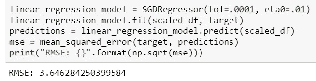

# 多项式变量

如果你记得我们的 Salnty 对我们的目标(T_degC)的图，看起来有一点多项式关系(这可能也是因为图的比例)。线性回归适合线性关系，但是如果添加多项式要素，例如 Salnty，则可以适合更复杂的关系。Sklearn 让这变得简单:

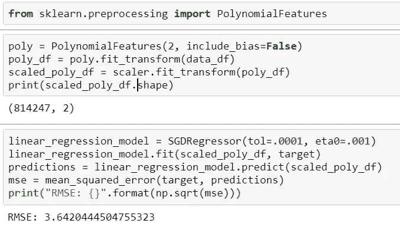

多项式要素命令生成了一个新的要素矩阵，该矩阵由阶数小于或等于指定阶数的要素的所有多项式组合组成(在我们的示例 2 中)。然后，我们对这些数据进行缩放，并将其输入到我们的模型中。我们得到了稍微改进的 RMSE。太棒了。但是，请注意，这些结果并不十分有效，因为它们应用于我们的测试数据。在这篇文章的后面，我们将看看如何更好地评估我们的模型的可推广性。

# 分类变量

当您有分类数据时，线性回归是您需要小心使用的模型之一。如果某个要素的值为 1、2 和 3，实际上表示男性、女性，则无响应。即使它们是数字，你也不想这样给模型。如果你这样做了，模型会给这个特征分配一个系数——可能是 0.1。这就意味着，女性会将预测提高 0.1%，而无反应会提高 0.2%。但是也许女性应该把分数提高 1.2，而没有反应的分数只提高 0.001。考虑到这一点，您应该将这些值转换为虚拟变量，以便每个值都有自己的权重。除非您确信在您的数值顺序中有一个恒定的关系。

# 解释你的模型

线性回归是一个伟大的统计模型，已经存在很长时间了。有许多统计技术可以用来评估和解释它。我们不会涵盖所有这些，事实上，我们将主要关注非常简单的方法，这些方法在机器学习中可能比统计学更常见。

统计学习手册线性回归点介绍:

这只是一个介绍。请参考[统计学习简介](http://www-bcf.usc.edu/~gareth/ISL/)以便更好地理解。

潜在问题:

*   响应-预测值关系的非线性——残差图帮助我们发现它。yhat — y 与 x 的关系图。如果残差图表明数据中存在非线性关联，那么一个简单的方法是使用预测值的非线性变换，如 logX、√X 和 X
*   误差项的相关性——如果误差项是相关的，我们可能会对模型产生不必要的信心。为什么误差项之间会出现相关性？这种相关性经常出现在时间序列数据中。
*   误差项的非恒定方差(异方差)——当你在残差图上发现漏斗形状时。面对这个问题，一个可能的解决方案是使用凹函数(如 logY 或√Y)来转换响应 Y。
*   异常值-异常值在最小二乘拟合中没有太多 effect。它们会影响 r 和 RSE 值。
*   高杠杆点-高/低这些点不是异常值，但它们与数据截然不同，靠近回归线，并将影响最小二乘拟合。
*   共线性-共线性是指两个或多个预测变量彼此密切相关的情况。

首先，让我们看看我们的模型已经学习的系数:

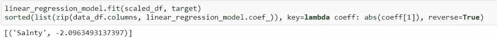

这些系数是什么？它们表示在保持模型中其他特征不变的情况下，特征变化一个单位的平均温度变化(在我们的例子中，我们只有一个)。例如，盐度每增加一个单位，我们的目标(温度)就会降低 2.096。

这真是太好了！我们也许可以说，如果你想提高温度，降低盐度可能是一个开始。我说可能是因为线性回归着眼于相关性。在我们的数据中，情况确实如此，但这本身并不意味着这些特征有因果关系。不过，这可能是寻找因果关系的好地方，并且确实代表了数据中出现的关系。

# 置信区间

通常在机器学习中，在你的估计值周围有一个置信区间是非常有用的。有不同的方法可以做到这一点，但是一个相当通用的方法是使用 **bootstrap。**

Bootstrap 是替换我们数据的随机样本，该样本与原始数据大小相同。这是生成同一数据的多个视图的一种方式。让我们创建 1000 个数据引导。完成采样后，我们可以通过输入模型来获得每个数据集的系数。

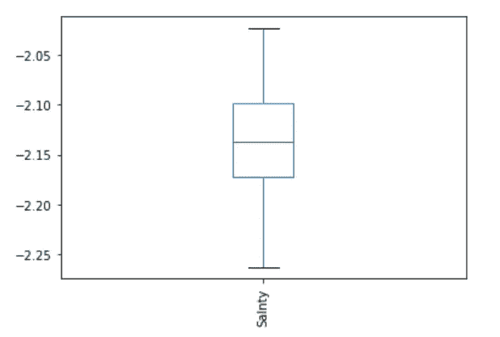

这太好了！现在我们可以很有信心地说，萨恩蒂的实际系数是负的，几乎肯定在-2.2 和-2.1 之间

# 训练/测试分割和交叉验证

到目前为止，我们一直在根据现有的所有数据进行训练。这可能是有意义的，因为我们希望通过使用尽可能多的数据进行训练来最大化数据的效用。然而，另一方面，这使得我们很难评估我们的模型做得有多好。其原因是，如果我们只是使用模型训练的数据来计算我们的 MSE 分数，我们可能会发现我们引入的数据不是模型训练的数据，它的表现相当差。

这个想法叫做**过拟合**。基本上，当一个模型在它被训练的数据上比在新数据上表现得更好时，它已经过度适应了训练数据所特有的东西，而这些数据并不一般化。

这种情况的另一面叫做**偏见。**当一个模型不能很好地拟合数据时，它就有很大的偏差。在这种情况下，对于训练数据和在训练期间没有看到的数据，MSE 都将是高的。

在机器学习中，偏差和方差之间总是有一个权衡。随着模型变得越来越复杂，过度适应训练数据的风险也越来越大。

既然我们知道只看训练数据的 MSE 有问题，我们能做什么来更好地判断概化？以及诊断过度拟合和偏差？通常，我们将数据分成两组:训练集和测试集。

您可以利用 sklearn.model_selection 中的 train_test_split

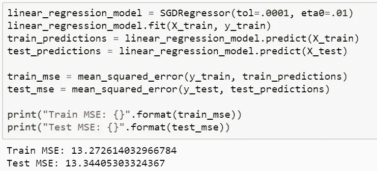

太棒了。现在我们有了 RMSE 的训练和测试数据。两者都非常接近，这表明我们没有过度拟合的问题。不过，它们都很低吗？这表明有很大的偏见。

研究这个问题的一个方法是绘制学习曲线。学习曲线描绘了我们的误差函数(MSE ),以及用于训练的各种数据量。这是我们的情节:

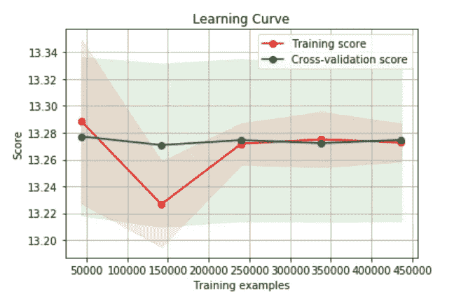

你可以看到，在不到 2.5 亿个训练样本的情况下，训练 MSE 相当好，交叉验证相当差(我们还没有谈到交叉验证，所以暂时把它当作测试)。如果我们那时只有那么多数据，它看起来就像一个高方差问题。随着我们数据的增加，我们开始提高我们的分数，它们变得非常接近，这表明我们没有高方差问题。

这张图看起来更像是我们有一个高偏差问题，因为我们的两条曲线非常接近，并趋于平缓。不过，这很难说，因为我们可能刚刚达到了可能的最佳 MSE。在这种情况下，这不会是一个高偏差问题。如果我们的曲线变得平坦，并且 MSE 高于最优值，这将是一个问题。在现实生活中，你不知道最优的 MSE 是多少，所以你必须从理论上说明你是否认为减少偏差会提高你的分数——或者只是尝试一下！

# 修复高偏差/高方差问题

那么，现在你已经诊断出了你的偏差或方差问题，你如何解决它们呢？

对于**高方差**:

*   获取更多培训数据
*   尝试一组较小的功能
*   尝试不太复杂的模型
*   添加正则化

对于**高偏置**:

*   尝试添加功能
*   尝试更复杂的模型

# 交叉验证和调整超参数

之前我们提到过这个短语:交叉验证。让我们现在谈论那个。到目前为止，我们已经了解到，将数据分成训练集和测试集是一个好主意，这样可以更好地了解模型的实际运行情况。这很好，但是想象一下我们想要测试多个不同的模型或者测试我们模型的不同参数——例如，不同的学习率或者容忍度。我们如何决定哪个模型或哪个参数是最好的？我们会用训练数据训练一切，用测试数据测试一切吗？希望你能看到这是没有意义的，因为那样的话，我们将基本上处于以前的同一位置，没有办法测试我们对以前从未见过的数据做得有多好。所以——我们希望保持我们的测试集不受污染，也就是说，在一个完美的世界中，我们只会在完成所有实验并认为我们找到了最佳模型之后，才在它上面运行我们的测试。

听起来我们需要第三组数据——验证组。基本上，我们可以做的是将我们的训练数据分成两组:一组训练数据和一组验证数据。所有模型将在训练集上训练，然后在我们的验证集上测试。然后，我们选择验证效果最好的模型，看看它在测试中表现如何。我们的测试结果代表了我们认为我们的模型对看不见的数据有多好——然后我们就完成了。

注意:这里的假设是我们的测试和验证集是我们总体的代表性样本。通常，我们随机地将可用的数据分成三组，但是确认这些组是好的表示总是好的。否则，您会发现在验证和测试中运行良好的模型在生产中表现不佳。

在实践中，我们经常使用 k-fold 交叉验证，而不是创建一个单一的验证集。这里我们选择一个 k 值，比如说 3。然后，我们将训练数据分成三份。我们随机选择 2 个折叠进行训练，然后使用剩余的进行测试。然后，我们再重复 2 次，总共 3 次，这样所有的观察结果都用于训练和验证，并且每个观察结果只用于验证一次。然后，我们将所有三个分数(在我们的例子中是 MSE)进行平均，以获得特定模型的分数。然后，我们可以对多个模型重复这一过程，以找到最佳模型。[这是一个很好的视频](https://www.youtube.com/watch?v=TIgfjmp-4BA)

使用 sklearn，这个过程非常简单:

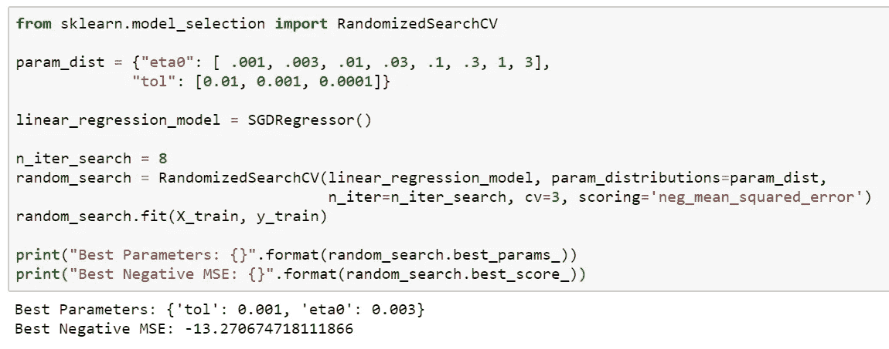

这里我们实际上使用了随机搜索，这通常比搜索所有可能的值要好。通常，你想为许多不同的旋钮尝试许多不同的参数，网格搜索一切是没有效率的。通常，你会像我们上面做的那样使用随机搜索。但是，因为我们只有少量的值，所以我们通过将 n_iter_search 设置为我们想要尝试的值的数量来强制进行网格搜索。

我们还将 cv=3 设置为 3 倍，并使用负 MSE，因为 sklearn 中的 cv 函数试图最大化值。

你可以在这里了解更多关于随机搜索和网格搜索的信息[:](http://scikit-learn.org/stable/modules/grid_search.html)

此外，sklearn 还有许多其他 CV 函数，特别是如果您想要测试具有相同折叠的不同模型时，这些函数非常有用。这里有一些[文件](http://scikit-learn.org/stable/modules/cross_validation.html)

# 正规化

作为解释高方差模型的一种方法，我提到了正则化。您可以将正则化视为一种用于惩罚学习复杂关系的模型的方法。对于线性回归，有三种流行的方法。所有这些方法都围绕着限制我们的特征的系数可以有多大的思想。这个想法是，如果我们高估了一个预测因子(一个大的系数)的影响，很可能我们是过度拟合了。注意:我们仍然可以有大的系数。正则化只是说，MSE 的减少必须证明系数幅度的增加是合理的。

*   L1 正则化(Lasso):将系数的绝对值之和添加到成本函数中。这种方法可以将系数强制为零，这可以作为特征选择的一种手段
*   L2 正则化(岭):你把系数的平方和加到成本函数中。
*   弹性网:你将两者相加，并选择如何加权

这些方法中的每一种都采用了一个加权因子，该因子告诉您应该对成本函数中的正则化项进行多少加权。在 sklearn 中，它被称为 alpha。alpha 值为零不会增加任何损失，而高 alpha 值会因为模型系数大而对模型造成很大损失。您可以使用交叉验证来发现 alpha 的一个好值。

Sklearn 让这变得简单:

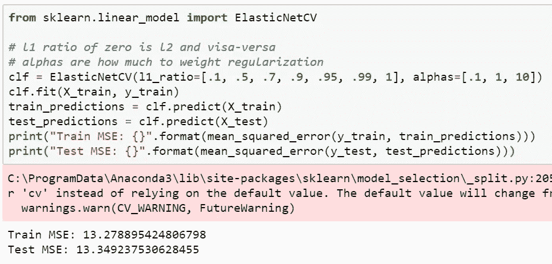

我希望你在文章中学到了一些东西。这是一个很好的起点。建议大家多读一些概念，巩固一下。大多数时候，人们倾向于在忙碌的时候学习新奇的东西。但是构建基础总是一个很好的起点。大量的业务应用程序只需要一个质量回归模型来进行点预测。

代号: [Github](https://github.com/hdev7/medium-linear-regression-article-source-code)

如果你需要任何帮助，你可以联系: [LinkedIn](https://www.linkedin.com/in/hemanthsaid/)

参考资料:

Geron Aurelien 的机器学习实践