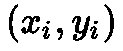
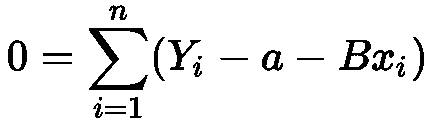

# 线性回归推导

> 原文：<https://towardsdatascience.com/linear-regression-derivation-d362ea3884c2?source=collection_archive---------1----------------------->

## 线性回归中的 2/3 部分

第 1/3 部分:[线性回归直觉](https://medium.com/@leisyridley/linear-regression-intuition-172b52758321)

第 3/3 部分:[线性回归实现](https://medium.com/@leisyridley/implementation-of-linear-regression-8a6ff13dc727)

经典的线性回归图像，但你知道吗，它背后的数学是**甚至**更性感。让我们揭开它。

在开始之前，您应该了解

> 偏导数
> 
> 总和

# **准备好寻找最适合的线条了吗？**

## 让我们从定义几件事情开始。

1.  给定 N 个输入和输出…

2.我们将最佳拟合线定义为…

3.使得最佳拟合线看起来最小化我们命名为 S 的成本函数…

作为参考，我们将把最佳拟合线输入到分配减法的成本函数中，结果是…

为了最小化我们的成本函数 S，我们必须找到 S 相对于 **a** 和 **B 的一阶导数等于 0 的位置。**a**a**和 **B** 越接近 0，每个点的总误差越小。先从 **a** 的[偏导数](https://mathinsight.org/partial_derivative_introduction)说起。

# **找一个**

使用链式法则，从指数开始，然后是括号中的等式。注意，对括号之间的方程求导可以简化为 **-1** 。

让我们从求和中取出-2，然后将两个方程除以-2。

让我们做一些半聪明的事情。让我们把总和分成 3 部分，把常数 B 从总和中抽出来

我们注意到 a 到 n 的和只是…

把这个代入并重新排列 B，给我们…

我们快到了！我们需要做的最后一件事是求解 **a，**所以我们将 **na** 加到两边，然后除以 **n** 。

看看这个。Y 和 x 的两个总和除以观察次数就是平均值:)。所以在所有这些工作之后，最小化相对于 **a** 的 **S** 的成本函数是简单的…

# **调查结果 B**

我们已经最小化了 S 相对于 a 的成本函数，让我们找到 S 相对于 b 的最后一部分。

我们把-2 剥掉，两边分。

为了便于查看，我们来分发 x。

现在，让我们做一些有创意的事情。还记得我们已经解决了。我们把 **a** (下面推导的公式)代入 S 关于上面 B 的偏导数。我们这样做是为了得到一个只有 x 和 y 的 a 和 B 的函数。

让我们分配负号和 x

这看起来很乱，但代数在这方面很厉害。让我们把总数分成两笔。

让我们把右边的求和项中的 **-B** 去掉，这样我们就可以分离出变量，并重新排列求和项中剩余的项。

通过减去第一个总和并除以第二个总和来隔离 B。

我们做到了！我们现在已经根据 x 和 y 分离出了 **B** 和 **a** 。这看起来像一个可怕的公式！不要担心，通过进一步操作公式，还有更简单的版本——你可以在这里查看这些。

# **总结一下:)**

如果数据集只有一个独立变量，可以通过计算 **B** 找到最佳拟合线

然后将 **B** 代入 **a**

最后，将 **B** 和 **a** 代入最佳拟合线！

# 向前移动

那么…有多个自变量的数据集呢？我们能找到最适合这些的路线吗？你打赌！我们很快会讨论多元线性回归。同时，看看本系列的第 3 部分，我们将上面的方程与 Sklearn 的线性模型进行了比较。